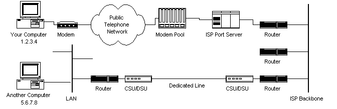
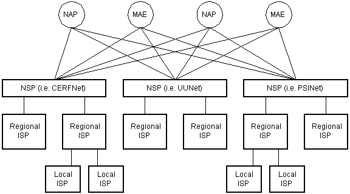
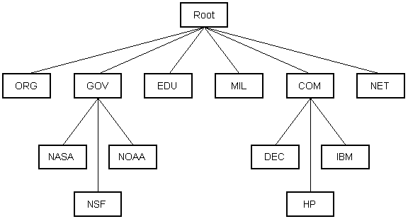
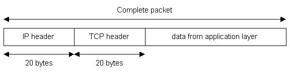

How Does the Internet Work?
===========================

_© 2002 [Rus Shuler](mailto:russhuler@yahoo.com) @ [Pomeroy IT Solutions](http://www.pomeroy.com/), all rights reserved_

* * *

Contents
--------

1.  [Introduction](#introduction)
2.  [Where to Begin? Internet Addresses](#where-to-begin-internet-addresses)
3.  [Protocol Stacks and Packets](#protocol-stacks-and-packets)
4.  [Networking Infrastructure](#networking-infrastructure)
5.  [Internet Infrastructure](#internet-infrastructure)
6.  [The Internet Routing Hierarchy](#the-internet-routing-hierarchy)
7.  [Domain Names and Address Resolution](#domain-names-and-address-resolution)
8.  [Internet Protocols Revisited](#internet-protocols-revisited)
9.  [Application Protocols: HTTP and the World Wide Web](#application-protocols-http-and-the-world-wide-web)
10.  [Application Protocols: SMTP and Electronic Mail](#application-protocols-smtp-and-electronic-mail)
11.  [Transmission Control Protocol](#transmission-control-protocol)
12.  [Internet Protocol](#internet-protocol)
13.  [Wrap Up](#wrap-up)
14.  [Resources](#resources)
15.  [Bibliography](#bibliography)

## Introduction

How does the Internet work? Good question! The Internet's growth has become explosive and it seems impossible to escape the bombardment of _www.com_'s seen constantly on television, heard on radio, and seen in magazines. Because the Internet has become such a large part of our lives, a good understanding is needed to use this new tool most effectively.

This whitepaper explains the underlying infrastructure and technologies that make the Internet work. It does not go into great depth, but covers enough of each area to give a basic understanding of the concepts involved. For any unanswered questions, a list of resources is provided at the end of the paper. Any comments, suggestions, questions, etc. are encouraged and may be directed to the author at rshuler@gobcg.com.

## Where to Begin? Internet Addresses
----------------------------------

Because the Internet is a global network of computers each computer connected to the Internet **must** have a unique address. Internet addresses are in the form **nnn.nnn.nnn.nnn** where nnn must be a number from 0 - 255. This address is known as an IP address. (IP stands for Internet Protocol; more on this later.)

The picture below illustrates two computers connected to the Internet; your computer with IP address 1.2.3.4 and another computer with IP address 5.6.7.8. The Internet is represented as an abstract object in-between. (As this paper progresses, the Internet portion of Diagram 1 will be explained and redrawn several times as the details of the Internet are exposed.)

Diagram 1

  

If you connect to the Internet through an Internet Service Provider (ISP), you are usually assigned a temporary IP address for the duration of your dial-in session. If you connect to the Internet from a local area network (LAN) your computer might have a permanent IP address or it might obtain a temporary one from a DHCP (Dynamic Host Configuration Protocol) server. In any case, if you are connected to the Internet, your computer has a unique IP address.

> **Check It Out - The Traceroute Program**
> 
> If you're using Microsoft Windows or a flavor of Unix and have a
> connection to the Internet, here is another handy Internet program.
> This one is called **traceroute** and it shows the path your packets
> are taking to a given Internet destination. Like ping, you must use
> traceroute from a command prompt. In Windows, use tracert
> www.yahoo.com. From a Unix prompt, type traceroute www.yahoo.com. Like
> ping, you may also enter IP addresses instead of domain names.
> Traceroute will print out a list of all the routers, computers, and
> any other Internet entities that your packets must travel through to
> get to their destination.

  

## Protocol Stacks and Packets
---------------------------

So your computer is connected to the Internet and has a unique address. How does it 'talk' to other computers connected to the Internet? An example should serve here: Let's say your IP address is 1.2.3.4 and you want to send a message to the computer 5.6.7.8. The message you want to send is "Hello computer 5.6.7.8!". Obviously, the message must be transmitted over whatever kind of wire connects your computer to the Internet. Let's say you've dialed into your ISP from home and the message must be transmitted over the phone line. Therefore the message must be translated from alphabetic text into electronic signals, transmitted over the Internet, then translated back into alphabetic text. How is this accomplished? Through the use of a **protocol stack**. Every computer needs one to communicate on the Internet and it is usually built into the computer's operating system (i.e. Windows, Unix, etc.). The protocol stack used on the Internet is refered to as the TCP/IP protocol stack because of the two major communication protocols used. The TCP/IP stack looks like this:  
  
  

| Protocol Layer | Comments |
|--|--|
| Application Protocols Layer |Protocols specific to applications such as WWW, e-mail, FTP, etc.  |
| Transmission Control Protocol Layer | TCP directs packets to a specific application on a computer using a port number. |
| Internet Protocol Layer | IP directs packets to a specific computer using an IP address. |
| Hardware Layer |  Converts binary packet data to network signals and back. (E.g. ethernet network card, modem for phone lines, etc.)|

  
  
If we were to follow the path that the message "Hello computer 5.6.7.8!" took from our computer to the computer with IP address 5.6.7.8, it would happen something like this:  
  

Diagram 2

  

1.  The message would start at the top of the protocol stack on your computer and work it's way downward.
2.  If the message to be sent is long, each stack layer that the message passes through may break the message up into smaller chunks of data. This is because data sent over the Internet (and most computer networks) are sent in manageable chunks. On the Internet, these chunks of data are known as **packets**.
3.  The packets would go through the Application Layer and continue to the TCP layer. Each packet is assigned a **port number**. Ports will be explained later, but suffice to say that many programs may be using the TCP/IP stack and sending messages. We need to know which program on the destination computer needs to receive the message because it will be listening on a specific port.
4.  After going through the TCP layer, the packets proceed to the IP layer. This is where each packet receives it's destination address, 5.6.7.8.
5.  Now that our message packets have a port number and an IP address, they are ready to be sent over the Internet. The hardware layer takes care of turning our packets containing the alphabetic text of our message into electronic signals and transmitting them over the phone line.
6.  On the other end of the phone line your ISP has a direct connection to the Internet. The ISPs **router** examines the destination address in each packet and determines where to send it. Often, the packet's next stop is another router. More on routers and Internet infrastructure later.
7.  Eventually, the packets reach computer 5.6.7.8. Here, the packets start at the bottom of the destination computer's TCP/IP stack and work upwards.
8.  As the packets go upwards through the stack, all routing data that the sending computer's stack added (such as IP address and port number) is stripped from the packets.
9.  When the data reaches the top of the stack, the packets have been re-assembled into their original form, "Hello computer 5.6.7.8!"

## Networking Infrastructure
-------------------------

So now you know how packets travel from one computer to another over the Internet. But what's in-between? What actually makes up the Internet? Let's look at another diagram:  
  

Diagram 3

  

Here we see Diagram 1 redrawn with more detail. The physical connection through the phone network to the Internet Service Provider might have been easy to guess, but beyond that might bear some explanation.

The ISP maintains a pool of modems for their dial-in customers. This is managed by some form of computer (usually a dedicated one) which controls data flow from the modem pool to a backbone or dedicated line router. This setup may be refered to as a port server, as it 'serves' access to the network. Billing and usage information is usually collected here as well.

After your packets traverse the phone network and your ISP's local equipment, they are routed onto the ISP's backbone or a backbone the ISP buys bandwidth from. From here the packets will usually journey through several routers and over several backbones, dedicated lines, and other networks until they find their destination, the computer with address 5.6.7.8. But wouldn't it would be nice if we knew the exact route our packets were taking over the Internet? As it turns out, there is a way...

**Check It Out - The Traceroute Program**

If you're using Microsoft Windows or a flavor of Unix and have a connection to the Internet, here is another handy Internet program. This one is called **traceroute** and it shows the path your packets are taking to a given Internet destination. Like ping, you must use traceroute from a command prompt. In Windows, use tracert www.yahoo.com. From a Unix prompt, type traceroute www.yahoo.com. Like ping, you may also enter IP addresses instead of domain names. Traceroute will print out a list of all the routers, computers, and any other Internet entities that your packets must travel through to get to their destination.

  
If you use traceroute, you'll notice that your packets must travel through many things to get to their destination. Most have long names such as sjc2-core1-h2-0-0.atlas.digex.net and fddi0-0.br4.SJC.globalcenter.net. These are Internet routers that decide where to send your packets. Several routers are shown in Diagram 3, but only a few. Diagram 3 is meant to show a simple network structure. The Internet is much more complex.

## Internet Infrastructure
-----------------------

The Internet backbone is made up of many large networks which interconnect with each other. These large networks are known as **Network Service Providers** or **NSP**s. Some of the large NSPs are UUNet, CerfNet, IBM, BBN Planet, SprintNet, PSINet, as well as others. These networks **peer** with each other to exchange packet traffic. Each NSP is required to connect to three **Network Access Points** or **NAP**s. At the NAPs, packet traffic may jump from one NSP's backbone to another NSP's backbone. NSPs also interconnect at **Metropolitan Area Exchanges** or **MAE**s. MAEs serve the same purpose as the NAPs but are privately owned. NAPs were the original Internet interconnect points. Both NAPs and MAEs are referred to as Internet Exchange Points or **IX**s. NSPs also sell bandwidth to smaller networks, such as ISPs and smaller bandwidth providers. Below is a picture showing this hierarchical infrastructure.  
  

Diagram 4

  

This is not a true representation of an actual piece of the Internet. Diagram 4 is only meant to demonstrate how the NSPs could interconnect with each other and smaller ISPs. None of the physical network components are shown in Diagram 4 as they are in Diagram 3. This is because a single NSP's backbone infrastructure is a complex drawing by itself. Most NSPs publish maps of their network infrastructure on their web sites and can be found easily. To draw an actual map of the Internet would be nearly impossible due to it's size, complexity, and ever changing structure.

## The Internet Routing Hierarchy
------------------------------

So how do packets find their way across the Internet? Does every computer connected to the Internet know where the other computers are? Do packets simply get 'broadcast' to every computer on the Internet? The answer to both the preceeding questions is 'no'. No computer knows where any of the other computers are, and packets do not get sent to every computer. The information used to get packets to their destinations are contained in routing tables kept by each router connected to the Internet.

**Routers are packet switches.** A router is usually connected between networks to route packets between them. Each router knows about it's sub-networks and which IP addresses they use. The router usually doesn't know what IP addresses are 'above' it. Examine Diagram 5 below. The black boxes connecting the backbones are routers. The larger NSP backbones at the top are connected at a NAP. Under them are several sub-networks, and under them, more sub-networks. At the bottom are two local area networks with computers attached.  
  

Diagram 5

  

When a packet arrives at a router, the router examines the IP address put there by the IP protocol layer on the originating computer. The router checks it's routing table. If the network containing the IP address is found, the packet is sent to that network. If the network containing the IP address is not found, then the router sends the packet on a default route, usually up the backbone hierarchy to the next router. Hopefully the next router will know where to send the packet. If it does not, again the packet is routed upwards until it reaches a NSP backbone. The routers connected to the NSP backbones hold the largest routing tables and here the packet will be routed to the correct backbone, where it will begin its journey 'downward' through smaller and smaller networks until it finds it's destination.

Domain Names and Address Resolution
-----------------------------------

But what if you don't know the IP address of the computer you want to connect to? What if the you need to access a web server referred to as _www.anothercomputer.com_? How does your web browser know where on the Internet this computer lives? The answer to all these questions is the **Domain Name Service** or **DNS**. The DNS is a distributed database which keeps track of computer's names and their corresponding IP addresses on the Internet.

Many computers connected to the Internet host part of the DNS database and the software that allows others to access it. These computers are known as DNS servers. No DNS server contains the entire database; they only contain a subset of it. If a DNS server does not contain the domain name requested by another computer, the DNS server re-directs the requesting computer to another DNS server.  
  

Diagram 6

  

The Domain Name Service is structured as a hierarchy similar to the IP routing hierarchy. The computer requesting a name resolution will be re-directed 'up' the hierarchy until a DNS server is found that can resolve the domain name in the request. Figure 6 illustrates a portion of the hierarchy. At the top of the tree are the domain roots. Some of the older, more common domains are seen near the top. What is not shown are the multitude of DNS servers around the world which form the rest of the hierarchy.

When an Internet connection is setup (e.g. for a LAN or Dial-Up Networking in Windows), one primary and one or more secondary DNS servers are usually specified as part of the installation. This way, any Internet applications that need domain name resolution will be able to function correctly. For example, when you enter a web address into your web browser, the browser first connects to your primary DNS server. After obtaining the IP address for the domain name you entered, the browser then connects to the target computer and requests the web page you wanted.

> **Check It Out - Disable DNS in Windows**
> 
> If you're using Windows 95/NT and access the Internet, you may view
> your DNS server(s) and even disable them.
> 
> _If you use Dial-Up Networking:_   Open your Dial-Up Networking window (which can be found in Windows Explorer under your CD-ROM drive and
> above Network Neighborhood). Right click on your Internet connection
> and click Properties. Near the bottom of the connection properties
> window press the TCP/IP Settings... button.
> 
> _If you have a permanent connection to the Internet:_   Right click on Network Neighborhood and click Properties. Click TCP/IP Properties.
> Select the DNS Configuration tab at the top.
> 
> You should now be looking at your DNS servers' IP addresses. Here you
> may disable DNS or set your DNS servers to 0.0.0.0. (Write down your
> DNS servers' IP addresses first. You will probably have to restart
> Windows as well.) Now enter an address into your web browser. The
> browser won't be able to resolve the domain name and you will probably
> get a nasty dialog box explaining that a DNS server couldn't be found.
> However, if you enter the corresponding IP address instead of the
> domain name, the browser will be able to retrieve the desired web
> page. (Use ping to get the IP address prior to disabling DNS.) Other
> Microsoft operating systems are similar.

  

## Internet Protocols Revisited
----------------------------

As hinted to earlier in the section about protocol stacks, one may surmise that there are many protocols that are used on the Internet. This is true; there are many communication protocols required for the Internet to function. These include the TCP and IP protocols, routing protocols, medium access control protocols, application level protocols, etc. The following sections describe some of the more important and commonly used protocols on the Internet. Higher level protocols are discussed first, followed by lower level protocols.

Application Protocols: HTTP and the World Wide Web
--------------------------------------------------

One of the most commonly used services on the Internet is the World Wide Web (WWW). The application protocol that makes the web work is **Hypertext Transfer Protocol** or **HTTP**. Do not confuse this with the Hypertext Markup Language (HTML). HTML is the language used to write web pages. HTTP is the protocol that web browsers and web servers use to communicate with each other over the Internet. It is an application level protocol because it sits on top of the TCP layer in the protocol stack and is used by specific applications to talk to one another. In this case the applications are web browsers and web servers.

HTTP is a connectionless text based protocol. Clients (web browsers) send requests to web servers for web elements such as web pages and images. After the request is serviced by a server, the connection between client and server across the Internet is disconnected. A new connection must be made for each request. Most protocols are connection oriented. This means that the two computers communicating with each other keep the connection open over the Internet. HTTP does not however. Before an HTTP request can be made by a client, a new connection must be made to the server.

When you type a URL into a web browser, this is what happens:

1.  If the URL contains a domain name, the browser first connects to a domain name server and retrieves the corresponding IP address for the web server.
2.  The web browser connects to the web server and sends an HTTP request (via the protocol stack) for the desired web page.
3.  The web server receives the request and checks for the desired page. If the page exists, the web server sends it. If the server cannot find the requested page, it will send an HTTP 404 error message. (404 means 'Page Not Found' as anyone who has surfed the web probably knows.)
4.  The web browser receives the page back and the connection is closed.
5.  The browser then parses through the page and looks for other page elements it needs to complete the web page. These usually include images, applets, etc.
6.  For each element needed, the browser makes additional connections and HTTP requests to the server for each element.
7.  When the browser has finished loading all images, applets, etc. the page will be completely loaded in the browser window.

> **Check It Out - Use Your Telnet Client to Retrieve a Web Page Using HTTP**
> 
> Telnet is a remote terminal service used on the Internet. It's use has
> declined lately, but it is a very useful tool to study the Internet.
> In Windows find the default telnet program. It may be located in the
> Windows directory named telnet.exe. When opened, pull down the
> Terminal menu and select Preferences. In the preferences window, check
> Local Echo. (This is so you can see your HTTP request when you type
> it.) Now pull down the Connection menu and select Remote System. Enter
> www.google.com for the Host Name and 80 for the Port. (Web servers
> usually listen on port 80 by default.) Press Connect. Now type
> 
> GET / HTTP/1.0
> 
> and press Enter twice. This is a simple HTTP request to a web server
> for it's root page. You should see a web page flash by and then a
> dialog box should pop up to tell you the connection was lost. If you'd
> like to save the retrieved page, turn on logging in the Telnet
> program. You may then browse through the web page and see the HTML
> that was used to write it.

  
Most Internet protocols are specified by Internet documents known as a **Request For Comments** or **RFC**s. RFCs may be found at several locations on the Internet. See the Resources section below for appropriate URL's. HTTP version 1.0 is specified by RFC 1945.

Application Protocols: SMTP and Electronic Mail
-----------------------------------------------

Another commonly used Internet service is electronic mail. E-mail uses an application level protocol called **Simple Mail Transfer Protocol** or **SMTP**. SMTP is also a text based protocol, but unlike HTTP, SMTP is connection oriented. SMTP is also more complicated than HTTP. There are many more commands and considerations in SMTP than there are in HTTP.

When you open your mail client to read your e-mail, this is what typically happens:

1.  The mail client (Netscape Mail, Lotus Notes, Microsoft Outlook, etc.) opens a connection to it's default mail server. The mail server's IP address or domain name is typically setup when the mail client is installed.
2.  The mail server will always transmit the first message to identify itself.
3.  The client will send an SMTP HELO command to which the server will respond with a 250 OK message.
4.  Depending on whether the client is checking mail, sending mail, etc. the appropriate SMTP commands will be sent to the server, which will respond accordingly.
5.  This request/response transaction will continue until the client sends an SMTP QUIT command. The server will then say goodbye and the connection will be closed.

A simple 'conversation' between an SMTP client and SMTP server is shown below. **R:** denotes messages sent by the server (receiver) and **S:** denotes messages sent by the client (sender). This SMTP example shows mail sent by Smith at host USC-ISIF, to
      Jones, Green, and Brown at host BBN-UNIX.  Here we assume that
      host USC-ISIF contacts host BBN-UNIX directly.  The mail is
      accepted for Jones and Brown.  Green does not have a mailbox at
      host BBN-UNIX.

      -------------------------------------------------------------

         R: 220 BBN-UNIX.ARPA Simple Mail Transfer Service Ready
         S: HELO USC-ISIF.ARPA
         R: 250 BBN-UNIX.ARPA

         S: MAIL FROM:<Smith@USC-ISIF.ARPA>
         R: 250 OK

         S: RCPT TO:<Jones@BBN-UNIX.ARPA>
         R: 250 OK

         S: RCPT TO:<Green@BBN-UNIX.ARPA>
         R: 550 No such user here

         S: RCPT TO:<Brown@BBN-UNIX.ARPA>
         R: 250 OK

         S: DATA
         R: 354 Start mail input; end with <CRLF>.<CRLF>
         S: Blah blah blah...
         S: ...etc. etc. etc.
         S: .
         R: 250 OK

         S: QUIT
         R: 221 BBN-UNIX.ARPA Service closing transmission channel This SMTP transaction is taken from RFC 821, which specifies SMTP.

Transmission Control Protocol
-----------------------------

Under the application layer in the protocol stack is the TCP layer. When applications open a connection to another computer on the Internet, the messages they send (using a specific application layer protocol) get passed down the stack to the TCP layer. **TCP is responsible for routing application protocols to the correct application on the destination computer**. To accomplish this, port numbers are used. Ports can be thought of as seperate channels on each computer. For example, you can surf the web while reading e-mail. This is because these two applications (the web browser and the mail client) used different port numbers. When a packet arrives at a computer and makes its way up the protocol stack, the TCP layer decides which application receives the packet based on a port number.

TCP works like this:

*   When the TCP layer receives the application layer protocol data from above, it segments it into manageable 'chunks' and then adds a TCP header with specific TCP information to each 'chunk'. The information contained in the TCP header includes the port number of the application the data needs to be sent to.
*   When the TCP layer receives a packet from the IP layer below it, the TCP layer strips the TCP header data from the packet, does some data reconstruction if necessary, and then sends the data to the correct application using the port number taken from the TCP header.

This is how TCP routes the data moving through the protocol stack to the correct application.

TCP is not a textual protocol. **TCP is a connection-oriented, reliable, byte stream service**. Connection-oriented means that two applications using TCP must first establish a connection before exchanging data. TCP is reliable because for each packet received, an acknowledgement is sent to the sender to confirm the delivery. TCP also includes a checksum in it's header for error-checking the received data. The TCP header looks like this:  
  

Diagram 7

  

Notice that there is no place for an IP address in the TCP header. This is because TCP doesn't know anything about IP addresses. TCP's job is to get application level data from application to application reliably. The task of getting data from computer to computer is the job of IP.

**Check It Out - Well Known Internet Port Numbers**

Listed below are the port numbers for some of the more commonly used Internet services.

| Service | Port  |
|--|--|
| Ftp | 20/21  |
| Telnet | 23 |
| SSH | 22 |
| Telnet | 23 |
| SMTP | 25 |
| DNS | 53 |
| DHCP | 67, 68 |
| TFTP | 69 |
| HTTP | 80 |
| POP3 | 110 |
| NNTP |119  |
| NTP | 123 |
| IMAP4 | 143 |
| LDAP |389  |
| HTTPS | 443 |
| IMAPS |993  |
| RADIUS | 1812 |
|AIM  | 5190 |

  

Internet Protocol
-----------------

Unlike TCP, **IP is an unreliable, connectionless protocol**. IP doesn't care whether a packet gets to it's destination or not. Nor does IP know about connections and port numbers. **IP's job is too send and route packets to other computers**. IP packets are independent entities and may arrive out of order or not at all. It is TCP's job to make sure packets arrive and are in the correct order. About the only thing IP has in common with TCP is the way it receives data and adds it's own IP header information to the TCP data. The IP header looks like this:  
  

Diagram 8

  

Above we see the IP addresses of the sending and receiving computers in the IP header. Below is what a packet looks like after passing through the application layer, TCP layer, and IP layer. The application layer data is segmented in the TCP layer, the TCP header is added, the packet continues to the IP layer, the IP header is added, and then the packet is transmitted across the Internet.  
  

Diagram 9

  

Wrap Up
-------

Now you know how the Internet works. But how long will it stay this way? The version of IP currently used on the Internet (version 4) only allows 232 addresses. Eventually there won't be any free IP addresses left. Surprised? Don't worry. IP version 6 is being tested right now on a research backbone by a consortium of research institutions and corporations. And after that? Who knows. The Internet has come a long way since it's inception as a Defense Department research project. No one really knows what the Internet will become. One thing is sure, however. The Internet will unite the world like no other mechanism ever has. The Information Age is in full stride and I am glad to be a part of it.

Rus Shuler, 1998  
Updates made 2002

Resources
---------

Main recource of this article:
[https://web.stanford.edu/class/msande91si/www-spr04/readings/week1/InternetWhitepaper.htm](https://web.stanford.edu/class/msande91si/www-spr04/readings/week1/InternetWhitepaper.htm)

Below are some interesting links associated with some of the topics discussed. (I hope they all still work. All open in new window.)

[http://www.ietf.org/](http://www.ietf.org/) is the home page of the Internet Engineering Task Force. This body is greatly responsible for the development of Internet protocols and the like.

[http://www.internic.org/](http://www.internic.org/) is the organization responsible for administering domain names.

[http://www.nexor.com/public/rfc/index/rfc.html](http://www.nexor.com/public/rfc/index/rfc.html) is an excellent RFC search engine useful for finding any RFC.

[http://www.internetweather.com/](http://www.internetweather.com/) shows animated maps of Internet latency.

[http://routes.clubnet.net/iw/](http://routes.clubnet.net/iw/) is Internet Weather from ClubNET. This page shows packet loss for various carriers.

[http://navigators.com/isp.html](http://navigators.com/isp.html) is Russ Haynal's ISP Page. This is a great site with links to most NSPs and their backbone infrastructure maps.

Bibliography
------------

The following books are excellent resources and helped greatly in the writing of this paper. I believe Stevens' book is the best TCP/IP reference ever and can be considered the bible of the Internet. Sheldon's book covers a much wider scope and contains a vast amount of networking information.

*   TCP/IP Illustrated, Volume 1, The Protocols.  
    W. Richard Stevens.  
    Addison-Wesley, Reading, Massachusetts. 1994.
*   Encyclopedia of Networking.  
    Tom Sheldon.  
    Osbourne McGraw-Hill, New York. 1998.

Although not used for writing this paper, here are some other good books on the topics of the Internet and networking:

*   Firewalls and Internet Security; Repelling the Wiley Hacker.  
    William R. Cheswick, Steven M. Bellovin.  
    Addison-Wesley, Reading, Massachusetts. 1994.
*   Data Communications, Computer Networks and Open Systems. Fourth Edition.  
    Fred Halsall.  
    Addison-Wesley, Harlow, England. 1996.
*   Telecommunications: Protocols and Design.  
    John D. Spragins with Joseph L. Hammond and Krzysztof Pawlikowski.  
    Addison-Wesley, Reading, Massachusetts. 1992.