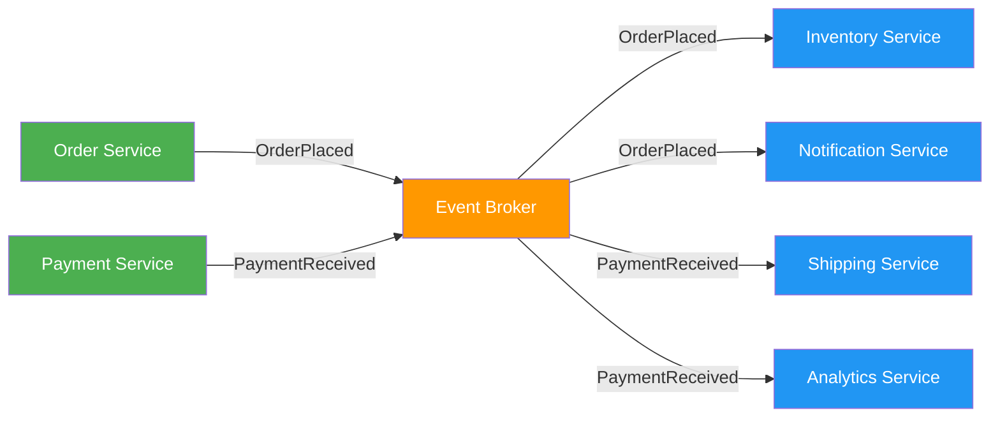
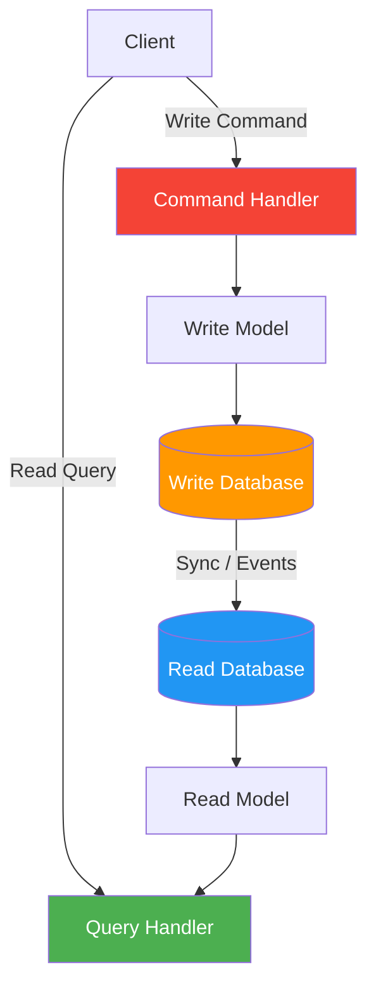
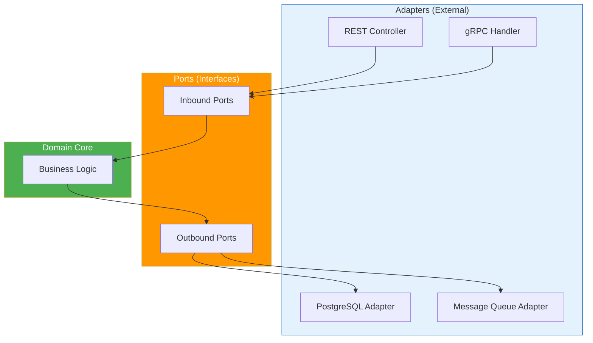
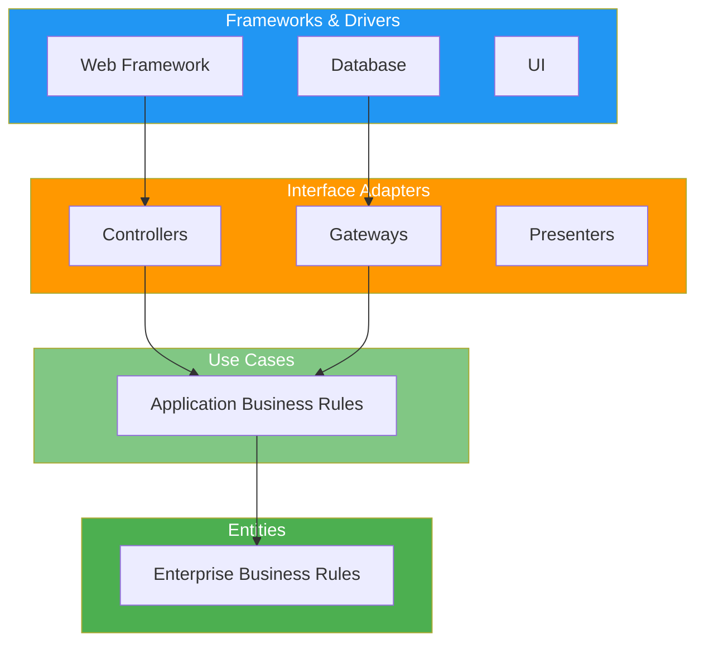
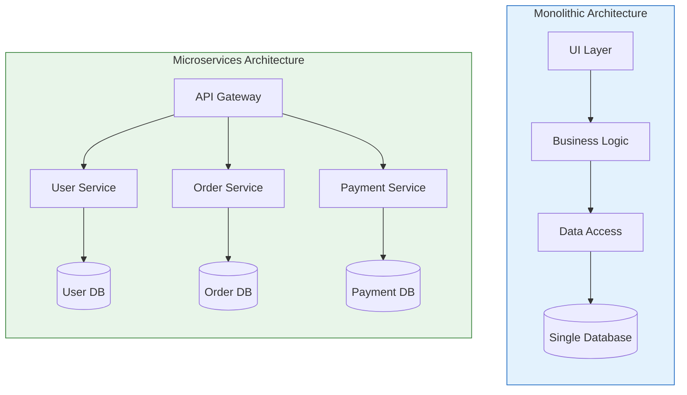
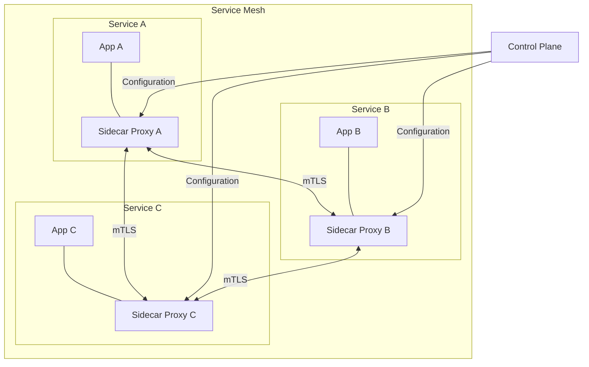
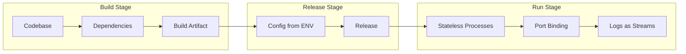

# Architectural Patterns

> Architecture is the fundamental organization of a system, embodied in its components, their relationships to each other and the environment, and the principles governing its design and evolution.

# Table of Contents

1. [What Are Architectural Patterns](#what-are-architectural-patterns)
2. [Monolithic Architecture](#monolithic-architecture)
3. [Microservices Architecture](#microservices-architecture)
4. [Serverless Architecture](#serverless-architecture)
5. [Service-Oriented Architecture (SOA)](#service-oriented-architecture-soa)
6. [Event-Driven Architecture](#event-driven-architecture)
7. [CQRS](#cqrs---command-query-responsibility-segregation)
8. [MVC - Model-View-Controller](#mvc---model-view-controller)
9. [Hexagonal Architecture](#hexagonal-architecture-ports-and-adapters)
10. [Clean Architecture](#clean-architecture)
11. [Monolith vs Microservices Comparison](#monolith-vs-microservices-comparison)
12. [When to Use Which Pattern](#when-to-use-which-pattern)
13. [Service Mesh](#service-mesh)
14. [Twelve-Factor App](#twelve-factor-app)
15. [Resources](#resources)

---

## What Are Architectural Patterns

An architectural pattern is a general, reusable solution to a commonly occurring problem in software architecture. Unlike design patterns (which address code-level concerns), architectural patterns define the high-level structure of an entire application or system.

Choosing the right architecture affects:

- **Scalability** - How easily the system handles growth
- **Maintainability** - How easily the system can be modified
- **Deployability** - How the system is built, tested, and released
- **Team organization** - How development teams are structured around the codebase
- **Performance** - How the system responds under load

> **Tip:** There is no universally "best" architecture. The right choice depends on your team size, project complexity, business requirements, and expected scale.

---

## Monolithic Architecture

A monolithic application is built as a single, unified unit. All components -- the user interface, business logic, and data access layer -- are part of one codebase and deployed as a single artifact.

**Structure:**

```
┌─────────────────────────────┐
│        Monolith             │
│  ┌───────┐ ┌────────────┐  │
│  │  UI   │ │  Business   │  │
│  │ Layer │ │   Logic     │  │
│  └───────┘ └────────────┘  │
│  ┌────────────────────────┐ │
│  │     Data Access Layer  │ │
│  └────────────────────────┘ │
└─────────────────────────────┘
         │
    ┌────┴────┐
    │ Database│
    └─────────┘
```

**Advantages:**
- Simple to develop, test, and deploy initially
- Straightforward debugging (single process)
- No network overhead between components
- Easy to maintain consistency and transactions

**Disadvantages:**
- Becomes difficult to maintain as the codebase grows
- A bug in one module can bring down the entire application
- Scaling requires scaling the entire application, not just the bottleneck
- Technology lock-in: hard to adopt new frameworks or languages for specific parts
- Long deployment cycles as the codebase grows

---

## Microservices Architecture

Microservices break an application into a collection of small, autonomous services, each responsible for a specific business capability. Each service runs in its own process, owns its data, and communicates with other services over the network (typically HTTP/REST or messaging).

**Structure:**

```
┌──────────┐  ┌──────────┐  ┌──────────┐
│  User    │  │  Order   │  │ Payment  │
│ Service  │  │ Service  │  │ Service  │
│          │  │          │  │          │
│  [DB]    │  │  [DB]    │  │  [DB]    │
└────┬─────┘  └────┬─────┘  └────┬─────┘
     │             │             │
     └─────────────┼─────────────┘
                   │
            ┌──────┴──────┐
            │ API Gateway │
            └─────────────┘
```

**Advantages:**
- Independent deployment of each service
- Teams can work autonomously on different services
- Each service can use the most appropriate technology
- Fine-grained scaling (scale only what needs scaling)
- Fault isolation: a failing service does not crash the whole system

**Disadvantages:**
- Distributed system complexity (network latency, partial failures)
- Data consistency is harder (no simple ACID transactions across services)
- Operational overhead: monitoring, logging, tracing across services
- Testing end-to-end flows is more complex
- Requires mature DevOps practices (CI/CD, containerization, orchestration)

---

## Serverless Architecture

In a serverless architecture, the cloud provider manages the infrastructure. Developers write functions that are executed in response to events. The provider handles scaling, provisioning, and server management.

**Key characteristics:**
- **Functions as a Service (FaaS)** - Code is deployed as individual functions (e.g., AWS Lambda, Azure Functions, Google Cloud Functions)
- **Event-driven** - Functions are triggered by events (HTTP requests, database changes, message queue messages)
- **Pay-per-execution** - You only pay for the compute time your functions actually use
- **Auto-scaling** - The platform scales automatically from zero to thousands of concurrent executions

```javascript
// AWS Lambda function example
exports.handler = async (event) => {
  const { name } = JSON.parse(event.body);

  const user = await createUser(name);

  return {
    statusCode: 201,
    body: JSON.stringify({ id: user.id, name: user.name }),
  };
};
```

**Advantages:**
- No server management
- Automatic scaling
- Cost-efficient for sporadic workloads
- Fast time to market

**Disadvantages:**
- Cold start latency
- Vendor lock-in
- Limited execution duration (e.g., 15 minutes on AWS Lambda)
- Harder to test and debug locally
- Not suitable for long-running processes

---

## Service-Oriented Architecture (SOA)

SOA is an architectural style where software components provide services to other components over a network. It predates microservices and typically uses an **Enterprise Service Bus (ESB)** as a central communication backbone.

**Key differences from Microservices:**

| Aspect | SOA | Microservices |
|--------|-----|---------------|
| Communication | Enterprise Service Bus (ESB) | Lightweight protocols (REST, gRPC) |
| Scope | Enterprise-wide integration | Single application or bounded context |
| Data | Often shared databases | Each service owns its data |
| Governance | Centralized | Decentralized |
| Service size | Larger, more encompassing | Smaller, single-purpose |

SOA was designed to integrate large enterprise systems and legacy applications. Microservices evolved from SOA's ideas but applied them with a focus on decentralization and autonomy.

---

## Event-Driven Architecture

In an event-driven architecture (EDA), components communicate by producing and consuming events. An event represents a significant change in state -- for example, "OrderPlaced" or "PaymentReceived."

**Core components:**
- **Event Producers** - Emit events when something happens
- **Event Broker** - Routes events (e.g., Kafka, RabbitMQ, AWS EventBridge)
- **Event Consumers** - React to events they are subscribed to

```
Producer A ──▶ ┌─────────────┐ ──▶ Consumer X
Producer B ──▶ │ Event Broker│ ──▶ Consumer Y
Producer C ──▶ └─────────────┘ ──▶ Consumer Z
```

**Patterns within EDA:**

- **Event Notification** - A service emits an event to inform others something happened; consumers decide what to do
- **Event-Carried State Transfer** - Events carry enough data so consumers do not need to call back to the source
- **Event Sourcing** - Instead of storing current state, store a sequence of events that led to that state



**Advantages:**
- Loose coupling between producers and consumers
- High scalability and responsiveness
- Natural fit for real-time systems

**Disadvantages:**
- Eventual consistency (not immediate)
- Harder to trace and debug event flows
- Potential for event storms or message loops

---

## CQRS - Command Query Responsibility Segregation

CQRS separates the read (query) and write (command) sides of an application into different models. The write model handles commands that change state, while the read model is optimized for queries.

```
         ┌────────────┐
         │   Client   │
         └──┬─────┬───┘
            │     │
    Command │     │ Query
            ▼     ▼
    ┌───────────┐ ┌───────────┐
    │  Write    │ │  Read     │
    │  Model    │ │  Model    │
    └─────┬─────┘ └─────┬─────┘
          │             │
    ┌─────┴─────┐ ┌─────┴─────┐
    │ Write DB  │ │ Read DB   │
    └───────────┘ └───────────┘
```



**When to use CQRS:**
- Read and write workloads have very different performance characteristics
- The read model needs a different structure than the write model (e.g., denormalized views)
- You want to scale reads and writes independently

> **Tip:** CQRS is often combined with Event Sourcing. Commands produce events, and the read side rebuilds its model by replaying events. This is powerful but adds significant complexity.

---

## MVC - Model-View-Controller

MVC is one of the oldest and most widely used architectural patterns. It divides an application into three interconnected components:

- **Model** - Manages the data, logic, and rules of the application
- **View** - Renders the data for the user (UI, API response, etc.)
- **Controller** - Accepts input, converts it to commands for the model or view

```
User ──▶ Controller ──▶ Model
              │            │
              │            ▼
              └────▶    View ──▶ User
```

Most backend web frameworks follow MVC or a variation of it:

| Framework | Language |
|-----------|----------|
| Express.js (with structure) | JavaScript/Node.js |
| Django | Python |
| Ruby on Rails | Ruby |
| Spring MVC | Java |
| ASP.NET MVC | C# |
| Laravel | PHP |

MVC keeps concerns separated, making it straightforward to modify the UI without touching business logic, or to change the data layer without affecting the controllers.

---

## Hexagonal Architecture (Ports and Adapters)

Proposed by Alistair Cockburn, Hexagonal Architecture (also called Ports and Adapters) isolates the application core from external concerns.

- **Core (Domain)** - Contains business logic with no dependencies on external systems
- **Ports** - Interfaces that define how the core communicates with the outside world
- **Adapters** - Implementations that connect ports to specific technologies (databases, HTTP, messaging)

```
        ┌─────────────────────────────────┐
        │           Adapters              │
        │  ┌───────────────────────────┐  │
        │  │         Ports             │  │
        │  │  ┌─────────────────────┐  │  │
        │  │  │    Domain Core      │  │  │
        │  │  │  (Business Logic)   │  │  │
        │  │  └─────────────────────┘  │  │
        │  └───────────────────────────┘  │
        └─────────────────────────────────┘
```



**Example ports and adapters:**
- `UserRepository` (interface) -- the port
- `PostgresUserRepository` (class) -- the adapter
- `InMemoryUserRepository` (class) -- another adapter (for testing)

The key benefit is that you can swap any external technology without touching the core business logic. This also makes testing much easier since you can replace real adapters with test doubles.

---

## Clean Architecture

Proposed by Robert C. Martin, Clean Architecture organizes code into concentric layers where dependencies always point inward. The innermost layer knows nothing about the outer layers.

```
┌──────────────────────────────────────────┐
│  Frameworks & Drivers (Web, DB, UI)      │
│  ┌────────────────────────────────────┐  │
│  │  Interface Adapters (Controllers,  │  │
│  │  Gateways, Presenters)            │  │
│  │  ┌──────────────────────────────┐  │  │
│  │  │  Application Business Rules  │  │  │
│  │  │  (Use Cases)                 │  │  │
│  │  │  ┌────────────────────────┐  │  │  │
│  │  │  │  Enterprise Business   │  │  │  │
│  │  │  │  Rules (Entities)      │  │  │  │
│  │  │  └────────────────────────┘  │  │  │
│  │  └──────────────────────────────┘  │  │
│  └────────────────────────────────────┘  │
└──────────────────────────────────────────┘
```



**The Dependency Rule:** Source code dependencies must point inward. Nothing in an inner circle can know about anything in an outer circle.

| Layer | Responsibility |
|-------|---------------|
| Entities | Core business objects and rules |
| Use Cases | Application-specific business rules |
| Interface Adapters | Convert data between use cases and external formats |
| Frameworks & Drivers | Web frameworks, databases, external APIs |

Clean Architecture, Hexagonal Architecture, and Onion Architecture all share the same fundamental idea: protect the domain from infrastructure concerns.

---

## Monolith vs Microservices Comparison



| Criteria | Monolith | Microservices |
|----------|----------|---------------|
| **Complexity** | Simple initially, grows over time | Complex initially, manageable with scale |
| **Deployment** | Single deployment unit | Independent deployment per service |
| **Scaling** | Scale entire application | Scale individual services |
| **Technology** | Single tech stack | Polyglot (different tech per service) |
| **Data Management** | Single database | Database per service |
| **Team Structure** | Single team or feature teams | Small autonomous teams per service |
| **Testing** | Easier end-to-end testing | Requires contract testing, integration testing |
| **Latency** | In-process calls (fast) | Network calls (slower) |
| **Fault Isolation** | One failure can crash everything | Failures are contained per service |
| **DevOps Maturity** | Low barrier | Requires CI/CD, containers, orchestration |
| **Initial Cost** | Low | High |
| **Long-term Cost** | Increases with complexity | Stabilizes with good practices |

---

## When to Use Which Pattern

| Scenario | Recommended Pattern |
|----------|-------------------|
| Small team, early-stage startup | Monolith |
| Simple CRUD application | MVC + Monolith |
| Large team with independent feature streams | Microservices |
| Complex business domain | Clean/Hexagonal Architecture + DDD |
| Real-time data processing | Event-Driven Architecture |
| Read-heavy application with complex queries | CQRS |
| Sporadic or unpredictable workloads | Serverless |
| Enterprise system integration | SOA |
| Need to scale specific components independently | Microservices |

> **Tip:** Many successful systems start as a well-structured monolith and evolve into microservices as the team and product grow. This approach is sometimes called the "Monolith First" strategy, advocated by Martin Fowler.

---

## Service Mesh

A service mesh is a dedicated infrastructure layer that handles service-to-service communication in a microservices architecture. It provides features like load balancing, service discovery, encryption, observability, and traffic management without requiring changes to application code.

### How a Service Mesh Works

In a service mesh, each service instance is paired with a lightweight network proxy called a **sidecar proxy**. All network traffic flows through these proxies, which collectively form the "mesh."



### Key Components

| Component | Role | Examples |
|-----------|------|----------|
| **Data Plane** | Sidecar proxies handling traffic | Envoy, Linkerd-proxy |
| **Control Plane** | Manages and configures proxies | Istio, Linkerd, Consul Connect |

### Core Features

- **Mutual TLS (mTLS)** — Automatic encryption between services
- **Traffic Management** — Canary deployments, A/B testing, traffic splitting
- **Load Balancing** — Intelligent request routing
- **Observability** — Distributed tracing, metrics, access logs
- **Circuit Breaking** — Preventing cascading failures
- **Rate Limiting** — Controlling traffic flow
- **Service Discovery** — Automatic detection of service instances
- **Retry and Timeout Policies** — Configurable resilience patterns

### Popular Service Mesh Solutions

| Solution | Proxy | Best For |
|----------|-------|----------|
| **Istio** | Envoy | Full-featured, Kubernetes-native |
| **Linkerd** | Linkerd-proxy (Rust) | Lightweight, simple to operate |
| **Consul Connect** | Envoy or built-in | Multi-platform, HashiCorp ecosystem |
| **AWS App Mesh** | Envoy | AWS-native workloads |

### When to Use a Service Mesh

> **Tip:** A service mesh adds operational complexity. It is most valuable when you have many microservices (10+) that need consistent security, observability, and traffic policies across the board.

**Use when:**
- You have many microservices with complex inter-service communication
- You need consistent mTLS encryption across all services
- You require advanced traffic management (canary, blue-green)
- You need unified observability without code changes

**Avoid when:**
- You have a monolith or only a few services
- Your team lacks Kubernetes expertise
- The operational overhead outweighs the benefits

---

## Twelve-Factor App

The [Twelve-Factor App](https://12factor.net/) is a methodology for building software-as-a-service (SaaS) applications. Created by developers at Heroku, it provides a set of best practices for building cloud-native, portable, and scalable applications.

### The Twelve Factors

| # | Factor | Description |
|---|--------|-------------|
| 1 | **Codebase** | One codebase tracked in version control, many deploys |
| 2 | **Dependencies** | Explicitly declare and isolate dependencies |
| 3 | **Config** | Store configuration in the environment |
| 4 | **Backing Services** | Treat backing services as attached resources |
| 5 | **Build, Release, Run** | Strictly separate build and run stages |
| 6 | **Processes** | Execute the app as one or more stateless processes |
| 7 | **Port Binding** | Export services via port binding |
| 8 | **Concurrency** | Scale out via the process model |
| 9 | **Disposability** | Maximize robustness with fast startup and graceful shutdown |
| 10 | **Dev/Prod Parity** | Keep development, staging, and production as similar as possible |
| 11 | **Logs** | Treat logs as event streams |
| 12 | **Admin Processes** | Run admin/management tasks as one-off processes |



### Key Principles Explained

**III. Config — Store config in the environment:**

```bash
# Bad: hardcoded configuration
DATABASE_URL = "postgres://localhost/mydb"

# Good: environment variables
DATABASE_URL = os.environ['DATABASE_URL']
```

**VI. Processes — Stateless and share-nothing:**

Each process should be stateless. Any data that needs to persist must be stored in a stateful backing service (database, cache, object storage).

**IX. Disposability — Fast startup, graceful shutdown:**

```javascript
// Graceful shutdown example
process.on('SIGTERM', async () => {
  console.log('SIGTERM received, shutting down gracefully');
  await server.close();
  await db.disconnect();
  process.exit(0);
});
```

**X. Dev/Prod Parity — Keep environments similar:**

| Gap | Traditional App | Twelve-Factor App |
|-----|----------------|-------------------|
| **Time** | Weeks between deploys | Hours between deploys |
| **Personnel** | Devs write, ops deploy | Same team does both |
| **Tools** | Different backing services | Same services everywhere |

> **Tip:** Docker and containerization make dev/prod parity much easier to achieve. Use the same Docker images across all environments.

### Why Twelve-Factor Matters

- **Portability** — Apps can run on any cloud platform
- **Scalability** — Stateless processes scale horizontally
- **Maintainability** — Clear separation of concerns
- **Automation** — CI/CD friendly with strict build/release/run separation
- **Resilience** — Disposable processes recover quickly from failures

---

## Resources

- [Martin Fowler - Microservices](https://martinfowler.com/articles/microservices.html)
- [Martin Fowler - Monolith First](https://martinfowler.com/bliki/MonolithFirst.html)
- [Clean Architecture by Robert C. Martin](https://www.oreilly.com/library/view/clean-architecture-a/9780134494272/)
- [Hexagonal Architecture - Alistair Cockburn](https://alistair.cockburn.us/hexagonal-architecture/)
- [CQRS - Martin Fowler](https://martinfowler.com/bliki/CQRS.html)
- [Event-Driven Architecture - AWS](https://aws.amazon.com/event-driven-architecture/)
- [Serverless Architectures - Martin Fowler](https://martinfowler.com/articles/serverless.html)
- [Building Microservices by Sam Newman](https://www.oreilly.com/library/view/building-microservices-2nd/9781492034018/)
- [Fundamentals of Software Architecture by Mark Richards & Neal Ford](https://www.oreilly.com/library/view/fundamentals-of-software/9781492043447/)
