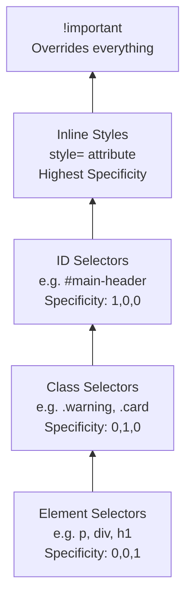
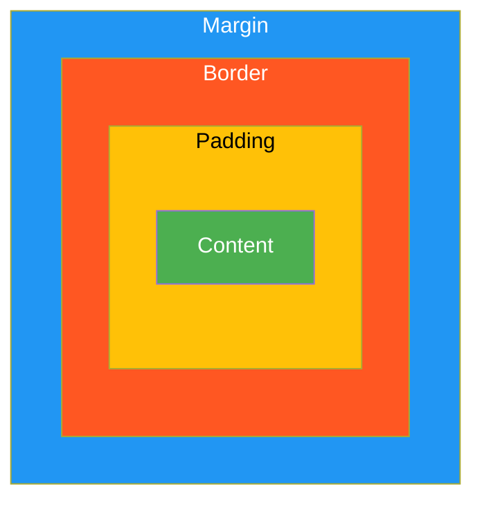
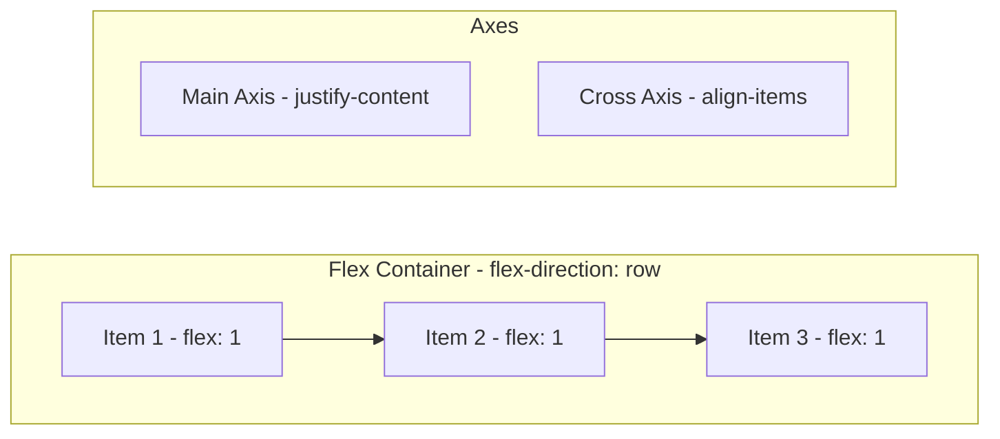

# CSS Basics

# Contents

1. [CSS Basics](#css-basics)
2. [What is CSS?](#what-is-css)
3. [How CSS Works with HTML](#how-css-works-with-html)
4. [CSS Syntax](#css-syntax)
5. [Ways to Add CSS](#ways-to-add-css)
   1. [Inline CSS](#inline-css)
   2. [Internal CSS](#internal-css)
   3. [External CSS](#external-css)
6. [Selectors](#selectors)
   1. [Element Selector](#element-selector)
   2. [Class Selector](#class-selector)
   3. [ID Selector](#id-selector)
   4. [Attribute Selector](#attribute-selector)
   5. [Pseudo-class and Pseudo-element Selectors](#pseudo-class-and-pseudo-element-selectors)
   6. [Combinators](#combinators)
7. [The Box Model](#the-box-model)
8. [Display Property](#display-property)
9. [Positioning](#positioning)
10. [Colors and Units](#colors-and-units)
11. [Flexbox Basics](#flexbox-basics)
12. [Grid Basics](#grid-basics)
13. [Responsive Design and Media Queries](#responsive-design-and-media-queries)
14. [CSS Variables](#css-variables)
15. [Resources](#resources)

---

## What is CSS?

**CSS (Cascading Style Sheets)** is the language used to describe the presentation of a document written in HTML. While HTML provides the structure and content of a web page, CSS controls its visual appearance: colors, fonts, spacing, layout, and even animations.

As a backend developer, understanding CSS basics is important because you will often need to debug frontend issues, build admin panels, work with server-rendered templates, or review pull requests that touch the UI layer.

> **Tip:** The word "cascading" refers to the way CSS rules are applied in a specific order of priority. When multiple rules target the same element, the cascade determines which rule wins.

## How CSS Works with HTML

The browser reads your HTML to build the **DOM (Document Object Model)**, then applies CSS rules to determine how each element should be rendered. CSS rules match elements in the DOM using **selectors** and apply visual **properties** to them.

```
HTML Document  -->  DOM Tree  -->  CSS Rules Applied  -->  Rendered Page
```

## CSS Syntax

A CSS rule consists of a **selector** and a **declaration block**. The declaration block contains one or more declarations, each made up of a **property** and a **value**.

```css
selector {
  property: value;
  another-property: value;
}
```

For example:

```css
h1 {
  color: navy;
  font-size: 24px;
  margin-bottom: 12px;
}
```

This rule targets all `<h1>` elements and sets their text color, font size, and bottom margin.

## Ways to Add CSS

There are three ways to include CSS in an HTML document. Each has its own use case.

### Inline CSS

Applied directly on an element using the `style` attribute. This has the highest specificity and is useful for quick overrides, but should be avoided for maintainability.

```html
<p style="color: red; font-size: 14px;">This text is red.</p>
```

### Internal CSS

Placed inside a `<style>` tag within the `<head>` section of an HTML document. Useful for single-page styles.

```html
<head>
  <style>
    body {
      background-color: #f5f5f5;
    }
    p {
      line-height: 1.6;
    }
  </style>
</head>
```

### External CSS

Written in a separate `.css` file and linked via a `<link>` tag. This is the recommended approach for most projects because it separates concerns and allows caching.

```html
<head>
  <link rel="stylesheet" href="styles.css">
</head>
```

| Method   | Scope         | Reusability | Maintainability |
|----------|---------------|-------------|-----------------|
| Inline   | Single element | None        | Poor            |
| Internal | Single page    | Low         | Medium          |
| External | Entire site    | High        | Best            |

### CSS Specificity Hierarchy

When multiple CSS rules target the same element, specificity determines which rule wins. The hierarchy from lowest to highest:



## Selectors

Selectors are patterns that tell the browser which HTML elements a set of CSS rules should apply to.

### Element Selector

Targets all instances of a specific HTML tag.

```css
p {
  color: #333;
}
```

### Class Selector

Targets elements with a specific `class` attribute. Prefixed with a dot (`.`). Classes are reusable across multiple elements.

```css
.warning {
  color: orange;
  font-weight: bold;
}
```

```html
<p class="warning">Disk usage is at 90%.</p>
```

### ID Selector

Targets a single element with a specific `id` attribute. Prefixed with a hash (`#`). IDs must be unique per page.

```css
#main-header {
  background-color: #222;
  color: white;
}
```

### Attribute Selector

Targets elements based on the presence or value of an attribute.

```css
/* All inputs of type "text" */
input[type="text"] {
  border: 1px solid #ccc;
}

/* Links that open in a new tab */
a[target="_blank"] {
  color: green;
}
```

### Pseudo-class and Pseudo-element Selectors

**Pseudo-classes** select elements based on their state:

```css
a:hover {
  color: red;
}

input:focus {
  outline: 2px solid blue;
}

li:first-child {
  font-weight: bold;
}
```

**Pseudo-elements** select and style a specific part of an element:

```css
p::first-line {
  font-variant: small-caps;
}

h2::before {
  content: ">> ";
  color: gray;
}
```

### Combinators

Combinators describe relationships between selectors.

```css
/* Descendant: any <p> inside a <div> */
div p { color: blue; }

/* Child: direct <p> children of <div> only */
div > p { color: green; }

/* Adjacent sibling: <p> immediately after <h2> */
h2 + p { margin-top: 0; }

/* General sibling: all <p> elements after <h2> */
h2 ~ p { color: gray; }
```

## The Box Model

Every HTML element is treated as a rectangular box. The CSS box model describes the space an element occupies, consisting of four layers from inside out:

```
+-----------------------------+
|          Margin              |
|  +------------------------+ |
|  |       Border            | |
|  |  +------------------+  | |
|  |  |    Padding        |  | |
|  |  |  +------------+  |  | |
|  |  |  |  Content   |  |  | |
|  |  |  +------------+  |  | |
|  |  +------------------+  | |
|  +------------------------+ |
+-----------------------------+
```

- **Content** -- the actual text, image, or child elements.
- **Padding** -- space between the content and the border.
- **Border** -- a line around the padding.
- **Margin** -- space outside the border, separating the element from neighbors.



```css
.card {
  width: 300px;
  padding: 20px;
  border: 1px solid #ddd;
  margin: 16px;
}
```

> **Tip:** By default, `width` only sets the content width. Use `box-sizing: border-box` to make `width` include padding and border, which is far more intuitive. Most CSS resets apply this globally: `* { box-sizing: border-box; }`

## Display Property

The `display` property controls how an element participates in the layout flow.

| Value          | Behavior                                                        |
|----------------|-----------------------------------------------------------------|
| `block`        | Takes full width, starts on a new line (`div`, `p`, `h1`)      |
| `inline`       | Only takes needed width, no line break (`span`, `a`, `strong`) |
| `inline-block` | Like inline but allows width/height settings                    |
| `none`         | Element is removed from the flow entirely                       |
| `flex`         | Enables flexbox layout on children                              |
| `grid`         | Enables grid layout on children                                 |

```css
.nav-item {
  display: inline-block;
  padding: 8px 16px;
}

.hidden {
  display: none;
}
```

## Positioning

The `position` property controls how an element is placed in the document.

| Value      | Description                                                              |
|------------|--------------------------------------------------------------------------|
| `static`   | Default. Element follows normal document flow.                           |
| `relative` | Positioned relative to its normal position. Still occupies original space.|
| `absolute` | Positioned relative to the nearest positioned ancestor. Removed from flow.|
| `fixed`    | Positioned relative to the browser viewport. Stays on scroll.            |
| `sticky`   | Toggles between relative and fixed based on scroll position.             |

```css
/* A fixed navigation bar */
.navbar {
  position: fixed;
  top: 0;
  left: 0;
  width: 100%;
  z-index: 1000;
}

/* A tooltip positioned relative to its parent */
.tooltip-container {
  position: relative;
}
.tooltip {
  position: absolute;
  top: -30px;
  left: 0;
}
```

## Colors and Units

### Color Values

CSS supports multiple color formats:

```css
.example {
  color: red;                    /* Named color */
  color: #ff0000;                /* Hex */
  color: rgb(255, 0, 0);        /* RGB */
  color: rgba(255, 0, 0, 0.5);  /* RGB with alpha */
  color: hsl(0, 100%, 50%);     /* HSL */
}
```

### CSS Units

| Unit  | Type     | Description                                  |
|-------|----------|----------------------------------------------|
| `px`  | Absolute | Pixels. Fixed size.                          |
| `em`  | Relative | Relative to the parent element's font size.  |
| `rem` | Relative | Relative to the root (`<html>`) font size.   |
| `%`   | Relative | Relative to the parent element's dimension.  |
| `vh`  | Relative | 1% of the viewport height.                   |
| `vw`  | Relative | 1% of the viewport width.                    |

> **Tip:** Prefer `rem` for font sizes and spacing in most cases. It provides consistency across your layout while remaining accessible -- users who change their browser's default font size will see your layout scale appropriately.

## Flexbox Basics

Flexbox is a one-dimensional layout system for arranging items in a row or column.

```css
.container {
  display: flex;
  flex-direction: row;       /* row | column */
  justify-content: center;   /* main axis alignment */
  align-items: center;       /* cross axis alignment */
  gap: 16px;                 /* space between items */
}

.item {
  flex: 1;                   /* grow to fill available space */
}
```

Key properties on the **container**: `flex-direction`, `justify-content`, `align-items`, `flex-wrap`, `gap`.

Key properties on the **items**: `flex-grow`, `flex-shrink`, `flex-basis`, `align-self`, `order`.

```html
<div class="container">
  <div class="item">1</div>
  <div class="item">2</div>
  <div class="item">3</div>
</div>
```

Common use cases: navigation bars, card layouts, centering content both vertically and horizontally.



## Grid Basics

CSS Grid is a two-dimensional layout system for creating complex layouts with rows and columns.

```css
.grid-container {
  display: grid;
  grid-template-columns: 1fr 2fr 1fr;  /* 3 columns */
  grid-template-rows: auto;
  gap: 16px;
}

.sidebar {
  grid-column: 1;
}

.main-content {
  grid-column: 2;
}

.aside {
  grid-column: 3;
}
```

The `fr` unit represents a fraction of the available space. `1fr 2fr 1fr` means the middle column gets twice the space of each side column.

| Feature     | Flexbox                  | Grid                          |
|-------------|--------------------------|-------------------------------|
| Dimension   | One-dimensional          | Two-dimensional               |
| Best for    | Components, small layouts| Page layouts, complex grids   |
| Alignment   | Along main/cross axis    | Along rows and columns        |

## Responsive Design and Media Queries

Responsive design ensures your page looks good on all screen sizes. The key tool is the **media query**, which applies CSS rules conditionally based on viewport characteristics.

First, always include the viewport meta tag in your HTML:

```html
<meta name="viewport" content="width=device-width, initial-scale=1.0">
```

Then use media queries to adapt the layout:

```css
/* Default: mobile-first styles */
.container {
  display: flex;
  flex-direction: column;
}

/* Tablets and above */
@media (min-width: 768px) {
  .container {
    flex-direction: row;
  }
}

/* Desktops */
@media (min-width: 1024px) {
  .container {
    max-width: 1200px;
    margin: 0 auto;
  }
}
```

Common breakpoints (not strict rules):

| Device      | Breakpoint     |
|-------------|----------------|
| Mobile      | up to 767px    |
| Tablet      | 768px -- 1023px |
| Desktop     | 1024px+        |

> **Tip:** A "mobile-first" approach means writing your base CSS for small screens and then using `min-width` media queries to add complexity for larger screens. This tends to produce cleaner, more maintainable code.

## CSS Variables

CSS Custom Properties (variables) let you define reusable values. They are declared with `--` prefix and accessed with `var()`.

```css
:root {
  --primary-color: #3498db;
  --secondary-color: #2ecc71;
  --font-size-base: 16px;
  --spacing: 8px;
  --border-radius: 4px;
}

.button {
  background-color: var(--primary-color);
  font-size: var(--font-size-base);
  padding: var(--spacing) calc(var(--spacing) * 2);
  border-radius: var(--border-radius);
  color: white;
  border: none;
  cursor: pointer;
}

.button:hover {
  background-color: var(--secondary-color);
}
```

CSS variables are scoped and can be overridden in child elements, making them ideal for theming:

```css
[data-theme="dark"] {
  --primary-color: #1a1a2e;
  --text-color: #eee;
  --bg-color: #16213e;
}
```

> **Tip for backend developers:** CSS variables are especially useful in server-rendered templates where you might inject theme values or brand colors from a database into a root-level style block.

## Resources

- [MDN Web Docs -- CSS Basics](https://developer.mozilla.org/en-US/docs/Learn/Getting_started_with_the_web/CSS_basics)
- [MDN Web Docs -- CSS Reference](https://developer.mozilla.org/en-US/docs/Web/CSS/Reference)
- [CSS-Tricks -- A Complete Guide to Flexbox](https://css-tricks.com/snippets/css/a-guide-to-flexbox/)
- [CSS-Tricks -- A Complete Guide to Grid](https://css-tricks.com/snippets/css/complete-guide-grid/)
- [web.dev -- Learn CSS](https://web.dev/learn/css/)
- [Box Model -- MDN](https://developer.mozilla.org/en-US/docs/Web/CSS/CSS_box_model/Introduction_to_the_CSS_box_model)
- [Can I Use -- Browser Support Tables](https://caniuse.com/)
- [Flexbox Froggy -- Interactive Flexbox Game](https://flexboxfroggy.com/)
- [Grid Garden -- Interactive Grid Game](https://cssgridgarden.com/)
