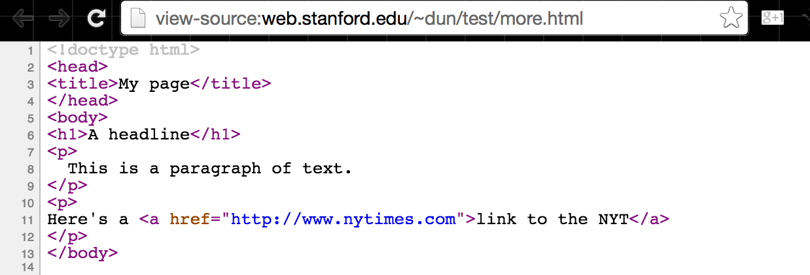
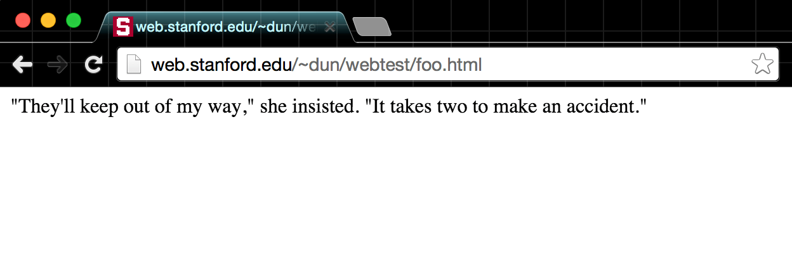
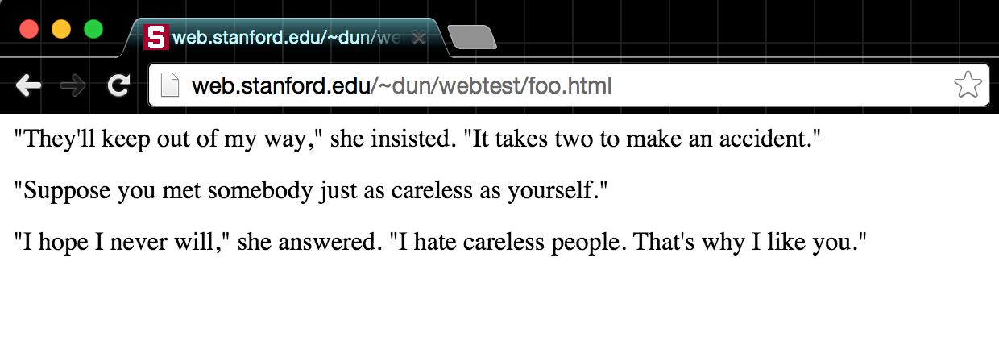
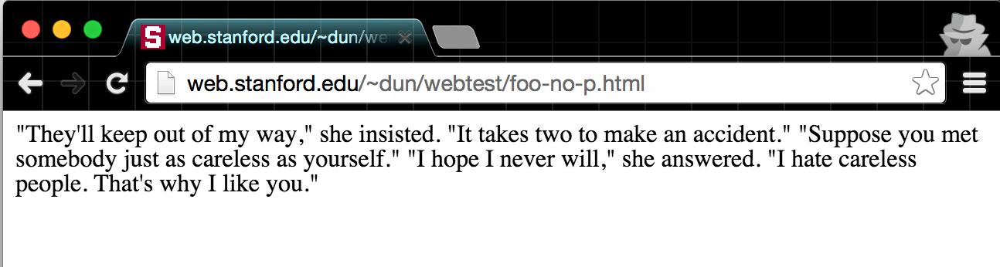
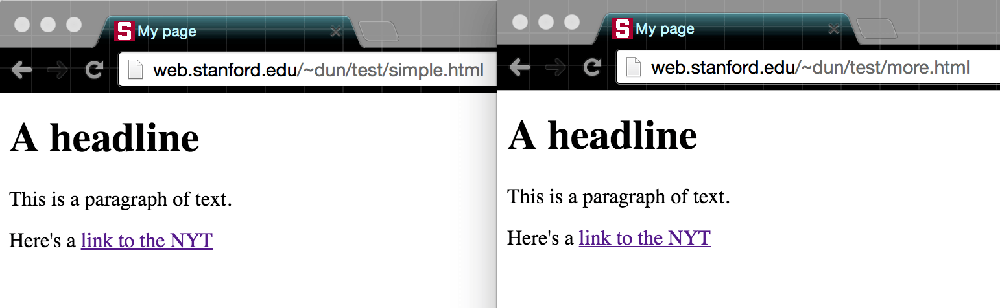

# Understanding HTML basics

© [Understanding HTML basics](http://www.compciv.org/topics/web/html-basics/) all rights reserved.

# Contents
1. [Understanding HTML basics](#understanding-html-basics)
2. [Contents](#contents)
3. [Introduction](#introduction)
4. [Bash and strings](#bash-and-strings)
5. [Seeing your own web pages](#seeing-your-own-web-pages)
6. [About HTML](#about-html)
    1. [The HTML Element](#the-html-element)
    2. [Let's make a webpage](#lets-make-a-webpage)
    3. [Insignificant whitespace](#insignificant-whitespace)
    4. [Tags as structure](#tags-as-structure)
    5. [Nesting HTML elements](#nesting-html-elements)
    6. [HTML attributes](#html-attributes)
    7. [Unclosed tags](#unclosed-tags)
    8. [Boilerplate HTML](#boilerplate-html)

# Introduction

How HTML works, and some of its terminology

By now, we know how to scrape HTML for data. Now we're going to move in the opposite direction, turn data into HTML. Luckily, the logic for doing both, at least at a mass, automated scale, is largely the same.

This guide covers some of the basics of HTML, assuming that you know literally nothing about it, and a few more techniques in dealing with multi-line strings in Bash. As web design and development are their own entire fields, this guide obviously can't cover everything, so consider this the bare minimum knowledge of HTML needed to make a functioning page.

If you want to learn more beyond what I cover (and you _should_), I highly suggest starting with [Chapter 3 of Scott Murray's (free, online) book, Interactive Data Visualization for the Web](http://chimera.labs.oreilly.com/books/1230000000345/ch03.html), which covers the fundamentals and purposes of HTML, CSS, and JS.

# Bash and strings

For review, read the guides/sections to:

*   [Heredocs](/topics/bash/text-values#heredocs-info), which allow for writing longer, multi-line strings

We know how to send a string of text to a new file:

    # To send a string to a new file, the old, clunky way:
    echo "<html><body><h1>Hello there</h1>" > some.html
   

We use **heredocs** to make it easier to work with multi-line strings. So you'll want to be comfortable with this notation, using **cat**, to add a heredoc to a file (though we'll practice more of it in another lesson):

    # To send a string to a new file, using cat and heredocs
    cat > some.html <<'EOF'
    <html>
      <body>
      <h1>Hello there</h1>
      <a href="http://example.com"> Hey mom, I'm using "quotes"!</a>
    EOF
   

To _append_ to a file, you should already be familiar with `>>`:

    # To append a string using cat and heredocs
    cat >> some.html <<'EOF'
    
Here's another paragraph for you

    EOF
   

# Seeing your own web pages

If you're on **corn.stanford.edu**, think about working in your `~/WWW` directory, as all pages and files saved there can be accessible to the web.

For example, in the code snippet below, I'm creating a page at: `~/WWW/playground/hello.html`:

    mkdir -p ~/WWW/playground
    cat > ~/WWW/playground/hello.html <<'EOF'
      <html>
      <head>
         <title>This is Dan's page</title>
      </head>
      <body>
   
      <h1>Hello there</h1>
      
Just testing out HTML and using a Heredoc

      
Here's a
        <a href="http://placekitten.com">kitten</a>:
      

      
    EOF
   
    # And let's add a little more, notice the use of double
    # right-braces to append to the file
   
    cat >> ~/WWW/playground/hello.html <<'EOF'
      
And here's Bill Murray

      
    EOF
   

My **SUnet ID** is `dun`, which means `~/WWW/playground/hello.html` will be viewable at:

[http://stanford.edu/~dun/playground/hello.html](http://stanford.edu/~dun/playground/hello.html)

About HTML
----------

### The HTML Element

The structural building block of HTML is the [HTML Element](http://en.wikipedia.org/wiki/HTML_element)

Below is an example of a **paragraph** element:

    

      "They’ll keep out of my way," she insisted. "It takes two to make an accident."
    

   

The textual content in the paragraph element is enclosed a **start tag**, `
`, and its corresponding **end tag**, `
` – note the end tag's _forward-slash_ that makes the difference between it and the start tag.

### Let's make a webpage

And that's about all we need to know to make a _functional_ (though egregiously non-standard) web page. If you're on **corn.stanford.edu**, change into your personal (but not _private_) `~/WWW` directory and create a subdirectory for trying things out:

    mkdir -p ~/WWW/webtest
    cd ~/WWW/webtest
    # Make a webpage named `foo.html` consisting of a single paragraph element:
    cat > foo.html <<'EOF'
    

      "They'll keep out of my way," she insisted. "It takes two to make an accident."
    

    EOF
   

**Note:** Above, [I use what's called a "heredoc"](http://stackoverflow.com/questions/2953081/how-can-i-write-a-here-doc-to-a-file-in-bash-script) to quickly dump a line into a new file. If you find its syntax weird, then just use **nano** to create the new file.

If you visit http://www.stanford.edu/~your\_sunet\_id/webtest/foo.html, you should see something like this:

That's not very impressive, so add a couple of other paragraph elements (and some arbitrary whitespace). Again, use **nano** to copy-and-paste if you don't like the look of that `EOF`:

    cat >> foo.html <<'EOF'
    

      "Suppose you met somebody just as careless as yourself."
   
      

    

     "I hope I never will," she answered. "I hate careless people. That's why I like you."
     

    EOF
   

The result:

### Insignificant whitespace

One thing that should be apparent is that the _amount of whitespace_, both between the elements and within the tags of the elements, makes not a bit of difference in the _physical_ layout of the webpage, as rendered by the browser.

Let's confirm that, via the command-line. Execute a command that removes **newline** characters from `foo.html` and redirect it into a new file: `foo-oneline.html`

    cat foo.html | tr -d '\n' > foo-oneline.html
   

Visit the `foo-oneline.html` in your browser. You should see no change to the physical appearance of the text.

HTML is said to be a **whitespace insignificant** language. In terms of the _content_, whitespace doesn't make a difference – all consecutive spaces and newlines are treated as a single space. This is mostly trivia to us, but in pragmatic terms, this means we can space HTML elements as much (or as little) as we need to, without disrupting what is shown in the browser.

### Tags as structure

Now instead of removing whitespace, let's remove the **tags** of the elements, and save the result as a new file, `foo-no-p.html`. We can do this in two ways; using the **pup** HTML parser:

    cat foo.html | pup 'text{}' > foo-no-p.html
   

– or via good 'ol **sed** and its **substitution** function:

    cat foo.html | sed -E 's#</?p>##g' > foo-no-p.html
   

Now visit `foo-no-p.html`:

Looks like the `
` tags made all the difference. By default, web browsers treat `
` elements as _blocks_ – each block element occupies an entire "line" of the browser window. With the `
` tags removed, no such blocks exist, and thus, no line-by-line separation.

**Note:** The block nature of the paragraph (i.e. `
`) element is the default, but ultimately, that characteristic, as well as the _physical appearance_ of paragraphs, and _every other element of a webpage_, is completely mutable, as we'll see when we get to the topic of [Cascading Style Sheets](#css)

### Nesting HTML elements

One characteristic of HTML is the ability to nest elements within each other. For example, if we wanted to _emphasize_ a sentence in a paragraph, we would wrap that sentence in `<em>` tags:

    cat foo.html | sed -E 's#(I hate careless people)#<em>\1</em>#'
   

(Note the usage of [capturing groups](http://www.thegeekstuff.com/2009/10/unix-sed-tutorial-advanced-sed-substitution-examples/): one of the best features of regular expressions)

The result:

    

      "They'll keep out of my way," she insisted. "It takes two to make an accident."
    

    

      "Suppose you met somebody just as careless as yourself."
   
      

   
   
    

     "I hope I never will," she answered. "<em>I hate careless people</em>. That's why I like you."
     

   

And the result, if we pipe it into a new page named `foo-em.html` – notice the italicized text:

There's not much to note here, except that you want your nested start and end tags to be self-contained within their **parent\_\_element. The `
` element is considered to be the \_\_parent** of the `<em>` element:

    

     "I hope I never will," she answered. "<em>I hate careless people</em>. That's why I like you."
     

   

This is **bad** form, having the child element's closing tag _after_ its parent's closing tag:

    

     "I hope I never will," she answered. "<em>I hate careless people. That's why I like you."
     

     </em>
   

– but _visually_, most browsers can deal with such mistakes. However, for the purposes of keeping your sanity, you don't want to be sloppy here. As we've seen before, the tagged elements essentially define the structure of the document.

### HTML attributes

One more bit of syntax and we'll have covered just about all we need to know about HTML. The code for an **anchor-tag**, commonly referred to as a **hyperlink**, looks like this:

    <a href="http://www.example.com">Click here please</a>
   

The `<a>` tag encloses the text element, `Click here please`, and has an **attribute** with the name of `href`. The **value** of that `href` attribute is `"http://www.example.com"`, which is the destination URL.

To summarize the components of the above hyperlink element:

The tag

`<a>`

The attribute

`href`

The attribute's value

`"http://www.example.com"`

The text

Click here please

The proper syntax for attributes is that they are inside the _start tag_, and a tag can have more than one attribute. The following variation will cause the browser to pop-open a new window for the clicked link:

    <a href="http://www.example.com" target="_blank">Click here please</a>
   

### Unclosed tags

Some tags do not need a corresponding **end** tag. One example is the `` tag, which is used to display an image that exists at the URL pointed to by its `src` attribute:

    
   

On a conceptual level, this makes some sense: an _image_ is a standalone element, it shouldn't enclose a text element, nor any other kind of element. Same thing with the ` ` tag, which denotes a **line-break**. Which tags _don't_ need to be closed? It's a matter of memorization, but it happens to only be a few (fnd if you do include an unnecessary closing tag, it won't break the page).

### Boilerplate HTML

Believe it or not, but we now know the essentials for to constructing a usable HTML web page. The rest is memorization of certain conventions and for the kinds of tags and their corresponding attributes (as we'll see in the lesson CSS, the name of tag and its appearance, as rendered by the browser, have nothing to do with each other).

Why we're able to get away with memorizing so little is that Web browsers have learned to cope with poor HTML, which is why our paragraph-only **foo.html** page shows up just fine. There is a [minimal amount of boilerplate to make it a valid HTML5 document](http://stackoverflow.com/questions/9797046/whats-a-valid-html5-document)…And again, this is mostly irrelevant since the browser will compensate for our laziness, at least on basic pages.

However, when we start working with stylesheets and JavaScript, we will want to be more formal in our boilerplate. Here's an example of a page with a `<html>` tag (which doesn't need to be closed) and a meta `<title>` tag:

    <!doctype html>
    <title>My page</title>
    <h1>A headline</h1>
    

      This is a paragraph of text.
    

    

    Here's a <a href="http://www.nytimes.com">link to the NYT</a>
    

   

Here's some more boilerplate, the `<head>` element is used to enclose meta information and links to external files and code, which we'll cover later, and the `<body>` tag wraps around all the actual content of the page:

    <!doctype html>
    <head>
    <title>My page</title>
    </head>
    <body>
    <h1>A headline</h1>
    

      This is a paragraph of text.
    

    

    Here's a <a href="http://www.nytimes.com">link to the NYT</a>
    

    </body>
   

Try outputting these two files to your "~/WWW" directory, one with some boilerplate and the other with more boilerplate, and then visiting them in your browser:

This page will live at `www.stanford.edu/~yourname/test/simple.html`

    mkdir -p ~/WWW/test/
    cat > ~/WWW/test/simple.html <<'EOF'
    <!doctype html>
    <title>My page</title>
    <h1>A headline</h1>
    

      This is a paragraph of text.
    

    

    Here's a <a href="http://www.nytimes.com">link to the NYT</a>
    

    EOF
   

This other page will live at `www.stanford.edu/~yourname/test/more.html`

    mkdir -p ~/WWW/test/
    cat > ~/WWW/test/more.html <<'EOF'
    <!doctype html>
    <head>
    <title>My page</title>
    </head>
    <body>
    <h1>A headline</h1>
    

      This is a paragraph of text.
    

    

    Here's a <a href="http://www.nytimes.com">link to the NYT</a>
    

    </body>
    EOF
   

Visit those two pages you created. Notice any difference (at least in a modern browser)? There likely won't be, and when it comes to metadata, such as the **attributes** of HTML, it shouldn't be visible on the page anyway.

Source: 

http://www.compciv.org/topics/web/html-basics/