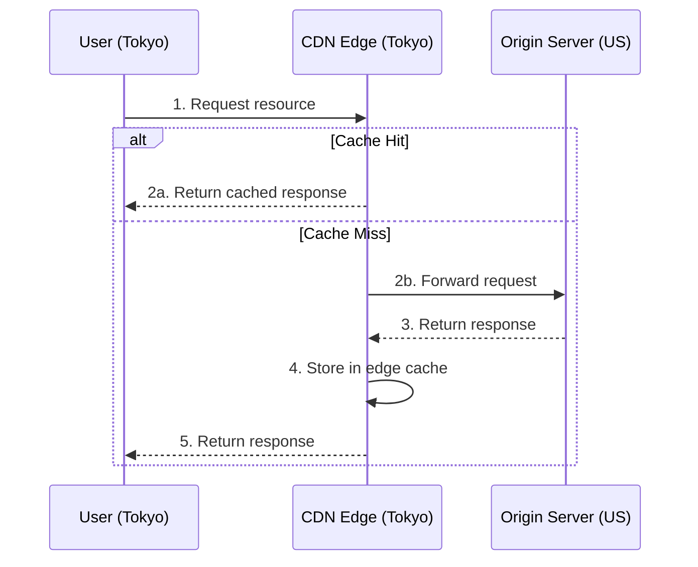
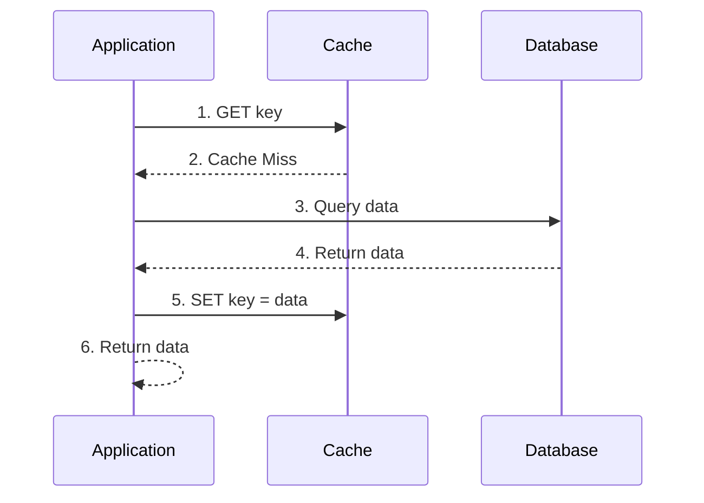
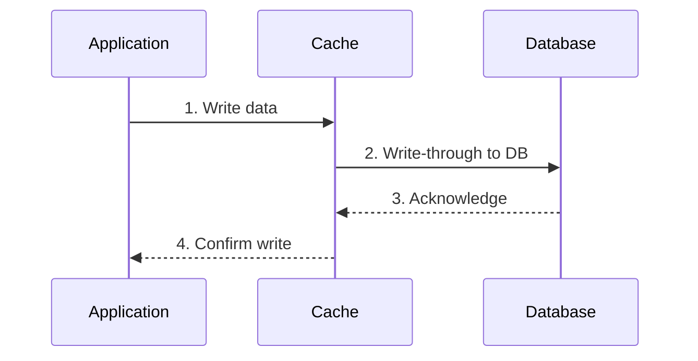
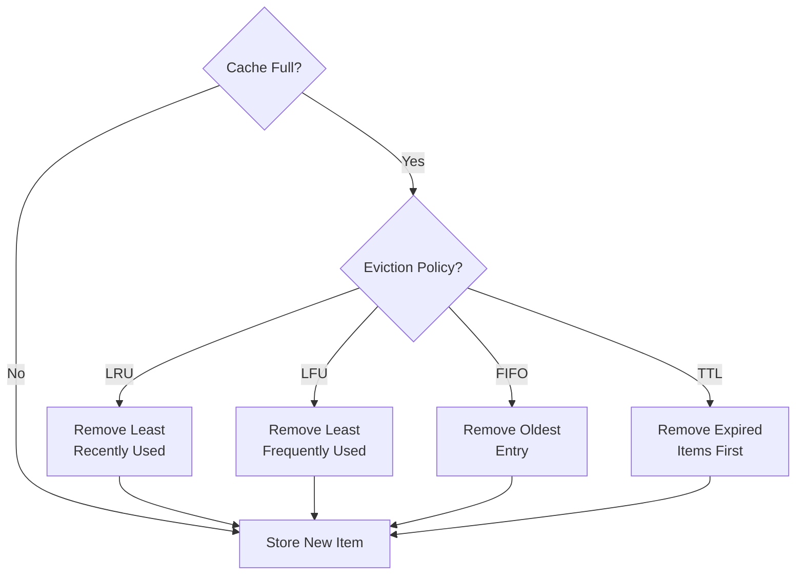

# Caching

---

# Contents

1.  [What is Caching](#what-is-caching)
2.  [Why Caching Matters](#why-caching-matters)
3.  [Types of Caching](#types-of-caching)
4.  [Cache Strategies](#cache-strategies)
5.  [Cache Eviction Policies](#cache-eviction-policies)
6.  [Redis as a Cache](#redis-as-a-cache)
7.  [Memcached Overview](#memcached-overview)
8.  [Cache Invalidation Challenges](#cache-invalidation-challenges)
9.  [HTTP Caching Headers](#http-caching-headers)
10. [Best Practices](#best-practices)
11. [Resources](#resources)

# What is Caching

Caching is the process of storing copies of data in a temporary storage location so that future requests for that data can be served faster. Instead of computing a result or fetching data from a slow data source every time, the system returns the previously stored result.

> "There are only two hard things in Computer Science: cache invalidation and naming things." -- Phil Karlton

At its core, a cache is a key-value store that sits between your application and a slower data source. When a request comes in, the system first checks the cache. If the data is found (a **cache hit**), it is returned immediately. If the data is not found (a **cache miss**), the system fetches it from the original source, stores a copy in the cache, and then returns it.

| Term | Description |
|------|-------------|
| **Cache Hit** | The requested data is found in the cache |
| **Cache Miss** | The requested data is not in the cache and must be fetched from the origin |
| **Hit Ratio** | The percentage of requests served from the cache vs. total requests |
| **TTL (Time to Live)** | How long a cached item remains valid before it expires |
| **Warm Cache** | A cache that has been populated with frequently accessed data |
| **Cold Cache** | An empty or freshly started cache with no data |

# Why Caching Matters

Caching is one of the most impactful techniques for improving the performance and scalability of backend systems.

**Performance** -- Reading from a cache (often in-memory) is orders of magnitude faster than reading from a database or computing a result. Redis, for example, can handle hundreds of thousands of operations per second with sub-millisecond latency.

**Scalability** -- By reducing the load on your database and backend services, caching allows your system to handle significantly more concurrent users without scaling the underlying infrastructure.

**Cost Reduction** -- Fewer database queries and less compute time translate directly to lower infrastructure costs, especially in cloud environments where you pay per resource usage.

**User Experience** -- Faster response times lead to a better experience. Studies show that even a 100ms delay can impact user satisfaction and conversion rates.

# Types of Caching

## Client-Side Caching (Browser Cache)

The browser stores static assets like images, CSS, JavaScript files, and API responses locally. When the user revisits a page, the browser serves these assets from its local cache instead of downloading them again.

```
GET /styles.css HTTP/1.1
Host: example.com

HTTP/1.1 200 OK
Cache-Control: max-age=86400
ETag: "abc123"
Content-Type: text/css
```

On subsequent requests, the browser can send a conditional request:

```
GET /styles.css HTTP/1.1
Host: example.com
If-None-Match: "abc123"

HTTP/1.1 304 Not Modified
```

## Server-Side Caching (Application Cache)

The application stores computed results or frequently accessed data in memory. This is the most common form of caching in backend development.

Common use cases include:
- Caching database query results
- Storing session data
- Caching rendered HTML pages or API responses
- Storing the results of expensive computations

```javascript
// Node.js example with a simple in-memory cache
const cache = new Map();

async function getUser(userId) {
  const cacheKey = `user:${userId}`;

  // Check cache first
  if (cache.has(cacheKey)) {
    return cache.get(cacheKey);
  }

  // Cache miss - fetch from database
  const user = await db.query('SELECT * FROM users WHERE id = $1', [userId]);

  // Store in cache with a TTL
  cache.set(cacheKey, user);
  setTimeout(() => cache.delete(cacheKey), 60000); // 60 second TTL

  return user;
}
```

## Database Caching (Query Cache)

Databases often have built-in caching mechanisms. For example, MySQL has a query cache that stores the result of SELECT statements. PostgreSQL uses a shared buffer pool to cache frequently accessed data pages in memory.

| Database | Caching Mechanism |
|----------|------------------|
| MySQL | Query Cache (deprecated in 8.0), InnoDB Buffer Pool |
| PostgreSQL | Shared Buffers, OS Page Cache |
| MongoDB | WiredTiger Cache |

## CDN Caching

A Content Delivery Network (CDN) is a distributed network of servers that cache content at edge locations close to end users. When a user requests a resource, the CDN serves it from the nearest edge server rather than the origin server.

```
User (Tokyo) --> CDN Edge (Tokyo) --> Origin Server (US)
                  [cache hit]
                  Returns cached response directly
```

Popular CDN providers include Cloudflare, AWS CloudFront, Akamai, and Fastly. CDNs are particularly effective for static assets, but modern CDNs can also cache dynamic API responses.



# Cache Strategies

## Cache-Aside (Lazy Loading)

The application is responsible for reading and writing to the cache. On a cache miss, the application fetches data from the database, stores it in the cache, and returns it. The cache is only populated when data is actually requested.

```
1. App checks cache         --> Cache Miss
2. App reads from database  --> Gets data
3. App writes to cache      --> Stores data
4. App returns data
```



**Pros:** Only requested data is cached; cache failure does not break the application.
**Cons:** Cache miss results in three round trips; data can become stale.

## Write-Through

Every write to the database also writes to the cache. This ensures the cache always has the latest data.

```
1. App writes to cache      --> Stores data
2. Cache writes to database --> Persists data
3. App confirms write
```



**Pros:** Cache is always consistent with the database; read-heavy workloads benefit.
**Cons:** Write latency is higher because both cache and database must be updated; unused data may fill the cache.

## Write-Behind (Write-Back)

The application writes to the cache first, and the cache asynchronously writes to the database after a delay. This improves write performance significantly.

```
1. App writes to cache      --> Stores data (returns immediately)
2. Cache queues write
3. Cache writes to database --> Persists data (asynchronously)
```

**Pros:** Very fast writes; can batch multiple writes together.
**Cons:** Risk of data loss if the cache fails before writing to the database.

## Read-Through

Similar to Cache-Aside, but the cache itself is responsible for loading data from the database on a cache miss. The application only interacts with the cache.

```
1. App reads from cache     --> Cache Miss
2. Cache reads from database --> Gets data
3. Cache stores data
4. Cache returns data to app
```

**Pros:** Application logic is simpler; cache management is centralized.
**Cons:** The cache library or service must support this pattern.

# Cache Eviction Policies

When a cache reaches its maximum capacity, it must decide which items to remove. The eviction policy determines how this decision is made.

| Policy | Full Name | Description |
|--------|-----------|-------------|
| **LRU** | Least Recently Used | Evicts the item that has not been accessed for the longest time. Most commonly used. |
| **LFU** | Least Frequently Used | Evicts the item that has been accessed the fewest times. Good for long-term popular data. |
| **FIFO** | First In, First Out | Evicts the oldest item regardless of access patterns. Simple but less effective. |
| **TTL** | Time to Live | Items expire after a set duration. Not strictly an eviction policy but often used alongside one. |
| **Random** | Random Eviction | Evicts a random item. Surprisingly effective in some workloads. |



> **Tip:** LRU is the default eviction policy for Redis and is a good starting point for most applications. Consider LFU if your access patterns have a strong frequency component.

# Redis as a Cache

Redis (Remote Dictionary Server) is an in-memory data structure store commonly used as a cache. It supports strings, hashes, lists, sets, sorted sets, and more.

## Basic Redis Caching with Node.js

```javascript
const Redis = require('ioredis');
const redis = new Redis({ host: '127.0.0.1', port: 6379 });

// SET with expiration (TTL of 3600 seconds)
await redis.set('user:1001', JSON.stringify({ name: 'Alice', email: 'alice@example.com' }), 'EX', 3600);

// GET
const cached = await redis.get('user:1001');
if (cached) {
  const user = JSON.parse(cached);
  console.log(user.name); // "Alice"
}

// DELETE (invalidate)
await redis.del('user:1001');
```

## Redis Caching with Python

```python
import redis
import json

r = redis.Redis(host='localhost', port=6379, db=0)

# Set with TTL
user_data = {"name": "Alice", "email": "alice@example.com"}
r.setex("user:1001", 3600, json.dumps(user_data))

# Get
cached = r.get("user:1001")
if cached:
    user = json.loads(cached)
    print(user["name"])  # "Alice"

# Delete
r.delete("user:1001")
```

## Redis Configuration for Caching

```
# redis.conf - configure Redis as a cache
maxmemory 256mb
maxmemory-policy allkeys-lru
```

Common `maxmemory-policy` options:

| Policy | Behavior |
|--------|----------|
| `noeviction` | Return errors when memory limit is reached |
| `allkeys-lru` | Evict any key using LRU |
| `volatile-lru` | Evict keys with TTL set using LRU |
| `allkeys-lfu` | Evict any key using LFU |
| `allkeys-random` | Evict any key randomly |

# Memcached Overview

Memcached is a high-performance, distributed memory caching system. It is simpler than Redis and focuses purely on key-value caching.

| Feature | Redis | Memcached |
|---------|-------|-----------|
| Data structures | Strings, hashes, lists, sets, sorted sets | Strings only |
| Persistence | Optional (RDB, AOF) | No persistence |
| Replication | Built-in | Not built-in |
| Clustering | Redis Cluster | Client-side sharding |
| Max value size | 512 MB | 1 MB (default) |
| Threading | Single-threaded (multi-threaded I/O in 6.0+) | Multi-threaded |

> **When to use Memcached:** Choose Memcached when you need simple key-value caching with multi-threaded performance and your data fits the string-only model. Choose Redis for richer data structures, persistence, or pub/sub features.

```python
# Python Memcached example
import pymemcache
from pymemcache.client import base

client = base.Client(('localhost', 11211))

# Set a value with TTL of 300 seconds
client.set('user:1001', '{"name": "Alice"}', expire=300)

# Get a value
result = client.get('user:1001')
print(result)  # b'{"name": "Alice"}'
```

# Cache Invalidation Challenges

Cache invalidation is the process of removing or updating stale data in the cache. It is widely considered one of the hardest problems in computer science.

**Common challenges:**

- **Stale Data** -- If data changes in the database but the cache is not updated, clients receive outdated information.
- **Race Conditions** -- Two concurrent requests may read and write conflicting data to the cache.
- **Thundering Herd** -- When a popular cache entry expires, many requests simultaneously hit the database. This can be mitigated with techniques like cache locking or staggered TTLs.
- **Distributed Invalidation** -- In a multi-server environment, invalidating cache across all nodes consistently is difficult.

**Mitigation strategies:**

1. **Use short TTLs** -- Accept slightly stale data but ensure it refreshes frequently.
2. **Event-driven invalidation** -- Publish events when data changes and have cache listeners invalidate the affected keys.
3. **Cache versioning** -- Include a version number in the cache key. When data changes, increment the version.
4. **Locking / Mutex** -- When a cache miss occurs, only one request fetches from the database while others wait.

```javascript
// Thundering herd mitigation with a lock
async function getWithLock(key, fetchFn, ttl = 60) {
  let value = await redis.get(key);
  if (value) return JSON.parse(value);

  const lockKey = `lock:${key}`;
  const acquired = await redis.set(lockKey, '1', 'EX', 5, 'NX');

  if (acquired) {
    // This request fetches from the source
    const data = await fetchFn();
    await redis.set(key, JSON.stringify(data), 'EX', ttl);
    await redis.del(lockKey);
    return data;
  } else {
    // Wait and retry
    await new Promise(resolve => setTimeout(resolve, 100));
    return getWithLock(key, fetchFn, ttl);
  }
}
```

# HTTP Caching Headers

HTTP provides built-in caching mechanisms through response headers. Understanding these headers is essential for backend developers building APIs and web applications.

## Cache-Control

The primary header for controlling caching behavior.

| Directive | Description |
|-----------|-------------|
| `public` | Response can be cached by any cache (browser, CDN, proxy) |
| `private` | Response can only be cached by the browser |
| `no-cache` | Cache must revalidate with the server before using the cached copy |
| `no-store` | Response must not be cached at all |
| `max-age=N` | Response is fresh for N seconds |
| `s-maxage=N` | Like max-age but only for shared caches (CDNs, proxies) |
| `must-revalidate` | Once stale, the cache must revalidate before using |

```
# Cache static assets for 1 year
Cache-Control: public, max-age=31536000, immutable

# Cache API responses for 5 minutes, CDN for 1 hour
Cache-Control: public, max-age=300, s-maxage=3600

# Do not cache sensitive data
Cache-Control: no-store, private
```

## ETag

An ETag (Entity Tag) is a unique identifier for a specific version of a resource. The server generates it, and the client can use it for conditional requests.

```
# Server response
HTTP/1.1 200 OK
ETag: "33a64df5"

# Client conditional request
GET /api/users/1
If-None-Match: "33a64df5"

# Server response (not modified)
HTTP/1.1 304 Not Modified
```

## Last-Modified

Similar to ETag but uses a timestamp instead of a hash.

```
# Server response
HTTP/1.1 200 OK
Last-Modified: Wed, 21 Oct 2025 07:28:00 GMT

# Client conditional request
GET /api/users/1
If-Modified-Since: Wed, 21 Oct 2025 07:28:00 GMT

# Server response (not modified)
HTTP/1.1 304 Not Modified
```

> **Tip:** Use ETags for precise cache validation and Cache-Control with max-age for reducing the number of requests entirely. Combining both gives you the best of both worlds.

# Best Practices

1. **Cache only what you need** -- Do not cache everything. Focus on data that is read frequently, expensive to compute, and changes infrequently.

2. **Set appropriate TTLs** -- Too short and you lose the benefit of caching. Too long and you serve stale data. Match TTLs to how frequently the data changes.

3. **Use consistent cache keys** -- Establish a naming convention for cache keys (e.g., `entity:id:field`) and stick to it across your application.

4. **Monitor your cache** -- Track hit ratio, memory usage, and eviction rates. A low hit ratio indicates your caching strategy needs adjustment.

5. **Plan for cache failure** -- Your application should work (albeit slower) when the cache is unavailable. Never make the cache a single point of failure.

6. **Avoid caching sensitive data** -- Do not cache personally identifiable information (PII), authentication tokens, or financial data unless absolutely necessary and with proper security measures.

7. **Warm the cache on deployment** -- After a deployment or restart, the cache is cold. Consider pre-populating the cache with frequently accessed data.

8. **Use compression** -- For large cached values, compress the data before storing it. This reduces memory usage and can improve throughput.

# Resources

- [Redis Documentation](https://redis.io/documentation)
- [Memcached Wiki](https://github.com/memcached/memcached/wiki)
- [AWS ElastiCache Best Practices](https://docs.aws.amazon.com/AmazonElastiCache/latest/red-ug/best-practices.html)
- [HTTP Caching - MDN Web Docs](https://developer.mozilla.org/en-US/docs/Web/HTTP/Caching)
- [Caching Strategies and How to Choose the Right One](https://codeahoy.com/2017/08/11/caching-strategies-and-how-to-choose-the-right-one/)
- [Design of a Modern Cache - Caffeine](https://github.com/ben-manes/caffeine/wiki/Design-Of-A-Modern-Cache)
- [System Design Primer - Caching](https://github.com/donnemartin/system-design-primer#cache)
