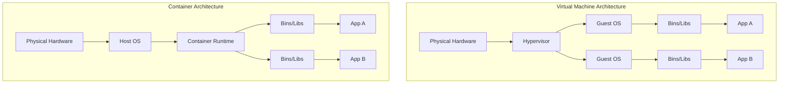
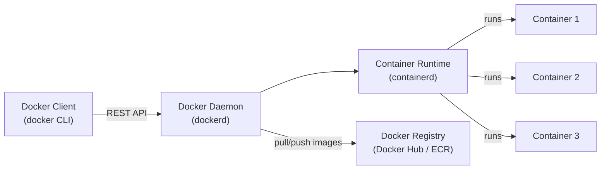
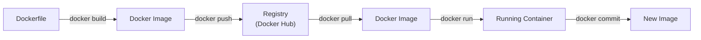
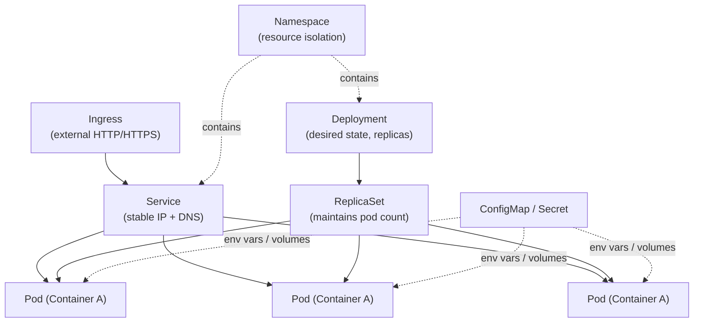

# Containerization vs Virtualization

## Table of Contents

1. [What is Virtualization](#what-is-virtualization)
2. [What is Containerization](#what-is-containerization)
3. [Containers vs VMs Comparison](#containers-vs-vms-comparison)
4. [Docker](#docker)
5. [Docker Architecture](#docker-architecture)
6. [Dockerfile Basics](#dockerfile-basics)
7. [Docker Compose](#docker-compose)
8. [Common Docker Commands](#common-docker-commands)
9. [Volumes and Networking](#volumes-and-networking)
10. [Kubernetes Overview](#kubernetes-overview)
11. [Container Orchestration](#container-orchestration)
12. [Docker Best Practices](#docker-best-practices)
13. [Resources](#resources)

---

## What is Virtualization

Virtualization is a technology that allows you to run multiple operating systems on a single physical machine. Each virtual machine (VM) includes a full copy of an operating system, the application, necessary binaries, and libraries — taking up tens of GBs.

At the core of virtualization is a **hypervisor**, a piece of software that sits between the hardware and the virtual machines. There are two types:

| Type | Name | Description | Examples |
|------|------|-------------|----------|
| Type 1 | Bare-metal | Runs directly on host hardware | VMware ESXi, Microsoft Hyper-V, Xen |
| Type 2 | Hosted | Runs on top of a host operating system | VirtualBox, VMware Workstation, Parallels |

**How VMs work:**

1. The hypervisor allocates physical resources (CPU, memory, storage) to each VM.
2. Each VM runs its own full operating system (guest OS).
3. Applications inside VMs are completely isolated from one another.
4. The host OS (if present) manages the hypervisor.

> **Tip:** VMs are ideal when you need full OS isolation, different OS types on the same hardware, or strong security boundaries between workloads.

---

## What is Containerization

Containerization is an OS-level virtualization method that packages an application and its dependencies into a lightweight, portable unit called a **container**. Unlike VMs, containers share the host OS kernel, making them much faster to start and far more efficient with system resources.

**Key characteristics of containers:**

- **Lightweight** — Containers share the host kernel and do not need a full OS per instance.
- **Fast startup** — Containers start in seconds (vs. minutes for VMs).
- **Portable** — A container runs the same way on a developer laptop, CI server, or production cloud.
- **Immutable** — Container images are built once and deployed everywhere without modification.

Containers rely on Linux kernel features such as **namespaces** (for isolation) and **cgroups** (for resource limiting).

---

## Containers vs VMs Comparison



| Feature | Virtual Machines | Containers |
|---------|-----------------|------------|
| Isolation | Full OS-level | Process-level |
| Size | GBs (full OS image) | MBs (app + dependencies only) |
| Boot time | Minutes | Seconds |
| Performance | Near-native with overhead | Near-native, minimal overhead |
| OS support | Any OS on any host | Shares host OS kernel |
| Resource usage | High (each VM runs full OS) | Low (shared kernel) |
| Portability | Limited (hypervisor dependent) | High (runs anywhere with container runtime) |
| Security | Strong isolation | Good but shares kernel |
| Use case | Running different OSes, legacy apps | Microservices, CI/CD, cloud-native apps |

> **Tip:** Containers and VMs are not mutually exclusive. Many production environments run containers inside VMs to get the benefits of both — strong VM isolation with container efficiency.

---

## Docker

Docker is the most widely adopted containerization platform. Released in 2013, Docker made containers accessible to mainstream developers by providing simple tooling and a standardized image format.

**Why Docker?**

- Eliminates "works on my machine" problems.
- Enables consistent environments from development to production.
- Simplifies dependency management.
- Makes microservices architecture practical.
- Integrates seamlessly with CI/CD pipelines.

---

## Docker Architecture

Docker uses a client-server architecture with three main components:



```
┌──────────────┐     REST API      ┌──────────────────┐
│ Docker Client │ ───────────────> │   Docker Daemon    │
│   (docker)    │                  │    (dockerd)       │
└──────────────┘                  └────────┬───────────┘
                                           │
                                  ┌────────▼───────────┐
                                  │  Container Runtime  │
                                  │   (containerd)      │
                                  └────────┬───────────┘
                                           │
                                  ┌────────▼───────────┐
                                  │   Docker Registry   │
                                  │  (Docker Hub, ECR)  │
                                  └────────────────────┘
```

- **Docker Client** — The CLI tool (`docker`) that users interact with. It sends commands to the Docker daemon.
- **Docker Daemon (`dockerd`)** — The background service that manages Docker objects (images, containers, networks, volumes).
- **Docker Registry** — A storage and distribution system for Docker images. Docker Hub is the default public registry.

**Key Docker objects:**

- **Image** — A read-only template with instructions for creating a container.
- **Container** — A runnable instance of an image.
- **Volume** — Persistent storage for container data.
- **Network** — Enables communication between containers.

---

## Dockerfile Basics

A Dockerfile is a text file containing instructions to build a Docker image. Each instruction creates a layer in the image.



```dockerfile
# Use an official Node.js runtime as the base image
FROM node:20-alpine

# Set the working directory inside the container
WORKDIR /app

# Copy package files first (leverages Docker layer caching)
COPY package*.json ./

# Install dependencies
RUN npm ci --only=production

# Copy the rest of the application code
COPY . .

# Expose the port the app runs on
EXPOSE 3000

# Define environment variable
ENV NODE_ENV=production

# Command to run the application
CMD ["node", "server.js"]
```

**Common Dockerfile instructions:**

| Instruction | Purpose |
|-------------|---------|
| `FROM` | Sets the base image |
| `WORKDIR` | Sets the working directory |
| `COPY` | Copies files from host to image |
| `ADD` | Like COPY but supports URLs and tar extraction |
| `RUN` | Executes a command during image build |
| `CMD` | Default command when container starts |
| `ENTRYPOINT` | Configures container to run as an executable |
| `EXPOSE` | Documents which ports the container listens on |
| `ENV` | Sets environment variables |
| `ARG` | Defines build-time variables |
| `VOLUME` | Creates a mount point for external volumes |

---

## Docker Compose

Docker Compose is a tool for defining and running multi-container applications. You use a YAML file to configure all your application's services, networks, and volumes.

```yaml
# docker-compose.yml
version: '3.8'

services:
  web:
    build: ./web
    ports:
      - "3000:3000"
    environment:
      - DATABASE_URL=postgres://user:pass@db:5432/mydb
      - REDIS_URL=redis://cache:6379
    depends_on:
      - db
      - cache

  db:
    image: postgres:16-alpine
    volumes:
      - pgdata:/var/lib/postgresql/data
    environment:
      POSTGRES_USER: user
      POSTGRES_PASSWORD: pass
      POSTGRES_DB: mydb

  cache:
    image: redis:7-alpine
    ports:
      - "6379:6379"

volumes:
  pgdata:
```

**Key Compose commands:**

```bash
docker compose up -d        # Start all services in detached mode
docker compose down          # Stop and remove all services
docker compose logs -f web   # Follow logs for the web service
docker compose ps            # List running services
docker compose exec web sh   # Open a shell inside the web container
docker compose build         # Rebuild images
```

---

## Common Docker Commands

```bash
# Image management
docker build -t myapp:1.0 .        # Build image from Dockerfile
docker pull nginx:latest             # Pull image from registry
docker push myrepo/myapp:1.0        # Push image to registry
docker images                        # List local images
docker rmi myapp:1.0                 # Remove an image

# Container lifecycle
docker run -d -p 8080:80 nginx      # Run container in background
docker run -it ubuntu bash           # Run interactive container
docker ps                            # List running containers
docker ps -a                         # List all containers
docker stop <container_id>           # Stop a container
docker start <container_id>          # Start a stopped container
docker rm <container_id>             # Remove a container
docker logs <container_id>           # View container logs
docker exec -it <container_id> sh   # Execute command in running container

# System
docker system prune                  # Remove unused data
docker stats                         # Live resource usage
docker inspect <container_id>        # Detailed container info
```

---

## Volumes and Networking

### Volumes

Volumes provide persistent storage that survives container restarts and removal.

```bash
# Create a named volume
docker volume create mydata

# Mount a volume when running a container
docker run -d -v mydata:/app/data myapp

# Bind mount (host directory mapped to container)
docker run -d -v /host/path:/container/path myapp

# List volumes
docker volume ls
```

**Volume types:**

| Type | Description | Use Case |
|------|-------------|----------|
| Named volume | Managed by Docker | Database storage, shared data |
| Bind mount | Maps host directory | Development (live code reload) |
| tmpfs mount | Stored in host memory | Sensitive data, temporary files |

### Networking

Docker provides several network drivers for container communication:

```bash
# List networks
docker network ls

# Create a custom network
docker network create mynetwork

# Run container on a specific network
docker run -d --network mynetwork --name api myapp

# Connect an existing container to a network
docker network connect mynetwork mycontainer
```

**Network drivers:**

| Driver | Description |
|--------|-------------|
| `bridge` | Default network for standalone containers |
| `host` | Container uses host's network directly |
| `overlay` | Multi-host networking for Docker Swarm |
| `none` | Disables networking |

> **Tip:** Containers on the same user-defined bridge network can reach each other by container name, which acts as a DNS hostname.

---

## Kubernetes Overview

Kubernetes (K8s) is an open-source container orchestration platform originally developed by Google. It automates the deployment, scaling, and management of containerized applications.

**Core Kubernetes objects:**



- **Pod** — The smallest deployable unit. A pod contains one or more containers that share storage and network.
- **Service** — An abstract way to expose an application running on a set of pods. Provides a stable IP and DNS name.
- **Deployment** — Declares the desired state for pods (replicas, image version). Manages rolling updates and rollbacks.
- **Namespace** — Virtual clusters within a physical cluster for resource isolation.
- **ConfigMap / Secret** — Externalized configuration and sensitive data.
- **Ingress** — Manages external HTTP/HTTPS access to services.

**Example Kubernetes Deployment:**

```yaml
apiVersion: apps/v1
kind: Deployment
metadata:
  name: web-app
spec:
  replicas: 3
  selector:
    matchLabels:
      app: web
  template:
    metadata:
      labels:
        app: web
    spec:
      containers:
      - name: web
        image: myapp:1.0
        ports:
        - containerPort: 3000
        resources:
          limits:
            memory: "256Mi"
            cpu: "500m"
---
apiVersion: v1
kind: Service
metadata:
  name: web-service
spec:
  selector:
    app: web
  ports:
  - port: 80
    targetPort: 3000
  type: LoadBalancer
```

---

## Container Orchestration

Container orchestration automates the deployment, management, scaling, and networking of containers across clusters of machines.

**Why orchestration is needed:**

- Managing hundreds or thousands of containers manually is impractical.
- Applications need automatic scaling based on load.
- Failed containers must be detected and replaced.
- Rolling updates must happen without downtime.
- Service discovery and load balancing between containers is required.

**Popular orchestration tools:**

| Tool | Description |
|------|-------------|
| Kubernetes | Industry standard, most feature-rich |
| Docker Swarm | Docker's native orchestration, simpler setup |
| Amazon ECS | AWS-managed container orchestration |
| HashiCorp Nomad | Flexible workload orchestrator |

---

## Docker Best Practices

1. **Use minimal base images** — Prefer `alpine` variants to reduce image size and attack surface.
2. **Leverage layer caching** — Order Dockerfile instructions from least to most frequently changed. Copy dependency files before source code.
3. **Use multi-stage builds** — Separate build and runtime stages to keep final images small.
4. **Do not run as root** — Use the `USER` instruction to run as a non-root user.
5. **Use `.dockerignore`** — Exclude unnecessary files (node_modules, .git, logs) from the build context.
6. **Tag images explicitly** — Avoid `:latest` in production. Use semantic versioning or commit SHAs.
7. **One process per container** — Each container should run a single concern.
8. **Scan images for vulnerabilities** — Use `docker scout`, Trivy, or Snyk to detect known CVEs.
9. **Keep images small** — Fewer layers, smaller base images, and clean up in the same `RUN` instruction.
10. **Use health checks** — Define `HEALTHCHECK` in your Dockerfile so orchestrators know when a container is ready.

```dockerfile
# Multi-stage build example
FROM node:20-alpine AS builder
WORKDIR /app
COPY package*.json ./
RUN npm ci
COPY . .
RUN npm run build

FROM node:20-alpine
WORKDIR /app
COPY --from=builder /app/dist ./dist
COPY --from=builder /app/node_modules ./node_modules
USER node
EXPOSE 3000
CMD ["node", "dist/server.js"]
```

---

## Resources

- [Docker Official Documentation](https://docs.docker.com/)
- [Dockerfile Reference](https://docs.docker.com/engine/reference/builder/)
- [Docker Compose Documentation](https://docs.docker.com/compose/)
- [Kubernetes Official Documentation](https://kubernetes.io/docs/)
- [Kubernetes Basics Tutorial](https://kubernetes.io/docs/tutorials/kubernetes-basics/)
- [Play with Docker](https://labs.play-with-docker.com/) — Free online Docker playground
- [Docker Hub](https://hub.docker.com/)
- [The Twelve-Factor App](https://12factor.net/) — Methodology for building cloud-native apps
- [Awesome Docker](https://github.com/veggiemonk/awesome-docker) — Curated list of Docker resources
