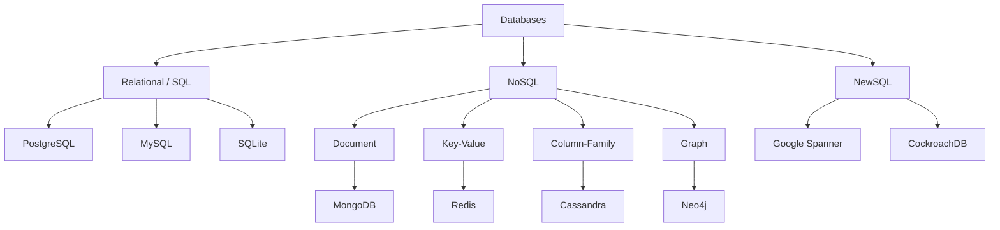
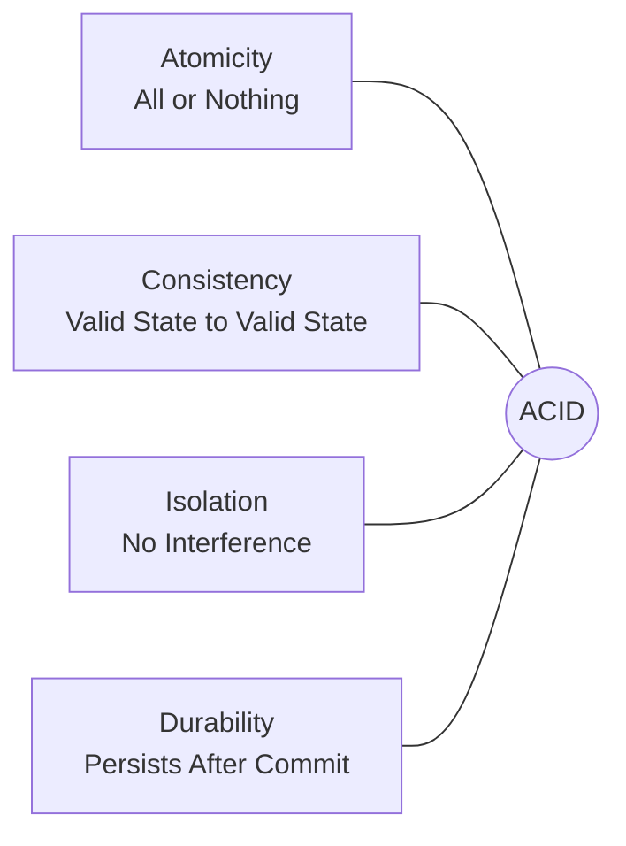
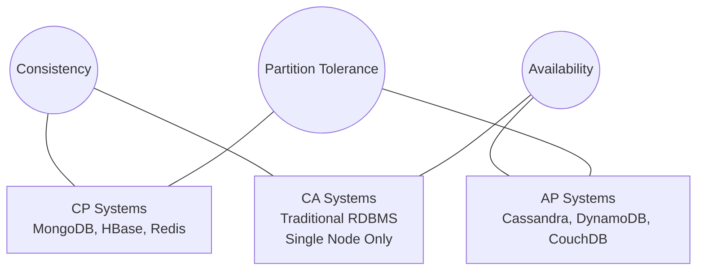

# Databases Overview

# Contents

1. [Databases Overview](#databases-overview)
2. [What is a Database?](#what-is-a-database)
3. [Why Databases Matter for Backend Developers](#why-databases-matter-for-backend-developers)
4. [Types of Databases](#types-of-databases)
   1. [Relational Databases (SQL)](#relational-databases-sql)
   2. [NoSQL Databases](#nosql-databases)
   3. [NewSQL Databases](#newsql-databases)
5. [ACID Properties](#acid-properties)
6. [CAP Theorem](#cap-theorem)
7. [Database Normalization Basics](#database-normalization-basics)
8. [Indexing](#indexing)
9. [Transactions](#transactions)
10. [When to Use Which Type](#when-to-use-which-type)
11. [Popular Databases Comparison](#popular-databases-comparison)
12. [Resources](#resources)

---

## What is a Database?

A **database** is an organized collection of structured data that can be easily accessed, managed, and updated. A **Database Management System (DBMS)** is the software that interacts with the database, the end user, and applications to capture, store, and analyze data.

At the most basic level, a database allows you to:

- **Store** data persistently (beyond the lifetime of a single program execution)
- **Query** data efficiently (find specific records among millions)
- **Update** data safely (without losing consistency)
- **Control access** to data (who can read, write, or modify)

```
Application  <-->  DBMS  <-->  Database (files on disk)
```

## Why Databases Matter for Backend Developers

As a backend developer, databases are at the core of nearly everything you build. Understanding databases well is arguably the most valuable skill in backend engineering.

- **Data persistence** -- almost every backend service needs to store and retrieve data.
- **Performance** -- poorly designed queries or schemas can turn a fast API into an unusable one.
- **Data integrity** -- your application depends on accurate, consistent data.
- **Scalability** -- choosing the right database and designing good schemas determines whether your system can grow.
- **Security** -- databases hold sensitive user data; understanding access control and injection prevention is essential.

> **Tip:** A common mistake by junior backend developers is treating the database as a simple key-value store. Investing time in understanding relational modeling, indexing, and query optimization will pay dividends throughout your career.

## Types of Databases



### Relational Databases (SQL)

Relational databases store data in **tables** with predefined **schemas**. Tables have rows (records) and columns (fields). Relationships between tables are established through **foreign keys**.

They use **SQL (Structured Query Language)** for querying and manipulation.

Examples: PostgreSQL, MySQL, SQLite, Microsoft SQL Server, Oracle Database.

**Strengths:**
- Strong data integrity through schemas and constraints
- Powerful querying with SQL and JOINs
- ACID compliance for reliable transactions
- Mature ecosystem with decades of optimization

### NoSQL Databases

NoSQL ("Not Only SQL") databases are designed for specific data models and have flexible schemas. They are often chosen for applications that need high scalability, flexible data structures, or specific access patterns.

There are four main categories:

| Type           | Description                            | Examples                    |
|----------------|----------------------------------------|-----------------------------|
| Document       | Stores JSON/BSON documents             | MongoDB, CouchDB            |
| Key-Value      | Simple key-to-value mapping            | Redis, Amazon DynamoDB      |
| Column-Family  | Stores data in column families         | Apache Cassandra, HBase     |
| Graph          | Stores nodes and relationships         | Neo4j, ArangoDB             |

**Strengths:**
- Horizontal scalability
- Flexible or schema-less data models
- Optimized for specific access patterns
- Often better performance for certain workloads (caching, real-time analytics)

### NewSQL Databases

NewSQL databases attempt to combine the ACID guarantees of relational databases with the horizontal scalability of NoSQL systems.

Examples: Google Spanner, CockroachDB, TiDB, VoltDB.

**Strengths:**
- SQL interface with distributed architecture
- ACID compliance at scale
- Designed for cloud-native deployments

## ACID Properties

ACID is a set of properties that guarantee database transactions are processed reliably. These properties are fundamental to relational databases and are increasingly adopted by some NoSQL systems.

| Property       | Description                                                                 |
|----------------|-----------------------------------------------------------------------------|
| **Atomicity**  | A transaction is all-or-nothing. If any part fails, the entire transaction is rolled back. |
| **Consistency** | A transaction brings the database from one valid state to another, respecting all rules and constraints. |
| **Isolation**  | Concurrent transactions do not interfere with each other. Each transaction appears to run in isolation. |
| **Durability** | Once a transaction is committed, the changes persist even if the system crashes. |



```
BEGIN TRANSACTION;
  UPDATE accounts SET balance = balance - 100 WHERE id = 1;
  UPDATE accounts SET balance = balance + 100 WHERE id = 2;
COMMIT;
-- If either UPDATE fails, both are rolled back (Atomicity).
-- The total balance remains the same (Consistency).
```

## CAP Theorem

The **CAP Theorem** (proposed by Eric Brewer) states that a distributed database system can provide at most **two out of three** guarantees simultaneously:

- **Consistency** -- Every read receives the most recent write.
- **Availability** -- Every request receives a response (success or failure).
- **Partition Tolerance** -- The system continues to operate despite network partitions between nodes.

Since network partitions are inevitable in distributed systems, you practically choose between **CP** (consistency + partition tolerance) and **AP** (availability + partition tolerance).



| Trade-off | Behavior                                         | Examples                  |
|-----------|--------------------------------------------------|---------------------------|
| CP        | Consistent but may be unavailable during partition | MongoDB, HBase, Redis (cluster) |
| AP        | Available but may return stale data               | Cassandra, DynamoDB, CouchDB    |
| CA        | Only possible without network partitions (single node) | Traditional RDBMS (single server) |

> **Tip:** The CAP theorem is a useful mental model but is somewhat simplified. In practice, modern databases offer tunable consistency levels, allowing you to make trade-offs on a per-query basis.

## Database Normalization Basics

Normalization is the process of organizing data in a relational database to **reduce redundancy** and **improve data integrity**.

The main normal forms are:

- **1NF (First Normal Form)** -- Each column contains atomic (indivisible) values. No repeating groups.
- **2NF (Second Normal Form)** -- Meets 1NF and every non-key column depends on the entire primary key.
- **3NF (Third Normal Form)** -- Meets 2NF and no non-key column depends on another non-key column (no transitive dependencies).

**Before normalization (denormalized):**

| OrderID | Customer | CustomerEmail      | Product  | Price |
|---------|----------|--------------------|----------|-------|
| 1       | Alice    | alice@example.com  | Widget   | 25    |
| 2       | Alice    | alice@example.com  | Gadget   | 50    |

**After normalization (3NF):**

**Customers table:**

| CustomerID | Name  | Email             |
|------------|-------|-------------------|
| 1          | Alice | alice@example.com |

**Orders table:**

| OrderID | CustomerID | Product | Price |
|---------|------------|---------|-------|
| 1       | 1          | Widget  | 25    |
| 2       | 1          | Gadget  | 50    |

> **Tip:** Normalization reduces data redundancy, but sometimes **denormalization** is intentionally applied in read-heavy systems to avoid expensive JOINs. Know the rules before you break them.

## Indexing

An **index** is a data structure (typically a B-tree or hash table) that speeds up data retrieval at the cost of additional storage and slower writes.

Without an index, the database must scan every row in a table to find matching records (a "full table scan"). With an index, it can jump directly to relevant rows.

```sql
-- Create an index on the email column
CREATE INDEX idx_users_email ON users(email);

-- This query now uses the index instead of scanning every row
SELECT * FROM users WHERE email = 'alice@example.com';
```

**Types of indexes:**

| Index Type      | Description                                        |
|-----------------|----------------------------------------------------|
| B-tree          | Default. Good for equality and range queries.      |
| Hash            | Fast equality lookups. No range support.            |
| GIN             | For full-text search and array/JSON columns.        |
| GiST            | For geometric data and full-text search.            |
| Composite       | Index on multiple columns.                          |

> **Tip:** Adding indexes speeds up reads but slows down writes (INSERT, UPDATE, DELETE) because the index must be updated too. Only index columns that are frequently used in WHERE clauses, JOIN conditions, or ORDER BY.

## Transactions

A **transaction** is a sequence of database operations treated as a single logical unit of work. Either all operations succeed (commit) or none of them do (rollback).

```sql
BEGIN;
  INSERT INTO orders (customer_id, product, amount) VALUES (1, 'Widget', 25);
  UPDATE inventory SET quantity = quantity - 1 WHERE product = 'Widget';
COMMIT;
```

Transactions support different **isolation levels** that trade off between consistency and performance:

| Isolation Level    | Dirty Read | Non-repeatable Read | Phantom Read |
|--------------------|------------|---------------------|--------------|
| Read Uncommitted   | Possible   | Possible            | Possible     |
| Read Committed     | No         | Possible            | Possible     |
| Repeatable Read    | No         | No                  | Possible     |
| Serializable       | No         | No                  | No           |

## When to Use Which Type

| Use Case                             | Recommended Type      | Why                                    |
|--------------------------------------|-----------------------|----------------------------------------|
| E-commerce, banking, ERP             | Relational (SQL)      | Strong consistency, complex queries    |
| Content management, catalogs         | Document (NoSQL)      | Flexible schemas, nested data          |
| Caching, sessions, real-time leaderboards | Key-Value (NoSQL) | Ultra-fast reads/writes                |
| Social networks, recommendation engines | Graph (NoSQL)      | Relationship traversal                 |
| IoT, time-series, logging            | Column-Family (NoSQL) | Write-heavy, high volume               |
| Global-scale apps needing SQL + scale | NewSQL               | ACID + horizontal scaling              |

## Popular Databases Comparison

| Database     | Type          | Language | License      | Best For                        |
|--------------|---------------|----------|--------------|---------------------------------|
| PostgreSQL   | Relational    | C        | Open Source   | General purpose, advanced features |
| MySQL        | Relational    | C/C++    | Open Source   | Web applications, read-heavy    |
| SQLite       | Relational    | C        | Public Domain | Embedded, mobile, local storage |
| MongoDB      | Document      | C++      | SSPL         | Flexible schemas, rapid prototyping |
| Redis        | Key-Value     | C        | BSD          | Caching, real-time, pub/sub     |
| Cassandra    | Column-Family | Java     | Open Source   | High write throughput, IoT      |
| Neo4j        | Graph         | Java     | GPL/Commercial | Relationships, recommendations |
| CockroachDB  | NewSQL        | Go       | BSL/Commercial | Distributed SQL, cloud-native  |
| DynamoDB     | Key-Value     | Managed  | AWS Proprietary | Serverless, AWS ecosystem     |
| Elasticsearch| Search Engine | Java     | SSPL         | Full-text search, log analytics |

## Resources

- [DB-Engines Ranking -- Database Popularity](https://db-engines.com/en/ranking)
- [CMU Database Course (Andy Pavlo)](https://15445.courses.cs.cmu.edu/)
- [Wikipedia -- ACID](https://en.wikipedia.org/wiki/ACID)
- [Wikipedia -- CAP Theorem](https://en.wikipedia.org/wiki/CAP_theorem)
- [Use The Index, Luke -- SQL Indexing Guide](https://use-the-index-luke.com/)
- [PostgreSQL Documentation](https://www.postgresql.org/docs/)
- [MongoDB University -- Free Courses](https://university.mongodb.com/)
- [Redis Documentation](https://redis.io/docs/)
- [Martin Kleppmann -- Designing Data-Intensive Applications](https://dataintensive.net/)
