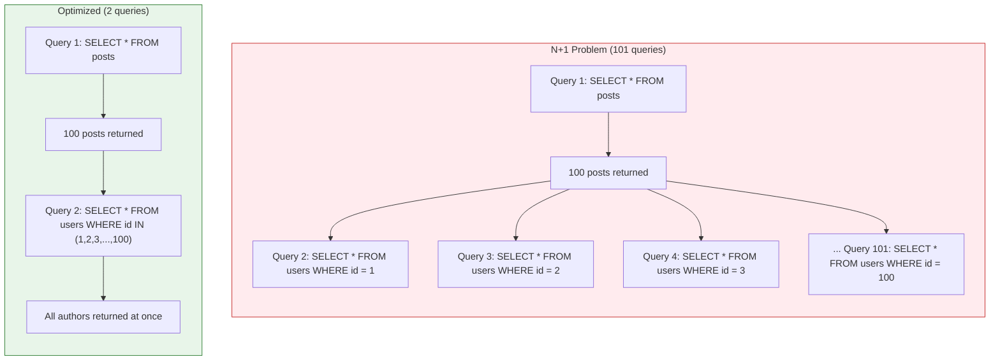
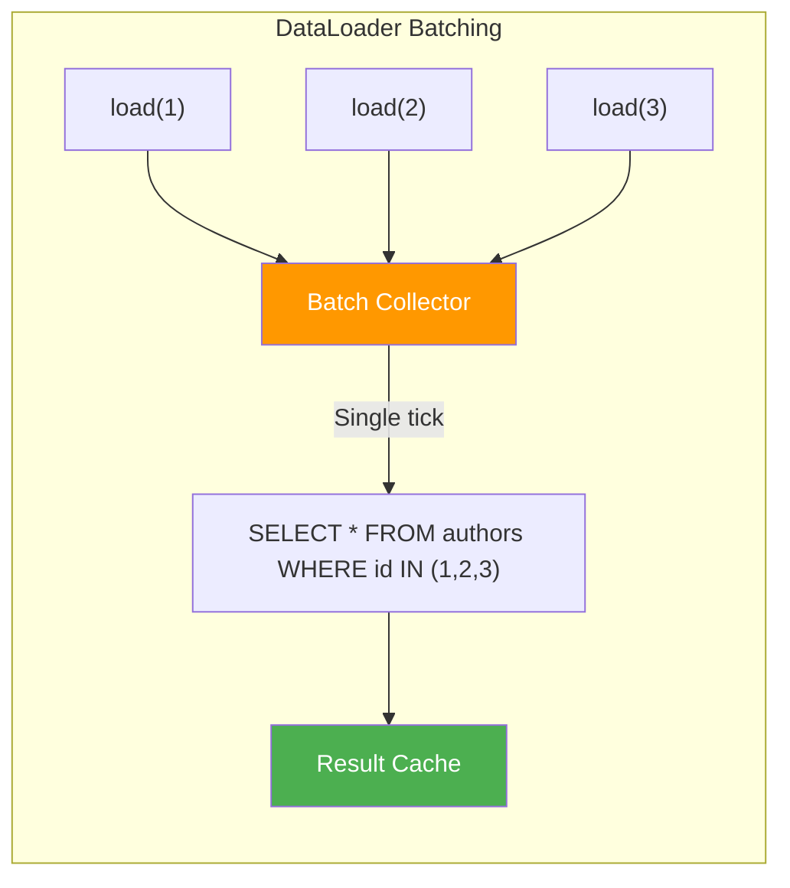

# The N+1 Query Problem

> The N+1 problem is one of the most common performance pitfalls in database-driven applications. It silently multiplies your query count, turning a single page load into hundreds or thousands of database round-trips.

# Table of Contents

1. [What Is the N+1 Problem](#what-is-the-n1-problem)
2. [How It Occurs](#how-it-occurs)
3. [Visual Example with SQL Queries](#visual-example-with-sql-queries)
4. [Detection](#detection)
5. [Solutions](#solutions)
6. [ORM-Specific Solutions](#orm-specific-solutions)
7. [Best Practices](#best-practices)
8. [Resources](#resources)

---

## What Is the N+1 Problem

The N+1 problem occurs when an application executes **1 query** to fetch a list of N records, and then executes **N additional queries** to fetch related data for each record individually. Instead of 1 or 2 efficient queries, the application ends up executing N+1 queries.

For example, if you fetch 100 blog posts and then loop through each post to load its author, you will execute:

- **1 query** to get all 100 posts
- **100 queries** to get the author for each post
- **Total: 101 queries** instead of 1 or 2

This dramatically increases latency, database load, and network round-trips.



---

## How It Occurs

The N+1 problem most commonly appears when using an ORM with **lazy loading** as the default strategy. Lazy loading means related data is only fetched from the database when it is explicitly accessed in code.

### Example with a Blog Application

Consider two models: `Post` and `Author`.

```
┌──────────────┐       ┌──────────────┐
│    posts     │       │    authors   │
├──────────────┤       ├──────────────┤
│ id           │       │ id           │
│ title        │       │ name         │
│ body         │       │ email        │
│ author_id  ──┼──────▶│              │
└──────────────┘       └──────────────┘
```

### The Problematic Code Pattern

```javascript
// Using Sequelize (Node.js ORM)
const posts = await Post.findAll(); // 1 query: SELECT * FROM posts

for (const post of posts) {
  // N queries: each access triggers a separate SELECT
  const author = await post.getAuthor();
  console.log(`${post.title} by ${author.name}`);
}
```

```python
# Using Django ORM
posts = Post.objects.all()  # 1 query: SELECT * FROM posts

for post in posts:
    # N queries: each access triggers a separate SELECT
    print(f"{post.title} by {post.author.name}")
```

```ruby
# Using ActiveRecord (Ruby on Rails)
posts = Post.all  # 1 query: SELECT * FROM posts

posts.each do |post|
  # N queries: each access triggers a separate SELECT
  puts "#{post.title} by #{post.author.name}"
end
```

---

## Visual Example with SQL Queries

Here is exactly what happens at the SQL level when the N+1 problem occurs with 5 posts:

```sql
-- Query 1: Fetch all posts
SELECT * FROM posts;
-- Returns: [{id:1, title:"Post A", author_id:10}, {id:2, title:"Post B", author_id:20}, ...]

-- Query 2: Fetch author for post 1
SELECT * FROM authors WHERE id = 10;

-- Query 3: Fetch author for post 2
SELECT * FROM authors WHERE id = 20;

-- Query 4: Fetch author for post 3
SELECT * FROM authors WHERE id = 30;

-- Query 5: Fetch author for post 4
SELECT * FROM authors WHERE id = 10;  -- Same author as post 1, fetched again!

-- Query 6: Fetch author for post 5
SELECT * FROM authors WHERE id = 40;
```

**Total: 6 queries for 5 posts.** With 1000 posts, this becomes 1001 queries.

### The Optimized Version

```sql
-- Query 1: Fetch all posts
SELECT * FROM posts;

-- Query 2: Fetch all needed authors in one query
SELECT * FROM authors WHERE id IN (10, 20, 30, 40);
```

**Total: 2 queries regardless of the number of posts.**

---

## Detection

### Query Logging

The first step to detecting N+1 problems is enabling query logging in your application or ORM.

**Django:**

```python
# settings.py
LOGGING = {
    'loggers': {
        'django.db.backends': {
            'level': 'DEBUG',
            'handlers': ['console'],
        },
    },
}
```

**Sequelize:**

```javascript
const sequelize = new Sequelize(database, username, password, {
  logging: console.log,  // Logs every SQL query
});
```

**ActiveRecord (Rails):**

```ruby
# config/environments/development.rb
config.log_level = :debug
# Or use the Bullet gem for automatic detection
```

### Profiling and Monitoring Tools

| Tool | Framework/Language | What It Does |
|------|--------------------|-------------|
| **Django Debug Toolbar** | Django (Python) | Shows query count and duplicates per request |
| **Bullet** | Rails (Ruby) | Detects N+1 queries and suggests fixes |
| **Hibernate Statistics** | Java (Hibernate) | Logs query counts and session metrics |
| **MiniProfiler** | .NET / Ruby / Node.js | In-page profiling with query counts |
| **pg_stat_statements** | PostgreSQL | Tracks query frequency at the database level |
| **Datadog APM / New Relic** | Any | Distributed tracing with per-request query counts |

> **Tip:** A good rule of thumb is that if a single HTTP request generates more than 10-20 database queries, you likely have an N+1 problem.

---

## Solutions

### 1. Eager Loading

Eager loading fetches the related data upfront, in the same query or in a small number of additional queries.

```javascript
// Sequelize: eager loading with include
const posts = await Post.findAll({
  include: [{ model: Author }],
});
// Generates:
// SELECT posts.*, authors.* FROM posts
// LEFT JOIN authors ON posts.author_id = authors.id
```

```python
# Django: select_related for ForeignKey relationships
posts = Post.objects.select_related('author').all()
# Generates a single JOIN query
```

```ruby
# ActiveRecord: includes for eager loading
posts = Post.includes(:author).all
# Generates 2 queries:
# SELECT * FROM posts
# SELECT * FROM authors WHERE id IN (...)
```

### 2. JOIN Queries

Write explicit JOIN queries to fetch all data in a single database round-trip.

```sql
SELECT posts.id, posts.title, authors.name AS author_name
FROM posts
INNER JOIN authors ON posts.author_id = authors.id;
```

This is the most efficient approach but returns denormalized data, which may require extra handling in application code.

### 3. Batch Queries (WHERE IN)

Instead of fetching related records one by one, collect all the IDs and fetch them in a single `WHERE IN` query.

```javascript
// Manual batch loading
const posts = await Post.findAll();
const authorIds = [...new Set(posts.map(p => p.author_id))];
const authors = await Author.findAll({
  where: { id: authorIds },
});

const authorMap = new Map(authors.map(a => [a.id, a]));
for (const post of posts) {
  const author = authorMap.get(post.author_id);
  console.log(`${post.title} by ${author.name}`);
}
```

### 4. DataLoader Pattern

The DataLoader pattern (popularized by Facebook for GraphQL) batches and caches individual load requests within a single tick of the event loop.

```javascript
const DataLoader = require('dataloader');

const authorLoader = new DataLoader(async (authorIds) => {
  const authors = await Author.findAll({
    where: { id: authorIds },
  });
  const authorMap = new Map(authors.map(a => [a.id, a]));
  return authorIds.map(id => authorMap.get(id));
});

// Usage in resolvers — requests are automatically batched
const posts = await Post.findAll();
for (const post of posts) {
  const author = await authorLoader.load(post.author_id);
  // All loads within the same tick are batched into one query
}
```



### 5. Subqueries

Some ORMs support subquery-based eager loading, which can be more efficient than JOINs for certain relationships (especially one-to-many).

```python
# Django: prefetch_related uses a separate query with IN clause
posts = Post.objects.prefetch_related('comments').all()
# Query 1: SELECT * FROM posts
# Query 2: SELECT * FROM comments WHERE post_id IN (1, 2, 3, ...)
```

---

## ORM-Specific Solutions

### Sequelize (Node.js)

```javascript
// Eager loading
const posts = await Post.findAll({
  include: [
    { model: Author, attributes: ['name', 'email'] },
    { model: Comment, include: [{ model: User }] },  // Nested eager loading
  ],
});

// Separate queries approach
const posts = await Post.findAll({
  include: [{ model: Author, separate: true }],
});
```

### Django (Python)

```python
# select_related: uses JOIN (for ForeignKey and OneToOne)
posts = Post.objects.select_related('author').all()

# prefetch_related: uses separate query with IN (for ManyToMany and reverse FK)
posts = Post.objects.prefetch_related('comments', 'tags').all()

# Combining both
posts = Post.objects.select_related('author').prefetch_related('comments').all()

# Custom prefetch with filtering
from django.db.models import Prefetch
posts = Post.objects.prefetch_related(
    Prefetch('comments', queryset=Comment.objects.filter(approved=True))
).all()
```

### ActiveRecord (Ruby on Rails)

```ruby
# includes: lets Rails decide JOIN vs separate queries
posts = Post.includes(:author).all

# eager_load: forces LEFT OUTER JOIN
posts = Post.eager_load(:author).all

# preload: forces separate queries
posts = Post.preload(:author).all

# Nested eager loading
posts = Post.includes(comments: :user).all
```

### Hibernate (Java)

```java
// JPQL with JOIN FETCH
List<Post> posts = entityManager
    .createQuery("SELECT p FROM Post p JOIN FETCH p.author", Post.class)
    .getResultList();

// Entity Graph
@EntityGraph(attributePaths = {"author", "comments"})
List<Post> findAll();

// Batch fetching via annotation
@BatchSize(size = 25)
@OneToMany(mappedBy = "post")
private List<Comment> comments;
```

---

## Best Practices

1. **Default to eager loading** for relationships you know will be accessed. Configure your ORM to load associated data upfront rather than relying on lazy loading.

2. **Use query logging in development.** Enable SQL logging so that you can see exactly how many queries each request generates. Flag anything above a reasonable threshold (e.g., 10 queries per request).

3. **Install automated detection tools.** Use gems/packages like Bullet (Rails), nplusone (Django), or custom middleware to catch N+1 queries during development and testing.

4. **Be careful with serialization.** JSON serializers and API endpoints that traverse relationships will trigger lazy loads. Always consider what data will be accessed during serialization.

5. **Use the DataLoader pattern for GraphQL.** GraphQL resolvers are especially prone to N+1 problems due to their field-by-field resolution model. DataLoader was specifically designed to solve this.

6. **Profile in production.** Development datasets are small. An N+1 query that runs fine with 10 records will become a serious bottleneck with 10,000 records. Use APM tools to monitor query counts in production.

7. **Review code in pull requests for N+1 patterns.** Look for loops that access related model attributes, ORM calls inside iteration blocks, and missing `include`/`select_related`/`prefetch_related` calls.

8. **Consider pagination.** Even with eager loading, fetching thousands of records with all their associations can be expensive. Combine eager loading with pagination to keep queries bounded.

---

## Resources

- [What is the N+1 Query Problem? - Stack Overflow](https://stackoverflow.com/questions/97197/what-is-the-n1-selects-problem-in-orm)
- [DataLoader - GitHub (Facebook)](https://github.com/graphql/dataloader)
- [Django select_related and prefetch_related](https://docs.djangoproject.com/en/stable/ref/models/querysets/#select-related)
- [Rails Guides - Eager Loading Associations](https://guides.rubyonrails.org/active_record_querying.html#eager-loading-associations)
- [Sequelize Eager Loading](https://sequelize.org/docs/v6/advanced-association-concepts/eager-loading/)
- [Hibernate Fetching Strategies](https://docs.jboss.org/hibernate/orm/current/userguide/html_single/Hibernate_User_Guide.html#fetching)
- [Bullet Gem - N+1 Query Detection for Rails](https://github.com/flyerhzm/bullet)
- [nplusone - N+1 Detection for Python ORMs](https://github.com/jmcarp/nplusone)
