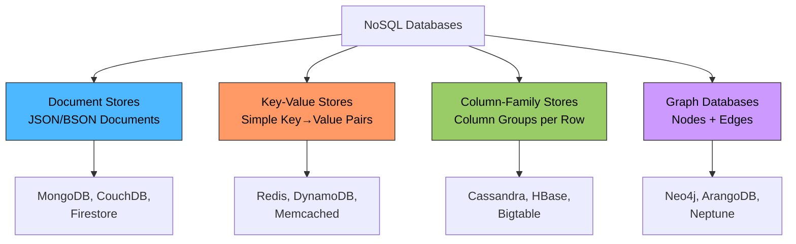
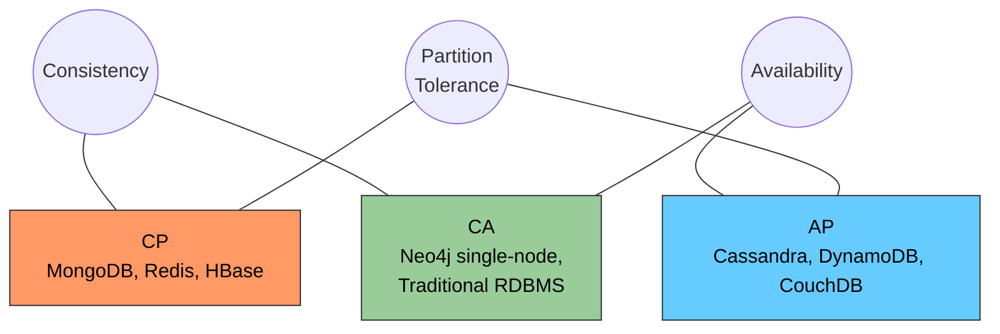
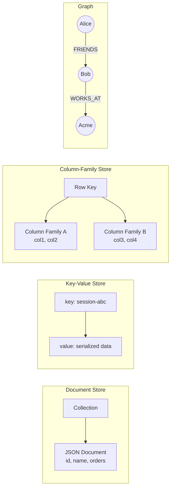

# NoSQL Databases

# Contents

1. [NoSQL Databases](#nosql-databases)
2. [What Are NoSQL Databases?](#what-are-nosql-databases)
3. [Why NoSQL?](#why-nosql)
4. [Types of NoSQL Databases](#types-of-nosql-databases)
   1. [Document Databases](#document-databases)
   2. [Key-Value Stores](#key-value-stores)
   3. [Column-Family Stores](#column-family-stores)
   4. [Graph Databases](#graph-databases)
5. [Schema Flexibility](#schema-flexibility)
6. [CAP Theorem and NoSQL](#cap-theorem-and-nosql)
7. [Eventual Consistency](#eventual-consistency)
8. [When to Use NoSQL vs SQL](#when-to-use-nosql-vs-sql)
9. [MongoDB Basics](#mongodb-basics)
   1. [Documents and Collections](#documents-and-collections)
   2. [CRUD Operations](#crud-operations)
   3. [Querying](#querying)
10. [Redis Basics](#redis-basics)
    1. [Data Structures](#data-structures)
    2. [Common Use Cases](#common-use-cases)
    3. [Basic Commands](#basic-commands)
11. [Comparison of NoSQL Types](#comparison-of-nosql-types)
12. [Resources](#resources)

---

## What Are NoSQL Databases?

**NoSQL** (commonly interpreted as "Not Only SQL") is a broad category of database management systems that differ from the traditional relational model. Instead of storing data in tables with fixed schemas, NoSQL databases use a variety of data models optimized for specific types of applications.

NoSQL databases emerged in the late 2000s, driven by the needs of large-scale web applications at companies like Google, Amazon, and Facebook. These companies faced challenges that traditional relational databases struggled with: massive data volumes, high write throughput, flexible and evolving data structures, and the need to distribute data across many servers.

> **Tip:** "NoSQL" does not mean "no SQL at all." Many NoSQL databases support SQL-like query languages, and some (like CockroachDB or Google Spanner) blur the line between SQL and NoSQL. The term is best understood as "beyond the relational model."

## Why NoSQL?

Relational databases are excellent for many use cases, but they have limitations that become apparent at certain scales and for certain data patterns:

| Limitation of Relational DBs              | How NoSQL Addresses It                       |
|-------------------------------------------|----------------------------------------------|
| Rigid schema -- changes require migrations | Flexible or schema-less data models          |
| Vertical scaling (bigger hardware)        | Horizontal scaling (more nodes)              |
| Complex JOINs slow down at scale          | Denormalized data stored together            |
| Not optimized for specific access patterns | Purpose-built for specific workloads         |
| Impedance mismatch with object models     | Native document/JSON storage                 |

**Common reasons to choose NoSQL:**

- Rapidly evolving data structures during early development
- Need to handle millions of reads/writes per second
- Data is naturally hierarchical or document-shaped (JSON, XML)
- Geographic distribution across multiple data centers
- Specific workloads like caching, real-time analytics, or graph traversal

## Types of NoSQL Databases



### Document Databases

Document databases store data as **documents**, typically in JSON or BSON format. Each document is a self-contained unit with its own structure, and documents within the same collection can have different fields.

```json
{
  "_id": "user_001",
  "name": "Alice",
  "email": "alice@example.com",
  "address": {
    "street": "123 Main St",
    "city": "Portland",
    "state": "OR"
  },
  "orders": [
    { "product": "Widget", "amount": 25.00 },
    { "product": "Gadget", "amount": 49.99 }
  ]
}
```

**Key characteristics:**
- Data that "belongs together" is stored together (no JOINs needed)
- Flexible schema -- documents can have varying structures
- Natural mapping to objects in application code
- Good for content management, catalogs, user profiles

**Popular document databases:** MongoDB, CouchDB, Amazon DocumentDB, Firebase Firestore.

### Key-Value Stores

The simplest NoSQL model. Data is stored as a collection of **key-value pairs**, where the key is a unique identifier and the value can be anything: a string, number, JSON blob, or binary data.

```
key: "session:abc123"     value: {"user_id": 1, "expires": "2025-12-31"}
key: "user:1:name"        value: "Alice"
key: "cache:homepage"     value: "<html>...</html>"
```

**Key characteristics:**
- Extremely fast reads and writes (O(1) lookups)
- No query language -- you can only get/set by key
- Ideal for caching, sessions, and configuration
- Highly scalable horizontally

**Popular key-value stores:** Redis, Amazon DynamoDB, Memcached, etcd, Riak.

### Column-Family Stores

Column-family databases store data in **column families** (groups of related columns). Unlike relational tables where rows have the same columns, each row can have a different set of columns.

```
Row Key: "user_001"
  Column Family "profile":
    name: "Alice"
    email: "alice@example.com"
  Column Family "activity":
    last_login: "2025-03-15"
    login_count: 142
```

**Key characteristics:**
- Optimized for writing large volumes of data
- Excellent for time-series data, logging, and IoT
- Data is distributed across nodes by row key
- Can handle petabytes of data

**Popular column-family databases:** Apache Cassandra, Apache HBase, Google Bigtable, ScyllaDB.

### Graph Databases

Graph databases store data as **nodes** (entities) and **edges** (relationships). They are designed for use cases where relationships between entities are as important as the entities themselves.

```
(Alice)-[:FRIENDS_WITH]->(Bob)
(Bob)-[:WORKS_AT]->(Acme Corp)
(Alice)-[:PURCHASED]->(Widget)
```

**Key characteristics:**
- Relationship traversal is extremely fast (no expensive JOINs)
- Natural model for social networks, recommendation engines, fraud detection
- Query languages like Cypher (Neo4j) or Gremlin (Apache TinkerPop)
- Not designed for bulk analytics or simple CRUD

**Popular graph databases:** Neo4j, ArangoDB, Amazon Neptune, JanusGraph.

## Schema Flexibility

One of the most significant differences between SQL and NoSQL databases is how they handle schemas.

**Relational (schema-on-write):**
- Schema is defined upfront with `CREATE TABLE`
- Every row must conform to the schema
- Schema changes require `ALTER TABLE` migrations
- The database rejects data that does not match the schema

**NoSQL (schema-on-read):**
- No predefined schema is required
- Documents/records can have different structures
- The application interprets the data when it reads it
- Adding new fields requires no migration

```javascript
// MongoDB: these two documents can coexist in the same collection
db.users.insertOne({ name: "Alice", email: "alice@example.com" });
db.users.insertOne({ name: "Bob", email: "bob@example.com", phone: "555-0100", verified: true });
```

> **Tip:** Schema flexibility is a double-edged sword. Without a schema, data inconsistencies can creep in over time. Many teams use application-level validation (like Mongoose schemas for MongoDB or JSON Schema) to enforce structure while retaining flexibility.

## CAP Theorem and NoSQL

The **CAP Theorem** states that in a distributed system, you can only guarantee two of three properties: **Consistency**, **Availability**, and **Partition Tolerance**.

Since NoSQL databases are often distributed, the CAP theorem directly influences their design choices:



| Database    | CAP Trade-off | Behavior                                                  |
|-------------|---------------|-----------------------------------------------------------|
| MongoDB     | CP            | Consistent reads from primary; may be unavailable during elections |
| Cassandra   | AP            | Always available; eventual consistency by default          |
| Redis       | CP            | Strong consistency on single node; tunable in cluster mode |
| DynamoDB    | AP            | Highly available; eventual consistency (strong consistency optional) |
| CouchDB     | AP            | Available with eventual consistency via replication        |
| Neo4j       | CA            | Typically single-node; causal consistency in clusters      |

## Eventual Consistency

Many NoSQL databases use **eventual consistency** instead of strong consistency. This means that after a write, all replicas will **eventually** converge to the same value, but there is a window where reads might return stale data.

```
Time 0: Client writes "Alice" to Node A
Time 1: Node A acknowledges the write (success)
Time 2: Client reads from Node B -> gets old value (stale!)
Time 3: Replication completes: Node B now has "Alice"
Time 4: Client reads from Node B -> gets "Alice" (consistent)
```

**Why accept eventual consistency?**
- Higher availability -- writes succeed even if some nodes are unreachable
- Lower latency -- no need to wait for all replicas to acknowledge
- Better throughput -- nodes can serve reads independently

**When eventual consistency is acceptable:**
- Social media feeds (seeing a post a few seconds late is fine)
- Shopping cart contents
- Analytics and metrics
- Notification counters

**When you need strong consistency:**
- Financial transactions
- Inventory with limited stock
- User authentication state

> **Tip:** Many NoSQL databases offer **tunable consistency**. For example, Cassandra lets you specify consistency levels per query (`ONE`, `QUORUM`, `ALL`), allowing you to balance between performance and consistency on a case-by-case basis.

## When to Use NoSQL vs SQL

| Criteria                    | SQL (Relational)                    | NoSQL                                |
|-----------------------------|-------------------------------------|--------------------------------------|
| Data structure              | Well-defined, structured            | Flexible, semi-structured, varies    |
| Relationships               | Complex relationships, many JOINs   | Minimal relationships or embedded    |
| Consistency requirements     | Strong (ACID)                       | Tunable (eventual to strong)         |
| Scaling strategy             | Vertical (scale up)                 | Horizontal (scale out)               |
| Query complexity             | Complex queries, aggregations       | Simple lookups, specific patterns    |
| Schema evolution             | Requires migrations                 | Flexible, no migrations needed       |
| Maturity and tooling         | Decades of optimization             | Newer but rapidly maturing           |
| Best for                     | ERP, banking, e-commerce, reporting | Caching, real-time, IoT, content mgmt|

> **Tip:** In many production systems, SQL and NoSQL databases are used together. For example, a typical architecture might use PostgreSQL as the primary data store, Redis for caching and sessions, and Elasticsearch for full-text search. This is called **polyglot persistence**.

## MongoDB Basics

**MongoDB** is the most popular document database. It stores data as BSON (Binary JSON) documents in collections.

### Documents and Collections

- A **document** is a JSON-like object (BSON) with field-value pairs.
- A **collection** is a group of documents (analogous to a table in SQL).
- A **database** contains multiple collections.

```
Database: "myapp"
  Collection: "users"
    Document: { _id: ObjectId("..."), name: "Alice", email: "alice@example.com" }
    Document: { _id: ObjectId("..."), name: "Bob", age: 25 }
  Collection: "orders"
    Document: { _id: ObjectId("..."), user_id: ObjectId("..."), items: [...] }
```

### CRUD Operations

```javascript
// INSERT
db.users.insertOne({ name: "Alice", email: "alice@example.com", age: 30 });

db.users.insertMany([
  { name: "Bob", email: "bob@example.com", age: 25 },
  { name: "Charlie", email: "charlie@example.com", age: 35 }
]);

// READ
db.users.findOne({ name: "Alice" });
db.users.find({ age: { $gt: 25 } });

// UPDATE
db.users.updateOne(
  { name: "Alice" },
  { $set: { age: 31 } }
);

db.users.updateMany(
  { age: { $lt: 18 } },
  { $set: { status: "minor" } }
);

// DELETE
db.users.deleteOne({ name: "Charlie" });
db.users.deleteMany({ status: "inactive" });
```

### Querying

MongoDB provides a rich query language with comparison, logical, and element operators.

```javascript
// Comparison operators
db.users.find({ age: { $gt: 25 } });        // greater than
db.users.find({ age: { $gte: 25 } });       // greater than or equal
db.users.find({ age: { $in: [25, 30] } });  // in a set

// Logical operators
db.users.find({ $and: [{ age: { $gt: 20 } }, { age: { $lt: 40 } }] });
db.users.find({ $or: [{ name: "Alice" }, { name: "Bob" }] });

// Nested documents
db.users.find({ "address.city": "Portland" });

// Projection (select specific fields)
db.users.find({}, { name: 1, email: 1, _id: 0 });

// Sorting and limiting
db.users.find().sort({ age: -1 }).limit(10);

// Aggregation pipeline
db.orders.aggregate([
  { $match: { status: "completed" } },
  { $group: { _id: "$customer_id", total: { $sum: "$amount" } } },
  { $sort: { total: -1 } }
]);
```

## Redis Basics

**Redis** (Remote Dictionary Server) is an in-memory key-value store known for its exceptional speed. It is commonly used as a cache, message broker, and session store.

### Data Structures

Redis is more than a simple key-value store. It supports rich data structures:

| Data Structure | Description                                    | Use Case                       |
|----------------|------------------------------------------------|--------------------------------|
| String         | Simple key-value pair                          | Caching, counters              |
| List           | Ordered collection of strings                  | Message queues, activity feeds |
| Set            | Unordered collection of unique strings          | Tags, unique visitors          |
| Sorted Set     | Set with scores for ordering                    | Leaderboards, ranking          |
| Hash           | Map of field-value pairs                        | User profiles, sessions        |
| Stream         | Append-only log of entries                      | Event sourcing, message broker |

### Common Use Cases

- **Caching** -- Store frequently accessed data in memory to reduce database load.
- **Session management** -- Store user sessions with automatic expiration (TTL).
- **Rate limiting** -- Track request counts per user/IP with expiring keys.
- **Real-time leaderboards** -- Use sorted sets to rank players or items.
- **Pub/Sub messaging** -- Publish messages to channels for real-time communication.
- **Job queues** -- Use lists as simple, reliable FIFO queues.

### Basic Commands

```bash
# Strings
SET user:1:name "Alice"
GET user:1:name                    # "Alice"
SET session:abc123 "data" EX 3600  # expires in 1 hour
INCR page:views                    # atomic increment

# Hashes
HSET user:1 name "Alice" email "alice@example.com" age 30
HGET user:1 name                   # "Alice"
HGETALL user:1                     # returns all fields

# Lists
LPUSH queue:emails "job1"
LPUSH queue:emails "job2"
RPOP queue:emails                  # "job1" (FIFO)

# Sets
SADD tags:post:1 "python" "backend" "tutorial"
SMEMBERS tags:post:1               # {"python", "backend", "tutorial"}
SINTER tags:post:1 tags:post:2     # intersection of tags

# Sorted Sets
ZADD leaderboard 100 "Alice"
ZADD leaderboard 200 "Bob"
ZADD leaderboard 150 "Charlie"
ZREVRANGE leaderboard 0 2 WITHSCORES  # Bob(200), Charlie(150), Alice(100)

# Key expiration
SET temp:data "value"
EXPIRE temp:data 300               # expires in 300 seconds
TTL temp:data                      # check remaining time
```

**Example -- Caching pattern in application code (Python):**

```python
import redis
import json

r = redis.Redis(host='localhost', port=6379, db=0)

def get_user(user_id):
    # Check cache first
    cached = r.get(f"user:{user_id}")
    if cached:
        return json.loads(cached)

    # Cache miss: query database
    user = db.query("SELECT * FROM users WHERE id = %s", user_id)

    # Store in cache with 5-minute TTL
    r.setex(f"user:{user_id}", 300, json.dumps(user))
    return user
```

## Comparison of NoSQL Types



| Feature          | Document           | Key-Value        | Column-Family      | Graph              |
|------------------|--------------------|------------------|--------------------|--------------------|
| Data model       | JSON documents     | Key-value pairs  | Column families    | Nodes and edges    |
| Schema           | Flexible           | None             | Flexible           | Flexible           |
| Query capability | Rich queries       | Get/Set by key   | Row key + columns  | Graph traversal    |
| Scalability      | Horizontal         | Horizontal       | Horizontal         | Varies             |
| Best for         | Content, catalogs  | Caching, sessions| Time-series, IoT   | Relationships      |
| Consistency      | Tunable            | Strong (single)  | Tunable            | Strong (single)    |
| Example DBs      | MongoDB, CouchDB   | Redis, DynamoDB  | Cassandra, HBase   | Neo4j, ArangoDB    |
| Query language   | MQL, N1QL          | Simple API       | CQL                | Cypher, Gremlin    |
| Write speed      | Fast               | Very fast        | Very fast          | Moderate           |
| Read speed       | Fast               | Very fast        | Fast (by key)      | Fast (traversal)   |
| Joins            | Limited ($lookup)  | None             | None               | Native (edges)     |

## Resources

- [MongoDB Documentation](https://www.mongodb.com/docs/)
- [MongoDB University -- Free Courses](https://university.mongodb.com/)
- [Redis Documentation](https://redis.io/docs/)
- [Redis University -- Free Courses](https://university.redis.io/)
- [Apache Cassandra Documentation](https://cassandra.apache.org/doc/)
- [Neo4j Documentation](https://neo4j.com/docs/)
- [Amazon DynamoDB Developer Guide](https://docs.aws.amazon.com/amazondynamodb/latest/developerguide/)
- [Martin Fowler -- NoSQL Distilled](https://martinfowler.com/books/nosql.html)
- [CAP Theorem -- Wikipedia](https://en.wikipedia.org/wiki/CAP_theorem)
- [Designing Data-Intensive Applications -- Martin Kleppmann](https://dataintensive.net/)
- [DB-Engines Ranking](https://db-engines.com/en/ranking)
