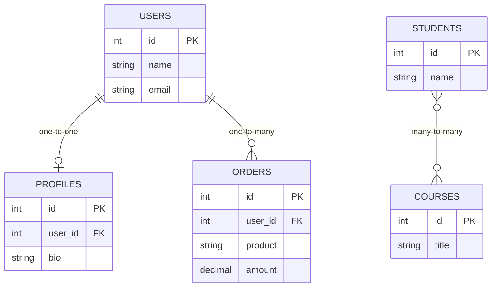
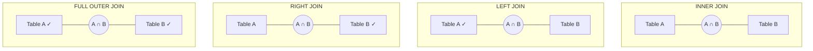
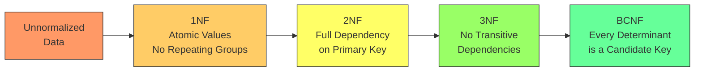

# Relational Databases

# Contents

1. [Relational Databases](#relational-databases)
2. [What Are Relational Databases?](#what-are-relational-databases)
3. [History of the Relational Model](#history-of-the-relational-model)
4. [Core Concepts](#core-concepts)
   1. [Tables, Rows, and Columns](#tables-rows-and-columns)
   2. [Schemas](#schemas)
   3. [Primary Keys](#primary-keys)
   4. [Foreign Keys](#foreign-keys)
5. [SQL Basics](#sql-basics)
   1. [SELECT -- Reading Data](#select----reading-data)
   2. [INSERT -- Creating Data](#insert----creating-data)
   3. [UPDATE -- Modifying Data](#update----modifying-data)
   4. [DELETE -- Removing Data](#delete----removing-data)
   5. [JOIN -- Combining Tables](#join----combining-tables)
6. [Normalization](#normalization)
   1. [First Normal Form (1NF)](#first-normal-form-1nf)
   2. [Second Normal Form (2NF)](#second-normal-form-2nf)
   3. [Third Normal Form (3NF)](#third-normal-form-3nf)
   4. [Boyce-Codd Normal Form (BCNF)](#boyce-codd-normal-form-bcnf)
7. [Indexes and Performance](#indexes-and-performance)
8. [Transactions and ACID](#transactions-and-acid)
9. [Popular Relational Databases](#popular-relational-databases)
10. [ORMs (Object-Relational Mapping)](#orms-object-relational-mapping)
11. [When to Use Relational Databases](#when-to-use-relational-databases)
12. [Resources](#resources)

---

## What Are Relational Databases?

A **relational database** is a type of database that organizes data into **tables** (also called relations) consisting of rows and columns. Each table represents an entity (such as users, orders, or products), and relationships between entities are expressed through shared columns called **keys**.

The relational model provides a mathematically rigorous way to structure, query, and maintain data. It is the most widely used database model in the world and forms the backbone of countless applications, from small websites to global banking systems.

```
+------------------+         +------------------+
|     customers    |         |      orders      |
+------------------+         +------------------+
| id (PK)          |<------->| id (PK)          |
| name             |         | customer_id (FK) |
| email            |         | product          |
| created_at       |         | amount           |
+------------------+         | created_at       |
                             +------------------+
```

## History of the Relational Model

The relational model was introduced by **Edgar F. Codd** in his seminal 1970 paper, *"A Relational Model of Data for Large Shared Data Banks"*, published while he was working at IBM.

Key milestones:

- **1970** -- Codd publishes the relational model, based on set theory and first-order predicate logic.
- **1974** -- IBM develops System R, one of the first relational database prototypes, and invents SQL.
- **1979** -- Oracle releases the first commercially available relational database.
- **1986** -- SQL becomes an ANSI standard.
- **1995** -- MySQL and PostgreSQL emerge as open-source alternatives.
- **2000s-present** -- Relational databases remain dominant while adapting to cloud-native and distributed architectures.

> **Tip:** Understanding the relational model's theoretical foundations (relational algebra, set operations) helps you write better queries and design better schemas, even if you never prove a theorem.

## Core Concepts

### Tables, Rows, and Columns

A **table** (or relation) is a collection of related data organized in rows and columns.

- A **row** (or tuple/record) represents a single entity instance.
- A **column** (or attribute/field) represents a property of that entity.

```sql
CREATE TABLE users (
    id       SERIAL PRIMARY KEY,
    name     VARCHAR(100) NOT NULL,
    email    VARCHAR(255) UNIQUE NOT NULL,
    age      INTEGER,
    created_at TIMESTAMP DEFAULT CURRENT_TIMESTAMP
);
```

| id | name    | email              | age | created_at          |
|----|---------|--------------------|-----|---------------------|
| 1  | Alice   | alice@example.com  | 30  | 2025-01-15 10:30:00 |
| 2  | Bob     | bob@example.com    | 25  | 2025-02-20 14:15:00 |

### Schemas

A **schema** defines the structure of a database: which tables exist, what columns they have, what data types those columns use, and what constraints apply. Schemas enforce data integrity at the database level.

Common column constraints:

| Constraint    | Description                                      |
|---------------|--------------------------------------------------|
| `NOT NULL`    | Column cannot contain NULL values                |
| `UNIQUE`      | All values in the column must be distinct         |
| `DEFAULT`     | Provides a default value if none is specified     |
| `CHECK`       | Validates that values meet a condition            |
| `PRIMARY KEY` | Uniquely identifies each row                      |
| `FOREIGN KEY` | References a row in another table                 |

### Primary Keys

A **primary key** uniquely identifies each row in a table. It must be unique and cannot be NULL.

```sql
-- Auto-incrementing integer (common in PostgreSQL)
id SERIAL PRIMARY KEY

-- UUID (useful for distributed systems)
id UUID PRIMARY KEY DEFAULT gen_random_uuid()
```

**Best practices:**
- Use a surrogate key (auto-generated ID) rather than natural keys (like email) as the primary key.
- Keep primary keys immutable -- they should never change after creation.

### Foreign Keys

A **foreign key** is a column that references the primary key of another table, establishing a relationship between the two.

```sql
CREATE TABLE orders (
    id          SERIAL PRIMARY KEY,
    customer_id INTEGER NOT NULL REFERENCES customers(id),
    product     VARCHAR(100) NOT NULL,
    amount      DECIMAL(10, 2) NOT NULL,
    created_at  TIMESTAMP DEFAULT CURRENT_TIMESTAMP
);
```

Foreign keys enforce **referential integrity**: you cannot insert an order with a `customer_id` that does not exist in the `customers` table, and you cannot delete a customer who has existing orders (unless you define cascade rules).



```sql
-- ON DELETE CASCADE: if a customer is deleted, their orders are also deleted
customer_id INTEGER REFERENCES customers(id) ON DELETE CASCADE

-- ON DELETE SET NULL: if a customer is deleted, the foreign key is set to NULL
customer_id INTEGER REFERENCES customers(id) ON DELETE SET NULL
```

## SQL Basics

**SQL (Structured Query Language)** is the standard language for interacting with relational databases. While dialects vary slightly between databases, the core syntax is universal.

### SELECT -- Reading Data

```sql
-- Select all columns
SELECT * FROM users;

-- Select specific columns
SELECT name, email FROM users;

-- Filtering with WHERE
SELECT * FROM users WHERE age > 25;

-- Sorting
SELECT * FROM users ORDER BY created_at DESC;

-- Limiting results
SELECT * FROM users LIMIT 10 OFFSET 20;

-- Aggregations
SELECT COUNT(*) FROM users;
SELECT age, COUNT(*) FROM users GROUP BY age HAVING COUNT(*) > 1;
```

### INSERT -- Creating Data

```sql
-- Insert a single row
INSERT INTO users (name, email, age) VALUES ('Charlie', 'charlie@example.com', 28);

-- Insert multiple rows
INSERT INTO users (name, email, age) VALUES
    ('Dave', 'dave@example.com', 35),
    ('Eve', 'eve@example.com', 22);
```

### UPDATE -- Modifying Data

```sql
-- Update specific rows
UPDATE users SET age = 31 WHERE name = 'Alice';

-- Update multiple columns
UPDATE users SET name = 'Bob Smith', age = 26 WHERE id = 2;
```

> **Tip:** Always include a `WHERE` clause with `UPDATE` and `DELETE` statements. Running `UPDATE users SET age = 0` without a `WHERE` clause would set every user's age to 0.

### DELETE -- Removing Data

```sql
-- Delete specific rows
DELETE FROM users WHERE id = 3;

-- Delete all rows (use with extreme caution)
DELETE FROM users;

-- TRUNCATE is faster for removing all rows (resets auto-increment)
TRUNCATE TABLE users;
```

### JOIN -- Combining Tables

JOINs are one of the most powerful features of relational databases. They allow you to query data across multiple related tables.

```sql
-- INNER JOIN: only rows with matches in both tables
SELECT users.name, orders.product, orders.amount
FROM users
INNER JOIN orders ON users.id = orders.customer_id;

-- LEFT JOIN: all rows from the left table, with NULLs where there's no match
SELECT users.name, orders.product
FROM users
LEFT JOIN orders ON users.id = orders.customer_id;

-- Multiple JOINs
SELECT u.name, o.id AS order_id, p.name AS product_name
FROM users u
JOIN orders o ON u.id = o.customer_id
JOIN products p ON o.product_id = p.id;
```

| JOIN Type    | Description                                          |
|--------------|------------------------------------------------------|
| INNER JOIN   | Returns only matching rows from both tables          |
| LEFT JOIN    | All rows from left table + matching rows from right  |
| RIGHT JOIN   | All rows from right table + matching rows from left  |
| FULL JOIN    | All rows from both tables, NULLs where no match      |
| CROSS JOIN   | Cartesian product of both tables                     |



## Normalization

Normalization is the process of structuring a relational database to minimize redundancy and dependency. Each **normal form** adds stricter requirements.



### First Normal Form (1NF)

- Each column must contain **atomic** (indivisible) values.
- No repeating groups or arrays.

**Violates 1NF:**

| id | name  | phone_numbers          |
|----|-------|------------------------|
| 1  | Alice | 555-0100, 555-0101     |

**Satisfies 1NF:**

| id | name  | phone_number |
|----|-------|--------------|
| 1  | Alice | 555-0100     |
| 1  | Alice | 555-0101     |

### Second Normal Form (2NF)

- Must satisfy 1NF.
- Every non-key column must depend on the **entire** primary key (relevant for composite keys).

### Third Normal Form (3NF)

- Must satisfy 2NF.
- No **transitive dependencies**: non-key columns must not depend on other non-key columns.

**Violates 3NF:**

| order_id | customer_id | customer_name |
|----------|-------------|---------------|
| 1        | 10          | Alice         |

Here `customer_name` depends on `customer_id`, not on `order_id`. The fix is to keep `customer_name` only in the `customers` table.

### Boyce-Codd Normal Form (BCNF)

- A stricter version of 3NF.
- Every determinant must be a candidate key.
- In practice, most 3NF tables are also in BCNF.

> **Tip:** For most backend applications, normalizing to 3NF is sufficient. Over-normalization can lead to excessive JOINs that hurt performance. Denormalization is sometimes justified for read-heavy workloads.

## Indexes and Performance

Indexes are critical for query performance. Without them, the database performs full table scans.

```sql
-- Single column index
CREATE INDEX idx_users_email ON users(email);

-- Composite index (order matters!)
CREATE INDEX idx_orders_customer_date ON orders(customer_id, created_at);

-- Unique index
CREATE UNIQUE INDEX idx_users_email_unique ON users(email);

-- Partial index (PostgreSQL)
CREATE INDEX idx_active_users ON users(email) WHERE active = true;
```

**How to know when you need an index:**

- Columns used frequently in `WHERE` clauses
- Columns used in `JOIN` conditions
- Columns used in `ORDER BY` or `GROUP BY`
- Columns with high cardinality (many distinct values)

**Query analysis with EXPLAIN:**

```sql
EXPLAIN ANALYZE SELECT * FROM users WHERE email = 'alice@example.com';
-- Shows whether an index is being used and the query execution plan
```

> **Tip:** The `EXPLAIN ANALYZE` command is your best friend for debugging slow queries. Learn to read execution plans -- it is one of the most practical skills for a backend developer.

## Transactions and ACID

Relational databases provide full **ACID** transaction support.

```sql
BEGIN;

-- Debit from one account
UPDATE accounts SET balance = balance - 500.00 WHERE id = 1;

-- Credit to another account
UPDATE accounts SET balance = balance + 500.00 WHERE id = 2;

-- If both succeed, commit
COMMIT;

-- If anything goes wrong, rollback
-- ROLLBACK;
```

**Savepoints** allow partial rollbacks within a transaction:

```sql
BEGIN;
INSERT INTO users (name, email) VALUES ('Alice', 'alice@example.com');
SAVEPOINT sp1;
INSERT INTO users (name, email) VALUES ('Bob', 'invalid-email');  -- fails
ROLLBACK TO sp1;  -- undo only Bob's insert
COMMIT;  -- Alice's insert is committed
```

## Popular Relational Databases

| Database         | Key Characteristics                                             |
|------------------|-----------------------------------------------------------------|
| **PostgreSQL**   | Most advanced open-source RDBMS. Extensible, standards-compliant, supports JSON, full-text search, and custom types. Excellent for complex queries. |
| **MySQL**        | Most popular open-source RDBMS. Fast reads, strong community. Powers WordPress, many web applications. Now owned by Oracle. |
| **SQLite**       | Serverless, file-based database. Zero configuration. Ideal for embedded systems, mobile apps, local development, and testing. |
| **SQL Server**   | Microsoft's enterprise RDBMS. Deep integration with .NET and Azure. Strong tooling with SSMS. |
| **Oracle DB**    | Enterprise-grade. Widely used in banking, telecom, and large corporations. Expensive licensing. |
| **MariaDB**      | Community fork of MySQL. Drop-in replacement with additional features and truly open-source governance. |

> **Tip:** If you are choosing a relational database for a new project and have no specific constraints, **PostgreSQL** is the most commonly recommended choice. It is free, powerful, extensible, and has an exceptional community.

## ORMs (Object-Relational Mapping)

An **ORM** maps database tables to classes/objects in your programming language, allowing you to interact with the database using your language's idioms instead of writing raw SQL.

**Example -- SQLAlchemy (Python):**

```python
from sqlalchemy import Column, Integer, String, create_engine
from sqlalchemy.orm import declarative_base, Session

Base = declarative_base()

class User(Base):
    __tablename__ = 'users'
    id = Column(Integer, primary_key=True)
    name = Column(String(100))
    email = Column(String(255))

engine = create_engine('postgresql://localhost/mydb')
session = Session(engine)

# Query
users = session.query(User).filter(User.age > 25).all()

# Insert
new_user = User(name='Alice', email='alice@example.com')
session.add(new_user)
session.commit()
```

**Popular ORMs by language:**

| Language   | ORM                          |
|------------|------------------------------|
| Python     | SQLAlchemy, Django ORM       |
| JavaScript | Sequelize, Prisma, TypeORM   |
| Java       | Hibernate, JPA               |
| Go         | GORM, sqlc                   |
| Ruby       | ActiveRecord                 |
| C# / .NET  | Entity Framework             |
| PHP        | Eloquent (Laravel), Doctrine |

**Pros and cons of ORMs:**

| Pros                                  | Cons                                      |
|---------------------------------------|-------------------------------------------|
| Faster development                    | Can generate inefficient SQL               |
| Database-agnostic code                | Abstracts away important details           |
| Built-in migration tools              | Learning curve for complex queries         |
| Protection against SQL injection      | Performance overhead                       |

> **Tip:** Use an ORM for standard CRUD operations but do not be afraid to drop down to raw SQL for complex queries, reports, or performance-critical operations. The best backend developers are comfortable with both.

## When to Use Relational Databases

**Choose a relational database when:**

- Your data has clear, well-defined relationships.
- You need strong data integrity and consistency (ACID).
- Your queries involve complex JOINs, aggregations, and reporting.
- You need a mature ecosystem with battle-tested tooling.
- Regulatory compliance requires strict data guarantees.

**Consider alternatives when:**

- Your schema changes very frequently and unpredictably.
- You need to store deeply nested or highly variable documents.
- You need sub-millisecond latency for simple key lookups (consider Redis).
- You are working with graph-shaped data where relationship traversal is the primary operation (consider a graph database).
- You need to scale writes horizontally across hundreds of nodes (consider Cassandra or DynamoDB).

## Resources

- [PostgreSQL Official Documentation](https://www.postgresql.org/docs/)
- [MySQL Official Documentation](https://dev.mysql.com/doc/)
- [SQLite Documentation](https://www.sqlite.org/docs.html)
- [Use The Index, Luke -- SQL Indexing and Tuning](https://use-the-index-luke.com/)
- [CMU Intro to Database Systems (Andy Pavlo)](https://15445.courses.cs.cmu.edu/)
- [SQL Tutorial -- W3Schools](https://www.w3schools.com/sql/)
- [SQLBolt -- Interactive SQL Lessons](https://sqlbolt.com/)
- [E.F. Codd's Original Paper (1970)](https://www.seas.upenn.edu/~zives/03f/cis550/codd.pdf)
- [Database Normalization -- Wikipedia](https://en.wikipedia.org/wiki/Database_normalization)
- [Designing Data-Intensive Applications -- Martin Kleppmann](https://dataintensive.net/)
