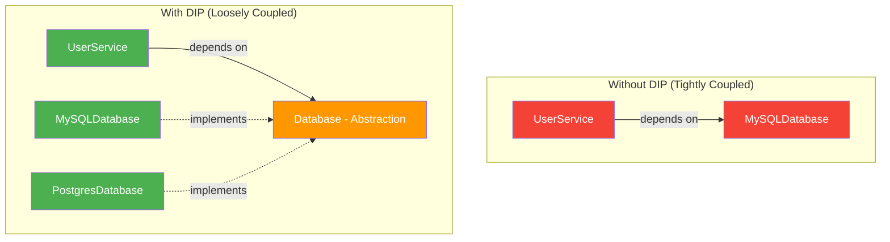
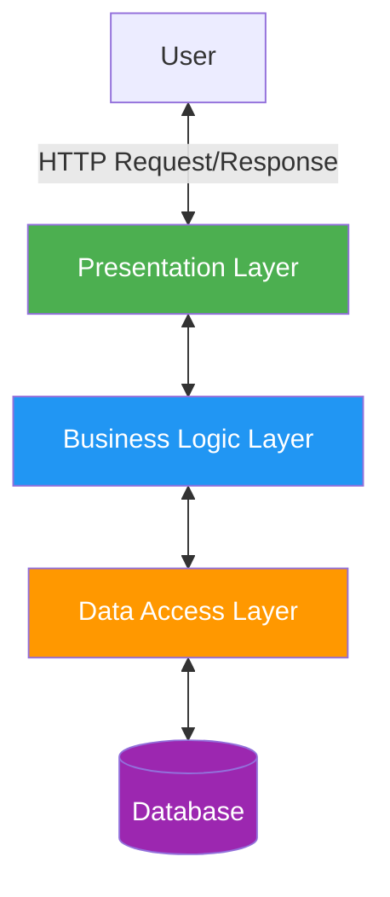
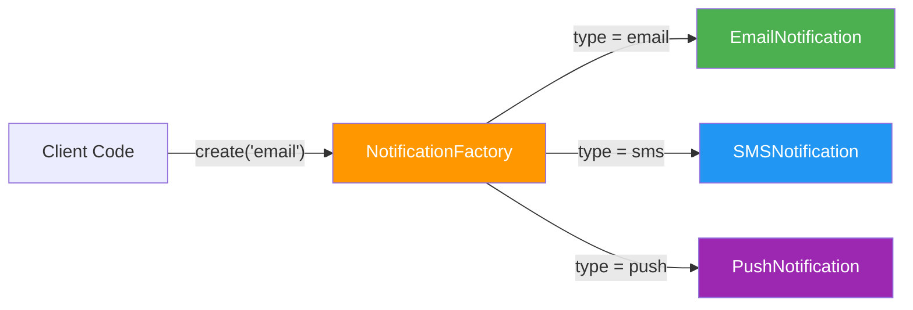
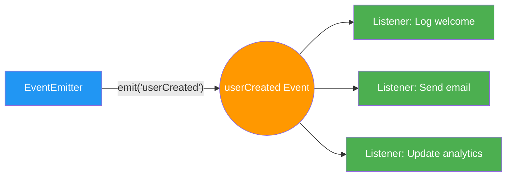

# Design and Development Principles

> Writing code that works is only the first step. Writing code that is maintainable, scalable, and understandable is what separates a junior developer from a senior one.

# Table of Contents

1. [Why Principles Matter](#why-principles-matter)
2. [SOLID Principles](#solid-principles)
   1. [Single Responsibility Principle (SRP)](#single-responsibility-principle-srp)
   2. [Open/Closed Principle (OCP)](#openclosed-principle-ocp)
   3. [Liskov Substitution Principle (LSP)](#liskov-substitution-principle-lsp)
   4. [Interface Segregation Principle (ISP)](#interface-segregation-principle-isp)
   5. [Dependency Inversion Principle (DIP)](#dependency-inversion-principle-dip)
3. [DRY - Don't Repeat Yourself](#dry---dont-repeat-yourself)
4. [KISS - Keep It Simple, Stupid](#kiss---keep-it-simple-stupid)
5. [YAGNI - You Aren't Gonna Need It](#yagni---you-arent-gonna-need-it)
6. [Separation of Concerns](#separation-of-concerns)
7. [Design Patterns](#design-patterns)
   1. [Creational Patterns](#creational-patterns)
   2. [Structural Patterns](#structural-patterns)
   3. [Behavioral Patterns](#behavioral-patterns)
8. [Domain-Driven Design (DDD)](#domain-driven-design-ddd)
9. [Clean Code Principles](#clean-code-principles)
10. [Resources](#resources)

---

## Why Principles Matter

Software development principles exist to help developers write code that is:

- **Maintainable** - Easy to modify and extend over time
- **Readable** - Other developers (and your future self) can understand it
- **Testable** - Individual components can be verified in isolation
- **Scalable** - The codebase can grow without becoming unmanageable

Without guiding principles, codebases tend to accumulate **technical debt** -- shortcuts and poor design decisions that slow down future development. Principles act as guardrails that keep software healthy as it evolves.

> **Tip:** Principles are guidelines, not laws. There are times when breaking a principle is the right call, but you should always understand *why* you are doing so.

---

## SOLID Principles

SOLID is an acronym introduced by Robert C. Martin (Uncle Bob) that represents five foundational principles of object-oriented design.


### Single Responsibility Principle (SRP)

**A class should have one, and only one, reason to change.**

Each module or class should be responsible for a single part of the functionality. When a class handles multiple concerns, changes to one concern risk breaking the other.

```javascript
// Bad: This class handles both user data AND email sending
class User {
  constructor(name, email) {
    this.name = name;
    this.email = email;
  }

  saveToDatabase() {
    // database logic
  }

  sendWelcomeEmail() {
    // email logic
  }
}

// Good: Responsibilities are separated
class User {
  constructor(name, email) {
    this.name = name;
    this.email = email;
  }
}

class UserRepository {
  save(user) {
    // database logic
  }
}

class EmailService {
  sendWelcomeEmail(user) {
    // email logic
  }
}
```

### Open/Closed Principle (OCP)

**Software entities should be open for extension but closed for modification.**

You should be able to add new behavior without changing existing code. This is typically achieved through abstraction and polymorphism.

```python
# Bad: Adding a new shape requires modifying the existing function
def calculate_area(shape):
    if shape.type == "circle":
        return 3.14 * shape.radius ** 2
    elif shape.type == "rectangle":
        return shape.width * shape.height
    # Every new shape means editing this function

# Good: Each shape defines its own area calculation
class Shape:
    def area(self):
        raise NotImplementedError

class Circle(Shape):
    def __init__(self, radius):
        self.radius = radius

    def area(self):
        return 3.14 * self.radius ** 2

class Rectangle(Shape):
    def __init__(self, width, height):
        self.width = width
        self.height = height

    def area(self):
        return self.width * self.height

# Adding a Triangle requires NO changes to existing code
class Triangle(Shape):
    def __init__(self, base, height):
        self.base = base
        self.height = height

    def area(self):
        return 0.5 * self.base * self.height
```

### Liskov Substitution Principle (LSP)

**Objects of a superclass should be replaceable with objects of a subclass without breaking the application.**

If class B is a subclass of class A, you should be able to use B anywhere A is expected without unexpected behavior.

```java
// Violation: Square changes the expected behavior of Rectangle
class Rectangle {
    protected int width;
    protected int height;

    public void setWidth(int w) { this.width = w; }
    public void setHeight(int h) { this.height = h; }
    public int getArea() { return width * height; }
}

class Square extends Rectangle {
    // This breaks LSP because setting width also changes height
    public void setWidth(int w) { this.width = w; this.height = w; }
    public void setHeight(int h) { this.width = h; this.height = h; }
}

// Code expecting Rectangle behavior will produce wrong results with Square
```

> **Tip:** If your subclass needs to override a parent method in a way that changes its contract, you likely have a design problem. Prefer composition over inheritance in these cases.

### Interface Segregation Principle (ISP)

**Clients should not be forced to depend on interfaces they do not use.**

Instead of one large interface, create smaller, focused interfaces that clients can implement selectively.

```typescript
// Bad: A single fat interface
interface Worker {
  work(): void;
  eat(): void;
  sleep(): void;
}

// A robot worker is forced to implement eat() and sleep()
class Robot implements Worker {
  work() { /* ... */ }
  eat() { throw new Error("Robots don't eat"); }  // Forced implementation
  sleep() { throw new Error("Robots don't sleep"); }
}

// Good: Segregated interfaces
interface Workable {
  work(): void;
}

interface Eatable {
  eat(): void;
}

interface Sleepable {
  sleep(): void;
}

class Human implements Workable, Eatable, Sleepable {
  work() { /* ... */ }
  eat() { /* ... */ }
  sleep() { /* ... */ }
}

class Robot implements Workable {
  work() { /* ... */ }
}
```

### Dependency Inversion Principle (DIP)

**High-level modules should not depend on low-level modules. Both should depend on abstractions.**

Instead of a service directly instantiating its dependencies, it should receive them through abstraction (dependency injection).

```python
# Bad: High-level module depends directly on low-level module
class MySQLDatabase:
    def save(self, data):
        # MySQL-specific logic
        pass

class UserService:
    def __init__(self):
        self.db = MySQLDatabase()  # Tightly coupled

# Good: Both depend on an abstraction
from abc import ABC, abstractmethod

class Database(ABC):
    @abstractmethod
    def save(self, data):
        pass

class MySQLDatabase(Database):
    def save(self, data):
        # MySQL-specific logic
        pass

class PostgresDatabase(Database):
    def save(self, data):
        # Postgres-specific logic
        pass

class UserService:
    def __init__(self, db: Database):
        self.db = db  # Depends on abstraction, not implementation

# Now we can swap databases without changing UserService
service = UserService(PostgresDatabase())
```



---

## DRY - Don't Repeat Yourself

**Every piece of knowledge must have a single, unambiguous, authoritative representation within a system.**

DRY is about reducing repetition of information and logic. When you find yourself copying and pasting code, that is a signal to extract it into a shared function, module, or constant.

```javascript
// Bad: Validation logic duplicated
function createUser(email) {
  if (!email.includes("@") || email.length < 5) {
    throw new Error("Invalid email");
  }
  // ...
}

function updateUser(email) {
  if (!email.includes("@") || email.length < 5) {
    throw new Error("Invalid email");
  }
  // ...
}

// Good: Single source of truth
function validateEmail(email) {
  if (!email.includes("@") || email.length < 5) {
    throw new Error("Invalid email");
  }
}

function createUser(email) {
  validateEmail(email);
  // ...
}

function updateUser(email) {
  validateEmail(email);
  // ...
}
```

> **Warning:** DRY does not mean "never write similar-looking code." Two pieces of code that look similar but serve different purposes and change for different reasons should remain separate. Premature abstraction can be worse than duplication.

---

## KISS - Keep It Simple, Stupid

**The simplest solution that works is usually the best one.**

KISS reminds developers to avoid unnecessary complexity. Clever code is often harder to debug, test, and maintain.

```python
# Overly clever
def is_even(n):
    return not n & 1

# KISS
def is_even(n):
    return n % 2 == 0
```

Both work, but the second version is immediately clear to any developer reading it.

---

## YAGNI - You Aren't Gonna Need It

**Don't implement something until you actually need it.**

YAGNI, from Extreme Programming, warns against building features or abstractions "just in case." Premature generalization adds complexity without delivering value.

- Do not add database support for multiple providers when you only use one
- Do not create an abstract factory when a simple constructor works
- Do not build a plugin system until someone actually requests plugins

---

## Separation of Concerns

**Each section of a program should address a separate concern.**

A "concern" is a distinct piece of functionality. The classic example is the three-tier architecture:

| Layer | Concern | Example |
|-------|---------|---------|
| Presentation | Displaying data to users | HTML templates, REST controllers |
| Business Logic | Rules and workflows | Validation, calculations, orchestration |
| Data Access | Storing and retrieving data | SQL queries, ORM models |



When concerns are separated, changes in one layer have minimal impact on others. A switch from PostgreSQL to MongoDB should not require rewriting your business logic.

---

## Design Patterns

Design patterns are reusable solutions to commonly occurring problems in software design. They were popularized by the "Gang of Four" (GoF) book *Design Patterns: Elements of Reusable Object-Oriented Software* (1994).

### Creational Patterns

These patterns deal with object creation mechanisms.

**Singleton** - Ensures a class has only one instance and provides a global point of access.

```python
class DatabaseConnection:
    _instance = None

    def __new__(cls):
        if cls._instance is None:
            cls._instance = super().__new__(cls)
        return cls._instance

# Both variables point to the same instance
db1 = DatabaseConnection()
db2 = DatabaseConnection()
assert db1 is db2  # True
```

**Factory** - Creates objects without specifying the exact class to create.

```javascript
class NotificationFactory {
  static create(type, message) {
    switch (type) {
      case "email": return new EmailNotification(message);
      case "sms":   return new SMSNotification(message);
      case "push":  return new PushNotification(message);
      default: throw new Error(`Unknown type: ${type}`);
    }
  }
}

const notification = NotificationFactory.create("email", "Hello!");
```



**Builder** - Constructs complex objects step by step.

```javascript
class QueryBuilder {
  constructor() { this.query = {}; }

  select(fields) { this.query.select = fields; return this; }
  from(table) { this.query.from = table; return this; }
  where(condition) { this.query.where = condition; return this; }
  build() { return this.query; }
}

const query = new QueryBuilder()
  .select(["name", "email"])
  .from("users")
  .where("age > 18")
  .build();
```

### Structural Patterns

These patterns deal with object composition and relationships.

**Adapter** - Allows incompatible interfaces to work together.

```python
class OldPaymentSystem:
    def make_payment(self, amount):
        return f"Paid {amount} via old system"

class NewPaymentGateway:
    def process(self, amount_in_cents):
        return f"Processed {amount_in_cents} cents"

class PaymentAdapter:
    def __init__(self, new_gateway):
        self.gateway = new_gateway

    def make_payment(self, amount):
        return self.gateway.process(amount * 100)
```

**Decorator** - Adds behavior to objects dynamically without modifying their class.

```python
class Logger:
    def __init__(self, service):
        self.service = service

    def process(self, data):
        print(f"Logging: processing {data}")
        result = self.service.process(data)
        print(f"Logging: result {result}")
        return result

# Wrap any service with logging without changing the service itself
logged_service = Logger(PaymentService())
logged_service.process(order)
```

**Proxy** - Provides a surrogate or placeholder for another object to control access to it. Common uses include lazy loading, access control, and logging.

### Behavioral Patterns

These patterns deal with communication between objects.

**Observer** - Defines a one-to-many dependency where changes in one object notify all dependents.

```javascript
class EventEmitter {
  constructor() { this.listeners = {}; }

  on(event, callback) {
    if (!this.listeners[event]) this.listeners[event] = [];
    this.listeners[event].push(callback);
  }

  emit(event, data) {
    (this.listeners[event] || []).forEach(cb => cb(data));
  }
}

const emitter = new EventEmitter();
emitter.on("userCreated", (user) => console.log(`Welcome ${user.name}`));
emitter.on("userCreated", (user) => sendWelcomeEmail(user));
emitter.emit("userCreated", { name: "Alice" });
```



**Strategy** - Defines a family of algorithms and makes them interchangeable at runtime.

```javascript
class PaymentProcessor {
  constructor(strategy) {
    this.strategy = strategy;
  }

  pay(amount) {
    return this.strategy.execute(amount);
  }
}

class CreditCardStrategy {
  execute(amount) { return `Charged $${amount} to credit card`; }
}

class PayPalStrategy {
  execute(amount) { return `Sent $${amount} via PayPal`; }
}

// Switch strategies at runtime
const processor = new PaymentProcessor(new CreditCardStrategy());
processor.pay(100); // "Charged $100 to credit card"
```

**Command** - Encapsulates a request as an object, allowing you to parameterize clients with different requests, queue them, or log them.

---

## Domain-Driven Design (DDD)

Domain-Driven Design is an approach to software development that centers the design on the business domain. It was introduced by Eric Evans in his 2003 book.

Key concepts of DDD:

| Concept | Description |
|---------|-------------|
| **Ubiquitous Language** | A shared vocabulary between developers and domain experts used in code and conversation |
| **Bounded Context** | A boundary within which a particular model is defined and applicable |
| **Entity** | An object with a distinct identity that persists over time (e.g., a User with an ID) |
| **Value Object** | An object defined by its attributes, with no conceptual identity (e.g., an Address) |
| **Aggregate** | A cluster of entities and value objects treated as a single unit for data changes |
| **Repository** | An abstraction for accessing aggregates from storage |
| **Domain Event** | A record of something meaningful that happened in the domain |

> **Tip:** DDD is most valuable in complex business domains. For simple CRUD applications, the overhead of DDD may not be justified.

---

## Clean Code Principles

Robert C. Martin's *Clean Code* (2008) defines principles for writing code that is easy to read and maintain:

1. **Meaningful names** - Variables, functions, and classes should reveal their intent. `getUserById(id)` is better than `get(id)`.
2. **Small functions** - Functions should do one thing and do it well. Aim for 5-20 lines per function.
3. **Avoid comments where code can speak** - Good code is self-documenting. Use comments for *why*, not *what*.
4. **Error handling** - Don't use return codes when exceptions are available. Don't return `null` when you can return an empty collection.
5. **No side effects** - A function named `checkPassword` should not also initialize a session.
6. **Boy Scout Rule** - Always leave the code cleaner than you found it.
7. **Single level of abstraction** - Within a function, all statements should be at the same level of abstraction.

```javascript
// Bad: Mixed levels of abstraction
function processOrder(order) {
  // high-level
  validateOrder(order);

  // suddenly low-level database details
  const connection = mysql.createConnection({ host: "localhost" });
  connection.query(`INSERT INTO orders VALUES (${order.id})`);

  // back to high-level
  sendConfirmationEmail(order);
}

// Good: Consistent abstraction level
function processOrder(order) {
  validateOrder(order);
  saveOrder(order);
  sendConfirmationEmail(order);
}
```

---

## Resources

- [Clean Code by Robert C. Martin](https://www.oreilly.com/library/view/clean-code-a/9780136083238/)
- [Design Patterns: Elements of Reusable Object-Oriented Software](https://www.oreilly.com/library/view/design-patterns-elements/0201633612/)
- [SOLID Principles - Wikipedia](https://en.wikipedia.org/wiki/SOLID)
- [Refactoring Guru - Design Patterns](https://refactoring.guru/design-patterns)
- [Domain-Driven Design by Eric Evans](https://www.domainlanguage.com/ddd/)
- [Martin Fowler's Blog](https://martinfowler.com/)
- [The Pragmatic Programmer by David Thomas & Andrew Hunt](https://pragprog.com/titles/tpp20/the-pragmatic-programmer-20th-anniversary-edition/)
