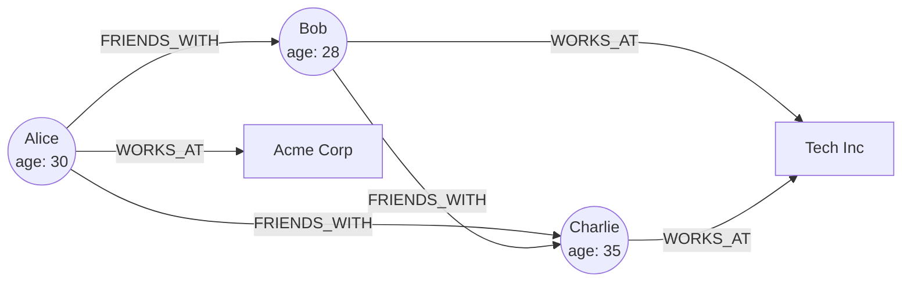
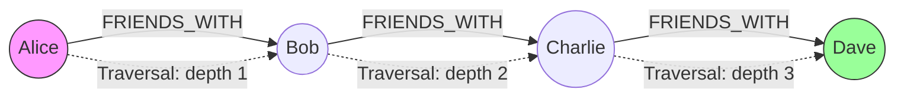
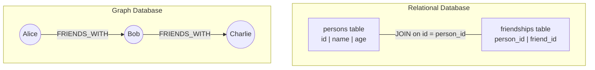

# Graph Databases

## Table of Contents

1. [What are Graph Databases](#what-are-graph-databases)
2. [Graph Theory Basics](#graph-theory-basics)
3. [When to Use Graph Databases](#when-to-use-graph-databases)
4. [Neo4j](#neo4j)
5. [Cypher Query Language](#cypher-query-language)
6. [CRUD Examples in Cypher](#crud-examples-in-cypher)
7. [ArangoDB](#arangodb)
8. [Amazon Neptune](#amazon-neptune)
9. [Use Cases](#use-cases)
10. [Graph vs Relational Comparison](#graph-vs-relational-comparison)
11. [Performance Considerations](#performance-considerations)
12. [Resources](#resources)

---

## What are Graph Databases

A graph database is a type of NoSQL database that uses graph structures to store, map, and query relationships between data. Instead of tables with rows and columns, graph databases use **nodes** (entities), **edges** (relationships), and **properties** (attributes) to represent and store data.

Graph databases are purpose-built for workloads where the relationships between data points are as important as the data itself. They excel at traversing connections — something that would require expensive JOIN operations in relational databases.

**Key advantages:**

- **Relationship-first** — Relationships are stored as first-class citizens, not computed at query time.
- **Flexible schema** — Easily add new types of nodes and relationships without migration.
- **Intuitive modeling** — The data model maps naturally to how we think about connected data.
- **Performance on connected queries** — Traversing relationships is O(1) per hop, regardless of total dataset size.

---

## Graph Theory Basics

Graph databases are built on mathematical graph theory. Understanding the fundamentals helps you design effective graph models.



### Nodes (Vertices)

Nodes represent entities in your data. Each node can have:
- One or more **labels** (categories, like "Person" or "Product").
- Zero or more **properties** (key-value pairs, like `name: "Alice"`).

### Edges (Relationships)

Edges represent connections between nodes. Each edge has:
- A **type** (like "FRIENDS_WITH" or "PURCHASED").
- A **direction** (from one node to another).
- Zero or more **properties** (like `since: 2020`).

### Properties

Both nodes and edges can carry properties, which are key-value pairs that store information about the entity or relationship.

```
        FRIENDS_WITH
  (Alice) ──────────────> (Bob)
    |                       |
    | WORKS_AT              | WORKS_AT
    v                       v
  (Acme Corp)            (Tech Inc)
```

**Graph types:**

| Type | Description |
|------|-------------|
| Directed graph | Edges have direction (A -> B) |
| Undirected graph | Edges have no direction (A -- B) |
| Weighted graph | Edges have numerical weights |
| Property graph | Nodes and edges carry key-value properties |
| RDF graph | Uses subject-predicate-object triples |

> **Tip:** Most graph databases (Neo4j, ArangoDB) use the **property graph model**, while Amazon Neptune and some knowledge graph systems also support **RDF**.

---

## When to Use Graph Databases

Graph databases are the best choice when your queries frequently involve traversing relationships, especially at variable depth.

**Good fit:**

- Social networks (friends of friends, mutual connections)
- Recommendation engines (people who bought X also bought Y)
- Fraud detection (finding suspicious patterns in transaction chains)
- Knowledge graphs (interconnected facts and entities)
- Network and IT infrastructure mapping
- Access control and authorization (permission hierarchies)
- Supply chain management
- Route and path optimization

**Not the best fit:**

- Simple CRUD applications with flat data
- Heavy aggregation and reporting workloads
- Time-series data at massive scale
- Applications where relationships are not central to queries

---

## Neo4j

Neo4j is the most popular graph database in the world. It uses the **property graph model** and provides its own query language called **Cypher**.

### Property Graph Model

In Neo4j's property graph model:

- **Nodes** have labels and properties.
- **Relationships** have types, direction, and properties.
- **Both nodes and relationships** can hold any number of key-value properties.

```
(:Person {name: "Alice", age: 30})
    -[:FRIENDS_WITH {since: 2019}]->
(:Person {name: "Bob", age: 28})
    -[:WORKS_AT {role: "Engineer"}]->
(:Company {name: "Tech Inc", founded: 2010})
```

### Architecture

- **Native graph storage** — Data is stored as a graph on disk, not as a table.
- **Index-free adjacency** — Each node directly references its neighbors, enabling O(1) relationship traversal.
- **ACID compliant** — Full transactional support.
- **Clustering** — Supports causal clustering for high availability and read scaling.

---

## Cypher Query Language

Cypher is Neo4j's declarative graph query language. Its syntax uses ASCII art patterns to describe graph structures visually.

**Pattern syntax:**

```
(node)                    -- a node
(node:Label)              -- a node with a label
(node {prop: "value"})    -- a node with properties
-[rel:TYPE]->             -- a directed relationship
-[rel:TYPE {prop: "val"}]-> -- relationship with properties
```



**Basic reading patterns:**

```cypher
// Find a person by name
MATCH (p:Person {name: "Alice"})
RETURN p

// Find Alice's friends
MATCH (alice:Person {name: "Alice"})-[:FRIENDS_WITH]->(friend:Person)
RETURN friend.name, friend.age

// Find friends of friends (2 hops)
MATCH (alice:Person {name: "Alice"})-[:FRIENDS_WITH*2]->(fof:Person)
RETURN DISTINCT fof.name

// Find shortest path between two people
MATCH path = shortestPath(
  (a:Person {name: "Alice"})-[:FRIENDS_WITH*]-(b:Person {name: "Dave"})
)
RETURN path
```

---

## CRUD Examples in Cypher

### Create

```cypher
// Create a node
CREATE (alice:Person {name: "Alice", age: 30, email: "alice@example.com"})

// Create multiple nodes and a relationship
CREATE (alice:Person {name: "Alice", age: 30})
CREATE (bob:Person {name: "Bob", age: 28})
CREATE (alice)-[:FRIENDS_WITH {since: 2019}]->(bob)

// Create a relationship between existing nodes
MATCH (a:Person {name: "Alice"}), (c:Company {name: "Acme Corp"})
CREATE (a)-[:WORKS_AT {role: "Developer", since: 2021}]->(c)
```

### Read

```cypher
// Find all people
MATCH (p:Person)
RETURN p.name, p.age

// Find people older than 25 who work at a specific company
MATCH (p:Person)-[:WORKS_AT]->(c:Company {name: "Acme Corp"})
WHERE p.age > 25
RETURN p.name, p.age
ORDER BY p.age DESC
LIMIT 10

// Count relationships
MATCH (p:Person)-[:FRIENDS_WITH]->(friend)
RETURN p.name, count(friend) AS friendCount
ORDER BY friendCount DESC
```

### Update

```cypher
// Update a node property
MATCH (p:Person {name: "Alice"})
SET p.age = 31, p.updatedAt = datetime()

// Add a label to a node
MATCH (p:Person {name: "Alice"})
SET p:Employee

// Update a relationship property
MATCH (a:Person {name: "Alice"})-[r:WORKS_AT]->(c:Company)
SET r.role = "Senior Developer"
```

### Delete

```cypher
// Delete a relationship
MATCH (a:Person {name: "Alice"})-[r:FRIENDS_WITH]->(b:Person {name: "Bob"})
DELETE r

// Delete a node (must remove relationships first)
MATCH (p:Person {name: "Bob"})
DETACH DELETE p

// Delete all nodes and relationships (use with caution)
MATCH (n)
DETACH DELETE n
```

> **Tip:** Always use `DETACH DELETE` when deleting nodes that may have relationships. Attempting to delete a node with existing relationships without `DETACH` will cause an error.

---

## ArangoDB

ArangoDB is a **multi-model** database that supports graph, document, and key-value data models in a single engine. It uses its own query language called **AQL** (ArangoDB Query Language).

**Key features:**

- **Multi-model** — Use graphs, documents, and key-value stores in the same queries.
- **AQL** — SQL-like query language that supports graph traversals.
- **SmartGraphs** — Enterprise feature for efficient distributed graph processing.
- **Full-text search** — Integrated search capabilities.
- **Transactions** — Multi-collection ACID transactions.

**AQL graph query example:**

```aql
// Find friends of Alice
FOR v, e, p IN 1..1 OUTBOUND 'persons/alice' GRAPH 'social'
  RETURN v.name

// Find friends of friends (depth 2)
FOR v, e, p IN 2..2 OUTBOUND 'persons/alice' GRAPH 'social'
  RETURN DISTINCT v.name

// Shortest path
FOR v, e IN OUTBOUND SHORTEST_PATH
  'persons/alice' TO 'persons/dave' GRAPH 'social'
  RETURN v.name
```

---

## Amazon Neptune

Amazon Neptune is a fully managed graph database service by AWS. It supports two popular graph models and their query languages:

| Model | Query Language | Best For |
|-------|---------------|----------|
| Property Graph | Apache TinkerPop Gremlin | Application data with rich properties |
| RDF (Resource Description Framework) | SPARQL | Knowledge graphs, linked data |

**Key features:**

- Fully managed (no server administration).
- Up to 15 read replicas for scaling.
- Continuous backup to Amazon S3.
- Encryption at rest and in transit.
- Integration with other AWS services (Lambda, IAM, CloudWatch).

**Gremlin query example:**

```groovy
// Find Alice's friends
g.V().has('name', 'Alice')
  .out('FRIENDS_WITH')
  .values('name')

// Find friends of friends
g.V().has('name', 'Alice')
  .out('FRIENDS_WITH')
  .out('FRIENDS_WITH')
  .dedup()
  .values('name')
```

---

## Use Cases

### Social Networks

Graph databases naturally model social relationships. Finding mutual friends, suggesting connections, or analyzing influence becomes simple graph traversal.

```cypher
// Find mutual friends between Alice and Bob
MATCH (alice:Person {name: "Alice"})-[:FRIENDS_WITH]->(mutual)<-[:FRIENDS_WITH]-(bob:Person {name: "Bob"})
RETURN mutual.name
```

### Recommendation Engines

Collaborative filtering uses graph patterns to suggest items.

```cypher
// "People who bought X also bought..."
MATCH (customer:Person)-[:PURCHASED]->(:Product {name: "Laptop"})
      <-[:PURCHASED]-(other:Person)-[:PURCHASED]->(rec:Product)
WHERE NOT (customer)-[:PURCHASED]->(rec)
RETURN rec.name, count(*) AS score
ORDER BY score DESC
LIMIT 5
```

### Fraud Detection

Financial fraud often involves chains of transactions designed to hide money flow. Graph databases can detect circular patterns and suspicious clusters.

```cypher
// Find circular transaction chains
MATCH path = (a:Account)-[:TRANSFERRED_TO*3..6]->(a)
WHERE ALL(r IN relationships(path) WHERE r.amount > 10000)
RETURN path
```

### Knowledge Graphs

Organizations use knowledge graphs to connect information from disparate sources into a unified, queryable model. Companies like Google, Amazon, and LinkedIn use massive knowledge graphs to power search and discovery.

---

## Graph vs Relational Comparison



| Aspect | Relational Database | Graph Database |
|--------|-------------------|----------------|
| Data model | Tables, rows, columns | Nodes, edges, properties |
| Relationships | Foreign keys + JOINs | First-class edges |
| Schema | Rigid (predefined schema) | Flexible (schema-optional) |
| Query language | SQL | Cypher, Gremlin, SPARQL, AQL |
| Join performance | Degrades with depth | Constant time per hop |
| Best for | Structured, tabular data | Highly connected data |
| Scaling | Vertical (mostly) | Horizontal and vertical |
| ACID | Full support | Full support (Neo4j, ArangoDB) |

**The same query — find friends of friends:**

```sql
-- SQL (3-way join)
SELECT DISTINCT p3.name
FROM persons p1
JOIN friendships f1 ON p1.id = f1.person_id
JOIN friendships f2 ON f1.friend_id = f2.person_id
JOIN persons p3 ON f2.friend_id = p3.id
WHERE p1.name = 'Alice' AND p3.name <> 'Alice';
```

```cypher
// Cypher (natural pattern)
MATCH (alice:Person {name: "Alice"})-[:FRIENDS_WITH*2]->(fof:Person)
WHERE fof <> alice
RETURN DISTINCT fof.name
```

The Cypher query is not only more readable but also performs better because it does not require computing large intermediate join sets.

---

## Performance Considerations

1. **Index your lookup properties** — Create indexes on properties used in `MATCH` or `WHERE` clauses (e.g., `name`, `email`).

```cypher
CREATE INDEX FOR (p:Person) ON (p.email)
CREATE INDEX FOR (p:Person) ON (p.name)
```

2. **Limit traversal depth** — Unbounded variable-length paths (`*`) can be extremely expensive. Always set upper bounds.

```cypher
// Good: bounded depth
MATCH path = (a)-[:KNOWS*1..5]->(b)

// Dangerous: unbounded depth
MATCH path = (a)-[:KNOWS*]->(b)
```

3. **Use parameterized queries** — Avoid string concatenation to prevent Cypher injection and enable query plan caching.

4. **Profile your queries** — Use `PROFILE` or `EXPLAIN` to understand query execution plans.

```cypher
PROFILE MATCH (p:Person)-[:FRIENDS_WITH]->(f)
WHERE p.name = "Alice"
RETURN f.name
```

5. **Design for your queries** — Model your graph to match your most common query patterns. Sometimes duplicating data or adding shortcut relationships improves performance.

6. **Batch operations** — When loading large datasets, use batch import tools (e.g., `neo4j-admin import`) rather than individual CREATE statements.

7. **Memory configuration** — Ensure the page cache and heap are sized to keep frequently accessed data in memory.

---

## Resources

- [Neo4j Official Documentation](https://neo4j.com/docs/)
- [Cypher Query Language Reference](https://neo4j.com/docs/cypher-manual/)
- [Neo4j Sandbox](https://neo4j.com/sandbox/) — Free online playground
- [ArangoDB Documentation](https://www.arangodb.com/docs/)
- [Amazon Neptune Documentation](https://docs.aws.amazon.com/neptune/)
- [Graph Databases (O'Reilly Book)](https://neo4j.com/graph-databases-book/) — Free eBook by Neo4j
- [Apache TinkerPop / Gremlin](https://tinkerpop.apache.org/)
- [SPARQL Query Language](https://www.w3.org/TR/sparql11-query/)
- [Awesome Graph](https://github.com/jbmusso/awesome-graph) — Curated graph database resources
