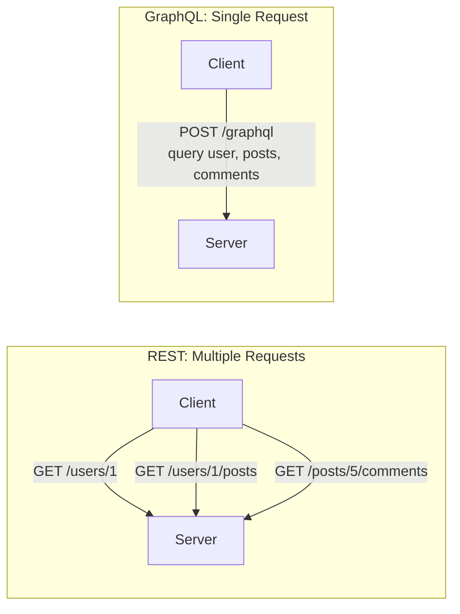
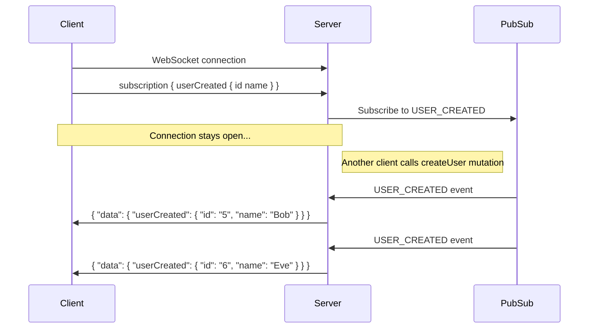
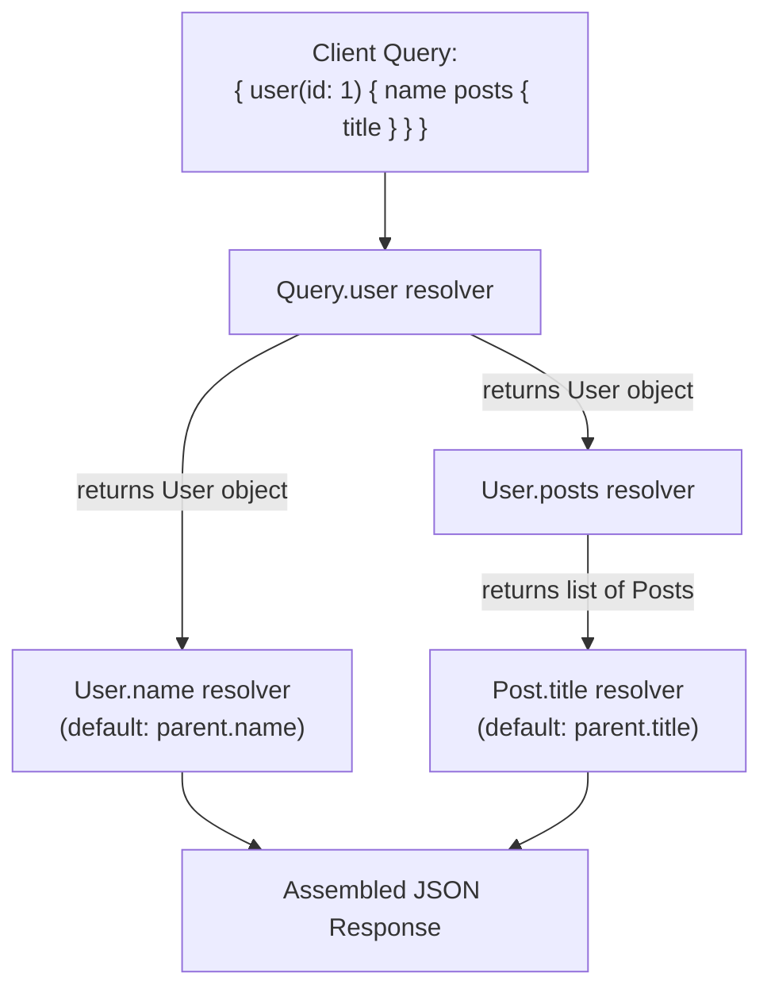
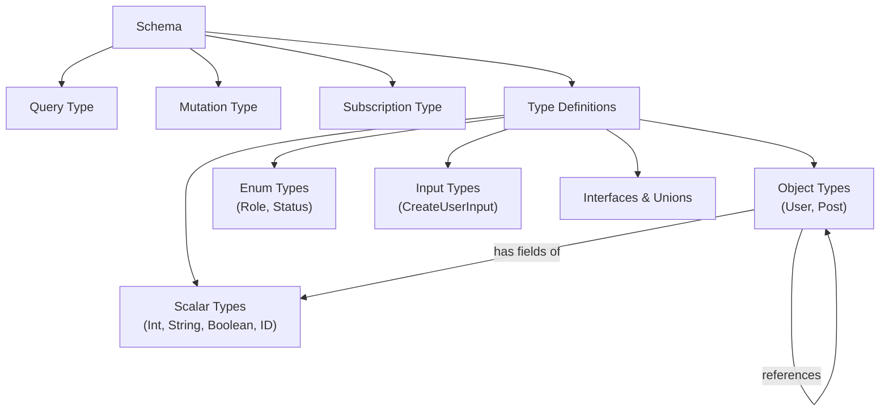

# GraphQL

## Table of Contents

1. [What is GraphQL](#what-is-graphql)
2. [GraphQL vs REST](#graphql-vs-rest)
3. [Core Concepts](#core-concepts)
4. [Schema and Types](#schema-and-types)
5. [Queries](#queries)
6. [Mutations](#mutations)
7. [Subscriptions](#subscriptions)
8. [Resolvers](#resolvers)
9. [Type System](#type-system)
10. [GraphQL Query Examples](#graphql-query-examples)
11. [N+1 Problem and DataLoader](#n1-problem-and-dataloader)
12. [Authentication in GraphQL](#authentication-in-graphql)
13. [Popular Implementations](#popular-implementations)
14. [When to Use GraphQL vs REST](#when-to-use-graphql-vs-rest)
15. [Best Practices](#best-practices)
16. [Resources](#resources)

---

## What is GraphQL

GraphQL is a query language for APIs and a server-side runtime for executing those queries. It was developed internally by Facebook in 2012 and open-sourced in 2015. Unlike REST, where the server defines the structure of responses, GraphQL lets the **client** specify exactly what data it needs.

**Key principles:**

- **Declarative data fetching** — Clients ask for specific fields and get exactly those fields back.
- **Single endpoint** — All queries go to one URL (typically `/graphql`), unlike REST which has many endpoints.
- **Strongly typed** — Every GraphQL API is defined by a schema that describes all available types and operations.
- **Introspective** — Clients can query the schema itself to discover available operations.

---

## GraphQL vs REST



| Feature | REST | GraphQL |
|---------|------|---------|
| Endpoints | Multiple (`/users`, `/posts`) | Single (`/graphql`) |
| Data fetching | Fixed response structure | Client specifies exact fields |
| Over-fetching | Common (server decides response) | Eliminated (client picks fields) |
| Under-fetching | Common (multiple requests needed) | Eliminated (nested queries) |
| Versioning | URL or header-based (`/v1/`, `/v2/`) | Schema evolution, no versioning needed |
| Caching | Built-in HTTP caching | Requires custom caching strategies |
| File upload | Native support | Requires separate spec or multipart |
| Learning curve | Low | Moderate |
| Tooling | Mature and widespread | Growing ecosystem |
| Real-time | Requires separate mechanism (SSE, WS) | Built-in subscriptions |

> **Tip:** GraphQL does not replace REST in all cases. REST remains simpler for straightforward CRUD APIs with well-defined resources, while GraphQL excels when clients have diverse data needs.

---

## Core Concepts

A GraphQL API is built around three core operation types:

1. **Query** — Read data (equivalent to GET in REST).
2. **Mutation** — Write or modify data (equivalent to POST/PUT/DELETE).
3. **Subscription** — Real-time updates via WebSocket connections.

These operations are defined in a **schema** and executed by **resolvers** on the server.

```graphql
# Schema definition
type Query {
  user(id: ID!): User
  users: [User!]!
}

type Mutation {
  createUser(input: CreateUserInput!): User!
}

type Subscription {
  userCreated: User!
}
```

---

## Schema and Types

The schema is the contract between the client and the server. It defines what data can be queried and what operations can be performed.

```graphql
# Schema Definition Language (SDL)
type User {
  id: ID!
  name: String!
  email: String!
  age: Int
  posts: [Post!]!
  role: Role!
  createdAt: String!
}

type Post {
  id: ID!
  title: String!
  content: String!
  author: User!
  comments: [Comment!]!
  published: Boolean!
}

type Comment {
  id: ID!
  text: String!
  author: User!
  post: Post!
}

enum Role {
  ADMIN
  USER
  MODERATOR
}
```

**Key symbols in SDL:**

| Symbol | Meaning |
|--------|---------|
| `!` | Non-nullable (field is required) |
| `[Type]` | List of items |
| `[Type!]!` | Non-nullable list of non-nullable items |
| `ID` | Unique identifier (serialized as String) |

---

## Queries

Queries are used to fetch data. The client describes exactly the shape of data it wants.

```graphql
# Simple query
query {
  user(id: "123") {
    name
    email
  }
}

# Response
{
  "data": {
    "user": {
      "name": "Alice",
      "email": "alice@example.com"
    }
  }
}
```

**Nested queries** allow fetching related data in a single request:

```graphql
query {
  user(id: "123") {
    name
    posts {
      title
      comments {
        text
        author {
          name
        }
      }
    }
  }
}
```

**Query with variables:**

```graphql
query GetUser($userId: ID!) {
  user(id: $userId) {
    name
    email
    role
  }
}

# Variables (sent as JSON)
{
  "userId": "123"
}
```

**Aliases and Fragments:**

```graphql
# Aliases let you query the same field with different arguments
query {
  admin: user(id: "1") {
    ...UserFields
  }
  guest: user(id: "2") {
    ...UserFields
  }
}

# Fragments let you reuse field selections
fragment UserFields on User {
  name
  email
  role
}
```

---

## Mutations

Mutations modify server-side data and return the updated result.

```graphql
mutation CreateUser($input: CreateUserInput!) {
  createUser(input: $input) {
    id
    name
    email
  }
}

# Variables
{
  "input": {
    "name": "Bob",
    "email": "bob@example.com",
    "role": "USER"
  }
}
```

**Input types** are used to group mutation arguments:

```graphql
input CreateUserInput {
  name: String!
  email: String!
  role: Role!
}

input UpdateUserInput {
  name: String
  email: String
  role: Role
}

type Mutation {
  createUser(input: CreateUserInput!): User!
  updateUser(id: ID!, input: UpdateUserInput!): User!
  deleteUser(id: ID!): Boolean!
}
```

---

## Subscriptions

Subscriptions provide real-time functionality by maintaining a persistent connection (usually over WebSocket) between the client and server.



```graphql
subscription {
  userCreated {
    id
    name
    email
  }
}
```

On the server side (using Apollo Server):

```javascript
const { PubSub } = require('graphql-subscriptions');
const pubsub = new PubSub();

const resolvers = {
  Mutation: {
    createUser: async (_, { input }) => {
      const user = await db.users.create(input);
      pubsub.publish('USER_CREATED', { userCreated: user });
      return user;
    },
  },
  Subscription: {
    userCreated: {
      subscribe: () => pubsub.asyncIterator(['USER_CREATED']),
    },
  },
};
```

---

## Resolvers

Resolvers are functions that populate the data for each field in the schema. Every field in a GraphQL schema has a corresponding resolver function.



```javascript
const resolvers = {
  Query: {
    // resolver(parent, args, context, info)
    user: async (_, { id }, { db }) => {
      return db.users.findById(id);
    },
    users: async (_, __, { db }) => {
      return db.users.findAll();
    },
  },

  Mutation: {
    createUser: async (_, { input }, { db }) => {
      return db.users.create(input);
    },
  },

  // Field-level resolver
  User: {
    posts: async (parent, _, { db }) => {
      return db.posts.findByAuthorId(parent.id);
    },
  },
};
```

**Resolver arguments:**

| Argument | Description |
|----------|-------------|
| `parent` | The result from the parent resolver |
| `args` | Arguments passed to the field in the query |
| `context` | Shared object across all resolvers (auth, DB, etc.) |
| `info` | Information about the query execution (AST, field name) |

---

## Type System

GraphQL has a rich type system that forms the foundation of every API.



### Scalar Types

Built-in scalar types represent leaf values:

| Type | Description |
|------|-------------|
| `Int` | 32-bit signed integer |
| `Float` | Double-precision floating point |
| `String` | UTF-8 character sequence |
| `Boolean` | `true` or `false` |
| `ID` | Unique identifier (serialized as String) |

You can also define custom scalars:

```graphql
scalar DateTime
scalar JSON
scalar Email
```

### Object Types

The most common type, representing an entity with fields:

```graphql
type Product {
  id: ID!
  name: String!
  price: Float!
  category: Category!
}
```

### Enum Types

Restrict a field to a set of allowed values:

```graphql
enum OrderStatus {
  PENDING
  PROCESSING
  SHIPPED
  DELIVERED
  CANCELLED
}
```

### Input Types

Used exclusively for mutation arguments:

```graphql
input CreateProductInput {
  name: String!
  price: Float!
  categoryId: ID!
}
```

### Interface and Union Types

```graphql
# Interface — shared fields across types
interface Node {
  id: ID!
}

type User implements Node {
  id: ID!
  name: String!
}

# Union — a field can return one of several types
union SearchResult = User | Post | Comment
```

---

## GraphQL Query Examples

**Pagination with cursor-based approach:**

```graphql
query {
  users(first: 10, after: "cursor123") {
    edges {
      node {
        id
        name
      }
      cursor
    }
    pageInfo {
      hasNextPage
      endCursor
    }
  }
}
```

**Filtering and sorting:**

```graphql
query {
  posts(
    filter: { published: true, authorId: "123" }
    orderBy: { field: CREATED_AT, direction: DESC }
    first: 20
  ) {
    edges {
      node {
        title
        createdAt
      }
    }
  }
}
```

**Error handling in responses:**

```json
{
  "data": {
    "user": null
  },
  "errors": [
    {
      "message": "User not found",
      "locations": [{ "line": 2, "column": 3 }],
      "path": ["user"],
      "extensions": {
        "code": "NOT_FOUND"
      }
    }
  ]
}
```

---

## N+1 Problem and DataLoader

The N+1 problem is one of the most common performance pitfalls in GraphQL. When resolving a list of items where each item has a related field, the server may execute one query for the list and then N additional queries for each item's related data.

**Example of the problem:**

```graphql
query {
  users {       # 1 query: SELECT * FROM users
    name
    posts {     # N queries: SELECT * FROM posts WHERE author_id = ?
      title
    }
  }
}
```

If there are 100 users, this results in 101 database queries.

**Solution — DataLoader:**

DataLoader batches and caches database requests within a single request cycle.

```javascript
const DataLoader = require('dataloader');

// Batch function: receives array of keys, returns array of results
const postLoader = new DataLoader(async (userIds) => {
  const posts = await db.posts.findByAuthorIds(userIds);
  // Group posts by author ID to match the input order
  const postsByUser = userIds.map(id =>
    posts.filter(post => post.authorId === id)
  );
  return postsByUser;
});

const resolvers = {
  User: {
    posts: (parent) => postLoader.load(parent.id),
  },
};
```

Now all 100 user IDs are batched into a single query: `SELECT * FROM posts WHERE author_id IN (1, 2, ..., 100)`.

---

## Authentication in GraphQL

Since GraphQL typically uses a single endpoint, authentication is usually handled through context rather than route-level middleware.

```javascript
// Express + Apollo Server
const server = new ApolloServer({
  typeDefs,
  resolvers,
});

app.use('/graphql', expressMiddleware(server, {
  context: async ({ req }) => {
    const token = req.headers.authorization || '';
    const user = await verifyToken(token);
    return { user, db };
  },
}));

// In resolvers — check auth
const resolvers = {
  Query: {
    me: (_, __, { user }) => {
      if (!user) throw new AuthenticationError('Not authenticated');
      return user;
    },
  },
  Mutation: {
    deleteUser: (_, { id }, { user }) => {
      if (!user || user.role !== 'ADMIN') {
        throw new ForbiddenError('Not authorized');
      }
      return db.users.delete(id);
    },
  },
};
```

> **Tip:** For more granular authorization, consider using schema directives like `@auth(requires: ADMIN)` or libraries like `graphql-shield`.

---

## Popular Implementations

| Library/Platform | Language | Description |
|-----------------|----------|-------------|
| **Apollo Server** | Node.js | Most popular GraphQL server, rich ecosystem |
| **Apollo Client** | JavaScript | Feature-rich client with caching and state management |
| **graphql-yoga** | Node.js | Lightweight, fully-featured GraphQL server |
| **Hasura** | Any (engine) | Instant GraphQL API on top of PostgreSQL |
| **Prisma** | Node.js/TypeScript | ORM that pairs well with GraphQL |
| **Strawberry** | Python | Modern Python GraphQL library with type annotations |
| **gqlgen** | Go | Schema-first Go GraphQL server |
| **Juniper** | Rust | GraphQL server library for Rust |
| **Relay** | JavaScript | Facebook's GraphQL client, strict conventions |

---

## When to Use GraphQL vs REST

**Choose GraphQL when:**

- Clients have varied data requirements (mobile vs. web vs. third-party).
- You need to aggregate data from multiple services in a single request.
- Your API has deeply nested or interconnected data.
- You want real-time capabilities via subscriptions.
- Frontend teams need to iterate quickly without backend changes.

**Choose REST when:**

- Your API is simple with well-defined resources.
- HTTP caching is critical for performance.
- You need file uploads as a primary feature.
- Your team is more experienced with REST.
- You are building public APIs where simplicity matters.

---

## Best Practices

1. **Design schema-first** — Define your schema before writing resolvers. This serves as the API contract.
2. **Use DataLoader** — Always batch and cache database requests to avoid N+1 queries.
3. **Implement pagination** — Use cursor-based pagination for large datasets. Avoid offset-based pagination.
4. **Limit query depth** — Prevent deeply nested queries that could overload your server.
5. **Set query complexity limits** — Assign costs to fields and reject queries that exceed a threshold.
6. **Use persisted queries** — In production, whitelist allowed queries to improve security and performance.
7. **Handle errors consistently** — Use error extensions with codes for machine-readable errors.
8. **Version through evolution** — Add new fields instead of changing existing ones. Deprecate old fields with `@deprecated`.
9. **Implement proper authorization** — Check permissions at the resolver level, not just at the endpoint.
10. **Monitor and trace** — Use Apollo Studio or similar tools to track resolver performance and query patterns.

```graphql
# Deprecation example
type User {
  id: ID!
  name: String!
  fullName: String!
  username: String @deprecated(reason: "Use 'name' instead")
}
```

---

## Resources

- [GraphQL Official Documentation](https://graphql.org/learn/)
- [Apollo GraphQL Documentation](https://www.apollographql.com/docs/)
- [How to GraphQL](https://www.howtographql.com/) — Free full-stack tutorial
- [GraphQL Specification](https://spec.graphql.org/)
- [DataLoader GitHub](https://github.com/graphql/dataloader)
- [GraphQL Best Practices](https://graphql.org/learn/best-practices/)
- [Hasura Documentation](https://hasura.io/docs/)
- [GraphQL Playground](https://github.com/graphql/graphql-playground) — Interactive IDE
- [Relay Documentation](https://relay.dev/)
