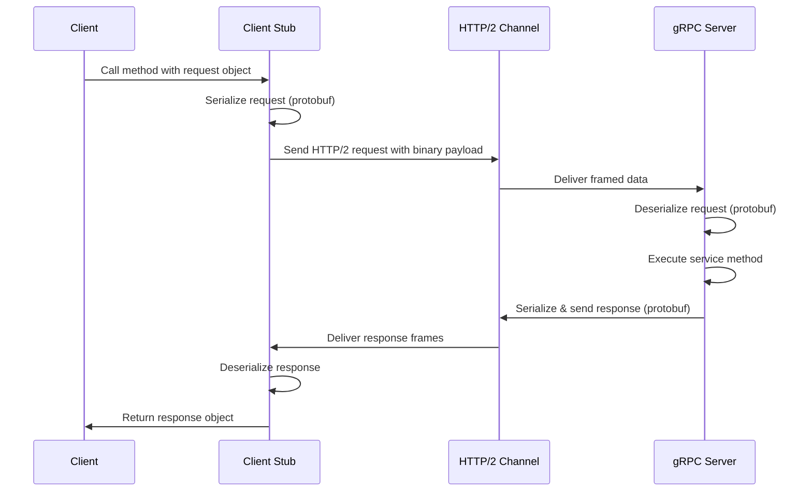
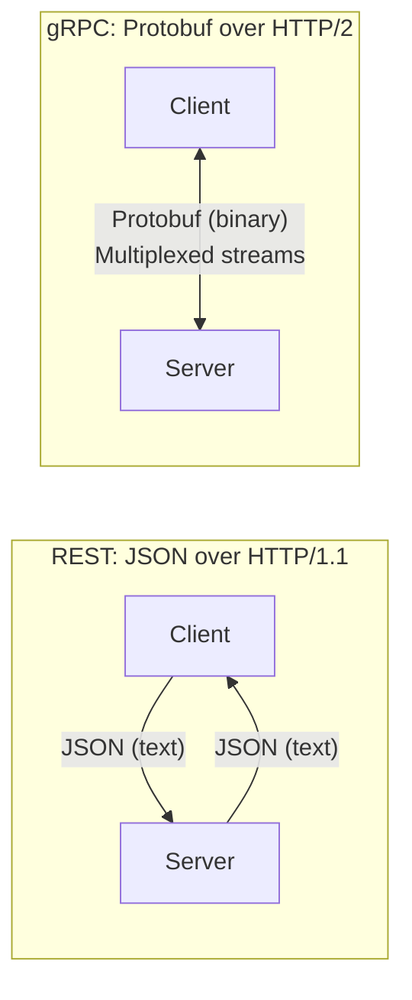
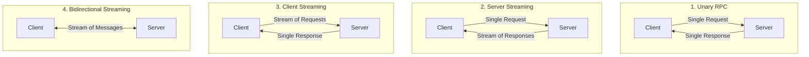
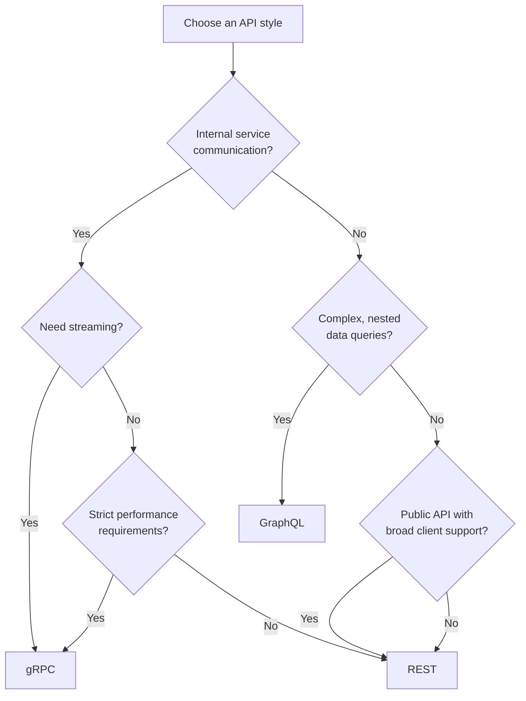
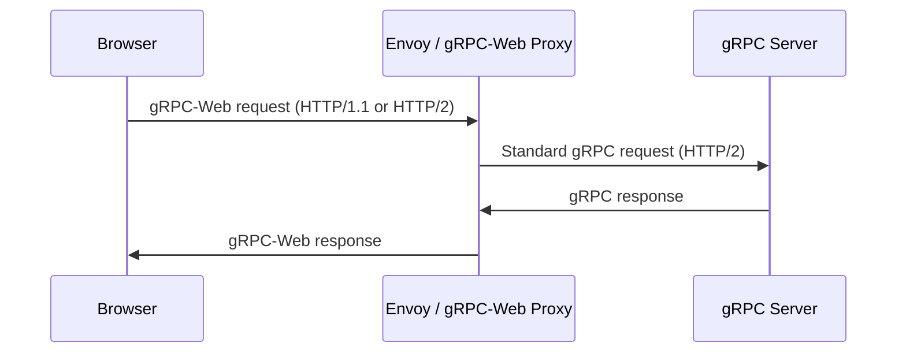

# gRPC

## Table of Contents

1. [What is gRPC](#what-is-grpc)
2. [How gRPC Works](#how-grpc-works)
3. [gRPC vs REST](#grpc-vs-rest)
4. [Protocol Buffers](#protocol-buffers)
5. [Service Definition (.proto Files)](#service-definition-proto-files)
6. [gRPC Communication Patterns](#grpc-communication-patterns)
7. [Code Examples (Node.js)](#code-examples-nodejs)
8. [gRPC with Authentication](#grpc-with-authentication)
9. [Error Handling and Status Codes](#error-handling-and-status-codes)
10. [When to Use gRPC vs REST vs GraphQL](#when-to-use-grpc-vs-rest-vs-graphql)
11. [gRPC-Web for Browser Clients](#grpc-web-for-browser-clients)
12. [Best Practices](#best-practices)
13. [Resources](#resources)

---

## What is gRPC

gRPC (Google Remote Procedure Call) is a high-performance, open-source RPC framework originally developed by Google. It enables client and server applications to communicate transparently and makes it easy to build connected systems across languages and platforms.

**Key characteristics:**

- **Language agnostic** — Official support for C++, Java, Python, Go, Node.js, C#, Ruby, and more.
- **HTTP/2 based** — Leverages multiplexing, header compression, and bidirectional streaming.
- **Protocol Buffers** — Uses protobuf as the default serialization format, which is smaller and faster than JSON.
- **Strongly typed** — Service contracts are defined in `.proto` files, generating type-safe client and server code.
- **Bidirectional streaming** — Supports all four communication patterns (unary, server streaming, client streaming, bidirectional).

gRPC is widely used in microservices architectures, real-time communication systems, and anywhere high throughput and low latency are required.

---

## How gRPC Works

gRPC builds on two foundational technologies: **HTTP/2** and **Protocol Buffers**.



### HTTP/2 Advantages

HTTP/2 provides several features that make gRPC efficient:

| Feature | Benefit |
|---------|---------|
| **Multiplexing** | Multiple RPCs over a single TCP connection |
| **Header compression** (HPACK) | Reduces overhead per request |
| **Binary framing** | More efficient parsing than text-based HTTP/1.1 |
| **Server push** | Server can send data without client requesting it |
| **Flow control** | Per-stream and connection-level flow control |

### Protocol Buffers Serialization

Protocol Buffers produce a compact binary encoding that is significantly smaller and faster to parse than JSON:

```
JSON:  {"name":"Alice","age":30,"email":"alice@example.com"}  → ~52 bytes
Proto: (binary encoding of the same data)                     → ~26 bytes
```

> **Tip:** The binary format is not human-readable. Use tools like `grpcurl` or `grpc-cli` during development to inspect gRPC messages in a readable format.

---

## gRPC vs REST



| Feature | REST | gRPC |
|---------|------|------|
| Protocol | HTTP/1.1 (mostly) | HTTP/2 |
| Payload format | JSON (text) | Protocol Buffers (binary) |
| API contract | OpenAPI/Swagger (optional) | `.proto` files (required) |
| Code generation | Optional (various tools) | Built-in (protoc compiler) |
| Streaming | Limited (SSE, WebSocket separate) | Native (4 patterns) |
| Browser support | Native | Requires gRPC-Web proxy |
| Latency | Higher (text parsing, larger payload) | Lower (binary, multiplexed) |
| Human readability | Easy (JSON is text) | Hard (binary format) |
| Caching | Built-in HTTP caching | No native caching |
| Tooling maturity | Very mature | Growing |
| Learning curve | Low | Moderate to high |

> **Tip:** REST is better for public-facing APIs that need broad client compatibility. gRPC excels in internal microservice communication where performance matters.

---

## Protocol Buffers

Protocol Buffers (protobuf) is a language-neutral, platform-neutral extensible mechanism for serializing structured data. It serves as both the **Interface Definition Language (IDL)** and the **serialization format** for gRPC.

### Proto3 Syntax

```protobuf
// Use proto3 syntax
syntax = "proto3";

// Package declaration prevents naming conflicts
package myapp.users;

// Import other proto files
import "google/protobuf/timestamp.proto";

// Message definition (like a struct or class)
message User {
  int32 id = 1;           // Field number 1
  string name = 2;        // Field number 2
  string email = 3;       // Field number 3
  UserRole role = 4;      // Enum field
  repeated string tags = 5; // List of strings
  optional string bio = 6;  // Optional field
  google.protobuf.Timestamp created_at = 7;
}

// Enum definition
enum UserRole {
  USER_ROLE_UNSPECIFIED = 0; // Must have a zero value
  USER_ROLE_ADMIN = 1;
  USER_ROLE_EDITOR = 2;
  USER_ROLE_VIEWER = 3;
}

// Nested messages
message Address {
  string street = 1;
  string city = 2;
  string state = 3;
  string zip = 4;
}

message UserProfile {
  User user = 1;
  Address address = 2;
  map<string, string> metadata = 3; // Map type
}
```

### Scalar Types

| Proto Type | Go Type | Python Type | Node.js Type | Notes |
|------------|---------|-------------|-------------|-------|
| `double` | `float64` | `float` | `number` | 64-bit floating point |
| `float` | `float32` | `float` | `number` | 32-bit floating point |
| `int32` | `int32` | `int` | `number` | Variable-length encoding |
| `int64` | `int64` | `int/long` | `Long` | Variable-length encoding |
| `bool` | `bool` | `bool` | `boolean` | True or false |
| `string` | `string` | `str` | `string` | UTF-8 or 7-bit ASCII |
| `bytes` | `[]byte` | `bytes` | `Buffer` | Arbitrary byte sequence |

> **Tip:** Field numbers (1, 2, 3...) are part of the binary encoding. Once assigned and deployed, they should never be changed. Numbers 1-15 take one byte to encode, so use them for frequently set fields.

---

## Service Definition (.proto Files)

A gRPC service is defined in a `.proto` file. The `protoc` compiler generates client stubs and server interfaces from it.

```protobuf
syntax = "proto3";

package myapp.users;

// Service definition
service UserService {
  // Unary RPC
  rpc GetUser (GetUserRequest) returns (User);

  // Server streaming RPC
  rpc ListUsers (ListUsersRequest) returns (stream User);

  // Client streaming RPC
  rpc UploadUsers (stream User) returns (UploadUsersResponse);

  // Bidirectional streaming RPC
  rpc Chat (stream ChatMessage) returns (stream ChatMessage);
}

// Request and response messages
message GetUserRequest {
  int32 id = 1;
}

message ListUsersRequest {
  int32 page_size = 1;
  string page_token = 2;
}

message UploadUsersResponse {
  int32 count = 1;
}

message ChatMessage {
  string sender = 1;
  string content = 2;
}
```

To generate code from this file:

```bash
# Install protoc compiler and plugins
npm install grpc-tools grpc_tools_node_protoc_ts

# Generate JavaScript/TypeScript code
grpc_tools_node_protoc \
  --js_out=import_style=commonjs,binary:./generated \
  --grpc_out=grpc_js:./generated \
  --proto_path=./protos \
  user_service.proto
```

---

## gRPC Communication Patterns

gRPC supports four communication patterns, each suited for different use cases.



### 1. Unary RPC

The simplest pattern. The client sends a single request and receives a single response, similar to a normal function call.

```
Client ──request──>  Server
Client <──response── Server
```

**Use cases:** Fetching a single resource, authentication, simple CRUD operations.

### 2. Server Streaming RPC

The client sends a single request, and the server returns a stream of responses. The client reads from the stream until there are no more messages.

```
Client ──request──────>  Server
Client <──response 1──── Server
Client <──response 2──── Server
Client <──response 3──── Server
Client <──(end)────────── Server
```

**Use cases:** Downloading large datasets, real-time feeds, search results.

### 3. Client Streaming RPC

The client sends a stream of requests to the server. After the client finishes sending, it waits for the server to read them all and return a single response.

```
Client ──request 1──>  Server
Client ──request 2──>  Server
Client ──request 3──>  Server
Client ──(end)──────>  Server
Client <──response──── Server
```

**Use cases:** File upload, aggregating sensor data, batch operations.

### 4. Bidirectional Streaming RPC

Both the client and server send a stream of messages. The two streams operate independently, so the client and server can read and write in any order.

```
Client ──message──>  Server
Client <──message──  Server
Client ──message──>  Server
Client ──message──>  Server
Client <──message──  Server
```

**Use cases:** Chat applications, collaborative editing, gaming, real-time dashboards.

---

## Code Examples (Node.js)

### Project Setup

```bash
mkdir grpc-demo && cd grpc-demo
npm init -y
npm install @grpc/grpc-js @grpc/proto-loader
```

### Proto File (user.proto)

```protobuf
syntax = "proto3";

package users;

service UserService {
  rpc GetUser (GetUserRequest) returns (UserResponse);
  rpc ListUsers (ListUsersRequest) returns (stream UserResponse);
}

message GetUserRequest {
  int32 id = 1;
}

message ListUsersRequest {
  int32 page_size = 1;
}

message UserResponse {
  int32 id = 1;
  string name = 2;
  string email = 3;
}
```

### Server Implementation

```javascript
const grpc = require("@grpc/grpc-js");
const protoLoader = require("@grpc/proto-loader");

// Load proto file
const packageDef = protoLoader.loadSync("user.proto", {
  keepCase: true,
  longs: String,
  enums: String,
  defaults: true,
  oneofs: true,
});

const proto = grpc.loadPackageDefinition(packageDef).users;

// Mock data
const users = [
  { id: 1, name: "Alice", email: "alice@example.com" },
  { id: 2, name: "Bob", email: "bob@example.com" },
  { id: 3, name: "Charlie", email: "charlie@example.com" },
];

// Unary RPC implementation
function getUser(call, callback) {
  const user = users.find((u) => u.id === call.request.id);
  if (!user) {
    return callback({
      code: grpc.status.NOT_FOUND,
      message: `User with id ${call.request.id} not found`,
    });
  }
  callback(null, user);
}

// Server streaming RPC implementation
function listUsers(call) {
  const pageSize = call.request.page_size || users.length;
  users.slice(0, pageSize).forEach((user) => {
    call.write(user);
  });
  call.end();
}

// Start the server
function main() {
  const server = new grpc.Server();
  server.addService(proto.UserService.service, {
    GetUser: getUser,
    ListUsers: listUsers,
  });
  server.bindAsync(
    "0.0.0.0:50051",
    grpc.ServerCredentials.createInsecure(),
    (err, port) => {
      if (err) throw err;
      console.log(`gRPC server running on port ${port}`);
    }
  );
}

main();
```

### Client Implementation

```javascript
const grpc = require("@grpc/grpc-js");
const protoLoader = require("@grpc/proto-loader");

const packageDef = protoLoader.loadSync("user.proto", {
  keepCase: true,
  longs: String,
  enums: String,
  defaults: true,
  oneofs: true,
});

const proto = grpc.loadPackageDefinition(packageDef).users;

const client = new proto.UserService(
  "localhost:50051",
  grpc.credentials.createInsecure()
);

// Unary call
client.GetUser({ id: 1 }, (err, response) => {
  if (err) {
    console.error("Error:", err.message);
    return;
  }
  console.log("User:", response);
});

// Server streaming call
const stream = client.ListUsers({ page_size: 10 });
stream.on("data", (user) => {
  console.log("Received user:", user);
});
stream.on("end", () => {
  console.log("Stream ended");
});
stream.on("error", (err) => {
  console.error("Stream error:", err.message);
});
```

---

## gRPC with Authentication

### SSL/TLS Encryption

```javascript
// Server with TLS
const fs = require("fs");

const serverCredentials = grpc.ServerCredentials.createSsl(
  fs.readFileSync("ca.crt"),   // CA certificate
  [
    {
      cert_chain: fs.readFileSync("server.crt"),
      private_key: fs.readFileSync("server.key"),
    },
  ],
  true // Request client certificate (mutual TLS)
);

server.bindAsync("0.0.0.0:50051", serverCredentials, (err, port) => {
  if (err) throw err;
  console.log(`Secure gRPC server running on port ${port}`);
});

// Client with TLS
const channelCredentials = grpc.credentials.createSsl(
  fs.readFileSync("ca.crt"),
  fs.readFileSync("client.key"),
  fs.readFileSync("client.crt")
);

const client = new proto.UserService("localhost:50051", channelCredentials);
```

### Token-Based Authentication (Interceptors)

```javascript
// Client interceptor to attach token
const metadata = new grpc.Metadata();
metadata.add("authorization", "Bearer my-jwt-token");

client.GetUser({ id: 1 }, metadata, (err, response) => {
  console.log("Authenticated response:", response);
});

// Server interceptor to verify token
function authInterceptor(methodDescriptor, call) {
  return new grpc.ServerInterceptingCall(call, {
    start: (next, metadata, listener) => {
      const token = metadata.get("authorization")[0];
      if (!token || !token.startsWith("Bearer ")) {
        call.sendStatus({
          code: grpc.status.UNAUTHENTICATED,
          details: "Missing or invalid authentication token",
        });
        return;
      }
      // Verify token here...
      next(metadata, listener);
    },
  });
}
```

---

## Error Handling and Status Codes

gRPC defines a standard set of status codes that all implementations use, regardless of language.

| Code | Name | Description |
|------|------|-------------|
| 0 | `OK` | Success |
| 1 | `CANCELLED` | Operation was cancelled by the caller |
| 2 | `UNKNOWN` | Unknown error (e.g., unhandled exception) |
| 3 | `INVALID_ARGUMENT` | Client specified an invalid argument |
| 4 | `DEADLINE_EXCEEDED` | Timeout before operation completed |
| 5 | `NOT_FOUND` | Requested resource was not found |
| 6 | `ALREADY_EXISTS` | Resource already exists |
| 7 | `PERMISSION_DENIED` | Caller does not have permission |
| 8 | `RESOURCE_EXHAUSTED` | Rate limit or quota exceeded |
| 9 | `FAILED_PRECONDITION` | Operation rejected due to system state |
| 10 | `ABORTED` | Operation aborted (e.g., concurrency conflict) |
| 11 | `OUT_OF_RANGE` | Value out of valid range |
| 12 | `UNIMPLEMENTED` | Method not implemented by the server |
| 13 | `INTERNAL` | Internal server error |
| 14 | `UNAVAILABLE` | Service temporarily unavailable (retry) |
| 16 | `UNAUTHENTICATED` | Caller is not authenticated |

**Returning errors from the server:**

```javascript
function getUser(call, callback) {
  const user = users.find((u) => u.id === call.request.id);

  if (!user) {
    return callback({
      code: grpc.status.NOT_FOUND,
      message: `User ${call.request.id} not found`,
    });
  }

  if (!call.request.id) {
    return callback({
      code: grpc.status.INVALID_ARGUMENT,
      message: "User ID is required",
    });
  }

  callback(null, user);
}
```

**Handling errors on the client:**

```javascript
client.GetUser({ id: 999 }, (err, response) => {
  if (err) {
    switch (err.code) {
      case grpc.status.NOT_FOUND:
        console.log("User not found");
        break;
      case grpc.status.UNAVAILABLE:
        console.log("Service unavailable, retrying...");
        break;
      default:
        console.error("Unexpected error:", err.message);
    }
    return;
  }
  console.log("User:", response);
});
```

> **Tip:** Always use the most specific status code. Avoid returning `UNKNOWN` or `INTERNAL` for errors that have a more appropriate code. This helps clients handle errors programmatically.

---

## When to Use gRPC vs REST vs GraphQL

| Criteria | gRPC | REST | GraphQL |
|----------|------|------|---------|
| **Best for** | Microservices, internal APIs | Public APIs, CRUD | Complex client data needs |
| **Performance** | Highest (binary, HTTP/2) | Good | Moderate |
| **Browser support** | Requires proxy (gRPC-Web) | Native | Native |
| **Streaming** | Full support (4 patterns) | Limited | Subscriptions only |
| **Schema** | Required (.proto) | Optional (OpenAPI) | Required (SDL) |
| **Code generation** | Built-in | External tools | External tools |
| **Caching** | Manual | HTTP caching | Manual |
| **Real-time** | Native streaming | SSE/WebSocket needed | Subscriptions |
| **File uploads** | Supported via streaming | Native multipart | Separate spec |



---

## gRPC-Web for Browser Clients

Browsers cannot use gRPC directly because they lack HTTP/2 trailer support and cannot control the binary framing. **gRPC-Web** is a JavaScript client library that bridges this gap using a proxy.



**How it works:**

1. The browser sends a gRPC-Web request (a modified version of the gRPC protocol that works over HTTP/1.1).
2. A proxy (typically **Envoy**) translates it into a standard gRPC call.
3. The proxy forwards the response back to the browser in gRPC-Web format.

**Limitations of gRPC-Web:**

- Only **unary** and **server streaming** RPCs are supported (no client or bidirectional streaming).
- Requires a proxy layer (adds operational complexity).
- Payload is Base64-encoded over HTTP/1.1, reducing the binary efficiency advantage.

```bash
# Install gRPC-Web client
npm install grpc-web google-protobuf
```

---

## Best Practices

1. **Design proto files carefully** — Field numbers are permanent. Use reserved numbers for removed fields to prevent future conflicts.

   ```protobuf
   message User {
     reserved 4, 8;              // Reserved field numbers
     reserved "phone", "fax";    // Reserved field names
     int32 id = 1;
     string name = 2;
   }
   ```

2. **Use deadlines** — Always set a deadline (timeout) on RPC calls to prevent hanging requests.

   ```javascript
   const deadline = new Date();
   deadline.setSeconds(deadline.getSeconds() + 5); // 5-second deadline
   client.GetUser({ id: 1 }, { deadline }, callback);
   ```

3. **Handle streaming lifecycle** — Always listen for `error`, `end`, and `status` events on streams.

4. **Use pagination for large results** — Return a `page_token` in responses and accept it in subsequent requests instead of streaming unbounded data.

5. **Version via package names** — Use `package myapp.v1;` and `package myapp.v2;` rather than changing existing messages.

6. **Keep messages small** — Avoid sending large payloads (>4 MB default limit). Use streaming for large data transfers.

7. **Use health checks** — Implement the [gRPC Health Checking Protocol](https://github.com/grpc/grpc/blob/master/doc/health-checking.md) for load balancers and orchestrators.

8. **Enable reflection in development** — gRPC server reflection lets tools like `grpcurl` discover services without `.proto` files.

9. **Use interceptors for cross-cutting concerns** — Logging, authentication, metrics, and tracing should be handled via interceptors, not in service methods.

10. **Prefer `oneof` for mutually exclusive fields** — This enforces that only one of the fields is set at a time.

    ```protobuf
    message SearchRequest {
      oneof query {
        string text_query = 1;
        int32 id_query = 2;
      }
    }
    ```

---

## Resources

- [gRPC Official Documentation](https://grpc.io/docs/) — Comprehensive guides and tutorials.
- [Protocol Buffers Language Guide (proto3)](https://protobuf.dev/programming-guides/proto3/) — Full proto3 syntax reference.
- [gRPC Node.js Tutorial](https://grpc.io/docs/languages/node/) — Official Node.js quickstart.
- [Awesome gRPC](https://github.com/grpc-ecosystem/awesome-grpc) — Curated list of gRPC resources and tools.
- [gRPC-Web GitHub](https://github.com/grpc/grpc-web) — Browser client for gRPC services.
- [BloomRPC](https://github.com/bloomrpc/bloomrpc) — GUI client for testing gRPC services.
- [grpcurl](https://github.com/fullstorydev/grpcurl) — Command-line tool for interacting with gRPC servers.
- [gRPC Status Codes](https://grpc.github.io/grpc/core/md_doc_statuscodes.html) — Official status code reference.
- [Google API Design Guide](https://cloud.google.com/apis/design) — Best practices for designing gRPC APIs.
