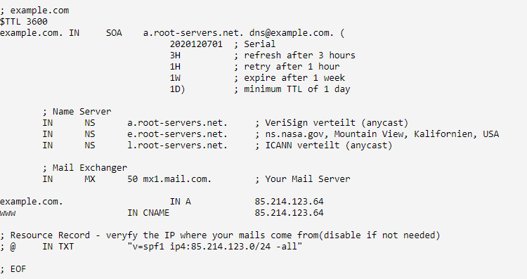
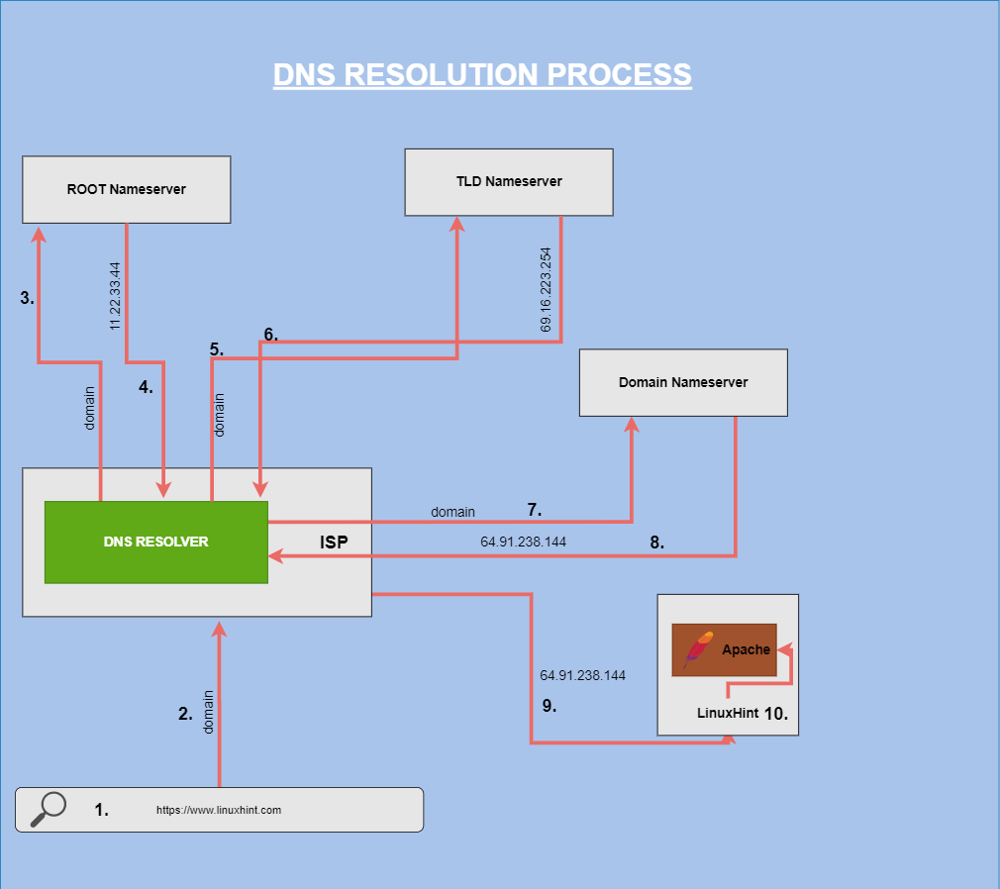
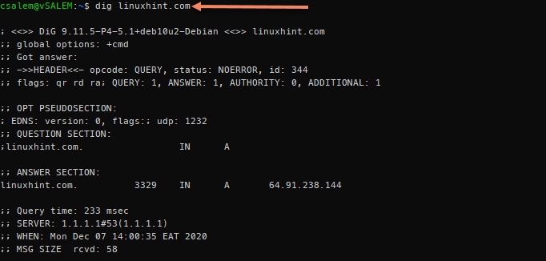
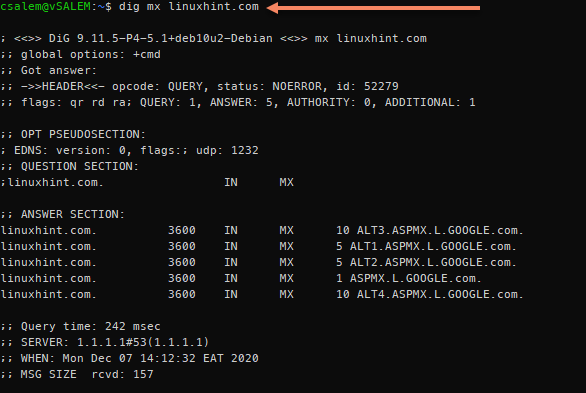

# Dns and How It Works?

_© 2020 [John Otieno](https://linuxhint.com/author/otienojohn/) @ [linuxhint.com](https://linuxhint.com/), all rights reserved_

---

## Contents

1.  [Introduction](#introduction)
2.  [What is DNS?](#what-is-dns)
3.  [How DNS Works?](#how-dns-works)
4.  [1: Domain Names](#domain-names)
5.  [2: Nameservers](#nameservers)
6.  [3: DNS Records and Zone Files](#dns-records-and-zone-files)
7.  [4: DNS Resolution](#dns-resolution)
8.  [Types of DNS Records](#types-of-dns-records)
9.  [AXFR Records](#axfr-records)
10. [CNAME Records](#cname-records)
11. [CAA Records](#caa-records)
12. [DKIM Records](#dkim-recordsw)
13. [MX Records](#mx-records)
14. [NS Records](#ns-records)
15. [PTR Records](#ptr-records)
16. [SOA Records](#soa-records)
17. [TXT Records](#txt-records)
18. [SPF Records](#spf-records)
19. [SRV Records](#srv-records)
20. [Quick Dig Guide](#quick-dig-guide)
21. [Installing Dig](#installing-dig)
22. [Using Dig](#using-dig)
23. [Conclusion](#conclusion)

## Introduction

_**Domain Name Systems,**_ or _**DNS**_, is an essential part of configuring networks, websites, and servers.

When you learn how DNS works and how you can apply its use to real-life networks, diagnosing network problems becomes a breeze. Moreover, mastering the ins and outs of working with DNS will also give you a deep understanding of what goes on behind the scenes of DNS lookup and validations.

This tutorial will help you learn fundamental DNS concepts that will help you get started with DNS configuration. After reading this guide, you should be able to modify DNS on your local system or even set up a personal DNS server.

Before we dive into how to setup DNS servers and resolve domains, let’s go over some basic DNS concepts that’ll help you understand what DNS is and how it works.

## What is DNS?

DNS or [Domain Name System](https://en.wikipedia.org/wiki/Domain_Name_System) is a database of Internet addresses indexed by domain names. For simplicity, think of DNS as an address book that forwards web traffic from a server to a client.

DNS maps recognized domain names, such as linuxhint.com, to its IP address such as `**64.91.238.144**` (IPv4) or `**0:0:0:0:0:ffff:405b:ee90**` (IPv6).

## How DNS Works?

Before discussing how to add and modify DNS records, let’s go over how DNS works, starting with defining some basic DNS features:

### Domain Names

We can define Domain names as a unique string of characters that identifies an object within the internet. The object could represent a website, an IoT interface, etc.

The best way to understand domain names is by reading them, starting from right towards the left. Comprehensive domain organization starts from the right and develops more specificity towards the left.

Consider the example domains shown below:

**linuxhint.com**

**mail.info.linuxhint.com**

In the examples above, the domains are best understood from right to left, with the TLD or Top-Level domain being **.com**

Other terms that appear on the left of the TLD are separated by a period and are considered specific subdomains.

For example:

In this case, **mail.linuxhint.com** can only be used to handle mail for the specific domain. When referring to domains (main), it includes the first-level subdomain plus the TLD such as **linuxhint.com**

As you move to the left of the TLD, **info,** and **mail** are referred to as second and third-level subdomains, correspondingly.

In most cases, subdomains are used to identify specific services or machines. However, domain owners can use them in any way they see fit.

### Nameservers

Nameservers are servers connected to the internet and used to handle queries about the location of a domain name and its services.

Selecting and setting up name servers is an important responsibility of being a domain owner. That’s because if you do fail to set up name servers, devices that want to connect to your domain will be unable to know where to find the DNS information for your domain, leading to failed DNS domain resolve.

Name servers use a text file called a zone file to host a domain’s DNS data. Zone files are sometimes called Start of Authority Records (SOA). You can host DNS information on name servers:

- Provided by your domain registrar

- Your own DNS Server

- CDN hostings such as Cloudflare and any other third-party hosting

Options such as hosting your DNS information on your own DNS server provide more control of the DNS process than most other options.

### DNS Records and Zone Files

Another important DNS management concept is working with DNS records. These records help map domain names to their respective IP addresses and are bundled together to create a zone file. Devices can look up the correct IP address for your domain using the DNS zone files.

Here’s an example of a DNS zone file:

In every DNS zone file, you will find default entries such as the administrator’s email, DNS records, and name servers. You are not limited to these default entries; you are allowed to create any number of DNS records for any subdomains possible.

### DNS Resolution

The simplest way to understand how DNS works is by learning DNS resolution.

Let’s talk about that:

A domain name needs to be translated from a human-readable format, like linuxhint.com, to an IP address. That’s because machines only understand IP addresses, not domain names.

As we have mentioned, this happens using the text zone file that stores a list of domains and their IP addresses.

Thus:

When you type a domain name such as linuxhint.com into your browser, your internet-connected device uses your ISP DNS resolver to query the root nameserver for the correct TLD nameserver.

Think of it as your computer asking the resolver, “where can I find the nameserver for .com domains?”

The root nameserver then replies with an IP address for the specified TLD. The DNS resolver uses the zone files from the domain’s nameserver to read which IP address points to the domain required.

Once the ISP reads the domain’s IP address, for example, linuxhint.com, it replies to your browser, allowing you to access the webserver.

It’s good to note that the DNS resolution process only happens if the ISP DNS resolver has no record of the domain requested. In most cases, ISP performs DNS cache for previously queried domains, which leads to faster DNS lookups and less strain on the DNS servers.

Although caching is a good thing, it can sometimes lead to issues, especially DNS information changes. You can use TTL or Time to Live to see the time it takes for a DNS to resolve.

Since you now know how DNS works, let’s discuss the types of DNS records.

## Types of DNS Records

Here’re the main types of DNS records:

**A and AAAA Records**

The type _A DNS_ record is an IPv4 DNS record used to point to your server’s IP address, allowing web traffic to get to your server.

Here’s an example of a type A DNS record:

**linuxhint.com** **A** **64.91.238.144**

**mail.linuxhint.com** **A** **64.91.238.144**

DNS rules allow the pointing of multiple subdomains to varying IP addresses. You can also point all subdomains to a single IP address. For example. Point all subdomains for linuxhint.com to a single IP using an asterisk:

**\*.linuxhint.com A 64.91.238.144**

The _AAAA_ type record is similar to A record but is used for IPv6 IP addresses. A typical AAAA record may look similar to:

**linuxhint.com AAAA 0456:7890:13ab:cdef:0145:5567:59ab:cdef**

## AXFR Records

An _AXFR_ record is a DNS record used in DNS replication. AXFR records mainly apply to slave DNS servers where they help replicate zone files from master DNS servers. You will rarely find AXFR records in master zone files.

It’s good to note that they are more efficient and modern ways to perform DNS replication other than using AXFR records.

## CNAME Records

A _CNAME_ or _Canonical Name Record_ matches a domain to another domain. CNAME records allow DNS lookups to utilize the target domain’s DNS resolve as an alias resolution. Consider the example below:

**aliasaddress.com CNAME linuxhint.com.**

**linuxhint.com A 64.91.238.144**

From the record:

Once the DNS lookup for alias address.com gets performed, the process encounters a CNAME record that points to another address—in this case, linuxhint.com.

It will initiate a new DNS lookup for the target address (linuxhint.com), which discovers the IP address of 64.91.238.144, thus directing the traffic to the IP address 64.91.238.144.

The main purpose of CNAME records is to allow domains to have aliases.

**NOTE:** Some mail servers use CNAME records to get mail. Therefore, it’s good to avoid using CNAME records for a domain designed to get mail.

Similarly, you cannot use MX records to reference CNAME defined hostnames. It’s also good to ensure that target domains contain an A-record resolution.

Although CNAME records can be an effective way to redirect traffic from a specific domain to another domain, the record does not function as HTTP 302 redirect.

## CAA Records

CAA records allow domain owners to determine which certificate authorities can issue certificates for that specific domain.

## DKIM Records

_DKIM_ or _Domain Keys Identified Mail Record_ shows the public keys used to authenticate messages signed by the DKIM protocol. It enhances the functionality of checking the authenticity of mail.

A typical DKIM record may look as follows:

**selector1.\_domainkey.linuxhint.com TXT k=rsa;p=J7eTBu445i045iK**

DKIM DNS records are applied as TXT record type. They get created from a subdomain with a unique selector for that specific key followed by a period, ending with **\_domainkey.domain.com** (linuxhint.com).

From the example above, we see the DKIM record of type TXT, a value that shows the key type (RSA), and finally, the key value.

## MX Records

MX or Mail Exchanger records help set the mail delivery destinations for a specific domain or subdomains.

Here’s an example of an MX record:

**linuxhint.com MX preference = 5, mail exchanger = ALT1.ASPMX.L.GOOGLE.com**

**linuxhint.com MX preference = 1, mail exchanger = ASPMX.L.GOOGLE.com**

**linuxhint.com MX preference = 5, mail exchanger = ALT2.ASPMX.L.GOOGLE.com**

**linuxhint.com MX preference = 10, mail exchanger = ALT4.ASPMX.L.GOOGLE.com**

**linuxhint.com MX preference = 10, mail exchanger = ALT3.ASPMX.L.GOOGLE.com**

The record in the example above directs mail for domain (linuxhint.com) to the server ALT1.ASPMX.L.GOOGLE.COM

Priority or preference is a key component of MX records. It is used to represent the number written between the record type and the target server. Low numbers are used to indicate higher priority.

For example, if server **ASPMX.L.GOOGLE.COM** is down, the mail gets delivered to **ALT1.ASPMX.L.GOOGLE.COM or ALT2.ASPMX.L.GOOGLE.COM**

## NS Records

NS or Nameserver records are the most common type of DNS records.

They are used to set the nameservers for a domain or subdomain. By default, the NS records for a domain are set both in your zone file and the domain registrar.

Here’s an example of NS records:

**linuxhint.com nameserver = ns1.liquidweb.com**

**linuxhint.com nameserver = ns.liquidweb.com**

Nameservers set at the domain registrar are responsible for carrying the zone file for the domain.

You can also add more than nameservers for your domain and subdomains. NS records for subdomains are configured in the primary domain zone file.

Primary nameservers are configured at the domain registrar. Secondary domain nameservers are configured at the primary domain’s zone file. NS records order does not matter because DNS requests get sent in a random pattern to different servers. This ensures that if one host fails to respond, the other hosts will get queried.

## PTR Records

PTR records, also called pointer records, are used for a reverse DNS lookup. They mainly match an IP address to a domain or a subdomain. You can consider the PTR record the opposite of A or AAAA records; its functions are opposite to those of the A record.

An A record allows you to look up a domain related to a specific IP address. On the other hand, PTR records allow you to look up the IP address associated with a specific domain name. These records are mainly set by a hosting provider and are not included in your zone file.

You must create a valid A record that points the domain to the target IP address before creating a PTR record. Use A record for IPv4 address and AAAA for IPv6 addresses.

DNS rules allow you to have different IP addresses, both IPv4 and IPv6 pointing to the same domain set for reverse DNS by configuring multiple A and AAAA records for a specific domain pointing to various IP addresses.

## SOA Records

SOA or Start of Authority records is used by DNS to label a zone file with the host’s name where it was originally created. It also displays the email address of the individual who owns the domain.

Here’s an example of a typical SOA record:

**@ IN SOA ns.liquidweb.com. admin.liquidweb.com. 20200627 14000 14000 1009600**

**86400**

**NOTE:** The administrative email is expressed using a period (.) and not an @ symbol.

SOA records include the following values:

- **Serial Number:** This represents the revision number for the domain’s zone file; the value changes once a file gets restructured.

- **Refresh Time:** Represents the total amount of time a secondary DNS server keeps the server before updating it to the latest changes. The value is represented in seconds.

- **Retry Time:** Represents the amount of time a secondary DNS server waits before retrying for a failed zone file transfer.

- **Expire Time:** This shows the amount of time a server waits before expiring and copying a zone file if updating the file fails.

- **Minimum Time to Live:** This shows the min amount of time other servers keep the zone file’s cached information.

The name server stated in the SOA record is regarded as the primary master for use in the Dynamic DNS. The Dynamic DNS is the server where zone file updates get completed before being propagated to other nameservers.

## TXT Records

A Text or TXT record is used to provide information about a specific domain to other network resources. TXT records are a very flexible record type. They can serve a wide range of operations depending on the contents of a specific text value.

One common use of TXT records is creating DKIM records and SPF records. Here is an example of a TXT record:

**linuxhint.com text =**

**“google-site-verification=tf_9zclZLNBJ5M…XXX…\_0nSA”**

## SPF Records

Sender Policy Framework records the list for the mail servers of a specific domain or subdomain. SPF records help prove a mail server’s authenticity by flagging spoofing attempts deployed using the common method of faking email headers for a specific domain, making it look like it originates from a legit server, thus evading filters.

Here’s an example of an SPF record:

**linuxhint.com TXT “v=spf1 a ~all”**

It is recommended to list all the servers in the SPF record you use to send mail and exclude the others.

The SPF record mainly has a domain, type (TXT or SPF if supported), and a value starting with v=spf1, which contains SPF record settings.

To ensure your emails don’t get flagged as spam, ensure the SPF records are not too strict or exclude the server you use to send emails.

## SRV Records

Service records or SRV help match services running on a domain to target domains, allowing you to direct traffic from specific services to another.

Here’s an example of an SRV record:

**\_service.\_protocol.linuxhint.com SRV 10 0 8080**

**service.linuxhint.com**

SRV records have the following elements:

- **Service:** This indicates the service name, which starts with an underscore, the name, and ends with a period.

- **Protocol:** This is the name of the protocol. It also has an underscore at the beginning of its name and ending with a period symbol. Example: **\_tcp or \_udp**

- **Domain:** This is the domain name receiving the initial traffic before forwarding.

- **Priority:** This sets the priority for the target domain. You are allowed to set multiple targets having different priorities, thus allowing you to have a fallback if a server fails.

- **Port:** This is the port where the service is running. TCP or UDP port.

- **Target:** Refers to the target domain. Ensure the domain has an A record that resolves to its target IP address.

- **The target domain or subdomain:** This domain must have an A or AAAA record that resolves to an IP address.

## Quick Dig Guide

Using a manual query tool is one of the best ways to understand and work with DNS. Let’s go over how to install and perform simple DNS queries using the Dig tool.

You can use additional tools such as **nslookup.**

## Installing Dig

Dig is a command-line utility used to perform manual DNS queries and DNS diagnostics.

Before we can use dig, we need to install it. Dig is a part of DNS utilities in the Bind DNS server package, and you can install these packages using the package manager for your distribution.

## Debian & Ubuntu

**apt-get install dnsutils**

## CentOS

**yum install bind-utils**

## Using Dig

Consider the following simple dig output.

From the above query, dig returns a NOERROR result and retrieves the A DNS record for the domain name linuxhint.com, which resolves to the IP address of 64.91.238.144.

Using dig, you can see more information, plus the DNS resolver used (1.1.1.1 – Cloudflare), the amount of time a DNS query takes to complete, as well as the query size.

## Use dig to Retrieve Different Record Types

You can use dig to retrieve information about specific DNS records by specifying the DNS record type in the command.

Consider the displayed output below:

A dig is a popular tool that can be very helpful when you’re working with DNS. You can learn more from its manual or a tutorial.

## Conclusion

In this article, we have learned what DNS is and how it works. We have covered important DNS concepts such as Domain names, DNS resolution and records, and how to use the Dig tool to examine DNS.

Using this guide, you should be in a position to manage and configure basic DNS functionalities.
