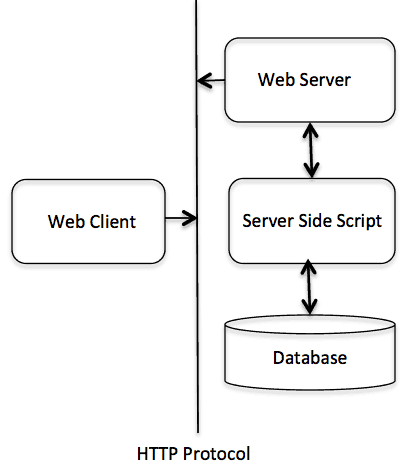

# What is HTTP?

_© [tutorialspoint](https://www.tutorialspoint.com/http/index.htm), all rights reserved_

---

# Contents

1.  [Introduction](#introduction)
2.  [Overview](#overview)
3.  [Parameters](#parameters)
4.  [Messages](#messages)
5.  [Requests](#requests)
6.  [Responses](#responses)
7.  [Methods](#methods)
8.  [Status Codes](#status-codes)
9.  [Header Fields](#header-fields)
10. [Caching](#caching)
11. [URL Encoding](#url-encoding)
12. [Security](#security)
13. [Message Examples](#message-examples)

## Introduction

The Hypertext Transfer Protocol (HTTP) is an application-level protocol for distributed, collaborative, hypermedia information systems. This is the foundation for data communication for the World Wide Web (i.e. internet) since 1990. HTTP is a generic and stateless protocol which can be used for other purposes as well using extensions of its request methods, error codes, and headers.

This tutorial is based on RFC-2616 specification, which defines the protocol referred to as HTTP/1.1. HTTP/1.1 is a revision of the original HTTP (HTTP/1.0). A major difference between HTTP/1.0 and HTTP/1.1 is that HTTP/1.0 uses a new connection for each request/response exchange, where as HTTP/1.1 connection may be used for one or more request/response exchanges.

## Overview

Basically, HTTP is a TCP/IP based communication protocol, that is used to deliver data (HTML files, image files, query results, etc.) on the World Wide Web. The default port is TCP 80, but other ports can be used as well. It provides a standardized way for computers to communicate with each other. HTTP specification specifies how clients' request data will be constructed and sent to the server, and how the servers respond to these requests.

**Basic Features**  
There are three basic features that make HTTP a simple but powerful protocol:

- **HTTP is connectionless:** The HTTP client, i.e., a browser initiates an HTTP request and after a request is made, the client waits for the response. The server processes the request and sends a response back after which client disconnect the connection. So client and server knows about each other during current request and response only. Further requests are made on new connection like client and server are new to each other.
- **HTTP is media independent:** It means, any type of data can be sent by HTTP as long as both the client and the server know how to handle the data content. It is required for the client as well as the server to specify the content type using appropriate MIME-type.
- **HTTP is stateless:** As mentioned above, HTTP is connectionless and it is a direct result of HTTP being a stateless protocol. The server and client are aware of each other only during a current request. Afterwards, both of them forget about each other. Due to this nature of the protocol, neither the client nor the browser can retain information between different requests across the web pages.

> HTTP/1.0 uses a new connection for each request/response exchange, where as  
> HTTP/1.1 connection may be used for one or more request/response exchanges.

**Basic Architecture**  
The following diagram shows a very basic architecture of a web application and depicts where HTTP sits:



The HTTP protocol is a request/response protocol based on the client/server based architecture where web browsers, robots and search engines, etc. act like HTTP clients, and the Web server acts as a server.

**Client**  
The HTTP client sends a request to the server in the form of a request method, URI, and protocol version, followed by a MIME-like message containing request modifiers, client information, and possible body content over a TCP/IP connection.

**Server**  
The HTTP server responds with a status line, including the message's protocol version and a success or error code, followed by a MIME-like message containing server information, entity meta information, and possible entity-body content.

## Parameters

This chapter is going to list down few of the important HTTP Protocol Parameters and their syntax the way they are used in the communication. For example, format for date, format of URL, etc. This will help you in constructing your request and response messages while writing HTTP client or server programs. You will see the complete usage of these parameters in subsequent chapters while learning the message structure for HTTP requests and responses.

### HTTP Version

HTTP uses a `<major>.<minor>` numbering scheme to indicate versions of the protocol. The version of an HTTP message is indicated by an HTTP-Version field in the first line. Here is the general syntax of specifying HTTP version number:

> HTTP-Version = "HTTP" "/" 1*DIGIT "." 1*DIGIT

Example

> HTTP/1.0
>
> or
>
> HTTP/1.1

### Uniform Resource Identifiers

Uniform Resource Identifiers (URI) are simply formatted, case-insensitive string containing name, location, etc. to identify a resource, for example, a website, a web service, etc. A general syntax of URI used for HTTP is as follows:

> URI = "http:" "//" host [ ":" port ] [ abs_path [ "?" query ]]

Here if the **port** is empty or not given, port 80 is assumed for HTTP and an empty **abs_path** is equivalent to an **abs_path** of "/". The characters other than those in the **reserved** and **unsafe** sets are equivalent to their ""%" HEX HEX" encoding.

Example

The following three URIs are equivalent:

> http://abc.com:80/~smith/home.html  
> http://ABC.com/%7Esmith/home.html  
> http://ABC.com:/%7esmith/home.html

### Date/Time Formats

All HTTP date/time stamps MUST be represented in Greenwich Mean Time (GMT), without exception. HTTP applications are allowed to use any of the following three representations of date/time stamps:

> `Sun, 06 Nov 1994 08:49:37 GMT ; RFC 822, updated by RFC 1123`  
> `Sunday, 06-Nov-94 08:49:37 GMT ; RFC 850, obsoleted by RFC 1036 `  
> `Sun Nov 6 08:49:37 1994 ; ANSI C's asctime() format`

### Character Sets

We use character sets to specify the character sets that the client prefers. Multiple character sets can be listed separated by commas. If a value is not specified, the default is the US-ASCII.

Example
Following are the valid character sets:

> US-ASCII
>
> or
>
> ISO-8859-1
>
> or
>
> ISO-8859-7

### Content Encodings

A content encoding value indicates that an encoding algorithm has been used to encode the content before passing it over the network. Content coding are primarily used to allow a document to be compressed or otherwise usefully transformed without losing the identity.

All content-coding values are case-insensitive. HTTP/1.1 uses content-coding values in the Accept-Encoding and Content-Encoding header fields which we will see in the subsequent chapters.

Example
Following are the valid encoding schemes:

> Accept-encoding: gzip
>
> or
>
> Accept-encoding: compress
>
> or
>
> Accept-encoding: deflate

### Media Types

HTTP uses Internet Media Types in the **Content-Type** and **Accept** header fields in order to provide open and extensible data typing and type negotiation. All the Media-type values are registered with the Internet Assigned Number Authority (IANA). The general syntax to specify media type is as follows:

> media-type = type "/" subtype \*( ";" parameter )

The type, subtype, and parameter attribute names are case--insensitive.

Example

> Accept: image/gif

### Language Tags

HTTP uses language tags within the **Accept-Language** and **Content-Language** fields. A language tag is composed of one or more parts: a primary language tag and a possibly empty series of subtags:

> language-tag = primary-tag \*( "-" subtag )

White spaces are not allowed within the tag and all tags are case- insensitive.

Example
Example tags include:

> en, en-US, en-cockney, i-cherokee, x-pig-latin

where any two-letter primary-tag is an ISO-639 language abbreviation and any two-letter initial subtag is an ISO-3166 country code.

## Messages

HTTP is based on the client-server architecture model and a stateless request/response protocol that operates by exchanging messages across a reliable TCP/IP connection.

An HTTP "client" is a program (Web browser or any other client) that establishes a connection to a server for the purpose of sending one or more HTTP request messages. An HTTP "server" is a program ( generally a web server like Apache Web Server or Internet Information Services IIS, etc. ) that accepts connections in order to serve HTTP requests by sending HTTP response messages.

HTTP makes use of the Uniform Resource Identifier (URI) to identify a given resource and to establish a connection. Once the connection is established, **HTTP messages** are passed in a format similar to that used by the Internet mail [RFC5322] and the Multipurpose Internet Mail Extensions (MIME) [RFC2045]. These messages include **requests** from client to server and **responses** from server to client which will have the following format:

> `HTTP-message = <Request> | <Response> ; HTTP/1.1 messages`

HTTP requests and HTTP responses use a generic message format of RFC 822 for transferring the required data. This generic message format consists of the following four items.

> ```lang-html
> A Start-line
>
> Zero or more header fields followed by CRLF
>
> An empty line (i.e., a line with nothing preceding the CRLF)
> indicating the end of the header fields
>
> Optionally a message-body
> ```

In the following sections, we will explain each of the entities used in an HTTP message.

### Message Start-Line

A start-line will have the following generic syntax:

> `start-line = Request-Line | Status-Line`

We will discuss Request-Line and Status-Line while discussing HTTP Request and HTTP Response messages respectively. For now, let's see the examples of start line in case of request and response:

> ```lang-html
> GET /hello.htm HTTP/1.1 (This is Request-Line sent by the client)
>
> HTTP/1.1 200 OK (This is Status-Line sent by the server)
> ```

### Header Field$

HTTP header fields provide required information about the request or response, or about the object sent in the message body. There are four types of HTTP message headers:

- **General-header:** These header fields have general applicability for both request and response messages.
- **Request-header:** These header fields have applicability only for request messages.
- **Response-header:** These header fields have applicability only for response messages.
- **Entity-header:** These header fields define meta information about the entity-body or, if no body is present, about the resource identified by the request.

All the above mentioned headers follow the same generic format and each of the header field consists of a name followed by a colon (:) and the field value as follows:

> `message-header = field-name ":" [ field-value ]`

Following are the examples of various header fields:

> ```lang-html
> User-Agent: curl/7.16.3 libcurl/7.16.3 OpenSSL/0.9.7l zlib/1.2.3
> Host: www.example.com
> Accept-Language: en, mi
> Date: Mon, 27 Jul 2009 12:28:53 GMT
> Server: Apache
> Last-Modified: Wed, 22 Jul 2009 19:15:56 GMT
> ETag: "34aa387-d-1568eb00"
> Accept-Ranges: bytes
> Content-Length: 51
> Vary: Accept-Encoding
> Content-Type: text/plain
> ```

### Message Body

The message body part is optional for an HTTP message but if it is available, then it is used to carry the entity-body associated with the request or response. If entity body is associated, then usually **Content-Type** and **Content-Length** headers lines specify the nature of the body associated.

A message body is the one which carries the actual HTTP request data (including form data and uploaded, etc.) and HTTP response data from the server ( including files, images, etc.). Shown below is the simple content of a message body:

> ```lang-html
> <html>
> <body>
>  <h1>Hello, World!</h1>
> </body>
> </html>
> ```

Next two chapters will make use of above explained concepts to prepare HTTP Requests and HTTP Responses.

## Requests

An HTTP client sends an HTTP request to a server in the form of a request message which includes following format:

> ```lang-html
> A Request-line
>
> Zero or more header (General|Request|Entity) fields followed by CRLF
>
> An empty line (i.e., a line with nothing preceding the CRLF)
> indicating the end of the header fields
>
> Optionally a message-body
> ```

The following sections explain each of the entities used in an HTTP request message.

## Request-Line

The Request-Line begins with a method token, followed by the Request-URI and the protocol version, and ending with CRLF. The elements are separated by space SP characters.

> Request-Line = Method SP Request-URI SP HTTP-Version CRLF

Let's discuss each of the parts mentioned in the Request-Line.

## Request Method

The request **method** indicates the method to be performed on the resource identified by the given **Request-URI**. The method is case-sensitive and should always be mentioned in uppercase. The following table lists all the supported methods in HTTP/1.1.

| S.N. | Method      | Description                                                                                                                                                                       |
| ---- | ----------- | --------------------------------------------------------------------------------------------------------------------------------------------------------------------------------- |
| 1    | **GET**     | The GET method is used to retrieve information from the given server using a given URI. Requests using GET should only retrieve data and should have no other effect on the data. |
| 2    | **HEAD**    | Same as GET, but it transfers the status line and the header section only.                                                                                                        |
| 3    | **POST**    | A POST request is used to send data to the server, for example, customer information, file upload, etc. using HTML forms.                                                         |
| 4    | **PUT**     | Replaces all the current representations of the target resource with the uploaded content.                                                                                        |
| 5    | **DELETE**  | Removes all the current representations of the target resource given by URI.                                                                                                      |
| 6    | **CONNECT** | Establishes a tunnel to the server identified by a given URI.                                                                                                                     |
| 7    | **OPTIONS** | Describe the communication options for the target resource.                                                                                                                       |
| 8    | **TRACE**   | Performs a message loop back test along with the path to the target resource.                                                                                                     |

## Request-URI

The Request-URI is a Uniform Resource Identifier and identifies the resource upon which to apply the request. Following are the most commonly used forms to specify an URI:

> `Request-URI = "*" | absoluteURI | abs_path | authority`

| S.N. | Method and Description                                                                                                                                                                                 |
| ---- | ------------------------------------------------------------------------------------------------------------------------------------------------------------------------------------------------------ |
| 1    | The asterisk **\*** is used when an HTTP request does not apply to a particular resource, but to the server itself, and is only allowed when the method used does not necessarily apply to a resource. |
| 2    | The **absoluteURI** is used when an HTTP request is being made to a proxy. The proxy is requested to forward the request or service from a valid cache, and return the response.                       |
| 3    | The most common form of Request-URI is that used to identify a resource on an origin server or gateway.                                                                                                |

## Request Header Fields

We will study General-header and Entity-header in a separate chapter when we will learn HTTP header fields. For now, let's check what Request header fields are.

The request-header fields allow the client to pass additional information about the request, and about the client itself, to the server. These fields act as request modifiers.Here is a list of some important Request-header fields that can be used based on the requirement:

- Accept-Charset

- Accept-Encoding

- Accept-Language

- Authorization

- Expect

- From

- Host

- If-Match

- If-Modified-Since

- If-None-Match

- If-Range

- If-Unmodified-Since

- Max-Forwards

- Proxy-Authorization

- Range

- Referer

- TE

- User-Agent

You can introduce your custom fields in case you are going to write your own custom Client and Web Server.

## Examples of Request Message

Now let's put it all together to form an HTTP request to fetch hello.htm page from the web server running on tutorialspoint.com

> ```lang-html
> GET /hello.htm HTTP/1.1
> User-Agent: Mozilla/4.0 (compatible; MSIE5.01; Windows NT)
> Host: www.tutorialspoint.com
> Accept-Language: en-us
> Accept-Encoding: gzip, deflate
> Connection: Keep-Alive
> ```

Here we are not sending any request data to the server because we are fetching a plain HTML page from the server. Connection is a general-header, and the rest of the headers are request headers. The following example shows how to send form data to the server using request message body:

> ```lang-html
> POST /cgi-bin/process.cgi HTTP/1.1
> User-Agent: Mozilla/4.0 (compatible; MSIE5.01; Windows NT)
> Host: www.tutorialspoint.com
> Content-Type: application/x-www-form-urlencoded
> Content-Length: length
> Accept-Language: en-us
> Accept-Encoding: gzip, deflate
> Connection: Keep-Alive
>
> licenseID=string&content=string&/paramsXML=string
> ```

Here the given URL /cgi-bin/process.cgi will be used to process the passed data and accordingly, a response will be returned. Here **content-type** tells the server that the passed data is a simple web form data and **length** will be the actual length of the data put in the message body. The following example shows how you can pass plain XML to your web server:

> ```lang-html
> POST /cgi-bin/process.cgi HTTP/1.1
> User-Agent: Mozilla/4.0 (compatible; MSIE5.01; Windows NT)
> Host: www.tutorialspoint.com
> Content-Type: text/xml; charset=utf-8
> Content-Length: length
> Accept-Language: en-us
> Accept-Encoding: gzip, deflate
> Connection: Keep-Alive
> ```

## Responses

After receiving and interpreting a request message, a server responds with an HTTP response message:

- A Status-line

- Zero or more header (General|Response|Entity) fields followed by CRLF

- An empty line (i.e., a line with nothing preceding the CRLF)
  indicating the end of the header fields

- Optionally a message-body

The following sections explain each of the entities used in an HTTP response message.

### Message Status-Line

A Status-Line consists of the protocol version followed by a numeric status code and its associated textual phrase. The elements are separated by space SP characters.

> Status-Line = HTTP-Version SP Status-Code SP Reason-Phrase CRLF

### HTTP Version

A server supporting HTTP version 1.1 will return the following version information:

> HTTP-Version = HTTP/1.1

## Status Code

The Status-Code element is a 3-digit integer where first digit of the Status-Code defines the class of response and the last two digits do not have any categorization role. There are 5 values for the first digit:

| S.N. | Code                   | Description                                                              |
| ---- | ---------------------- | ------------------------------------------------------------------------ |
| 1    | **1xx: Informational** | It means the request was received and the process is continuing.         |
| 2    | **2xx: Success**       | It means the action was successfully received, understood, and accepted. |
| 3    | **3xx: Redirection**   | It means further action must be taken in order to complete the request.  |
| 4    | **4xx: Client Error**  | It means the request contains incorrect syntax or cannot be fulfilled.   |
| 5    | **5xx: Server Error**  | It means the server failed to fulfill an apparently valid request.       |

HTTP status codes are extensible and HTTP applications are not required to understand the meaning of all registered status codes. A list of all the status codes has been given in a separate chapter for your reference.

## Response Header Fields

We will study General-header and Entity-header in a separate chapter when we will learn HTTP header fields. For now, let's check what Response header fields are.

The response-header fields allow the server to pass additional information about the response which cannot be placed in the Status- Line. These header fields give information about the server and about further access to the resource identified by the Request-URI.

- Accept-Ranges

- Age

- ETag

- Location

- Proxy-Authenticate

- Retry-After

- Server

- Vary

- WWW-Authenticate

You can introduce your custom fields in case you are going to write your own custom Web Client and Server.

## Examples of Response Message

Now let's put it all together to form an HTTP response for a request to fetch the **hello.htm** page from the web server running on tutorialspoint.com

> ```lang-html
> HTTP/1.1 200 OK
> Date: Mon, 27 Jul 2009 12:28:53 GMT
> Server: Apache/2.2.14 (Win32)
> Last-Modified: Wed, 22 Jul 2009 19:15:56 GMT
> Content-Length: 88
> Content-Type: text/html
> Connection: Closed
> ```

> ```lang-html
> <html>
> <body>
> <h1>Hello, World!</h1>
> </body>
> </html>
> ```

The following example shows an HTTP response message displaying error condition when the web server could not find the requested page:

> ```lang-html
> HTTP/1.1 404 Not Found
> Date: Sun, 18 Oct 2012 10:36:20 GMT
> Server: Apache/2.2.14 (Win32)
> Content-Length: 230
> Connection: Closed
> Content-Type: text/html; charset=iso-8859-1
> ```

> ```lang-html
> <!DOCTYPE HTML PUBLIC "-//IETF//DTD HTML 2.0//EN">
> <html>
> <head>
> <title>404 Not Found</title>
> </head>
> <body>
> <h1>Not Found</h1>
> <p>The requested URL /t.html was not found on this server.</p>
> </body>
> </html>
> ```

Following is an example of HTTP response message showing error condition when the web server encountered a wrong HTTP version in the given HTTP request:

> ```lang-html
> HTTP/1.1 400 Bad Request
> Date: Sun, 18 Oct 2012 10:36:20 GMT
> Server: Apache/2.2.14 (Win32)
> Content-Length: 230
> Content-Type: text/html; charset=iso-8859-1
> Connection: Closed
> ```

> ```lang-html
> <!DOCTYPE HTML PUBLIC "-//IETF//DTD HTML 2.0//EN">
> <html>
> <head>
> <title>400 Bad Request</title>
> </head>
> <body>
> <h1>Bad Request</h1>
> <p>Your browser sent a request that this server could not understand.</p>
> <p>The request line contained invalid characters following the protocol string.</p>
> </body>
> </html>
> ```

## Methods

The set of common methods for HTTP/1.1 is defined below and this set can be expanded based on requirements. These method names are case sensitive and they must be used in uppercase.

| S.N. | Code        | Description                                                                                                                                                                       |
| ---- | ----------- | --------------------------------------------------------------------------------------------------------------------------------------------------------------------------------- |
| 1    | **GET**     | The GET method is used to retrieve information from the given server using a given URI. Requests using GET should only retrieve data and should have no other effect on the data. |
| 2    | **HEAD**    | Same as GET, but transfers the status line and header section only.                                                                                                               |
| 3    | **POST**    | A POST request is used to send data to the server, for example, customer information, file upload, etc. using HTML forms.                                                         |
| 4    | **PUT**     | Replaces all current representations of the target resource with the uploaded content.                                                                                            |
| 5    | **DELETE**  | Removes all current representations of the target resource given by a URI.                                                                                                        |
| 6    | **CONNECT** | Establishes a tunnel to the server identified by a given URI.                                                                                                                     |
| 7    | **OPTIONS** | Describes the communication options for the target resource.                                                                                                                      |
| 8    | **TRACE**   | Performs a message loop-back test along the path to the target resource.                                                                                                          |

### GET Method

A GET request retrieves data from a web server by specifying parameters in the URL portion of the request. This is the main method used for document retrieval. The following example makes use of GET method to fetch hello.htm:

> ```lang-html
> GET /hello.htm HTTP/1.1
> User-Agent: Mozilla/4.0 (compatible; MSIE5.01; Windows NT)
> Host: www.tutorialspoint.com
> Accept-Language: en-us
> Accept-Encoding: gzip, deflate
> Connection: Keep-Alive
> The server response against the above HEAD request will be as follow
> ```

> ```lang-html
> HTTP/1.1 200 OK
> Date: Mon, 27 Jul 2009 12:28:53 GMT
> Server: Apache/2.2.14 (Win32)
> Last-Modified: Wed, 22 Jul 2009 19:15:56 GMT
> ETag: "34aa387-d-1568eb00"
> Vary: Authorization,Accept
> Accept-Ranges: bytes
> Content-Length: 88
> Content-Type: text/html
> Connection: Closed
> ```

> ```lang-html
> <html>
> <body>
> <h1>Hello, World!</h1>
> </body>
> </html>
> ```

### HEAD Method

The HEAD method is functionally similar to GET, except that the server replies with a response line and headers, but no entity-body. The following example makes use of HEAD method to fetch header information about hello.htm:

> ```lang-html
> HEAD /hello.htm HTTP/1.1
> User-Agent: Mozilla/4.0 (compatible; MSIE5.01; Windows NT)
> Host: www.tutorialspoint.com
> Accept-Language: en-us
> Accept-Encoding: gzip, deflate
> Connection: Keep-Alive
> The server response against the above HEAD request will be as follows:
> ```

> ```lang-html
> HTTP/1.1 200 OK
> Date: Mon, 27 Jul 2009 12:28:53 GMT
> Server: Apache/2.2.14 (Win32)
> Last-Modified: Wed, 22 Jul 2009 19:15:56 GMT
> ETag: "34aa387-d-1568eb00"
> Vary: Authorization,Accept
> Accept-Ranges: bytes
> Content-Length: 88
> Content-Type: text/html
> Connection: Closed
> ```

You can notice that here server the does not send any data after header.

### POST Method

The POST method is used when you want to send some data to the server, for example, file update, form data, etc. The following example makes use of POST method to send a form data to the server, which will be processed by a process.cgi and finally a response will be returned:

> ```lang-html
> POST /cgi-bin/process.cgi HTTP/1.1
> User-Agent: Mozilla/4.0 (compatible; MSIE5.01; Windows NT)
> Host: www.tutorialspoint.com
> Content-Type: text/xml; charset=utf-8
> Content-Length: 88
> Accept-Language: en-us
> Accept-Encoding: gzip, deflate
> Connection: Keep-Alive
> ```

> ```lang-html
> <?xml version="1.0" encoding="utf-8"?>
> <string xmlns="http://clearforest.com/">string</string>
> ```

The server side script process.cgi processes the passed data and sends the following response:

> ```lang-html
> HTTP/1.1 200 OK
> Date: Mon, 27 Jul 2009 12:28:53 GMT
> Server: Apache/2.2.14 (Win32)
> Last-Modified: Wed, 22 Jul 2009 19:15:56 GMT
> ETag: "34aa387-d-1568eb00"
> Vary: Authorization,Accept
> Accept-Ranges: bytes
> Content-Length: 88
> Content-Type: text/html
> Connection: Closed
> ```

> ```lang-html
> <html>
> <body>
> <h1>Request Processed Successfully</h1>
> </body>
> </html>
> ```

### PUT Method

The PUT method is used to request the server to store the included entity-body at a location specified by the given URL. The following example requests the server to save the given entity-body in hello.htm at the root of the server:

> ```lang-html
> PUT /hello.htm HTTP/1.1
> User-Agent: Mozilla/4.0 (compatible; MSIE5.01; Windows NT)
> Host: www.tutorialspoint.com
> Accept-Language: en-us
> Connection: Keep-Alive
> Content-type: text/html
> Content-Length: 182
> ```

> ```lang-html
> <html>
> <body>
> <h1>Hello, World!</h1>
> </body>
> </html>
> ```

The server will store the given entity-body in hello.htm file and will send the following response back to the client:

> ```lang-html
> HTTP/1.1 201 Created
> Date: Mon, 27 Jul 2009 12:28:53 GMT
> Server: Apache/2.2.14 (Win32)
> Content-type: text/html
> Content-length: 30
> Connection: Closed
> ```

> ```lang-html
> <html>
> <body>
> <h1>The file was created.</h1>
> </body>
> </html>
> ```

## DELETE Method

The DELETE method is used to request the server to delete a file at a location specified by the given URL. The following example requests the server to delete the given file hello.htm at the root of the server:

> ```lang-html
> DELETE /hello.htm HTTP/1.1
> User-Agent: Mozilla/4.0 (compatible; MSIE5.01; Windows NT)
> Host: www.tutorialspoint.com
> Accept-Language: en-us
> Connection: Keep-Alive
> ```

The server will delete the mentioned file hello.htm and will send the following response back to the client:

> ```lang-html
> HTTP/1.1 200 OK
> Date: Mon, 27 Jul 2009 12:28:53 GMT
> Server: Apache/2.2.14 (Win32)
> Content-type: text/html
> Content-length: 30
> Connection: Closed
> ```

> ```lang-html
> <html>
> <body>
> <h1>URL deleted.</h1>
> </body>
> </html>
> ```

### CONNECT Method

The CONNECT method is used by the client to establish a network connection to a web server over HTTP. The following example requests a connection with a web server running on the host tutorialspoint.com:

> ```lang-html
> CONNECT www.tutorialspoint.com HTTP/1.1
> User-Agent: Mozilla/4.0 (compatible; MSIE5.01; Windows NT)
> ```

The connection is established with the server and the following response is sent back to the client:

> ```lang-html
> HTTP/1.1 200 Connection established
> Date: Mon, 27 Jul 2009 12:28:53 GMT
> Server: Apache/2.2.14 (Win32)
> ```

### OPTIONS Method

The OPTIONS method is used by the client to find out the HTTP methods and other options supported by a web server. The client can specify a URL for the OPTIONS method, or an asterisk (\*) to refer to the entire server. The following example requests a list of methods supported by a web server running on tutorialspoint.com:

> ```lang-html
> OPTIONS \* HTTP/1.1
> User-Agent: Mozilla/4.0 (compatible; MSIE5.01; Windows NT)
> ```

The server will send an information based on the current configuration of the server, for example:

> ```lang-html
> HTTP/1.1 200 OK
> Date: Mon, 27 Jul 2009 12:28:53 GMT
> Server: Apache/2.2.14 (Win32)
> Allow: GET,HEAD,POST,OPTIONS,TRACE
> Content-Type: httpd/unix-directory
> ```

### TRACE Method

The TRACE method is used to echo the contents of an HTTP Request back to the requester which can be used for debugging purpose at the time of development. The following example shows the usage of TRACE method:

> ```lang-html
> TRACE / HTTP/1.1
> Host: www.tutorialspoint.com
> User-Agent: Mozilla/4.0 (compatible; MSIE5.01; Windows NT)
> ```

The server will send the following message in response to the above request:

> ```lang-html
> HTTP/1.1 200 OK
> Date: Mon, 27 Jul 2009 12:28:53 GMT
> Server: Apache/2.2.14 (Win32)
> Connection: close
> Content-Type: message/http
> Content-Length: 39
>
> TRACE / HTTP/1.1
> Host: www.tutorialspoint.com
> User-Agent: Mozilla/4.0 (compatible; MSIE5.01; Windows NT)
> ```

## Status Codes

The Status-Code element in a server response, is a 3-digit integer where the first digit of the Status-Code defines the class of response and the last two digits do not have any categorization role. There are 5 values for the first digit:

| S.N. | Code                   | Description                                                              |
| ---- | ---------------------- | ------------------------------------------------------------------------ |
| 1    | **1xx: Informational** | It means the request has been received and the process is continuing.    |
| 2    | **2xx: Success**       | It means the action was successfully received, understood, and accepted. |
| 3    | **3xx: Redirection**   | It means further action must be taken in order to complete the request.  |
| 4    | **4xx: Client Error**  | It means the request contains incorrect syntax or cannot be fulfilled.   |
| 5    | **5xx: Server Error**  | It means the server failed to fulfill an apparently valid request.       |

HTTP status codes are extensible and HTTP applications are not required to understand the meaning of all the registered status codes. Given below is a list of all the status codes.

### 1xx: Information

| **Message**             | **Description**                                                                                                                                   |
| ----------------------- | ------------------------------------------------------------------------------------------------------------------------------------------------- |
| 100 Continue            | Only a part of the request has been received by the server, but as long as it has not been rejected, the client should continue with the request. |
| 101 Switching Protocols | The server switches protocol.                                                                                                                     |

### 2xx: Successful

| **Message**                       | **Description**                                                                                                                                                                                                |
| --------------------------------- | -------------------------------------------------------------------------------------------------------------------------------------------------------------------------------------------------------------- |
| 200 OK                            | The request is OK.                                                                                                                                                                                             |
| 201 Created                       | The request is complete, and a new resource is created.                                                                                                                                                        |
| 202 Accepted                      | The request is accepted for processing, but the processing is not complete.                                                                                                                                    |
| 203 Non-authoritative Information | The information in the entity header is from a local or third-party copy, not from the original server.                                                                                                        |
| 204 No Content                    | A status code and a header are given in the response, but there is no entity-body in the reply.                                                                                                                |
| 205 Reset Content                 | The browser should clear the form used for this transaction for additional input.                                                                                                                              |
| 206 Partial Content               | The server is returning partial data of the size requested. Used in response to a request specifying a Range header. The server must specify the range included in the response with the Content-Range header. |

### 3xx: Redirection

| **Message**            | **Description**                                                                                                                                                                                                |
| ---------------------- | -------------------------------------------------------------------------------------------------------------------------------------------------------------------------------------------------------------- |
| 300 Multiple Choices   | A link list. The user can select a link and go to that location. Maximum five addresses.                                                                                                                       |
| 301 Moved Permanently  | The requested page has moved to a new url.                                                                                                                                                                     |
| 302 Found              | The requested page has moved temporarily to a new url.                                                                                                                                                         |
| 303 See Other          | The requested page can be found under a different url.                                                                                                                                                         |
| 304 Not Modified       | This is the response code to an _If-Modified-Since_ or _If-None-Match_ header, where the URL has not been modified since the specified date.                                                                   |
| 205 Reset Content      | The browser should clear the form used for this transaction for additional input.                                                                                                                              |
| 206 Partial Content    | The server is returning partial data of the size requested. Used in response to a request specifying a Range header. The server must specify the range included in the response with the Content-Range header. |
| 305 Use Proxy          | The requested URL must be accessed through the proxy mentioned in the Location header.                                                                                                                         |
| 306 Unused             | This code was used in a previous version. It is no longer used, but the code is reserved.                                                                                                                      |
| 307 Temporary Redirect | The requested page has moved temporarily to a new url.                                                                                                                                                         |

### 4xx: Client Error

| **Message**                         | **Description**                                                                                                                                                 |
| ----------------------------------- | --------------------------------------------------------------------------------------------------------------------------------------------------------------- |
| 400 Bad Request                     | The server did not understand the request.                                                                                                                      |
| 401 Unauthorized                    | The requested page needs a username and a password.                                                                                                             |
| 402 Payment Required                | You can not use this code yet.                                                                                                                                  |
| 303 See Other                       | The requested page can be found under a different url.                                                                                                          |
| 403 Forbidden                       | Access is forbidden to the requested page.                                                                                                                      |
| 404 Not Found                       | The server can not find the requested page.                                                                                                                     |
| 405 Method Not Allowed              | The method specified in the request is not allowed.                                                                                                             |
| 406 Not Acceptable                  | The server can only generate a response that is not accepted by the client.                                                                                     |
| 407 Proxy Authentication Required   | You must authenticate with a proxy server before this request can be served.                                                                                    |
| 408 Request Timeout                 | The request took longer than the server was prepared to wait.                                                                                                   |
| 409 Conflict                        | The request could not be completed because of a conflict.                                                                                                       |
| 410 Gone                            | The requested page is no longer available.                                                                                                                      |
| 411 Length Required                 | The "Content-Length" is not defined. The server will not accept the request without it.                                                                         |
| 412 Precondition Failed             | The pre condition given in the request evaluated to false by the server.                                                                                        |
| 413 Request Entity Too Large        | The server will not accept the request, because the request entity is too large.                                                                                |
| 414 Request-url Too Long            | The server will not accept the request, because the url is too long. Occurs when you convert a "post" request to a "get" request with a long query information. |
| 415 Unsupported Media Type          | The server will not accept the request, because the mediatype is not supported.                                                                                 |
| 416 Requested Range Not Satisfiable | The requested byte range is not available and is out of bounds.                                                                                                 |
| 417 Expectation Failed              | The expectation given in an Expect request-header field could not be met by this server.                                                                        |

### 5xx: Server Error

| **Message**                    | **Description**                                                                                  |
| ------------------------------ | ------------------------------------------------------------------------------------------------ |
| 500 Internal Server Error      | The request was not completed. The server met an unexpected condition.                           |
| 501 Not Implemented            | The request was not completed. The server did not support the functionality required.            |
| 502 Bad Gateway                | The request was not completed. The server received an invalid response from the upstream server. |
| 503 Service Unavailable        | The request was not completed. The server is temporarily overloading or down                     |
| 504 Gateway Timeout            | The gateway has timed out.                                                                       |
| 505 HTTP Version Not Supported | The server does not support the "http protocol" version.                                         |

### Header Fields
