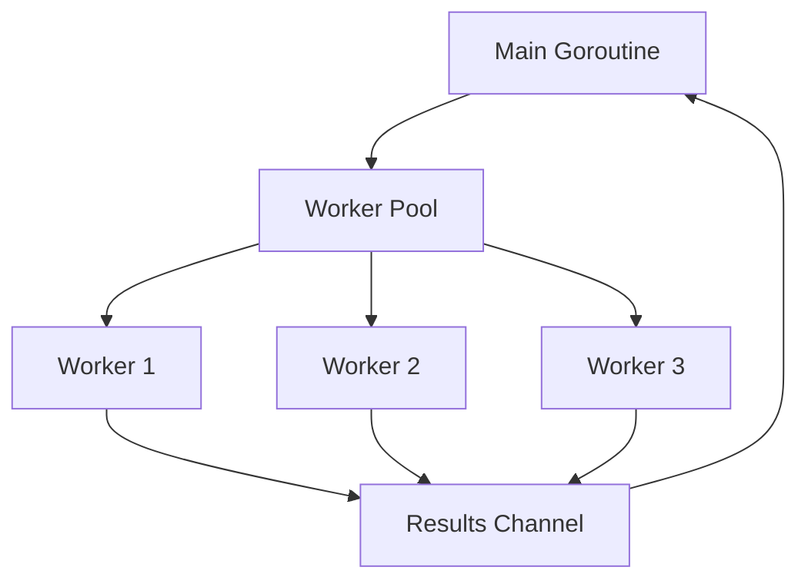

# Go for Backend Development

Go (Golang) is a statically typed, compiled language designed at Google for building reliable, efficient backend systems. Its standout features are goroutines for lightweight concurrency, a fast compiler, a comprehensive standard library, and a single-binary deployment model.

## Why Go for Backend?

- **Concurrency first** - Goroutines and channels make concurrent programming natural.
- **Fast compilation** and execution (compiles to native machine code).
- **Simple language** with a small spec, easy to learn and read.
- **Single binary deployment** - No runtime dependencies.
- **Excellent standard library** for HTTP, JSON, cryptography, and more.

## Hello World HTTP Server

```go
package main

import (
    "fmt"
    "net/http"
)

func main() {
    http.HandleFunc("/", func(w http.ResponseWriter, r *http.Request) {
        fmt.Fprintf(w, "Hello, Backend!")
    })

    fmt.Println("Server running on :8080")
    http.ListenAndServe(":8080", nil)
}
```

```bash
# Run the server
go run main.go

# Build a binary
go build -o server main.go
./server
```

## Goroutines

Goroutines are lightweight threads managed by the Go runtime. They cost about 2 KB of stack space each, allowing millions to run concurrently.

```go
package main

import (
    "fmt"
    "sync"
    "time"
)

func worker(id int, wg *sync.WaitGroup) {
    defer wg.Done()
    fmt.Printf("Worker %d starting\n", id)
    time.Sleep(time.Second)
    fmt.Printf("Worker %d done\n", id)
}

func main() {
    var wg sync.WaitGroup

    for i := 1; i <= 5; i++ {
        wg.Add(1)
        go worker(i, &wg)  // Launch goroutine
    }

    wg.Wait()  // Wait for all to finish
    fmt.Println("All workers complete")
}
```

## Channels

Channels are typed conduits for communication between goroutines. They enforce synchronization by design.


```go
package main

import "fmt"

func producer(ch chan<- string) {
    ch <- "task 1"
    ch <- "task 2"
    ch <- "task 3"
    close(ch)
}

func main() {
    ch := make(chan string, 3)  // Buffered channel

    go producer(ch)

    // Range over channel until closed
    for task := range ch {
        fmt.Println("Processing:", task)
    }
}
```

### Select Statement

`select` waits on multiple channel operations simultaneously.

```go
select {
case msg := <-ch1:
    fmt.Println("Received from ch1:", msg)
case msg := <-ch2:
    fmt.Println("Received from ch2:", msg)
case <-time.After(5 * time.Second):
    fmt.Println("Timeout")
}
```

## Concurrency Patterns



### Worker Pool

```go
func workerPool(jobs <-chan int, results chan<- int, id int) {
    for job := range jobs {
        fmt.Printf("Worker %d processing job %d\n", id, job)
        results <- job * 2
    }
}

func main() {
    jobs := make(chan int, 100)
    results := make(chan int, 100)

    // Start 3 workers
    for w := 1; w <= 3; w++ {
        go workerPool(jobs, results, w)
    }

    // Send 10 jobs
    for j := 1; j <= 10; j++ {
        jobs <- j
    }
    close(jobs)

    // Collect results
    for r := 1; r <= 10; r++ {
        fmt.Println(<-results)
    }
}
```

## Building REST APIs

### Using net/http (Standard Library)

```go
package main

import (
    "encoding/json"
    "net/http"
)

type User struct {
    ID    int    `json:"id"`
    Name  string `json:"name"`
    Email string `json:"email"`
}

func getUsers(w http.ResponseWriter, r *http.Request) {
    users := []User{
        {ID: 1, Name: "Alice", Email: "alice@example.com"},
        {ID: 2, Name: "Bob", Email: "bob@example.com"},
    }

    w.Header().Set("Content-Type", "application/json")
    json.NewEncoder(w).Encode(users)
}

func main() {
    mux := http.NewServeMux()
    mux.HandleFunc("GET /api/users", getUsers)
    http.ListenAndServe(":8080", mux)
}
```

## Error Handling

Go uses explicit error returns instead of exceptions.

```go
func readConfig(path string) (Config, error) {
    data, err := os.ReadFile(path)
    if err != nil {
        return Config{}, fmt.Errorf("reading config: %w", err)
    }

    var cfg Config
    if err := json.Unmarshal(data, &cfg); err != nil {
        return Config{}, fmt.Errorf("parsing config: %w", err)
    }

    return cfg, nil
}

// Caller
cfg, err := readConfig("config.json")
if err != nil {
    log.Fatal(err)
}
```

## Modules and Dependencies

```bash
# Initialize a module
go mod init github.com/user/project

# Add a dependency
go get github.com/gin-gonic/gin

# Tidy up unused dependencies
go mod tidy
```

## Project Structure

```
project/
├── cmd/
│   └── server/
│       └── main.go
├── internal/
│   ├── handlers/
│   ├── models/
│   ├── repository/
│   └── service/
├── pkg/
├── go.mod
├── go.sum
└── Makefile
```

## Resources

- [Go Official Documentation](https://go.dev/doc/)
- [A Tour of Go (interactive)](https://go.dev/tour/)
- [Effective Go](https://go.dev/doc/effective_go)
- [Go by Example](https://gobyexample.com/)
- [Go Concurrency Patterns (Rob Pike)](https://go.dev/blog/pipelines)
