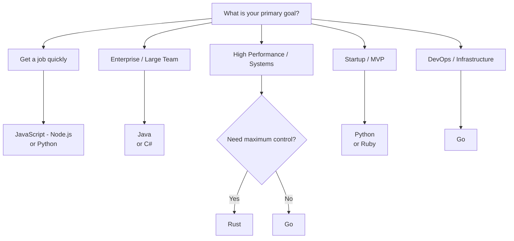
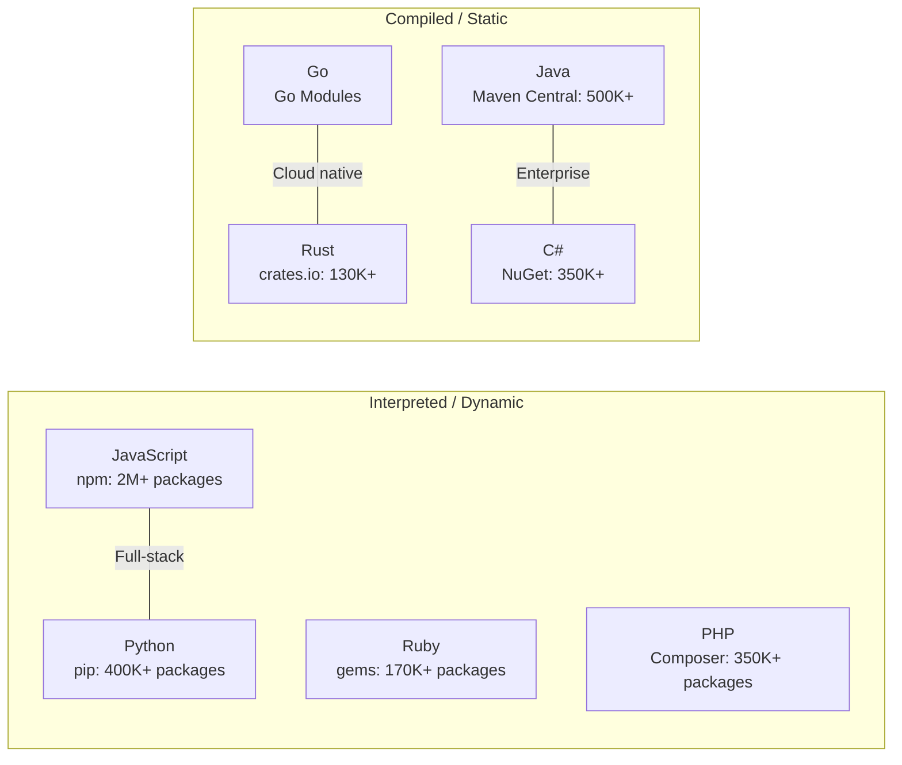

# Learn a Programming Language for Backend Development

Choosing your first (or next) backend programming language is one of the most impactful decisions you will make as a developer. Each language comes with its own ecosystem, paradigms, strengths, and trade-offs. This guide covers the most popular backend languages and helps you make an informed choice.

# Contents

1. [Why Choosing the Right Language Matters](#why-choosing-the-right-language-matters)
2. [JavaScript (Node.js)](#javascript-nodejs)
3. [Python](#python)
4. [Java](#java)
5. [Go](#go)
6. [Rust](#rust)
7. [C# (.NET)](#c-net)
8. [PHP](#php)
9. [Ruby](#ruby)
10. [Language Comparison Table](#language-comparison-table)
11. [Language Selection Criteria](#language-selection-criteria)
12. [Polyglot Programming](#polyglot-programming)
13. [Recommended Learning Path](#recommended-learning-path)
14. [Resources](#resources)

---

## Why Choosing the Right Language Matters

Your programming language choice affects:

- **Productivity** -- how quickly you can build and iterate on features
- **Performance** -- how efficiently your application uses CPU, memory, and I/O
- **Ecosystem** -- the availability of libraries, frameworks, and tools
- **Hiring** -- how easy it is to find developers who know the language
- **Maintenance** -- how readable and maintainable the codebase remains over time
- **Deployment** -- how the language integrates with your infrastructure

There is no single "best" language. The right choice depends on your project requirements, team expertise, and business constraints.

> **Tip:** Focus on learning programming concepts deeply rather than chasing the newest language. Concepts like data structures, algorithms, concurrency, and design patterns transfer across all languages.

## JavaScript (Node.js)

JavaScript, originally a browser language, became a backend powerhouse with the introduction of **Node.js** in 2009. Node.js runs JavaScript on the server using the V8 engine.

### Key Characteristics

- **Event-driven, non-blocking I/O** -- excellent for handling many concurrent connections
- **Single-threaded event loop** with worker threads for CPU-intensive tasks
- **npm** -- the largest package registry in the world
- **Full-stack capability** -- use the same language on frontend and backend

### Popular Frameworks

| Framework | Type | Description |
|---|---|---|
| Express.js | Minimalist | Most popular, flexible, unopinionated |
| Nest.js | Full-featured | TypeScript-first, inspired by Angular |
| Fastify | Performance | Low overhead, schema-based validation |
| Koa | Minimalist | By the Express team, modern async/await |

### Example: Simple HTTP Server

```javascript
const express = require('express');
const app = express();

app.get('/api/users', async (req, res) => {
    try {
        const users = await db.query('SELECT * FROM users');
        res.json(users);
    } catch (error) {
        res.status(500).json({ error: 'Internal server error' });
    }
});

app.listen(3000, () => {
    console.log('Server running on port 3000');
});
```

### When to Use

- Real-time applications (chat, notifications, streaming)
- REST APIs and microservices
- Full-stack JavaScript projects
- Rapid prototyping

### Considerations

- Single-threaded nature makes CPU-bound tasks challenging
- Callback complexity (mitigated by async/await)
- Dynamic typing can lead to runtime errors (mitigated by TypeScript)

## Python

Python is known for its clean syntax, readability, and vast ecosystem. It is one of the most popular languages for web development, data science, automation, and scripting.

### Key Characteristics

- **Readable, expressive syntax** -- often described as "executable pseudocode"
- **Batteries included** -- extensive standard library
- **Versatile** -- web, data science, ML, scripting, automation
- **Dynamic typing** with optional type hints (PEP 484)

### Popular Frameworks

| Framework | Type | Description |
|---|---|---|
| Django | Full-featured | "Batteries included," ORM, admin panel, auth |
| Flask | Minimalist | Lightweight, flexible, easy to learn |
| FastAPI | Modern | Async support, automatic OpenAPI docs, type hints |
| Starlette | ASGI | Async framework, powers FastAPI |

### Example: FastAPI Endpoint

```python
from fastapi import FastAPI, HTTPException
from pydantic import BaseModel

app = FastAPI()

class User(BaseModel):
    name: str
    email: str

@app.get("/api/users/{user_id}")
async def get_user(user_id: int):
    user = await db.fetch_user(user_id)
    if not user:
        raise HTTPException(status_code=404, detail="User not found")
    return user

@app.post("/api/users", status_code=201)
async def create_user(user: User):
    result = await db.create_user(user.name, user.email)
    return result
```

### When to Use

- Rapid prototyping and MVPs
- Data-intensive applications (ML/AI integration)
- Scripting and automation
- Applications where development speed matters more than raw performance

### Considerations

- Slower execution compared to compiled languages
- GIL (Global Interpreter Lock) limits true multi-threading for CPU-bound work
- Async support is mature but was added later (Python 3.5+)

## Java

Java has been a backbone of enterprise software development for decades. It runs on the **Java Virtual Machine (JVM)**, providing platform independence and a mature ecosystem.

### Key Characteristics

- **"Write once, run anywhere"** -- JVM portability
- **Strong type system** -- catches errors at compile time
- **Mature ecosystem** -- extensive libraries, tools, and frameworks
- **Excellent concurrency** -- robust threading model, virtual threads (Project Loom)
- **Garbage collection** -- automatic memory management with tunable GCs

### Popular Frameworks

| Framework | Type | Description |
|---|---|---|
| Spring Boot | Full-featured | Industry standard, dependency injection, massive ecosystem |
| Quarkus | Cloud-native | Fast startup, low memory, GraalVM native compilation |
| Micronaut | Cloud-native | Compile-time DI, minimal reflection |
| Jakarta EE | Enterprise | Successor to Java EE, full enterprise spec |

### Example: Spring Boot Controller

```java
@RestController
@RequestMapping("/api/users")
public class UserController {

    @Autowired
    private UserService userService;

    @GetMapping("/{id}")
    public ResponseEntity<User> getUser(@PathVariable Long id) {
        return userService.findById(id)
            .map(ResponseEntity::ok)
            .orElse(ResponseEntity.notFound().build());
    }

    @PostMapping
    public ResponseEntity<User> createUser(@Valid @RequestBody UserDto dto) {
        User user = userService.create(dto);
        return ResponseEntity.status(HttpStatus.CREATED).body(user);
    }
}
```

### When to Use

- Large-scale enterprise applications
- Microservices architectures
- Systems requiring high concurrency and reliability
- Android development (Kotlin is now preferred)

### Considerations

- Verbose syntax compared to Python or JavaScript (improving with newer versions)
- Higher memory footprint than Go or Rust
- Slower startup time (mitigated by GraalVM native images)

## Go

Go (Golang), created at Google, was designed for building scalable, concurrent backend systems. It compiles to native binaries and has a simple, opinionated design.

### Key Characteristics

- **Built-in concurrency** -- goroutines and channels make concurrent programming natural
- **Fast compilation** -- compiles to a single static binary in seconds
- **Simple language design** -- small spec, easy to learn
- **Excellent standard library** -- HTTP server, JSON, crypto, testing all built in
- **Low memory footprint** -- suitable for containers and microservices

### Popular Frameworks and Libraries

| Framework | Type | Description |
|---|---|---|
| Standard library | Built-in | Often sufficient; `net/http` is powerful |
| Gin | Web framework | Fast, middleware support |
| Echo | Web framework | High performance, extensible |
| Fiber | Web framework | Express-inspired, built on fasthttp |

### Example: HTTP Handler

```go
package main

import (
    "encoding/json"
    "log"
    "net/http"
)

type User struct {
    ID    int    `json:"id"`
    Name  string `json:"name"`
    Email string `json:"email"`
}

func getUsers(w http.ResponseWriter, r *http.Request) {
    users := []User{
        {ID: 1, Name: "Alice", Email: "alice@example.com"},
    }
    w.Header().Set("Content-Type", "application/json")
    json.NewEncoder(w).Encode(users)
}

func main() {
    http.HandleFunc("/api/users", getUsers)
    log.Println("Server starting on :8080")
    log.Fatal(http.ListenAndServe(":8080", nil))
}
```

### When to Use

- High-performance microservices
- CLI tools and DevOps tooling
- Systems programming (Docker, Kubernetes, Terraform are all written in Go)
- Applications requiring high concurrency

### Considerations

- No generics until Go 1.18 (now available but still maturing)
- Error handling is verbose (explicit `if err != nil` checks)
- Smaller ecosystem of libraries compared to Java or JavaScript

## Rust

Rust focuses on safety, concurrency, and performance. It achieves memory safety without a garbage collector through its **ownership system**.

### Key Characteristics

- **Memory safety without GC** -- ownership and borrowing system prevents data races and null pointer bugs at compile time
- **Zero-cost abstractions** -- high-level code compiles to efficient machine code
- **Fearless concurrency** -- the type system prevents data races
- **Growing web ecosystem** -- rapidly maturing frameworks

### Popular Frameworks

| Framework | Type | Description |
|---|---|---|
| Actix Web | Web framework | Extremely fast, actor-based |
| Axum | Web framework | Built on Tokio, by the Tokio team |
| Rocket | Web framework | Ergonomic, type-safe |
| Warp | Web framework | Filter-based, composable |

### Example: Axum Handler

```rust
use axum::{routing::get, Json, Router};
use serde::Serialize;

#[derive(Serialize)]
struct User {
    id: u32,
    name: String,
    email: String,
}

async fn get_users() -> Json<Vec<User>> {
    let users = vec![
        User {
            id: 1,
            name: "Alice".to_string(),
            email: "alice@example.com".to_string(),
        },
    ];
    Json(users)
}

#[tokio::main]
async fn main() {
    let app = Router::new().route("/api/users", get(get_users));
    let listener = tokio::net::TcpListener::bind("0.0.0.0:8080").await.unwrap();
    axum::serve(listener, app).await.unwrap();
}
```

### When to Use

- Performance-critical services (replacing C/C++ components)
- Systems where memory safety is paramount
- WebAssembly targets
- Infrastructure tooling

### Considerations

- Steep learning curve (ownership, lifetimes, borrow checker)
- Slower development speed initially
- Smaller web ecosystem compared to Node.js or Python

## C# (.NET)

C# is a modern, object-oriented language developed by Microsoft. The **.NET** platform provides a comprehensive runtime and framework for building backend applications.

### Key Characteristics

- **Strong type system** with modern features (pattern matching, records, async/await)
- **Cross-platform** -- .NET runs on Linux, macOS, and Windows
- **High performance** -- competitive with Go and Java
- **Excellent tooling** -- Visual Studio, JetBrains Rider, VS Code with OmniSharp
- **LINQ** -- powerful query syntax for collections and databases

### Example: ASP.NET Core Controller

```csharp
[ApiController]
[Route("api/[controller]")]
public class UsersController : ControllerBase
{
    private readonly IUserService _userService;

    public UsersController(IUserService userService)
    {
        _userService = userService;
    }

    [HttpGet("{id}")]
    public async Task<ActionResult<User>> GetUser(int id)
    {
        var user = await _userService.GetByIdAsync(id);
        if (user == null) return NotFound();
        return Ok(user);
    }

    [HttpPost]
    public async Task<ActionResult<User>> CreateUser(CreateUserDto dto)
    {
        var user = await _userService.CreateAsync(dto);
        return CreatedAtAction(nameof(GetUser), new { id = user.Id }, user);
    }
}
```

### When to Use

- Enterprise applications (especially in Microsoft-centric organizations)
- Game backends (Unity uses C#)
- Applications requiring tight Windows/Azure integration
- Teams already familiar with the .NET ecosystem

## PHP

PHP powers a massive portion of the web. While it has evolved significantly from its early days, it remains a practical choice for web development.

### Key Characteristics

- **Built for the web** -- designed specifically for server-side web development
- **Huge market share** -- powers WordPress, which runs ~40% of websites
- **Modern PHP (8.x)** -- type declarations, enums, fibers, JIT compilation
- **Easy deployment** -- runs virtually everywhere with minimal configuration

### Popular Frameworks

| Framework | Type | Description |
|---|---|---|
| Laravel | Full-featured | Elegant syntax, Eloquent ORM, rich ecosystem |
| Symfony | Full-featured | Enterprise-grade, reusable components |
| Slim | Micro | Lightweight, for APIs |

### Example: Laravel Route

```php
// routes/api.php
Route::get('/users/{id}', function (int $id) {
    $user = User::findOrFail($id);
    return response()->json($user);
});

Route::post('/users', function (Request $request) {
    $validated = $request->validate([
        'name' => 'required|string|max:255',
        'email' => 'required|email|unique:users',
    ]);

    $user = User::create($validated);
    return response()->json($user, 201);
});
```

### When to Use

- Content management systems and WordPress-based projects
- Rapid web application development
- Shared hosting environments
- Teams with existing PHP expertise

## Ruby

Ruby, with its emphasis on developer happiness, powers the **Ruby on Rails** framework that revolutionized web development.

### Key Characteristics

- **Developer-friendly syntax** -- "optimized for developer happiness"
- **Convention over configuration** -- Rails makes decisions for you
- **Metaprogramming** -- powerful DSL capabilities
- **Mature ecosystem** -- RubyGems package manager

### Example: Rails Controller

```ruby
class UsersController < ApplicationController
  def show
    user = User.find(params[:id])
    render json: user
  end

  def create
    user = User.new(user_params)
    if user.save
      render json: user, status: :created
    else
      render json: { errors: user.errors }, status: :unprocessable_entity
    end
  end

  private

  def user_params
    params.require(:user).permit(:name, :email)
  end
end
```

### When to Use

- Startups and MVPs where development speed is critical
- CRUD-heavy web applications
- Projects where convention over configuration is valued

## Language Comparison Table

| Language | Typing | Performance | Learning Curve | Concurrency Model | Package Manager |
|---|---|---|---|---|---|
| JavaScript | Dynamic | Moderate | Low | Event loop, async/await | npm / yarn |
| Python | Dynamic | Low-Moderate | Very Low | asyncio, multiprocessing | pip |
| Java | Static | High | Moderate | Threads, virtual threads | Maven / Gradle |
| Go | Static | High | Low-Moderate | Goroutines, channels | Go modules |
| Rust | Static | Very High | High | async/await, threads | Cargo |
| C# | Static | High | Moderate | async/await, Task | NuGet |
| PHP | Dynamic | Moderate | Low | Fibers (8.1+) | Composer |
| Ruby | Dynamic | Low-Moderate | Low | Threads, Ractors | Bundler |

## Language Selection Criteria

The following flowchart can help guide your decision when choosing a backend language:



### Language Ecosystem Comparison



When choosing a language, evaluate these factors:

### 1. Project Requirements

- **I/O-heavy** (APIs, web servers) -- Node.js, Go, Python (FastAPI)
- **CPU-heavy** (computation, data processing) -- Go, Rust, Java
- **Rapid prototyping** -- Python, Ruby, Node.js
- **Enterprise / large teams** -- Java, C#, Go

### 2. Ecosystem and Libraries

Consider the availability of libraries for your specific needs: database drivers, authentication, payment processing, cloud SDKs, etc.

### 3. Performance Requirements

If raw performance is critical, compiled languages (Go, Rust, Java) outperform interpreted languages (Python, Ruby, PHP). However, for most web applications, the database is the bottleneck, not the language.

### 4. Team Expertise

The best language is often the one your team knows well. Productivity and code quality usually matter more than language benchmarks.

### 5. Job Market

| Language | Relative Demand | Average Salary Range |
|---|---|---|
| JavaScript | Very High | Moderate-High |
| Python | Very High | Moderate-High |
| Java | High | High |
| Go | Growing | High |
| Rust | Growing | Very High |
| C# | High | High |
| PHP | Moderate | Moderate |
| Ruby | Declining | High |

> **Tip:** Salary and demand vary significantly by region and industry. Always research your local market.

## Polyglot Programming

Modern backend systems often use multiple languages. This approach is called **polyglot programming**.

Examples of polyglot architectures:

- **API Gateway** in Go (performance) + **Business Logic** services in Python (productivity) + **Data Pipeline** in Java (ecosystem)
- **Web API** in Node.js + **ML Service** in Python + **Infrastructure tools** in Go

Benefits:

- Use the best tool for each job
- Leverage team strengths across different services
- Avoid being locked into a single ecosystem

Challenges:

- Increased operational complexity
- Cross-language debugging is harder
- Requires investment in standardized communication (APIs, message queues)

## Recommended Learning Path

1. **Start with one language** -- learn it deeply before branching out
2. **Master the fundamentals** -- data structures, algorithms, HTTP, databases
3. **Build a complete project** -- a REST API with authentication, database, and deployment
4. **Learn a second language** -- choose something different (e.g., if you started with Python, try Go or Java)
5. **Understand the runtime** -- learn how your language manages memory, handles concurrency, and executes code
6. **Contribute to open source** -- read and contribute to real-world codebases

Suggested first languages based on your goals:

| Goal | Suggested Language |
|---|---|
| Get a job quickly | JavaScript (Node.js) or Python |
| Enterprise career | Java or C# |
| DevOps / Infrastructure | Go |
| Systems / Performance | Rust |
| Startup / MVP | Python or Ruby |

## Resources

- [Node.js Official Documentation](https://nodejs.org/en/docs/)
- [Python Official Tutorial](https://docs.python.org/3/tutorial/)
- [The Go Programming Language (book)](https://www.gopl.io/)
- [A Tour of Go](https://go.dev/tour/)
- [The Rust Programming Language (free book)](https://doc.rust-lang.org/book/)
- [Spring Boot Guides](https://spring.io/guides)
- [ASP.NET Core Documentation](https://learn.microsoft.com/en-us/aspnet/core/)
- [Laravel Documentation](https://laravel.com/docs)
- [Ruby on Rails Guides](https://guides.rubyonrails.org/)
- [FastAPI Documentation](https://fastapi.tiangolo.com/)
- [Stack Overflow Developer Survey](https://survey.stackoverflow.co/) -- annual language popularity and salary data
- [TIOBE Index](https://www.tiobe.com/tiobe-index/) -- programming language popularity rankings
