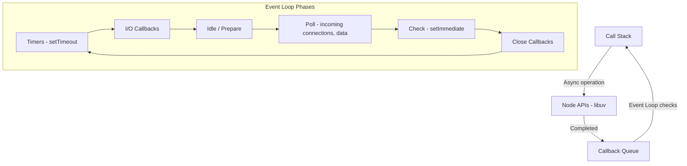

# JavaScript for Backend Development

JavaScript, through Node.js, has become one of the most popular backend languages. Node.js runs the V8 engine outside the browser, enabling server-side JavaScript with a non-blocking, event-driven architecture that excels at handling concurrent connections.

## Why JavaScript for Backend?

- **Single language** for both frontend and backend.
- **Massive ecosystem** with over 2 million packages on npm.
- **Non-blocking I/O** for high-concurrency applications.
- **Active community** and extensive documentation.

## The Event Loop

The event loop is the core of Node.js. It allows single-threaded JavaScript to handle thousands of concurrent operations by offloading I/O to the operating system.



```javascript
console.log('1 - Start');

setTimeout(() => {
    console.log('2 - Timeout callback');
}, 0);

Promise.resolve().then(() => {
    console.log('3 - Promise (microtask)');
});

console.log('4 - End');

// Output: 1, 4, 3, 2
// Microtasks (Promises) run before macrotasks (setTimeout)
```

## npm - Node Package Manager

```bash
# Initialize a new project
npm init -y

# Install a dependency
npm install express

# Install a dev dependency
npm install --save-dev nodemon

# Run scripts defined in package.json
npm run dev

# Install all dependencies from package.json
npm install
```

## Building a Server with Express

Express is the most widely used Node.js web framework.

```javascript
const express = require('express');
const app = express();

// Middleware
app.use(express.json());

// Routes
app.get('/api/users', (req, res) => {
    res.json([
        { id: 1, name: 'Alice' },
        { id: 2, name: 'Bob' }
    ]);
});

app.post('/api/users', (req, res) => {
    const { name, email } = req.body;
    // Save to database...
    res.status(201).json({ id: 3, name, email });
});

// Error handling middleware
app.use((err, req, res, next) => {
    console.error(err.stack);
    res.status(500).json({ error: 'Internal server error' });
});

app.listen(3000, () => {
    console.log('Server running on port 3000');
});
```

## Async/Await

Modern Node.js uses async/await for handling asynchronous operations cleanly.

```javascript
// Callback style (old)
fs.readFile('config.json', (err, data) => {
    if (err) throw err;
    console.log(data);
});

// Promise style
fs.promises.readFile('config.json')
    .then(data => console.log(data))
    .catch(err => console.error(err));

// Async/await style (preferred)
async function loadConfig() {
    try {
        const data = await fs.promises.readFile('config.json', 'utf8');
        return JSON.parse(data);
    } catch (err) {
        console.error('Failed to load config:', err.message);
        throw err;
    }
}
```

### Parallel Async Operations

```javascript
async function fetchAllData() {
    // Run in parallel
    const [users, posts, comments] = await Promise.all([
        fetch('/api/users').then(r => r.json()),
        fetch('/api/posts').then(r => r.json()),
        fetch('/api/comments').then(r => r.json())
    ]);
    return { users, posts, comments };
}
```

## Modules

```javascript
// CommonJS (traditional Node.js)
const express = require('express');
module.exports = { myFunction };

// ES Modules (modern, requires "type": "module" in package.json)
import express from 'express';
export function myFunction() { }
```

## Working with Databases

```javascript
// Using pg for PostgreSQL
const { Pool } = require('pg');
const pool = new Pool({ connectionString: process.env.DATABASE_URL });

async function getUsers() {
    const { rows } = await pool.query('SELECT * FROM users WHERE active = $1', [true]);
    return rows;
}

// Using mongoose for MongoDB
const mongoose = require('mongoose');
await mongoose.connect(process.env.MONGODB_URI);

const UserSchema = new mongoose.Schema({
    name: { type: String, required: true },
    email: { type: String, unique: true }
});
const User = mongoose.model('User', UserSchema);
```

## Environment Variables

```javascript
// Load from .env file using dotenv
require('dotenv').config();

const port = process.env.PORT || 3000;
const dbUrl = process.env.DATABASE_URL;
```

## Project Structure

```
project/
├── src/
│   ├── routes/
│   ├── controllers/
│   ├── models/
│   ├── middleware/
│   ├── services/
│   └── app.js
├── tests/
├── .env
├── .gitignore
├── package.json
└── README.md
```

## Resources

- [Node.js Official Documentation](https://nodejs.org/docs/)
- [Express.js Guide](https://expressjs.com/en/guide/routing.html)
- [Node.js Best Practices](https://github.com/goldbergyoni/nodebestpractices)
- [JavaScript.info](https://javascript.info/)
- [MDN Web Docs - JavaScript](https://developer.mozilla.org/en-US/docs/Web/JavaScript)
