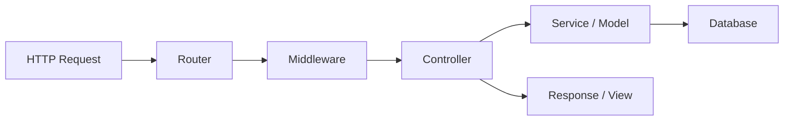

# PHP for Backend Development

PHP is one of the most widely deployed server-side languages, powering a large portion of the web including WordPress, Wikipedia, and Facebook (via Hack). Modern PHP (8.0+) has evolved significantly with strong typing, JIT compilation, and powerful frameworks like Laravel.

## Why PHP for Backend?

- **Battle-tested** with decades of web development history.
- **Easy deployment** on virtually any hosting platform.
- **Laravel** provides one of the most productive full-stack frameworks.
- **Composer** ecosystem with thousands of packages.
- **PHP 8+** brings modern language features and performance improvements.

## Modern PHP 8+ Features

### Named Arguments and Match Expression

```php
// Named arguments
function createUser(string $name, string $email, string $role = 'user'): array {
    return compact('name', 'email', 'role');
}

$user = createUser(name: 'Alice', email: 'alice@example.com', role: 'admin');

// Match expression (strict comparison, returns value)
$statusText = match($statusCode) {
    200 => 'OK',
    301 => 'Moved Permanently',
    404 => 'Not Found',
    500 => 'Internal Server Error',
    default => 'Unknown',
};
```

### Enums, Union Types, and Readonly Properties

```php
// Enums (PHP 8.1)
enum UserRole: string {
    case Admin = 'admin';
    case Editor = 'editor';
    case Viewer = 'viewer';
}

// Union types and readonly properties
class User {
    public function __construct(
        public readonly int $id,
        public readonly string $name,
        public string|null $email = null,
    ) {}
}

$user = new User(id: 1, name: 'Alice', email: 'alice@example.com');
echo $user->name; // Alice
```

### Fibers (PHP 8.1)

Fibers enable cooperative multitasking for asynchronous programming.

```php
$fiber = new Fiber(function (): void {
    $value = Fiber::suspend('paused');
    echo "Resumed with: $value\n";
});

$result = $fiber->start();    // 'paused'
$fiber->resume('hello');       // Resumed with: hello
```

## Composer - Dependency Management

```bash
# Initialize a project
composer init

# Install a package
composer require laravel/framework

# Install dev dependency
composer require --dev phpunit/phpunit

# Install all dependencies
composer install

# Autoloading
composer dump-autoload
```

```json
{
    "require": {
        "php": ">=8.2",
        "laravel/framework": "^11.0"
    },
    "autoload": {
        "psr-4": {
            "App\\": "app/"
        }
    }
}
```

## Laravel Framework

Laravel is the most popular PHP framework for building modern web applications.



### Routing

```php
use App\Http\Controllers\UserController;
use Illuminate\Support\Facades\Route;

Route::get('/api/users', [UserController::class, 'index']);
Route::post('/api/users', [UserController::class, 'store']);
Route::get('/api/users/{id}', [UserController::class, 'show']);
Route::put('/api/users/{id}', [UserController::class, 'update']);
Route::delete('/api/users/{id}', [UserController::class, 'destroy']);
```

### Controllers

```php
namespace App\Http\Controllers;

use App\Models\User;
use Illuminate\Http\Request;
use Illuminate\Http\JsonResponse;

class UserController extends Controller
{
    public function index(): JsonResponse
    {
        $users = User::where('active', true)->paginate(20);
        return response()->json($users);
    }

    public function store(Request $request): JsonResponse
    {
        $validated = $request->validate([
            'name'  => 'required|string|max:255',
            'email' => 'required|email|unique:users',
        ]);

        $user = User::create($validated);
        return response()->json($user, 201);
    }
}
```

### Eloquent ORM

```php
namespace App\Models;

use Illuminate\Database\Eloquent\Model;
use Illuminate\Database\Eloquent\Relations\HasMany;

class User extends Model
{
    protected $fillable = ['name', 'email'];

    public function posts(): HasMany
    {
        return $this->hasMany(Post::class);
    }
}

// Usage
$user = User::find(1);
$posts = $user->posts()->where('published', true)->get();
$admins = User::where('role', 'admin')->orderBy('name')->get();
```

## PDO - Database Access

For projects without an ORM, PDO provides a secure way to interact with databases.

```php
$pdo = new PDO(
    'mysql:host=localhost;dbname=myapp;charset=utf8mb4',
    'user',
    'password',
    [PDO::ATTR_ERRMODE => PDO::ERRMODE_EXCEPTION]
);

// Prepared statement (prevents SQL injection)
$stmt = $pdo->prepare('SELECT * FROM users WHERE email = :email');
$stmt->execute(['email' => $email]);
$user = $stmt->fetch(PDO::FETCH_ASSOC);

// Insert
$stmt = $pdo->prepare('INSERT INTO users (name, email) VALUES (:name, :email)');
$stmt->execute(['name' => 'Bob', 'email' => 'bob@example.com']);
$newId = $pdo->lastInsertId();
```

## Project Structure (Laravel)

```
laravel-project/
├── app/
│   ├── Http/Controllers/
│   ├── Models/
│   └── Services/
├── config/
├── database/migrations/
├── routes/
│   ├── api.php
│   └── web.php
├── tests/
├── .env
├── composer.json
└── artisan
```

## Resources

- [PHP Official Documentation](https://www.php.net/docs.php)
- [Laravel Documentation](https://laravel.com/docs)
- [PHP: The Right Way](https://phptherightway.com/)
- [Composer Documentation](https://getcomposer.org/doc/)
- [PHP 8.x Migration Guides](https://www.php.net/manual/en/migration80.php)
