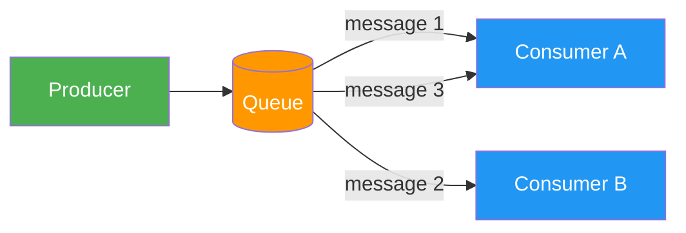
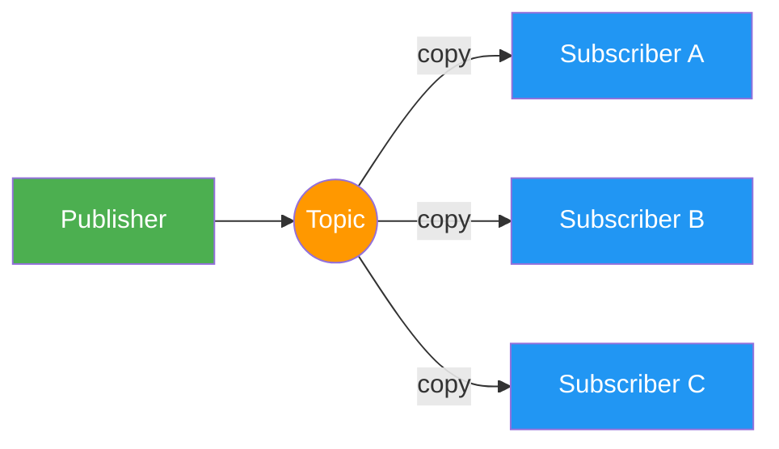
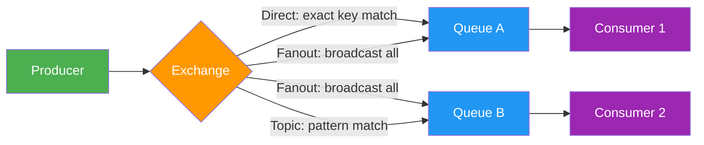
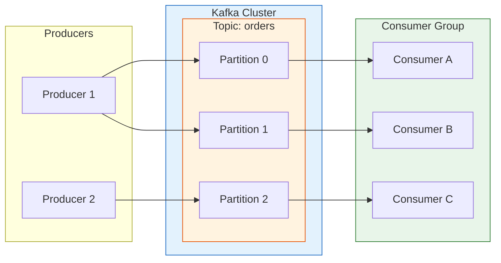
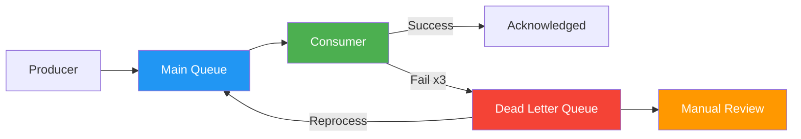

# Message Brokers

> Message brokers are the backbone of asynchronous communication in distributed systems. They decouple services, enable event-driven architectures, and allow systems to handle load spikes gracefully.

# Table of Contents

1. [What Are Message Brokers](#what-are-message-brokers)
2. [Why Message Brokers](#why-message-brokers)
3. [Message Queue vs Pub/Sub Pattern](#message-queue-vs-pubsub-pattern)
4. [Popular Message Brokers](#popular-message-brokers)
   1. [RabbitMQ](#rabbitmq)
   2. [Apache Kafka](#apache-kafka)
   3. [Redis Pub/Sub](#redis-pubsub)
   4. [Amazon SQS/SNS](#amazon-sqssns)
5. [RabbitMQ vs Kafka Comparison](#rabbitmq-vs-kafka-comparison)
6. [Use Cases](#use-cases)
7. [Dead Letter Queues](#dead-letter-queues)
8. [Message Serialization](#message-serialization)
9. [Delivery Guarantees](#delivery-guarantees)
10. [Best Practices](#best-practices)
11. [Resources](#resources)

---

## What Are Message Brokers

A message broker is an intermediary software component that translates messages between formal messaging protocols. It enables applications, systems, and services to communicate with each other by sending and receiving messages.

Instead of services calling each other directly (synchronous communication), a message broker sits between them and manages the flow of messages (asynchronous communication).

```
Synchronous (direct):
  Service A ──HTTP──▶ Service B    (A waits for B to respond)

Asynchronous (via broker):
  Service A ──▶ [Message Broker] ──▶ Service B    (A moves on immediately)
```

The broker accepts messages from **producers** (senders), stores them temporarily, and delivers them to **consumers** (receivers). This decouples the producer from the consumer -- they do not need to know about each other, be online at the same time, or process messages at the same rate.

---

## Why Message Brokers

Message brokers solve several fundamental problems in distributed systems:

**Decoupling** - Services do not depend on each other directly. A payment service does not need to know about the notification service, the analytics service, or the inventory service. It just publishes a "PaymentCompleted" message.

**Asynchronous Processing** - Time-consuming tasks (sending emails, generating reports, processing images) can be offloaded to background workers. The user gets an immediate response while work happens in the background.

**Load Leveling** - If a service receives a spike of 10,000 requests per second but can only process 1,000/s, a message queue absorbs the burst. Messages queue up and are processed at a sustainable rate.

**Reliability** - Messages are persisted in the broker. If a consumer crashes, messages wait in the queue until the consumer recovers. No data is lost.

**Scalability** - Multiple consumers can process messages from the same queue in parallel, enabling horizontal scaling of workers.

```
                    ┌── Consumer 1
Producer ──▶ Queue ─┼── Consumer 2    (parallel processing)
                    └── Consumer 3
```

---

## Message Queue vs Pub/Sub Pattern

There are two fundamental messaging patterns:

### Message Queue (Point-to-Point)

A message is sent to a queue and consumed by **exactly one** consumer. Once a consumer acknowledges the message, it is removed from the queue. If multiple consumers are listening, the broker distributes messages among them (competing consumers pattern).

```
Producer ──▶ [Queue] ──▶ Consumer A  (gets message 1)
                    ──▶ Consumer B  (gets message 2)
                    ──▶ Consumer A  (gets message 3)
```



**Use when:** You need a task to be processed exactly once by one worker (e.g., sending an email, processing an order).

### Pub/Sub (Publish/Subscribe)

A message is published to a **topic** and delivered to **all** subscribers. Each subscriber gets its own copy of every message.

```
                     ┌──▶ Subscriber A (gets all messages)
Publisher ──▶ Topic ─┤
                     └──▶ Subscriber B (gets all messages)
```



**Use when:** Multiple services need to react to the same event (e.g., "UserRegistered" triggers a welcome email, analytics tracking, and CRM update).

| Aspect | Message Queue | Pub/Sub |
|--------|--------------|---------|
| Consumers | One consumer per message | All subscribers get every message |
| Use case | Task distribution | Event notification |
| Message lifetime | Removed after consumption | Removed after all subscribers receive it (or after TTL) |
| Scaling | Add more consumers to process faster | Add more subscribers for new functionality |

---

## Popular Message Brokers

### RabbitMQ

RabbitMQ is one of the most widely deployed open-source message brokers. It implements the **AMQP** (Advanced Message Queuing Protocol) and supports multiple messaging patterns.

**Core Concepts:**

- **Producer** - Sends messages to an exchange
- **Exchange** - Receives messages and routes them to queues based on rules (bindings)
- **Queue** - Stores messages until a consumer retrieves them
- **Binding** - A rule that tells the exchange which queue(s) to route messages to
- **Consumer** - Receives and processes messages from a queue

```
Producer ──▶ Exchange ──binding──▶ Queue ──▶ Consumer
```



**Exchange Types:**

| Type | Routing Behavior |
|------|-----------------|
| **Direct** | Routes to queues whose binding key exactly matches the routing key |
| **Fanout** | Routes to all bound queues (broadcast) |
| **Topic** | Routes based on wildcard pattern matching of the routing key |
| **Headers** | Routes based on message header attributes |

**Example with Node.js (using amqplib):**

```javascript
const amqp = require("amqplib");

// Producer
async function sendMessage() {
  const connection = await amqp.connect("amqp://localhost");
  const channel = await connection.createChannel();

  const queue = "task_queue";
  await channel.assertQueue(queue, { durable: true });

  const message = JSON.stringify({ task: "send_email", to: "user@example.com" });
  channel.sendToQueue(queue, Buffer.from(message), { persistent: true });

  console.log("Message sent:", message);
  await channel.close();
  await connection.close();
}

// Consumer
async function consumeMessages() {
  const connection = await amqp.connect("amqp://localhost");
  const channel = await connection.createChannel();

  const queue = "task_queue";
  await channel.assertQueue(queue, { durable: true });
  channel.prefetch(1); // Process one message at a time

  channel.consume(queue, (msg) => {
    const task = JSON.parse(msg.content.toString());
    console.log("Processing:", task);

    // Acknowledge after successful processing
    channel.ack(msg);
  });
}
```

**Key RabbitMQ features:**
- Message acknowledgments (manual or automatic)
- Message persistence (survives broker restart)
- Priority queues
- Dead letter exchanges
- Management UI with monitoring dashboards
- Clustering and high availability

### Apache Kafka

Apache Kafka is a distributed event streaming platform designed for high-throughput, fault-tolerant, real-time data pipelines. Unlike traditional message brokers, Kafka is built around a **distributed commit log**.

**Core Concepts:**

- **Topic** - A named stream of records. Similar to a database table or a folder in a filesystem.
- **Partition** - Each topic is split into partitions for parallelism. Messages within a partition are ordered.
- **Offset** - A sequential ID assigned to each message within a partition. Consumers track their position via offsets.
- **Producer** - Writes records to topics
- **Consumer** - Reads records from topics
- **Consumer Group** - A group of consumers that cooperate to consume a topic. Each partition is consumed by exactly one consumer in the group.
- **Broker** - A Kafka server that stores data and serves clients

```
Topic: "orders" (3 partitions)

Partition 0: [msg0, msg1, msg2, msg3, ...]  ──▶ Consumer A
Partition 1: [msg0, msg1, msg2, ...]         ──▶ Consumer B
Partition 2: [msg0, msg1, ...]               ──▶ Consumer C
                                                  └── Consumer Group "order-processors"
```



**Key Kafka characteristics:**
- **Log-based storage** - Messages are persisted to disk and retained for a configurable period (days, weeks, or indefinitely). Consumers can replay messages.
- **High throughput** - Designed to handle millions of messages per second
- **Ordering guarantee** - Messages within a partition are strictly ordered
- **Replication** - Each partition is replicated across multiple brokers for fault tolerance
- **Consumer groups** - Enable both queue (competing consumers within a group) and pub/sub (multiple groups) patterns

**Example with Node.js (using kafkajs):**

```javascript
const { Kafka } = require("kafkajs");

const kafka = new Kafka({
  clientId: "my-app",
  brokers: ["localhost:9092"],
});

// Producer
async function produce() {
  const producer = kafka.producer();
  await producer.connect();

  await producer.send({
    topic: "orders",
    messages: [
      { key: "order-123", value: JSON.stringify({ id: 123, total: 59.99 }) },
    ],
  });

  await producer.disconnect();
}

// Consumer
async function consume() {
  const consumer = kafka.consumer({ groupId: "order-processors" });
  await consumer.connect();
  await consumer.subscribe({ topic: "orders", fromBeginning: true });

  await consumer.run({
    eachMessage: async ({ topic, partition, message }) => {
      const order = JSON.parse(message.value.toString());
      console.log(`Partition ${partition} | Order:`, order);
    },
  });
}
```

### Redis Pub/Sub

Redis includes a lightweight publish/subscribe messaging system. It is simple and fast but does not persist messages -- if no subscriber is listening when a message is published, the message is lost.

```javascript
const Redis = require("ioredis");

// Publisher
const publisher = new Redis();
publisher.publish("notifications", JSON.stringify({ type: "alert", text: "Server load high" }));

// Subscriber
const subscriber = new Redis();
subscriber.subscribe("notifications");
subscriber.on("message", (channel, message) => {
  console.log(`Received on ${channel}:`, JSON.parse(message));
});
```

**When to use Redis Pub/Sub:**
- Real-time notifications where message loss is acceptable
- Cache invalidation across multiple application instances
- Simple use cases where you already have Redis deployed

> **Note:** For durable messaging with Redis, consider **Redis Streams**, which provides persistence, consumer groups, and message acknowledgment -- similar to Kafka's model.

### Amazon SQS/SNS

AWS provides two managed messaging services:

**Amazon SQS (Simple Queue Service)** - A fully managed message queue service.
- Standard queues: at-least-once delivery, best-effort ordering
- FIFO queues: exactly-once processing, strict ordering
- Automatic scaling, no infrastructure to manage
- Messages retained for up to 14 days

**Amazon SNS (Simple Notification Service)** - A fully managed pub/sub service.
- Publish to topics, deliver to multiple subscribers
- Subscribers can be SQS queues, Lambda functions, HTTP endpoints, email, SMS
- Fan-out pattern: one SNS topic feeding multiple SQS queues

```
               ┌──▶ SQS Queue (Email Service)
SNS Topic ─────┼──▶ SQS Queue (Analytics Service)
               └──▶ Lambda Function (Audit Log)
```

This SNS + SQS fan-out pattern is one of the most common architectures on AWS for event-driven systems.

---

## RabbitMQ vs Kafka Comparison

| Feature | RabbitMQ | Apache Kafka |
|---------|----------|-------------|
| **Model** | Message broker (smart broker, simple consumers) | Distributed commit log (simple broker, smart consumers) |
| **Message retention** | Removed after consumption | Retained for configurable period |
| **Ordering** | Per-queue ordering | Per-partition ordering |
| **Throughput** | Thousands/sec per queue | Millions/sec per cluster |
| **Replay** | Not possible (message deleted after ack) | Consumers can replay by resetting offset |
| **Routing** | Flexible exchange-based routing | Topic-based, partition key routing |
| **Protocol** | AMQP, MQTT, STOMP | Custom binary protocol |
| **Consumer model** | Push (broker pushes to consumers) | Pull (consumers pull from broker) |
| **Best for** | Task queues, RPC, complex routing | Event streaming, log aggregation, real-time pipelines |
| **Operational complexity** | Moderate | Higher (ZooKeeper/KRaft, partition management) |

> **Rule of thumb:** Use RabbitMQ when you need a traditional message broker with flexible routing and task distribution. Use Kafka when you need a high-throughput event streaming platform with message replay and long-term retention.

---

## Use Cases

**Event Sourcing** - Store every state change as an event in Kafka. Rebuild application state by replaying events. Provides a complete audit trail.

**Log Aggregation** - Collect logs from hundreds of services into Kafka, then pipe them to Elasticsearch for search and analysis (the ELK/EFK pattern).

**Task Queues** - Distribute background work (image processing, PDF generation, email sending) across worker pools using RabbitMQ or SQS.

**Data Pipelines** - Stream data from operational databases to data warehouses, search engines, or analytics systems using Kafka Connect.

**Microservice Communication** - Decouple microservices with event-driven messaging instead of direct HTTP calls. Reduces cascading failures.

**Real-Time Analytics** - Stream user activity events through Kafka for real-time dashboards, recommendations, and fraud detection.

---

## Dead Letter Queues

A **Dead Letter Queue (DLQ)** is a special queue that holds messages that could not be processed successfully. Instead of losing failed messages or retrying them indefinitely, they are moved to a DLQ for investigation.

**Common reasons a message ends up in a DLQ:**
- Consumer threw an exception while processing
- Message exceeded the maximum retry count
- Message expired (TTL exceeded)
- Message was rejected by the consumer

```
Main Queue ──▶ Consumer ──(fails 3 times)──▶ Dead Letter Queue
                                                    │
                                              Manual review
                                              or reprocessing
```



**RabbitMQ DLQ configuration:**

```javascript
// Declare a dead letter exchange
await channel.assertExchange("dlx", "direct");
await channel.assertQueue("dead_letter_queue");
await channel.bindQueue("dead_letter_queue", "dlx", "");

// Main queue sends rejected messages to the DLX
await channel.assertQueue("main_queue", {
  deadLetterExchange: "dlx",
  messageTtl: 60000,  // Optional: messages expire after 60 seconds
});
```

> **Tip:** Always set up dead letter queues in production. Without them, failing messages can block your queues or be silently lost.

---

## Message Serialization

Messages need to be serialized (converted to bytes) before being sent through a broker. The choice of serialization format affects performance, compatibility, and developer experience.

| Format | Type | Schema | Size | Speed | Human-readable |
|--------|------|--------|------|-------|----------------|
| **JSON** | Text | No (schema-less) | Large | Moderate | Yes |
| **Protocol Buffers** | Binary | Yes (.proto files) | Small | Fast | No |
| **Avro** | Binary | Yes (JSON schema) | Small | Fast | No |
| **MessagePack** | Binary | No | Small | Fast | No |

**JSON** - The most common format. Easy to debug and widely supported. Best for lower-throughput systems where developer productivity matters more than raw performance.

```json
{ "orderId": 123, "total": 59.99, "status": "completed" }
```

**Protocol Buffers (Protobuf)** - Google's binary serialization format. Requires schema definition. Produces much smaller messages than JSON and is faster to serialize/deserialize.

```protobuf
syntax = "proto3";

message Order {
  int32 order_id = 1;
  float total = 2;
  string status = 3;
}
```

**Apache Avro** - Popular in the Kafka ecosystem. Schemas are stored in a **Schema Registry**, enabling schema evolution (adding/removing fields) without breaking consumers.

> **Tip:** For Kafka-based systems, Avro with a Schema Registry is the recommended choice. It provides compact encoding, schema evolution, and cross-language compatibility.

---

## Delivery Guarantees

Message delivery guarantees describe the contract between the broker and the consumer regarding how many times a message will be delivered.

### At-Most-Once

The message is delivered zero or one time. If delivery fails, the message is lost. This is the fastest option but offers no reliability guarantee.

```
Producer ──▶ Broker ──▶ Consumer
                  (if consumer crashes, message is gone)
```

### At-Least-Once

The message is guaranteed to be delivered at least once, but may be delivered multiple times (duplicates). The consumer must be **idempotent** -- processing the same message twice should produce the same result.

```
Producer ──▶ Broker ──▶ Consumer (processes message)
                  ──▶ Consumer (processes same message again -- duplicate)
```

This is the most common guarantee in practice. Making consumers idempotent (e.g., using unique message IDs to detect duplicates) is usually simpler than implementing exactly-once delivery.

### Exactly-Once

The message is delivered and processed exactly once. This is the strongest guarantee but the hardest to achieve. It typically requires coordination between the broker and the consumer.

Kafka provides exactly-once semantics (EOS) through **idempotent producers** and **transactional messaging**, but only within the Kafka ecosystem (Kafka-to-Kafka).

| Guarantee | Duplicates | Message Loss | Complexity | Use Case |
|-----------|-----------|-------------|------------|----------|
| At-most-once | No | Possible | Low | Metrics, logs |
| At-least-once | Possible | No | Medium | Most applications |
| Exactly-once | No | No | High | Financial transactions |

---

## Best Practices

1. **Make consumers idempotent.** Assume messages can be delivered more than once. Use unique message IDs or database constraints to handle duplicates gracefully.

2. **Set appropriate message TTLs.** Messages should not live in queues forever. Set time-to-live values and use dead letter queues for expired messages.

3. **Monitor queue depth.** A growing queue means consumers cannot keep up. Set up alerts for queue depth thresholds and scale consumers accordingly.

4. **Use persistent/durable messages in production.** Non-persistent messages are faster but lost if the broker restarts. Always use persistence for important data.

5. **Implement backpressure.** If your producer is faster than your consumer, you need a strategy: limit the producer, scale consumers, or set queue size limits.

6. **Version your message schemas.** As your system evolves, message formats will change. Use a schema registry (for Avro/Protobuf) or include a version field in JSON messages to handle backward compatibility.

7. **Keep messages small.** Send references (IDs, URLs) instead of large payloads. If a consumer needs the full object, it can fetch it from the source.

8. **Test failure scenarios.** Simulate consumer crashes, broker restarts, and network partitions. Ensure your system recovers gracefully.

9. **Use correlation IDs.** Assign a unique ID to each request that flows through multiple services via messages. This makes distributed tracing and debugging much easier.

10. **Choose the right tool for the job.** Do not use Kafka when RabbitMQ suffices, and do not use Redis Pub/Sub when you need durability.

---

## Resources

- [RabbitMQ Official Documentation](https://www.rabbitmq.com/documentation.html)
- [Apache Kafka Documentation](https://kafka.apache.org/documentation/)
- [Redis Streams Introduction](https://redis.io/docs/data-types/streams/)
- [Amazon SQS Developer Guide](https://docs.aws.amazon.com/sqs/)
- [Designing Data-Intensive Applications by Martin Kleppmann](https://dataintensive.net/)
- [Enterprise Integration Patterns by Gregor Hohpe](https://www.enterpriseintegrationpatterns.com/)
- [Kafka: The Definitive Guide](https://www.oreilly.com/library/view/kafka-the-definitive/9781492043072/)
- [RabbitMQ in Depth by Gavin M. Roy](https://www.manning.com/books/rabbitmq-in-depth)
- [CloudAMQP Blog - RabbitMQ Tutorials](https://www.cloudamqp.com/blog/index.html)
