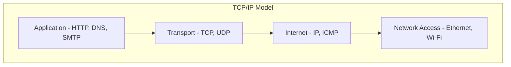
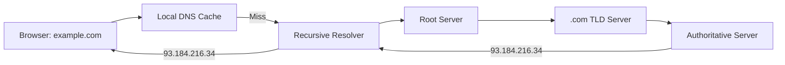

# Basic Networking Concepts

Networking is how computers communicate with each other. From the OS perspective, networking involves kernel-managed protocol stacks, sockets, and system calls. Backend developers need a solid understanding of networking fundamentals to build reliable, performant server applications.

## The OSI and TCP/IP Models



Most backend work happens at the **Transport** (TCP/UDP) and **Application** (HTTP, DNS) layers.

## TCP vs UDP

| Feature          | TCP                          | UDP                         |
|------------------|------------------------------|-----------------------------|
| Connection       | Connection-oriented          | Connectionless              |
| Reliability      | Guaranteed delivery, ordering| No guarantees               |
| Speed            | Slower (overhead)            | Faster (minimal overhead)   |
| Use cases        | HTTP, SSH, databases         | DNS, video streaming, gaming|
| Flow control     | Yes (windowing)              | No                          |
| Header size      | 20-60 bytes                  | 8 bytes                     |

### TCP Three-Way Handshake

```
Client              Server
  |--- SYN ----------->|
  |<-- SYN-ACK --------|
  |--- ACK ----------->|
  |   Connection Open   |
```

## IP Addresses and Ports

- **IP Address** - Identifies a machine on the network (e.g., `192.168.1.10` for IPv4, `::1` for IPv6 loopback).
- **Port** - Identifies a specific service on that machine (0-65535).

### Well-Known Ports

| Port  | Service  |
|-------|----------|
| 22    | SSH      |
| 53    | DNS      |
| 80    | HTTP     |
| 443   | HTTPS    |
| 3306  | MySQL    |
| 5432  | PostgreSQL |
| 6379  | Redis    |

```bash
# Check listening ports
ss -tlnp

# Or with netstat
netstat -tlnp
```

## Sockets

A socket is an endpoint for network communication. The OS provides the socket API through system calls.

```c
#include <sys/socket.h>
#include <netinet/in.h>
#include <string.h>
#include <unistd.h>

int main() {
    // Create a TCP socket
    int server_fd = socket(AF_INET, SOCK_STREAM, 0);

    // Bind to an address and port
    struct sockaddr_in addr;
    addr.sin_family = AF_INET;
    addr.sin_addr.s_addr = INADDR_ANY;
    addr.sin_port = htons(8080);
    bind(server_fd, (struct sockaddr *)&addr, sizeof(addr));

    // Listen for connections
    listen(server_fd, 128);

    // Accept a connection
    int client_fd = accept(server_fd, NULL, NULL);

    // Read and write
    char buf[1024];
    read(client_fd, buf, sizeof(buf));
    char *response = "HTTP/1.1 200 OK\r\nContent-Length: 5\r\n\r\nHello";
    write(client_fd, response, strlen(response));

    close(client_fd);
    close(server_fd);
    return 0;
}
```

## DNS (Domain Name System)

DNS translates human-readable domain names into IP addresses.



```bash
# Query DNS
dig example.com

# Simple lookup
nslookup example.com

# Check DNS resolution path
dig +trace example.com
```

## HTTP Basics

HTTP (Hypertext Transfer Protocol) is the application-layer protocol that powers the web. It runs over TCP (typically port 80 or 443 for HTTPS).

### HTTP Request Structure

```
GET /api/users HTTP/1.1
Host: example.com
Accept: application/json
Authorization: Bearer token123
```

### HTTP Response Structure

```
HTTP/1.1 200 OK
Content-Type: application/json
Content-Length: 27

{"users": ["alice", "bob"]}
```

### Common HTTP Methods

| Method  | Purpose             | Idempotent |
|---------|---------------------|------------|
| GET     | Retrieve a resource | Yes        |
| POST    | Create a resource   | No         |
| PUT     | Replace a resource  | Yes        |
| PATCH   | Partially update    | No         |
| DELETE  | Remove a resource   | Yes        |

## Useful Networking Commands

```bash
# Test connectivity
ping example.com

# Trace the route to a host
traceroute example.com

# Make HTTP requests
curl -v https://example.com/api

# View network interfaces
ip addr show    # Linux
ifconfig        # macOS

# Monitor network traffic
tcpdump -i any port 80
```

## Resources

- [Beej's Guide to Network Programming](https://beej.us/guide/bgnet/)
- [Computer Networking: A Top-Down Approach by Kurose & Ross](https://gaia.cs.umass.edu/kurose_ross/index.php)
- [High Performance Browser Networking (free)](https://hpbn.co/)
- [HTTP/2 Explained](https://http2-explained.haxx.se/)
- [Mozilla HTTP Documentation](https://developer.mozilla.org/en-US/docs/Web/HTTP)
