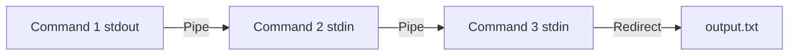

# Basic Terminal Commands

Mastering basic terminal commands is essential for every backend developer. These commands allow you to navigate file systems, manipulate files, search content, manage permissions, and chain operations together efficiently.

## File System Navigation

### ls - List Directory Contents

```bash
# List files in current directory
ls

# Long format with permissions, sizes, dates
ls -la

# Human-readable file sizes
ls -lh

# Sort by modification time
ls -lt
```

### cd - Change Directory

```bash
# Move to a directory
cd /var/log

# Go to home directory
cd ~

# Go up one level
cd ..

# Go to previous directory
cd -
```

### pwd - Print Working Directory

```bash
pwd
# Output: /home/user/projects
```

## File Operations

### cp - Copy Files and Directories

```bash
# Copy a file
cp source.txt destination.txt

# Copy a directory recursively
cp -r src/ backup/

# Preserve permissions and timestamps
cp -p original.conf copy.conf
```

### mv - Move or Rename

```bash
# Rename a file
mv old_name.txt new_name.txt

# Move file to another directory
mv file.txt /var/data/
```

### rm - Remove Files and Directories

```bash
# Remove a file
rm file.txt

# Remove a directory and its contents
rm -r directory/

# Force removal without prompts
rm -rf build/
```

### mkdir - Create Directories

```bash
# Create a directory
mkdir logs

# Create nested directories
mkdir -p project/src/utils
```

## File Content

### cat - Display File Contents

```bash
# Display entire file
cat config.json

# Display with line numbers
cat -n script.sh
```

### less / more - Paginated Viewing

```bash
# Scroll through a large file
less /var/log/syslog
```

## Searching

### grep - Search Text Patterns

```bash
# Search for a pattern in a file
grep "error" app.log

# Case-insensitive search
grep -i "warning" app.log

# Recursive search in directories
grep -r "TODO" src/

# Show line numbers
grep -n "function" app.js

# Invert match (lines NOT containing pattern)
grep -v "debug" app.log
```

### find - Search for Files

```bash
# Find files by name
find /var/log -name "*.log"

# Find files modified in the last 24 hours
find . -mtime -1

# Find and execute a command on results
find . -name "*.tmp" -exec rm {} \;

# Find files larger than 100MB
find / -size +100M
```

## Permissions

### chmod - Change File Permissions

```bash
# Give owner execute permission
chmod u+x script.sh

# Set specific permissions (rwxr-xr--)
chmod 754 script.sh

# Apply recursively
chmod -R 755 public/
```

### chown - Change File Ownership

```bash
# Change owner
chown user file.txt

# Change owner and group
chown user:group file.txt

# Apply recursively
chown -R www-data:www-data /var/www/
```

## Pipes and Redirection

Pipes and redirection are powerful mechanisms for chaining commands together.



### Pipe ( | )

Sends the output of one command as input to the next.

```bash
# Count files in a directory
ls -1 | wc -l

# Find running node processes
ps aux | grep node

# Sort and remove duplicates
cat data.txt | sort | uniq
```

### Redirection

```bash
# Redirect stdout to a file (overwrite)
echo "log entry" > output.txt

# Redirect stdout to a file (append)
echo "another entry" >> output.txt

# Redirect stderr to a file
command 2> errors.log

# Redirect both stdout and stderr
command > output.txt 2>&1

# Discard output
command > /dev/null 2>&1
```

## Useful Command Combinations

```bash
# Find the 10 largest files in a directory
du -ah /var | sort -rh | head -10

# Watch a log file in real time
tail -f /var/log/app.log

# Count occurrences of a word in files
grep -rc "error" logs/ | sort -t: -k2 -rn

# Download and extract an archive
curl -L https://example.com/file.tar.gz | tar xz
```

## Resources

- [GNU Coreutils Manual](https://www.gnu.org/software/coreutils/manual/)
- [The Linux Command Line (free book)](https://linuxcommand.org/tlcl.php)
- [ExplainShell](https://explainshell.com/)
- [Linux man pages online](https://man7.org/linux/man-pages/)
- [tldr pages - Simplified man pages](https://tldr.sh/)
