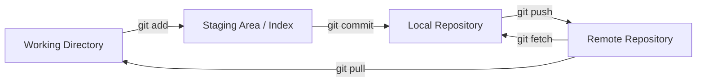
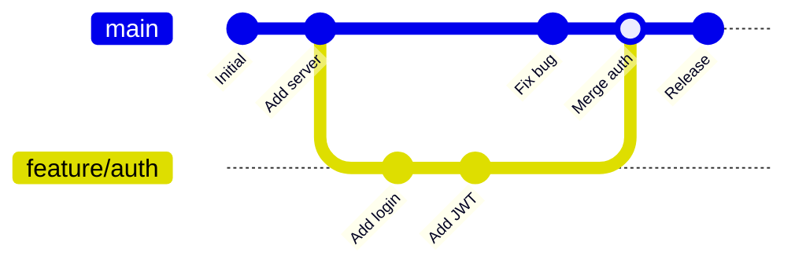

# Basic Usage of Git

Git is a distributed version control system that tracks changes to files over time. It is the standard tool for source code management in modern software development. Understanding Git is essential for collaborating on backend projects, managing deployments, and maintaining code history.

## How Git Works

Git stores snapshots of your project, not diffs. Each commit is a snapshot of every tracked file at that point in time. Unchanged files are stored as references to the previous version.



## Getting Started

### Configuration

```bash
# Set your identity
git config --global user.name "Your Name"
git config --global user.email "your.email@example.com"

# Set default branch name
git config --global init.defaultBranch main

# View configuration
git config --list
```

### Initializing a Repository

```bash
# Create a new repository
git init my-project
cd my-project

# Or clone an existing one
git clone https://github.com/user/repo.git
```

## Core Workflow

### Staging and Committing

```bash
# Check repository status
git status

# Stage specific files
git add server.js package.json

# Stage all changes
git add .

# Commit staged changes
git commit -m "Add server entry point and package configuration"

# View commit history
git log --oneline --graph
```

### Viewing Changes

```bash
# See unstaged changes
git diff

# See staged changes
git diff --staged

# See changes in a specific file
git diff server.js
```

## Branching

Branches allow parallel development without affecting the main codebase.

```bash
# Create and switch to a new branch
git checkout -b feature/auth

# List all branches
git branch -a

# Switch between branches
git checkout main

# Delete a branch
git branch -d feature/auth
```



## Merging

```bash
# Merge a branch into the current branch
git checkout main
git merge feature/auth

# If there are conflicts, resolve them manually then:
git add resolved-file.js
git commit
```

## Working with Remotes

```bash
# View remotes
git remote -v

# Add a remote
git remote add origin https://github.com/user/repo.git

# Push to remote
git push origin main

# Push and set upstream tracking
git push -u origin feature/auth

# Pull changes from remote
git pull origin main

# Fetch without merging
git fetch origin
```

## Undoing Changes

```bash
# Unstage a file (keep changes)
git restore --staged file.js

# Discard changes in a file
git restore file.js

# Amend the last commit message
git commit --amend -m "New commit message"

# Revert a commit (creates a new commit)
git revert abc1234

# View reference log (recover lost commits)
git reflog
```

## .gitignore

A `.gitignore` file tells Git which files to exclude from tracking.

```
# Dependencies
node_modules/
vendor/

# Environment files
.env
.env.local

# Build output
dist/
build/

# Logs
*.log

# OS files
.DS_Store
Thumbs.db
```

## Common Workflow Example

```bash
# 1. Start a new feature
git checkout main
git pull origin main
git checkout -b feature/user-api

# 2. Make changes and commit
git add src/routes/users.js src/models/user.js
git commit -m "Add user CRUD endpoints"

# 3. Push the branch
git push -u origin feature/user-api

# 4. After code review, merge
git checkout main
git pull origin main
git merge feature/user-api
git push origin main

# 5. Clean up
git branch -d feature/user-api
git push origin --delete feature/user-api
```

## Resources

- [Pro Git Book (free)](https://git-scm.com/book/en/v2)
- [Git Official Documentation](https://git-scm.com/doc)
- [Learn Git Branching (interactive)](https://learngitbranching.js.org/)
- [GitHub Git Cheat Sheet](https://education.github.com/git-cheat-sheet-education.pdf)
- [Oh Shit, Git!?!](https://ohshitgit.com/)
