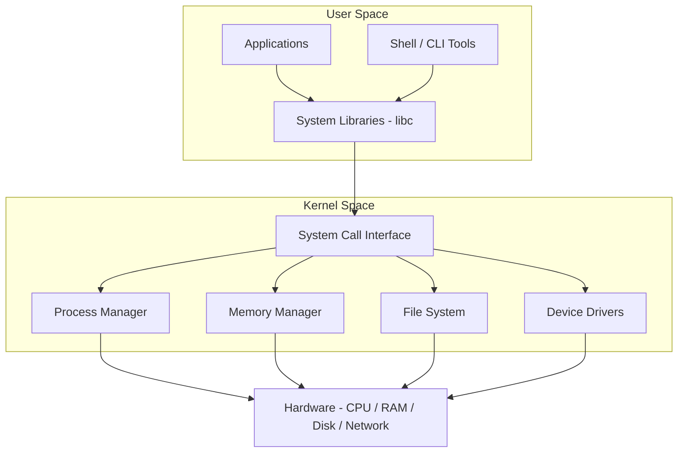

# How Operating Systems Work in General

An operating system (OS) is the software layer between hardware and user applications. It manages hardware resources, provides abstractions for programs, and ensures that multiple applications can run safely and efficiently on the same machine.

## Core Components of an Operating System

### The Kernel

The kernel is the core of the operating system. It runs in a privileged mode (kernel space) with full access to hardware. Its responsibilities include:

- **Process scheduling** - Deciding which process runs on the CPU and for how long.
- **Memory management** - Allocating and freeing RAM for processes.
- **Device drivers** - Communicating with hardware peripherals.
- **File systems** - Organizing data on storage devices.
- **Networking** - Managing network protocols and connections.

### User Space

User space is where applications and user-facing services run. Programs in user space have restricted access to hardware and must request services from the kernel through system calls.



## System Calls

System calls (syscalls) are the interface between user space and the kernel. When a program needs to perform a privileged operation, it makes a system call.

```c
// Example: using the write system call in C
#include <unistd.h>

int main() {
    // write(file_descriptor, buffer, count)
    write(1, "Hello from syscall\n", 19);
    return 0;
}
```

Common system call categories:

| Category         | Examples                          |
|------------------|-----------------------------------|
| Process control  | `fork()`, `exec()`, `exit()`      |
| File management  | `open()`, `read()`, `write()`, `close()` |
| Device management| `ioctl()`, `read()`, `write()`    |
| Information      | `getpid()`, `time()`, `uname()`   |
| Communication    | `pipe()`, `socket()`, `send()`    |

## How a Program Runs

1. The shell receives a command from the user.
2. The shell calls `fork()` to create a child process.
3. The child process calls `exec()` to load the program binary into memory.
4. The kernel allocates memory, sets up the stack, and begins execution.
5. The program interacts with the kernel via system calls as needed.
6. When the program finishes, it calls `exit()` and the kernel reclaims resources.

## Kernel Types

- **Monolithic Kernel** - All OS services run in kernel space (Linux, BSD).
- **Microkernel** - Minimal kernel; most services run in user space (Minix, QNX).
- **Hybrid Kernel** - Combination of both approaches (Windows NT, macOS XNU).

## Booting Process

1. **BIOS/UEFI** initializes hardware and locates the bootloader.
2. **Bootloader** (GRUB, systemd-boot) loads the kernel into memory.
3. **Kernel** initializes hardware drivers, mounts the root file system.
4. **Init system** (systemd, init) starts user-space services.
5. **Login manager** presents the user interface.

## Resources

- [Operating Systems: Three Easy Pieces (free book)](https://pages.cs.wisc.edu/~remzi/OSTEP/)
- [Linux Kernel Documentation](https://www.kernel.org/doc/html/latest/)
- [OSDev Wiki](https://wiki.osdev.org/)
- [How Linux Works by Brian Ward](https://nostarch.com/howlinuxworks3)
- [The Linux Programming Interface by Michael Kerrisk](https://man7.org/tlpi/)
