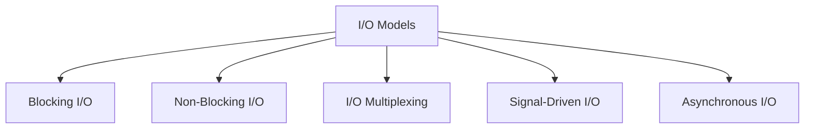

# I/O Management

I/O (Input/Output) management governs how programs read and write data to devices such as disks, network interfaces, and terminals. For backend developers, understanding I/O models is critical because server performance is almost always I/O-bound rather than CPU-bound.

## File Descriptors

A file descriptor (fd) is a non-negative integer that the kernel uses to reference an open file, socket, or pipe. Every process starts with three standard file descriptors:

| FD | Name   | Purpose         |
|----|--------|-----------------|
| 0  | stdin  | Standard input  |
| 1  | stdout | Standard output |
| 2  | stderr | Standard error  |

```c
#include <fcntl.h>
#include <unistd.h>

int main() {
    // open() returns a new file descriptor
    int fd = open("data.txt", O_RDONLY);
    char buf[256];
    ssize_t bytes = read(fd, buf, sizeof(buf));
    write(1, buf, bytes);  // Write to stdout (fd 1)
    close(fd);
    return 0;
}
```

## I/O Models



### Blocking I/O

The default model. The process is suspended until the I/O operation completes.

```c
// Blocks until data is available
ssize_t n = read(fd, buf, sizeof(buf));
```

- Simple to program.
- Wastes CPU time waiting; one thread is needed per concurrent connection.

### Non-Blocking I/O

The system call returns immediately, even if data is not ready. The process must poll repeatedly.

```c
#include <fcntl.h>

// Set fd to non-blocking
int flags = fcntl(fd, F_GETFL, 0);
fcntl(fd, F_SETFL, flags | O_NONBLOCK);

// Returns -1 with errno=EAGAIN if no data
ssize_t n = read(fd, buf, sizeof(buf));
```

- Avoids blocking, but polling wastes CPU cycles.

### I/O Multiplexing

Monitor multiple file descriptors simultaneously and act only when one is ready. This is the backbone of high-performance servers.

#### select / poll

```c
#include <poll.h>

struct pollfd fds[2];
fds[0].fd = client1_fd;
fds[0].events = POLLIN;
fds[1].fd = client2_fd;
fds[1].events = POLLIN;

int ready = poll(fds, 2, 5000);  // Wait up to 5 seconds
if (fds[0].revents & POLLIN) {
    read(client1_fd, buf, sizeof(buf));
}
```

#### epoll (Linux)

`epoll` scales to thousands of connections efficiently. It is used by Nginx, Node.js (libuv), and Redis.

```c
#include <sys/epoll.h>

int epfd = epoll_create1(0);

struct epoll_event ev;
ev.events = EPOLLIN;
ev.data.fd = server_fd;
epoll_ctl(epfd, EPOLL_CTL_ADD, server_fd, &ev);

struct epoll_event events[64];
int nready = epoll_wait(epfd, events, 64, -1);

for (int i = 0; i < nready; i++) {
    if (events[i].data.fd == server_fd) {
        // Accept new connection
    } else {
        // Read from client
    }
}
```

#### kqueue (macOS / BSD)

The equivalent of epoll on macOS and BSD systems. Used by the same high-performance servers on those platforms.

### Asynchronous I/O (AIO)

The kernel performs the I/O operation entirely in the background and notifies the process when it completes. The process does not block or poll.

- **Linux AIO** (`io_submit`) - kernel-level async I/O for files.
- **io_uring** - Modern Linux async I/O interface with high throughput and low overhead.

## Comparison of I/O Models

| Model          | Blocking? | Scalability | Complexity | Use Case                    |
|----------------|-----------|-------------|------------|-----------------------------|
| Blocking       | Yes       | Low         | Low        | Simple scripts, small tools |
| Non-Blocking   | No        | Medium      | Medium     | Polling-based apps          |
| I/O Multiplexing | No     | High        | Medium     | Web servers, proxies        |
| Async I/O      | No        | Very High   | High       | High-performance databases  |

## I/O in Backend Frameworks

| Framework / Runtime | I/O Model                     |
|---------------------|-------------------------------|
| Node.js             | Event loop + epoll/kqueue (libuv) |
| Nginx               | epoll/kqueue event-driven     |
| Go                  | Goroutines + netpoller (epoll/kqueue) |
| Apache              | Thread-per-connection (blocking) |

## Buffered vs Unbuffered I/O

- **Buffered I/O** (stdio: `fread`, `fwrite`): Data is collected in a user-space buffer before being written to the kernel. Reduces system call overhead.
- **Unbuffered I/O** (syscall: `read`, `write`): Each call directly invokes a system call. Lower latency but higher overhead for small writes.

## Resources

- [The C10K Problem](http://www.kegel.com/c10k.html)
- [Linux epoll man page](https://man7.org/linux/man-pages/man7/epoll.7.html)
- [io_uring introduction](https://kernel.dk/io_uring.pdf)
- [Beej's Guide to Network Programming](https://beej.us/guide/bgnet/)
- [libuv Documentation](https://docs.libuv.org/)
