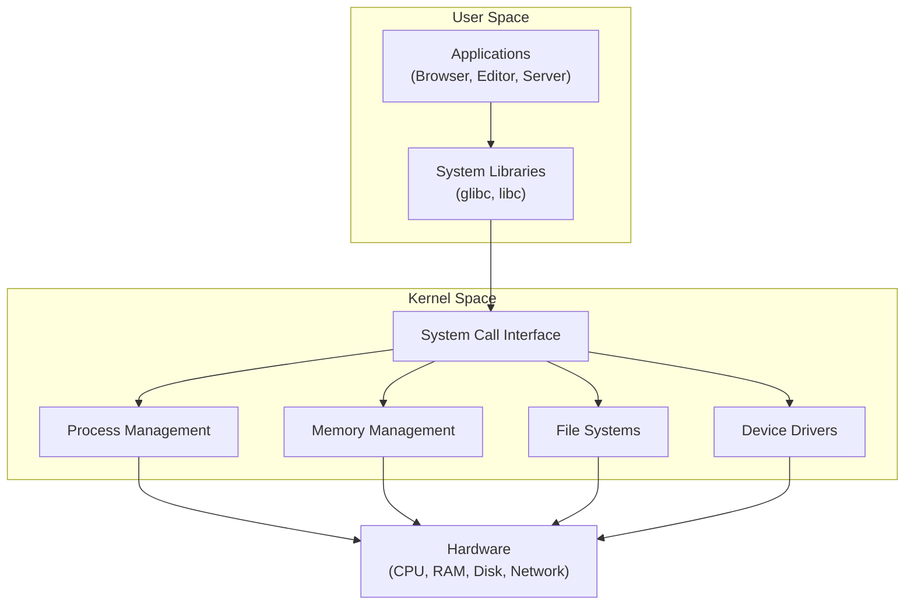
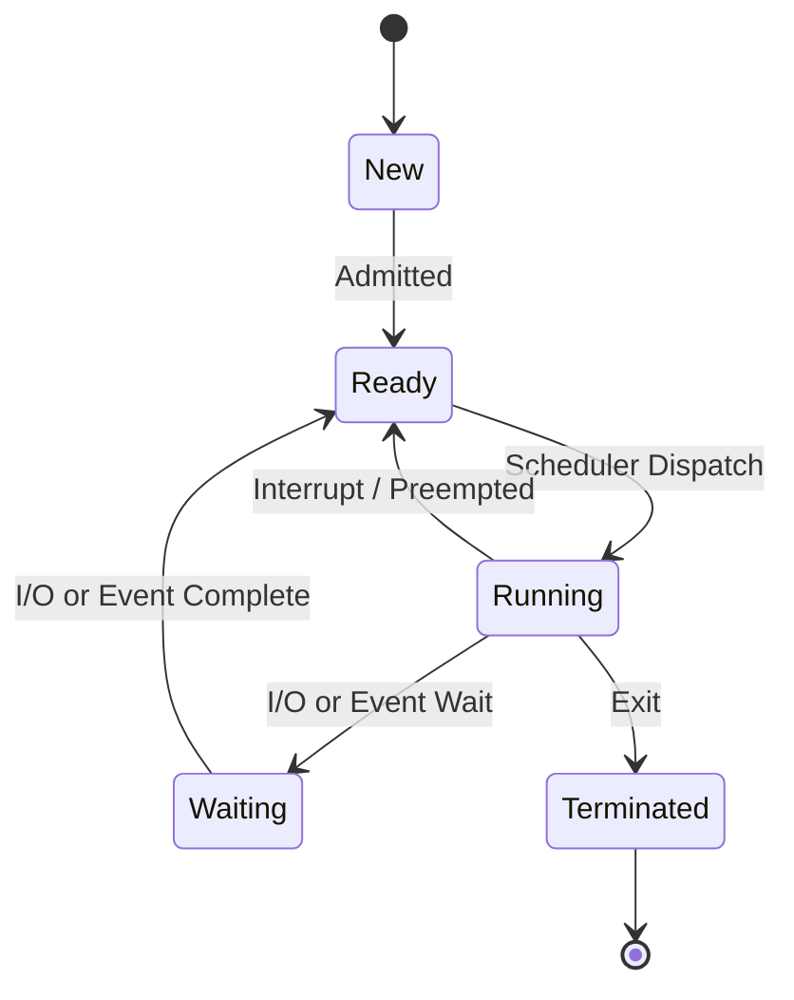
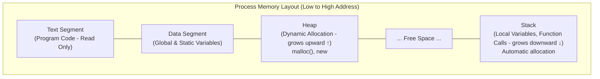

# Operating System and General Knowledge

Understanding operating systems is fundamental to backend development. Whether you are deploying applications on Linux servers, debugging performance issues, or designing systems that handle thousands of concurrent requests, OS knowledge gives you the foundation to make informed decisions.

# Contents

1. [What is an Operating System](#what-is-an-operating-system)
2. [How an OS Works: Kernel and User Space](#how-an-os-works-kernel-and-user-space)
3. [Process Management](#process-management)
4. [Memory Management](#memory-management)
5. [File Systems](#file-systems)
6. [I/O Management](#io-management)
7. [Inter-Process Communication (IPC)](#inter-process-communication-ipc)
8. [Terminal and Shell Basics](#terminal-and-shell-basics)
9. [POSIX Basics](#posix-basics)
10. [Networking Basics](#networking-basics)
11. [Linux vs Windows for Backend Development](#linux-vs-windows-for-backend-development)
12. [Resources](#resources)

---

## What is an Operating System

An operating system (OS) is system software that manages computer hardware, software resources, and provides common services for application programs. It acts as an intermediary between users and the computer hardware.

The core responsibilities of an OS include:

- **Resource allocation** -- managing CPU time, memory, disk space, and I/O devices
- **Abstraction** -- providing a consistent interface so programs do not need to deal with hardware specifics
- **Isolation** -- keeping processes separated so one misbehaving program cannot crash the entire system
- **Security** -- enforcing access controls and permissions

Common operating systems include Linux, Windows, macOS, FreeBSD, and various Unix variants. For backend development, Linux dominates the server landscape, though Windows Server and macOS are also used.

## How an OS Works: Kernel and User Space



The operating system is divided into two primary regions:

### Kernel Space

The **kernel** is the core of the operating system. It runs with full privileges and has direct access to hardware. The kernel is responsible for:

- Scheduling processes on the CPU
- Managing physical and virtual memory
- Handling device drivers
- Providing system calls for user-space programs

There are different kernel architectures:

| Architecture | Description | Examples |
|---|---|---|
| Monolithic | All OS services run in kernel space | Linux, FreeBSD |
| Microkernel | Minimal kernel; most services run in user space | Minix, QNX |
| Hybrid | Combines aspects of both approaches | Windows NT, macOS (XNU) |

### User Space

User space is where all user applications run. Programs in user space cannot directly access hardware or kernel memory. Instead, they make **system calls** (syscalls) to request services from the kernel.

```
User Application
       |
   System Call (e.g., read(), write(), fork())
       |
     Kernel
       |
    Hardware
```

> **Tip:** Understanding the boundary between user space and kernel space helps you reason about performance. Every system call involves a context switch, which has a cost. Minimizing unnecessary syscalls can improve application performance.

## Process Management

### Processes

A **process** is a running instance of a program. Each process has its own:

- **PID (Process ID)** -- a unique identifier
- **Address space** -- isolated memory region
- **File descriptors** -- references to open files, sockets, etc.
- **Environment variables**

Processes go through various states during their lifecycle:



Common process operations:

```bash
# List running processes
ps aux

# View process tree
pstree

# Monitor processes in real time
top
htop

# Send a signal to a process
kill -SIGTERM 1234
kill -9 1234        # force kill
```

### Threads

A **thread** is the smallest unit of execution within a process. Multiple threads within the same process share the same address space and file descriptors, which makes communication between them faster than between processes -- but also introduces concurrency challenges.

| Feature | Process | Thread |
|---|---|---|
| Memory | Separate address space | Shared address space |
| Creation cost | Higher (fork) | Lower (pthread_create) |
| Communication | IPC required | Shared memory directly |
| Isolation | Strong | Weak (bugs can affect other threads) |

### Concurrency and Parallelism

- **Concurrency** means dealing with multiple tasks that make progress over overlapping time periods. Tasks may not literally run at the same time.
- **Parallelism** means tasks execute simultaneously on multiple CPU cores.

Backend servers heavily rely on concurrency models:

- **Multi-process** (e.g., traditional Apache, PHP-FPM)
- **Multi-threaded** (e.g., Java Servlet containers)
- **Event-driven / async I/O** (e.g., Node.js, Nginx)
- **Coroutines / green threads** (e.g., Go goroutines, Python asyncio)

## Memory Management

The OS manages memory to ensure each process gets the resources it needs without interfering with others.

### Virtual Memory

Virtual memory gives each process the illusion of having its own large, contiguous address space. The OS maps virtual addresses to physical addresses using a **page table**.

Benefits of virtual memory:

- Processes are isolated from each other
- Programs can use more memory than physically available (via swapping)
- Memory can be shared between processes efficiently

### Paging

Memory is divided into fixed-size blocks called **pages** (typically 4 KB). The OS keeps track of which pages are in physical RAM and which are swapped to disk.

```
Virtual Address --> Page Table --> Physical Address (RAM or Disk)
```

A **page fault** occurs when a program accesses a page not currently in RAM. The OS then loads the page from disk, which is significantly slower.

### Process Memory Layout



### Stack vs Heap

| Feature | Stack | Heap |
|---|---|---|
| Allocation | Automatic (function calls) | Manual or garbage-collected |
| Speed | Very fast (pointer bump) | Slower (allocation algorithms) |
| Size | Limited (typically 1-8 MB) | Large (limited by virtual memory) |
| Structure | LIFO (last in, first out) | Unstructured |
| Use case | Local variables, function frames | Dynamic data, objects |

```c
// Stack allocation
int x = 42;

// Heap allocation (C)
int *arr = malloc(100 * sizeof(int));
free(arr);
```

> **Tip:** Stack overflow errors occur when the stack runs out of space, often due to deep or infinite recursion. Heap memory leaks occur when allocated memory is never freed.

## File Systems

A file system organizes and manages data on storage devices.

### Common File Systems

| File System | OS | Features |
|---|---|---|
| ext4 | Linux | Journaling, large file support, widely used |
| XFS | Linux | High performance, scalable |
| Btrfs | Linux | Copy-on-write, snapshots, checksums |
| NTFS | Windows | Journaling, ACLs, encryption |
| APFS | macOS | Optimized for SSDs, snapshots, cloning |

### File Permissions (Linux/Unix)

Linux uses a permission model based on three categories: **owner**, **group**, and **others**. Each category has three permission types: **read (r)**, **write (w)**, and **execute (x)**.

```bash
# View file permissions
ls -la

# Example output:
# -rwxr-xr-- 1 alice devs 4096 Jan 15 10:30 deploy.sh
# |---|---|---|
#  owner group others

# Change permissions
chmod 755 deploy.sh    # rwxr-xr-x
chmod u+x script.sh   # add execute for owner

# Change ownership
chown alice:devs file.txt
```

The numeric representation uses octal values: **r=4, w=2, x=1**.

## I/O Management

The OS manages all input/output operations, providing a unified interface for programs to interact with hardware devices, files, and network connections.

### Blocking vs Non-blocking I/O

- **Blocking I/O** -- the process waits until the I/O operation completes. Simple to program but can waste CPU time.
- **Non-blocking I/O** -- the process continues executing and checks for completion later.
- **Asynchronous I/O** -- the OS notifies the process when the operation is complete.

### I/O Multiplexing

I/O multiplexing allows a single thread to monitor multiple file descriptors simultaneously. This is the foundation of high-performance servers like Nginx and Node.js.

Key mechanisms:

| Mechanism | OS | Scalability |
|---|---|---|
| `select` | Cross-platform | Poor (limited to ~1024 fds) |
| `poll` | Cross-platform | Better than select |
| `epoll` | Linux | Excellent (O(1) for events) |
| `kqueue` | BSD/macOS | Excellent |
| `IOCP` | Windows | Excellent |

```c
// Simplified epoll example (Linux)
int epfd = epoll_create1(0);
struct epoll_event event;
event.events = EPOLLIN;
event.data.fd = server_fd;
epoll_ctl(epfd, EPOLL_CTL_ADD, server_fd, &event);

// Wait for events
int n = epoll_wait(epfd, events, MAX_EVENTS, timeout);
```

## Inter-Process Communication (IPC)

Processes need to communicate and share data. The OS provides several IPC mechanisms:

| Mechanism | Description | Use Case |
|---|---|---|
| Pipes | Unidirectional byte stream | Shell command chaining (`ls \| grep`) |
| Named Pipes (FIFOs) | Pipe with a filesystem name | Communication between unrelated processes |
| Message Queues | Structured message passing | Producer-consumer patterns |
| Shared Memory | Direct access to common memory region | High-performance data sharing |
| Sockets | Network-capable communication | Client-server communication |
| Signals | Asynchronous notifications | Process control (SIGTERM, SIGHUP) |
| Semaphores | Synchronization primitive | Controlling access to shared resources |

```bash
# Pipe example in shell
cat access.log | grep "ERROR" | wc -l

# Named pipe
mkfifo /tmp/mypipe
echo "hello" > /tmp/mypipe &
cat /tmp/mypipe
```

## Terminal and Shell Basics

The terminal (or command line) is the primary interface for backend developers working with servers.

### Essential Bash Commands

```bash
# Navigation
pwd                    # print working directory
ls -la                 # list files with details
cd /var/log            # change directory

# File operations
cp source.txt dest.txt # copy file
mv old.txt new.txt     # move/rename file
rm file.txt            # delete file
mkdir -p dir/subdir    # create directories

# Viewing files
cat file.txt           # display entire file
less file.txt          # paginated view
head -n 20 file.txt    # first 20 lines
tail -f app.log        # follow log output

# Searching
grep -r "pattern" .    # recursive search
find . -name "*.log"   # find files by name

# Process management
ps aux                 # list processes
kill PID               # terminate process
nohup cmd &            # run in background, persist after logout

# Disk and memory
df -h                  # disk usage
free -m                # memory usage
du -sh /var/log        # directory size

# Networking
curl http://localhost:8080   # HTTP request
netstat -tlnp                # list listening ports
ss -tlnp                     # modern alternative to netstat

# Permissions
chmod +x script.sh     # make executable
sudo command           # run as superuser
```

### Shell Scripting Basics

```bash
#!/bin/bash

# Variables
APP_NAME="my-backend"
PORT=3000

# Conditionals
if [ -f "config.yml" ]; then
    echo "Config found"
else
    echo "Config missing!"
    exit 1
fi

# Loops
for file in *.log; do
    echo "Processing $file"
    gzip "$file"
done

# Functions
deploy() {
    echo "Deploying $APP_NAME on port $PORT"
    npm start &
}
```

## POSIX Basics

**POSIX** (Portable Operating System Interface) is a family of standards specified by IEEE for maintaining compatibility between operating systems. POSIX defines:

- **System calls** -- standard C API for file operations, process control, signals
- **Shell and utilities** -- standard commands (ls, grep, awk, sed, etc.)
- **Shell language** -- the `sh` shell scripting syntax

Why POSIX matters for backend developers:

- Scripts written to POSIX standards work across Linux, macOS, and other Unix-like systems
- Many server environments expect POSIX-compliant behavior
- Container base images (Alpine, Debian) are POSIX-compliant

```bash
# POSIX-compliant shell script (uses sh, not bash-specific features)
#!/bin/sh
if [ "$ENV" = "production" ]; then
    echo "Running in production mode"
fi
```

> **Tip:** When writing shell scripts for deployment or CI/CD pipelines, prefer POSIX-compliant syntax unless you are certain the target environment has Bash installed.

## Networking Basics

Backend applications are inherently networked. Understanding OS-level networking is essential.

### Sockets

A **socket** is an endpoint for communication. The OS provides a socket API that allows processes to send and receive data over a network.

```python
# Simple TCP server in Python
import socket

server = socket.socket(socket.AF_INET, socket.SOCK_STREAM)
server.bind(('0.0.0.0', 8080))
server.listen(5)

while True:
    client, addr = server.accept()
    data = client.recv(1024)
    client.send(b"HTTP/1.1 200 OK\r\n\r\nHello World")
    client.close()
```

### TCP vs UDP

| Feature | TCP | UDP |
|---|---|---|
| Connection | Connection-oriented | Connectionless |
| Reliability | Guaranteed delivery, ordering | Best effort, no guarantees |
| Speed | Slower (handshake, acks) | Faster (minimal overhead) |
| Use cases | HTTP, databases, file transfer | DNS, streaming, gaming |

### Key Networking Concepts

- **Ports** -- 16-bit numbers (0-65535) identifying services on a host
- **DNS** -- translates domain names to IP addresses
- **Loopback** -- `127.0.0.1` (localhost) for local communication
- **Network interfaces** -- `eth0`, `lo`, `wlan0`

```bash
# Check open ports
ss -tlnp

# DNS lookup
dig example.com
nslookup example.com

# Test connectivity
ping -c 4 google.com
traceroute google.com
```

## Linux vs Windows for Backend Development

| Aspect | Linux | Windows |
|---|---|---|
| Server market share | ~75-80% of web servers | ~20-25% (growing with .NET) |
| Shell | Bash, Zsh, Fish | PowerShell, CMD |
| Package management | apt, yum, pacman | Chocolatey, winget |
| Container support | Native (cgroups, namespaces) | WSL2 / Hyper-V |
| Cost | Free and open source | Licensed |
| Typical stack | LAMP, Node.js, Go, Python | .NET, IIS, SQL Server |
| Remote access | SSH (built-in) | RDP, SSH (OpenSSH) |

**Why Linux dominates backend development:**

- Most cloud servers and containers run Linux
- Docker and Kubernetes are Linux-native
- Better tooling for scripting, automation, and server management
- Lower resource usage
- The open-source ecosystem is centered on Linux

**When Windows makes sense:**

- .NET / C# applications
- Enterprise environments with Active Directory
- Applications requiring Windows-specific services (IIS, SQL Server)

> **Tip:** Even if you develop on macOS or Windows locally, your applications will most likely run on Linux in production. Learning Linux fundamentals is non-negotiable for backend developers.

## Resources

- [Operating Systems: Three Easy Pieces (free online textbook)](https://pages.cs.wisc.edu/~remzi/OSTEP/)
- [Linux Journey -- Learn Linux](https://linuxjourney.com/)
- [The Linux Command Line (free book)](https://linuxcommand.org/tlcl.php)
- [POSIX Standard Overview](https://pubs.opengroup.org/onlinepubs/9699919799/)
- [Beej's Guide to Network Programming](https://beej.us/guide/bgnet/)
- [Linux From Scratch](https://www.linuxfromscratch.org/)
- [How Linux Works by Brian Ward (book)](https://nostarch.com/howlinuxworks3)
- [Julia Evans' Linux zines](https://wizardzines.com/)
- [MIT 6.S081: Operating System Engineering (course)](https://pdos.csail.mit.edu/6.828/2021/schedule.html)
