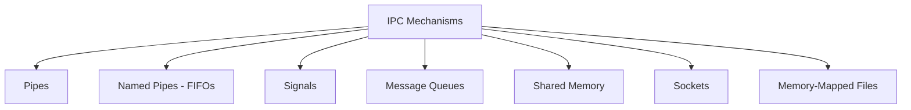

# Interprocess Communication

Interprocess Communication (IPC) refers to mechanisms that allow processes to exchange data and coordinate their actions. Since processes have isolated address spaces, they cannot share memory directly and must rely on IPC facilities provided by the operating system.

## Why IPC Matters

Backend systems often consist of multiple cooperating processes. A web server might communicate with a database, a cache, and background workers. Understanding IPC helps developers choose the right communication strategy for reliability, performance, and simplicity.

## IPC Mechanisms Overview



## Pipes

Pipes provide a unidirectional byte stream between two related processes (typically parent and child).

```c
#include <stdio.h>
#include <unistd.h>
#include <string.h>

int main() {
    int fd[2];
    pipe(fd);  // fd[0] = read end, fd[1] = write end

    if (fork() == 0) {
        // Child: read from pipe
        close(fd[1]);
        char buf[128];
        read(fd[0], buf, sizeof(buf));
        printf("Child received: %s\n", buf);
        close(fd[0]);
    } else {
        // Parent: write to pipe
        close(fd[0]);
        char *msg = "Hello from parent";
        write(fd[1], msg, strlen(msg) + 1);
        close(fd[1]);
    }
    return 0;
}
```

Shell pipes use this mechanism:

```bash
cat access.log | grep "404" | wc -l
```

## Named Pipes (FIFOs)

Named pipes exist as special files in the filesystem, allowing communication between unrelated processes.

```bash
# Create a named pipe
mkfifo /tmp/myfifo

# Terminal 1: Write to the pipe
echo "Hello" > /tmp/myfifo

# Terminal 2: Read from the pipe
cat /tmp/myfifo
```

## Signals

Signals are asynchronous notifications sent to a process. They are limited in data (just a signal number) but useful for control flow.

```c
#include <signal.h>
#include <stdio.h>
#include <unistd.h>

void handler(int sig) {
    printf("Caught signal %d\n", sig);
}

int main() {
    signal(SIGUSR1, handler);
    printf("PID: %d, waiting for SIGUSR1...\n", getpid());
    pause();  // Wait for a signal
    return 0;
}
```

```bash
# Send SIGUSR1 from another terminal
kill -USR1 <pid>
```

## Message Queues

Message queues allow processes to send and receive discrete messages. Messages are stored in a kernel-managed queue and can have types/priorities.

### POSIX Message Queues

```c
#include <mqueue.h>
#include <string.h>

// Sender
mqd_t mq = mq_open("/myqueue", O_CREAT | O_WRONLY, 0644, NULL);
char *msg = "Hello via MQ";
mq_send(mq, msg, strlen(msg) + 1, 0);
mq_close(mq);

// Receiver
mqd_t mq = mq_open("/myqueue", O_RDONLY);
char buf[256];
mq_receive(mq, buf, sizeof(buf), NULL);
printf("Received: %s\n", buf);
mq_close(mq);
mq_unlink("/myqueue");
```

## Shared Memory

Shared memory is the fastest IPC mechanism because data does not need to be copied between processes. Both processes map the same region of physical memory into their address spaces.

```c
#include <sys/mman.h>
#include <fcntl.h>
#include <string.h>
#include <unistd.h>

int main() {
    int fd = shm_open("/myshm", O_CREAT | O_RDWR, 0644);
    ftruncate(fd, 4096);
    char *ptr = mmap(NULL, 4096, PROT_READ | PROT_WRITE, MAP_SHARED, fd, 0);

    if (fork() == 0) {
        // Child reads
        sleep(1);
        printf("Child reads: %s\n", ptr);
    } else {
        // Parent writes
        strcpy(ptr, "Shared data");
        wait(NULL);
    }

    munmap(ptr, 4096);
    shm_unlink("/myshm");
    return 0;
}
```

Shared memory requires synchronization (mutexes or semaphores) to avoid race conditions.

## Sockets

Sockets enable communication between processes on the same machine (Unix domain sockets) or across a network (TCP/UDP sockets). They are the most versatile IPC mechanism.

```bash
# Unix domain socket example with socat
# Terminal 1: Listen
socat UNIX-LISTEN:/tmp/mysock -

# Terminal 2: Connect
echo "Hello via socket" | socat - UNIX-CONNECT:/tmp/mysock
```

## Comparison of IPC Mechanisms

| Mechanism      | Speed    | Complexity | Scope              | Data Type       |
|----------------|----------|------------|--------------------|-----------------|
| Pipe           | Fast     | Low        | Related processes  | Byte stream     |
| Named Pipe     | Fast     | Low        | Same machine       | Byte stream     |
| Signal         | Fast     | Low        | Same machine       | Signal number   |
| Message Queue  | Medium   | Medium     | Same machine       | Discrete messages|
| Shared Memory  | Fastest  | High       | Same machine       | Arbitrary data  |
| Socket         | Variable | Medium     | Local or network   | Byte stream     |

## Resources

- [OSTEP - Concurrency and IPC](https://pages.cs.wisc.edu/~remzi/OSTEP/)
- [Beej's Guide to Unix IPC](https://beej.us/guide/bgipc/)
- [Linux man pages - ipc(7)](https://man7.org/linux/man-pages/man7/ipc_namespaces.7.html)
- [The Linux Programming Interface - IPC Chapters](https://man7.org/tlpi/)
