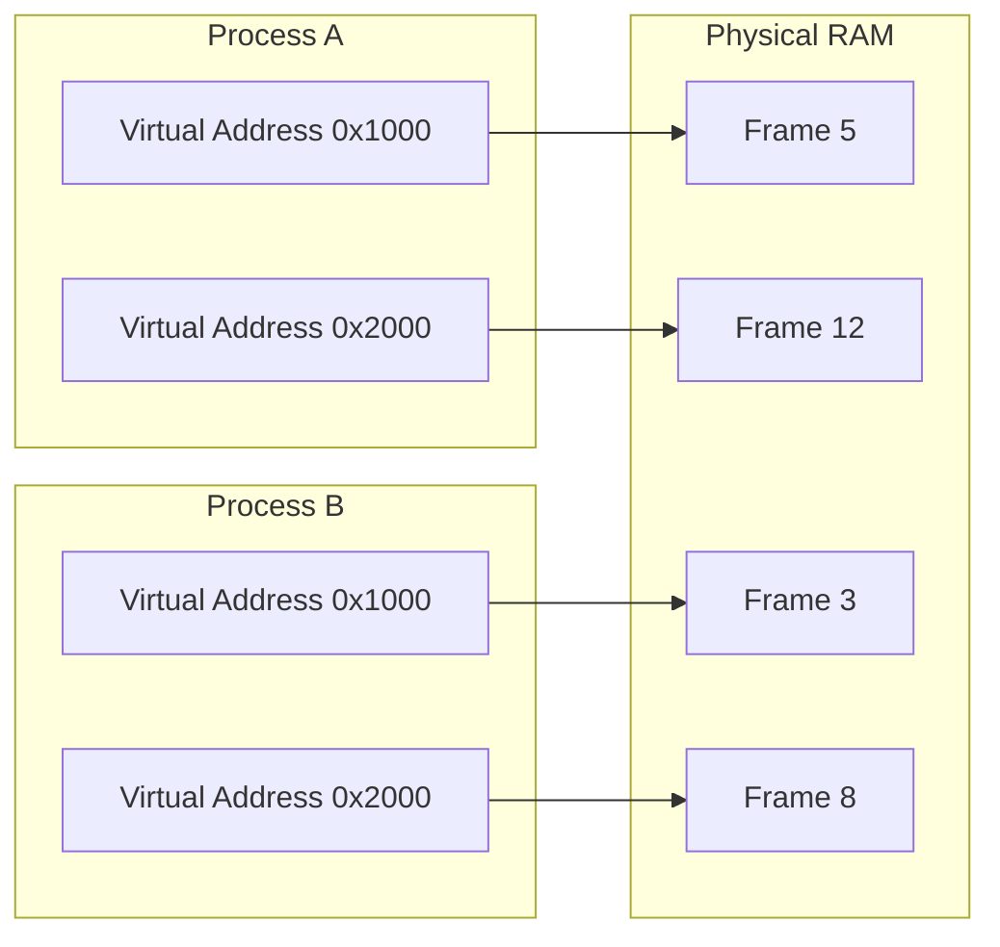

# Memory Management

Memory management is how the operating system allocates, tracks, and reclaims RAM for running processes. Understanding memory management helps backend developers write efficient applications, diagnose memory leaks, and tune server performance.

## Physical vs Virtual Memory

Physical memory is the actual RAM installed in the machine. Virtual memory is an abstraction that gives each process the illusion of having its own large, contiguous address space.



Each process has its own virtual address space mapped to physical frames through page tables managed by the kernel.

## Paging

The OS divides virtual memory into fixed-size blocks called **pages** (typically 4 KB) and physical memory into **frames** of the same size.

### How Paging Works

1. A process accesses a virtual address.
2. The **Memory Management Unit (MMU)** translates the virtual address to a physical address using the page table.
3. If the page is in RAM, the access succeeds.
4. If the page is not in RAM (a **page fault**), the OS loads it from disk (swap space).

### Translation Lookaside Buffer (TLB)

The TLB is a cache for recent virtual-to-physical address translations. It speeds up memory access significantly since most programs exhibit locality of reference.

## Stack vs Heap

| Aspect        | Stack                              | Heap                                |
|---------------|------------------------------------|-------------------------------------|
| Allocation    | Automatic (function scope)         | Manual or GC-managed                |
| Speed         | Very fast (pointer adjustment)     | Slower (search for free block)      |
| Size          | Limited (typically 1-8 MB)         | Large (limited by virtual memory)   |
| Growth        | Grows downward                     | Grows upward                        |
| Data lifetime | Until function returns             | Until explicitly freed or collected  |
| Thread safety | Each thread gets its own stack     | Shared across threads               |

```c
#include <stdlib.h>

void example() {
    int stack_var = 42;             // Allocated on the stack
    int *heap_var = malloc(sizeof(int));  // Allocated on the heap
    *heap_var = 42;

    free(heap_var);  // Must be freed manually in C
    // stack_var is automatically freed when function returns
}
```

## Memory Layout of a Process

```
High Address
+------------------+
|     Stack        |  (grows downward)
|        |         |
|        v         |
|                  |
|        ^         |
|        |         |
|     Heap         |  (grows upward)
+------------------+
|     BSS          |  (uninitialized globals)
+------------------+
|     Data         |  (initialized globals)
+------------------+
|     Text         |  (program code)
+------------------+
Low Address
```

## Garbage Collection

Languages with garbage collection automatically reclaim memory that is no longer referenced. This removes the burden of manual memory management but introduces overhead.

### Common GC Strategies

- **Reference Counting** - Track how many references point to an object. Free when count reaches zero. Used in Python and PHP.
- **Mark and Sweep** - Traverse all reachable objects from root references, then free unmarked objects. Used in JavaScript (V8) and Go.
- **Generational GC** - Objects are grouped by age. Young objects are collected more frequently. Used in Java (JVM) and .NET.

## Memory Issues in Backend Applications

### Memory Leaks

Memory that is allocated but never freed, causing usage to grow over time.

```javascript
// Node.js memory leak example
const cache = [];
app.get('/data', (req, res) => {
    cache.push(new Array(10000).fill('x'));  // Never cleared
    res.json({ cached: cache.length });
});
```

### Monitoring Memory Usage

```bash
# View system memory
free -h

# Process memory usage
ps aux --sort=-%mem | head -10

# Detailed per-process memory map
cat /proc/<pid>/maps

# Monitor in real time
top -o %MEM
```

## Swap Space

Swap is disk space used as an extension of RAM. When physical memory is full, the OS moves inactive pages to swap. This prevents crashes but is much slower than RAM access.

```bash
# Check swap usage
swapon --show
free -h
```

## Resources

- [OSTEP - Virtual Memory](https://pages.cs.wisc.edu/~remzi/OSTEP/vm-intro.pdf)
- [Linux Memory Management Documentation](https://www.kernel.org/doc/html/latest/admin-guide/mm/)
- [Valgrind - Memory Debugging Tool](https://valgrind.org/)
- [Understanding the Linux Virtual Memory Manager](https://www.kernel.org/doc/gorman/)
- [Node.js Memory Leak Detection](https://nodejs.org/en/docs/guides/diagnostics/memory/using-heap-profiler)
