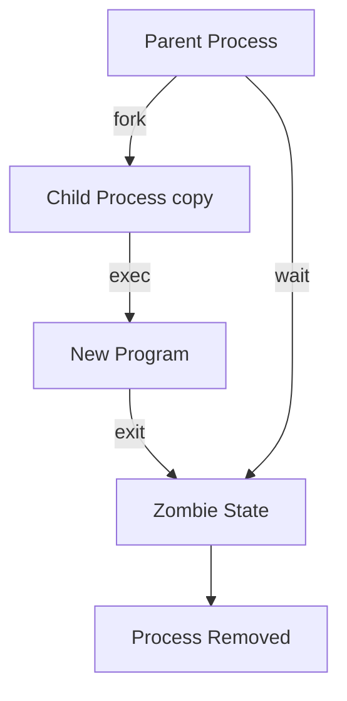

# POSIX Basics

POSIX (Portable Operating System Interface) is a family of standards defined by the IEEE that specifies how operating systems should behave. It ensures that software written for one POSIX-compliant system can be ported to another with minimal changes. Linux, macOS, and the BSDs are POSIX-compliant or mostly compliant.

## Why POSIX Matters

- **Portability** - Code written against POSIX APIs works across Linux, macOS, and BSD.
- **Consistency** - Standard behaviors for file systems, processes, and shell commands.
- **Backend relevance** - Server software (Nginx, PostgreSQL, Redis) relies heavily on POSIX APIs.

## POSIX File System

POSIX defines a hierarchical file system with a single root (`/`). Everything in Unix is represented as a file, including devices, sockets, and pipes.

### Standard Directory Structure

```
/
├── bin/       Essential command binaries
├── etc/       System configuration files
├── home/      User home directories
├── lib/       Shared libraries
├── proc/      Process information (virtual filesystem)
├── tmp/       Temporary files
├── usr/       User programs and libraries
├── var/       Variable data (logs, databases)
└── dev/       Device files
```

### File Operations

```c
#include <fcntl.h>
#include <unistd.h>

int main() {
    // Open a file
    int fd = open("example.txt", O_CREAT | O_WRONLY | O_TRUNC, 0644);

    // Write to it
    write(fd, "Hello POSIX\n", 12);

    // Seek to the beginning
    lseek(fd, 0, SEEK_SET);

    // Close the file
    close(fd);

    // File metadata
    struct stat st;
    stat("example.txt", &st);

    return 0;
}
```

### File Permissions

POSIX uses a permission model with three categories: owner, group, and others.

| Permission | Symbol | Octal |
|------------|--------|-------|
| Read       | r      | 4     |
| Write      | w      | 2     |
| Execute    | x      | 1     |

```bash
# rwxr-xr-- = 754
chmod 754 script.sh
```

## POSIX Process API



### Core Process Functions

```c
#include <unistd.h>
#include <sys/wait.h>
#include <stdio.h>

int main() {
    pid_t pid = fork();

    if (pid == 0) {
        // Child process
        printf("Child PID: %d\n", getpid());
        printf("Parent PID: %d\n", getppid());
        execl("/bin/echo", "echo", "Hello from child", NULL);
    } else {
        // Parent process
        int status;
        waitpid(pid, &status, 0);
        if (WIFEXITED(status)) {
            printf("Child exited with code %d\n", WEXITSTATUS(status));
        }
    }
    return 0;
}
```

### Key Process Functions

| Function   | Purpose                                  |
|------------|------------------------------------------|
| `fork()`   | Create a child process                   |
| `exec()`   | Replace process image with a new program |
| `wait()`   | Wait for child process to terminate      |
| `getpid()` | Get current process ID                   |
| `getppid()`| Get parent process ID                    |
| `exit()`   | Terminate the process                    |
| `kill()`   | Send a signal to a process               |

## POSIX Signals

Signals are software interrupts defined by POSIX for process control and communication.

| Signal   | Default Action | Meaning                      |
|----------|---------------|------------------------------|
| SIGTERM  | Terminate      | Request graceful shutdown    |
| SIGKILL  | Terminate      | Force kill (cannot be caught)|
| SIGINT   | Terminate      | Interrupt from keyboard      |
| SIGHUP   | Terminate      | Terminal hangup              |
| SIGCHLD  | Ignore         | Child process stopped/exited |
| SIGUSR1  | Terminate      | User-defined signal 1        |
| SIGPIPE  | Terminate      | Write to broken pipe         |

```c
#include <signal.h>
#include <stdio.h>

void handle_sigterm(int sig) {
    printf("Graceful shutdown...\n");
    // Clean up resources
    _exit(0);
}

int main() {
    struct sigaction sa;
    sa.sa_handler = handle_sigterm;
    sigemptyset(&sa.sa_mask);
    sa.sa_flags = 0;
    sigaction(SIGTERM, &sa, NULL);

    while (1) {
        pause();  // Wait for signals
    }
    return 0;
}
```

## POSIX Threads (pthreads)

POSIX defines a threading API known as pthreads.

```c
#include <pthread.h>
#include <stdio.h>

void *worker(void *arg) {
    int id = *(int *)arg;
    printf("Thread %d running\n", id);
    return NULL;
}

int main() {
    pthread_t threads[4];
    int ids[4] = {1, 2, 3, 4};

    for (int i = 0; i < 4; i++) {
        pthread_create(&threads[i], NULL, worker, &ids[i]);
    }
    for (int i = 0; i < 4; i++) {
        pthread_join(threads[i], NULL);
    }
    return 0;
}
```

## POSIX Shell

POSIX defines a standard shell (`/bin/sh`) and a set of utilities. Shell scripts written to the POSIX standard are portable across compliant systems.

```bash
#!/bin/sh
# POSIX-compliant script (no bash-isms)
count=0
while [ "$count" -lt 5 ]; do
    echo "Count: $count"
    count=$((count + 1))
done
```

## Resources

- [POSIX.1-2017 Standard](https://pubs.opengroup.org/onlinepubs/9699919799/)
- [The Linux Programming Interface by Michael Kerrisk](https://man7.org/tlpi/)
- [Advanced Programming in the UNIX Environment by Stevens & Rago](https://www.apue.com/)
- [POSIX Threads Programming](https://computing.llnl.gov/tutorials/pthreads/)
