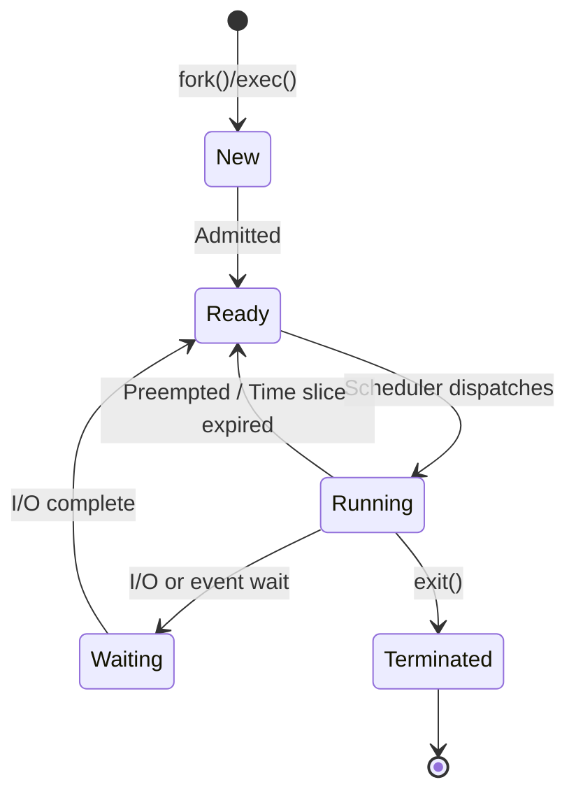

# Process Management

A process is an instance of a running program. Process management is a core responsibility of the operating system, covering how processes are created, scheduled, monitored, and terminated. Understanding processes is essential for backend developers who deploy and manage server applications.

## What is a Process?

A process includes:

- **Program code** (text section)
- **Current activity** (program counter, CPU registers)
- **Stack** (temporary data like function parameters and return addresses)
- **Heap** (dynamically allocated memory)
- **Data section** (global variables)

Each process is identified by a unique **Process ID (PID)**.

## Process Lifecycle



## Process States

| State       | Description                                    |
|-------------|------------------------------------------------|
| New         | Process is being created                       |
| Ready       | Waiting to be assigned to a CPU                |
| Running     | Instructions are being executed                |
| Waiting     | Waiting for an I/O operation or event          |
| Terminated  | Process has finished execution                 |

## Creating Processes

In Unix/Linux, processes are created using `fork()` and `exec()`.

```c
#include <stdio.h>
#include <unistd.h>
#include <sys/wait.h>

int main() {
    pid_t pid = fork();

    if (pid == 0) {
        // Child process
        printf("Child PID: %d\n", getpid());
        execlp("ls", "ls", "-la", NULL);
    } else if (pid > 0) {
        // Parent process
        printf("Parent PID: %d, Child PID: %d\n", getpid(), pid);
        wait(NULL);  // Wait for child to finish
    } else {
        perror("fork failed");
    }
    return 0;
}
```

## Monitoring Processes

### ps - Process Status

```bash
# List all processes
ps aux

# List processes for current user
ps -u $USER

# Show process tree
ps auxf
```

### top / htop - Real-time Monitoring

```bash
# Launch top
top

# Launch htop (enhanced version)
htop
```

### Key Fields in top

| Field   | Meaning                          |
|---------|----------------------------------|
| PID     | Process ID                       |
| USER    | Owner of the process             |
| %CPU    | CPU usage percentage             |
| %MEM    | Memory usage percentage          |
| VSZ     | Virtual memory size              |
| RSS     | Resident set size (physical RAM) |
| STAT    | Process state                    |
| COMMAND | Command that started the process |

## Sending Signals to Processes

Signals are software interrupts sent to processes. The `kill` command sends signals.

```bash
# Send SIGTERM (graceful shutdown, signal 15)
kill 1234

# Send SIGKILL (force kill, signal 9)
kill -9 1234

# Send SIGHUP (reload configuration, signal 1)
kill -HUP 1234

# Kill all processes by name
killall nginx

# Kill processes matching a pattern
pkill -f "node server.js"
```

### Common Signals

| Signal    | Number | Action                        |
|-----------|--------|-------------------------------|
| SIGHUP    | 1      | Hangup / reload config        |
| SIGINT    | 2      | Interrupt (Ctrl+C)            |
| SIGKILL   | 9      | Force kill (cannot be caught) |
| SIGTERM   | 15     | Graceful termination          |
| SIGSTOP   | 19     | Pause process                 |
| SIGCONT   | 18     | Resume paused process         |

## Background and Foreground Processes

```bash
# Run a process in the background
node server.js &

# List background jobs
jobs

# Bring a background job to the foreground
fg %1

# Send a running process to the background
# Press Ctrl+Z first, then:
bg %1
```

## Resources

- [Linux man pages - ps](https://man7.org/linux/man-pages/man1/ps.1.html)
- [Linux man pages - kill](https://man7.org/linux/man-pages/man1/kill.1.html)
- [htop - Interactive Process Viewer](https://htop.dev/)
- [Operating Systems: Three Easy Pieces - Processes](https://pages.cs.wisc.edu/~remzi/OSTEP/cpu-intro.pdf)
- [The Linux Programming Interface - Chapter 6: Processes](https://man7.org/tlpi/)
