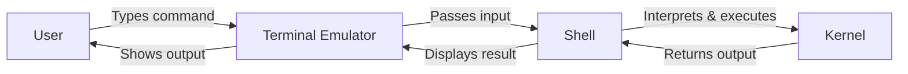

# Terminal Usage

The terminal is the primary interface for backend developers to interact with operating systems, servers, and development tools. Understanding terminal usage is a foundational skill that enables efficient system administration, automation, and software development workflows.

## What is a Terminal?

A terminal (or terminal emulator) is a text-based interface that allows users to communicate with the operating system by typing commands. It provides direct access to the shell, which interprets and executes those commands.

## Common Shells

### Bash (Bourne Again Shell)

Bash is the default shell on most Linux distributions and older macOS versions. It is widely used in scripting and automation.

```bash
# Check your current shell
echo $SHELL

# View bash version
bash --version
```

### Zsh (Z Shell)

Zsh is the default shell on macOS since Catalina. It offers advanced features like better auto-completion, spell correction, and plugin support through frameworks like Oh My Zsh.

```bash
# Switch to zsh
chsh -s $(which zsh)

# View zsh version
zsh --version
```

### Other Shells

- **Fish** - User-friendly shell with syntax highlighting and auto-suggestions out of the box.
- **sh** - The original Bourne shell; minimal and POSIX-compliant.
- **PowerShell** - Cross-platform shell from Microsoft, common on Windows.

## Why the Terminal Matters for Backend Developers

1. **Server Management** - Most servers run headless Linux; SSH and terminal commands are the only way to manage them.
2. **Automation** - Shell scripts automate repetitive tasks such as deployments, backups, and log rotation.
3. **Development Tools** - Package managers, version control (git), containerization (docker), and build tools all operate through the terminal.
4. **Performance** - Terminal operations are faster and more resource-efficient than GUI equivalents.
5. **Remote Access** - SSH provides secure remote access to servers across the network.

## Terminal Anatomy



## Essential Terminal Concepts

### Environment Variables

Environment variables store configuration values accessible by the shell and programs.

```bash
# Set a variable
export MY_VAR="hello"

# Access a variable
echo $MY_VAR

# View all environment variables
env
```

### PATH Variable

The PATH variable tells the shell where to look for executable files.

```bash
# View current PATH
echo $PATH

# Add a directory to PATH
export PATH="$PATH:/usr/local/my-tools/bin"
```

### Shell Configuration Files

- **Bash**: `~/.bashrc`, `~/.bash_profile`
- **Zsh**: `~/.zshrc`, `~/.zprofile`

```bash
# Reload shell configuration
source ~/.zshrc
```

## Keyboard Shortcuts

| Shortcut   | Action                        |
|------------|-------------------------------|
| `Ctrl+C`   | Cancel current command        |
| `Ctrl+D`   | Exit the shell                |
| `Ctrl+L`   | Clear the screen              |
| `Ctrl+R`   | Reverse search command history|
| `Ctrl+A`   | Move cursor to line start     |
| `Ctrl+E`   | Move cursor to line end       |
| `Tab`      | Auto-complete file/command    |

## Resources

- [The Linux Command Line (free book)](https://linuxcommand.org/tlcl.php)
- [Bash Reference Manual](https://www.gnu.org/software/bash/manual/)
- [Zsh Documentation](https://zsh.sourceforge.io/Doc/)
- [Oh My Zsh](https://ohmyz.sh/)
- [ExplainShell - Explain any shell command](https://explainshell.com/)
