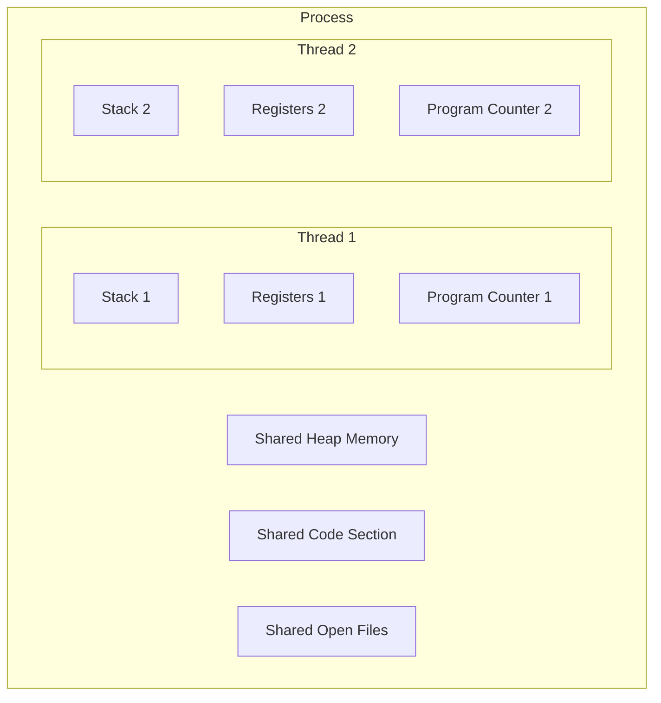

# Threads and Concurrency

Concurrency is the ability of a system to handle multiple tasks at the same time. Threads are lightweight units of execution within a process that enable concurrent programming. Backend developers must understand threads and concurrency to build performant, correct server applications.

## Threads vs Processes

| Aspect           | Process                        | Thread                          |
|------------------|--------------------------------|---------------------------------|
| Memory           | Own address space              | Shares parent process memory    |
| Creation cost    | Expensive (fork + copy)        | Lightweight                     |
| Communication    | IPC mechanisms needed          | Shared memory (direct access)   |
| Isolation        | Fully isolated                 | Not isolated (shared heap)      |
| Crash impact     | Other processes unaffected     | Can crash the entire process    |

## How Threads Work



Each thread has its own stack, registers, and program counter, but shares the heap, code, and file descriptors with other threads in the same process.

## Concurrency vs Parallelism

- **Concurrency**: Multiple tasks make progress by interleaving execution (possible on a single core).
- **Parallelism**: Multiple tasks execute simultaneously on multiple cores.

## Race Conditions

A race condition occurs when the outcome depends on the unpredictable order of thread execution.

```c
#include <pthread.h>
#include <stdio.h>

int counter = 0;

void *increment(void *arg) {
    for (int i = 0; i < 1000000; i++) {
        counter++;  // NOT thread-safe
    }
    return NULL;
}

int main() {
    pthread_t t1, t2;
    pthread_create(&t1, NULL, increment, NULL);
    pthread_create(&t2, NULL, increment, NULL);
    pthread_join(t1, NULL);
    pthread_join(t2, NULL);
    // Expected: 2000000, Actual: unpredictable
    printf("Counter: %d\n", counter);
    return 0;
}
```

## Mutexes (Mutual Exclusion)

A mutex ensures that only one thread accesses a critical section at a time.

```c
#include <pthread.h>
#include <stdio.h>

int counter = 0;
pthread_mutex_t lock = PTHREAD_MUTEX_INITIALIZER;

void *increment(void *arg) {
    for (int i = 0; i < 1000000; i++) {
        pthread_mutex_lock(&lock);
        counter++;  // Now thread-safe
        pthread_mutex_unlock(&lock);
    }
    return NULL;
}
```

## Deadlocks

A deadlock occurs when two or more threads are waiting for each other to release resources, creating a circular dependency.

### Four Conditions for Deadlock

1. **Mutual exclusion** - Resources cannot be shared.
2. **Hold and wait** - A thread holds a resource while waiting for another.
3. **No preemption** - Resources cannot be forcibly taken from a thread.
4. **Circular wait** - A circular chain of threads, each waiting for a resource held by the next.

```
Thread A locks Resource 1, waits for Resource 2
Thread B locks Resource 2, waits for Resource 1
--> Deadlock
```

### Preventing Deadlocks

- Always acquire locks in a consistent global order.
- Use timeouts when attempting to acquire locks.
- Avoid holding multiple locks simultaneously when possible.

## Synchronization Primitives

| Primitive        | Purpose                                        |
|------------------|------------------------------------------------|
| Mutex            | Exclusive access to a resource                 |
| Semaphore        | Limits concurrent access to N threads          |
| Read-Write Lock  | Multiple readers or one writer                 |
| Condition Variable | Thread waits until a condition is signaled   |
| Barrier          | Threads wait until all reach a certain point   |

## Concurrency in Backend Languages

- **Node.js** - Single-threaded event loop with worker threads for CPU tasks.
- **Go** - Goroutines (lightweight threads) with channels for communication.
- **Java** - Native threads with `synchronized`, `ReentrantLock`, and `ExecutorService`.
- **Python** - GIL limits true parallelism; use `multiprocessing` or async I/O.

## Resources

- [OSTEP - Concurrency](https://pages.cs.wisc.edu/~remzi/OSTEP/threads-intro.pdf)
- [The Little Book of Semaphores (free)](https://greenteapress.com/wp/semaphores/)
- [Java Concurrency in Practice](https://jcip.net/)
- [Pthread Tutorial](https://computing.llnl.gov/tutorials/pthreads/)
- [Go Concurrency Patterns](https://go.dev/blog/pipelines)
