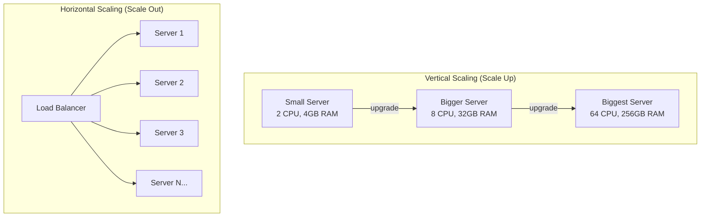
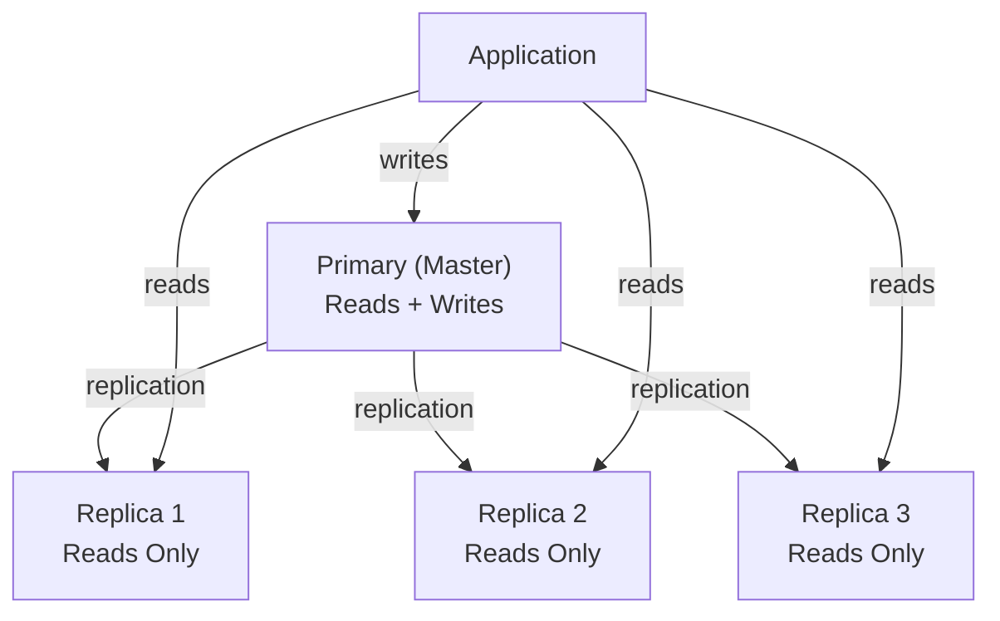
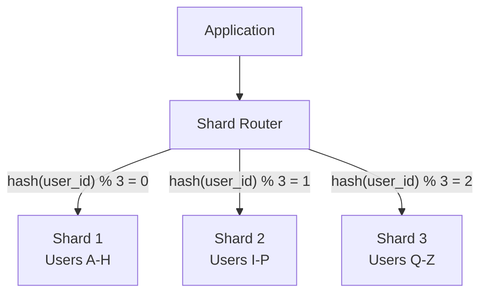
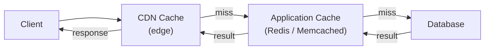
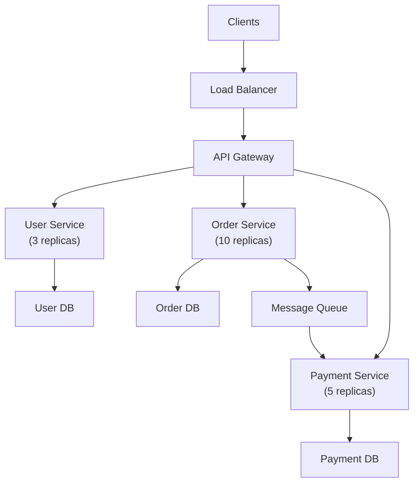
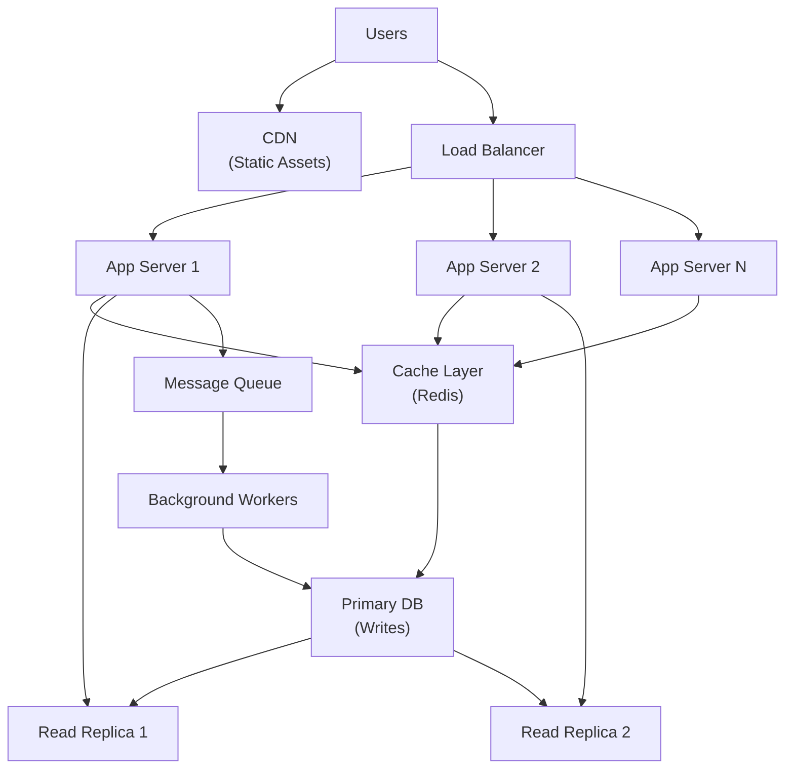

# Scaling

## Table of Contents

1. [What is Scaling](#what-is-scaling)
2. [Vertical vs Horizontal Scaling](#vertical-vs-horizontal-scaling)
3. [Load Balancing](#load-balancing)
4. [Database Scaling](#database-scaling)
5. [Replication](#replication)
6. [Sharding](#sharding)
7. [Read Replicas](#read-replicas)
8. [Caching for Scalability](#caching-for-scalability)
9. [CDN](#cdn)
10. [Microservices and Scaling](#microservices-and-scaling)
11. [Stateless vs Stateful Applications](#stateless-vs-stateful-applications)
12. [Database Connection Pooling](#database-connection-pooling)
13. [Rate Limiting and Throttling](#rate-limiting-and-throttling)
14. [Monitoring and Observability](#monitoring-and-observability)
15. [CAP Theorem Revisited](#cap-theorem-revisited)
16. [Scaling Patterns and Best Practices](#scaling-patterns-and-best-practices)
17. [Resources](#resources)

---

## What is Scaling

Scaling is the process of increasing a system's capacity to handle growing amounts of work. As your application gains users, processes more data, or handles more requests, you need strategies to ensure it continues to perform well.

**Why scaling matters:**

- User growth increases traffic and data volume.
- Slow response times directly impact user retention and revenue.
- Downtime costs money and erodes trust.
- Peak traffic events (product launches, sales events) can be orders of magnitude above normal load.

**Key metrics to watch:**

| Metric | Description |
|--------|-------------|
| Throughput | Requests per second the system can handle |
| Latency | Time to respond to a single request (p50, p95, p99) |
| Error rate | Percentage of failed requests |
| Resource utilization | CPU, memory, disk, network usage |
| Concurrent users | Number of simultaneous active users |

---

## Vertical vs Horizontal Scaling



### Vertical Scaling (Scale Up)

Add more power to your existing machine: more CPU, RAM, faster storage.

**Pros:**

- Simple — no application changes required.
- No distributed system complexity.
- Works well up to a point.

**Cons:**

- Hardware limits — there is a ceiling to how powerful one machine can be.
- Single point of failure.
- Expensive — high-end hardware costs grow non-linearly.
- Requires downtime for upgrades (usually).

### Horizontal Scaling (Scale Out)

Add more machines to distribute the load.

**Pros:**

- Virtually unlimited scaling potential.
- Built-in redundancy — if one node fails, others continue.
- Can use commodity hardware.
- Can scale incrementally.

**Cons:**

- Application must support distributed execution.
- Introduces complexity (networking, data consistency, service discovery).
- Requires load balancing.
- Distributed state management is challenging.

```
Vertical Scaling:          Horizontal Scaling:
┌──────────────┐           ┌────────┐  ┌────────┐  ┌────────┐
│              │           │ Server │  │ Server │  │ Server │
│  BIG Server  │           │   1    │  │   2    │  │   3    │
│  (more CPU,  │           └───┬────┘  └───┬────┘  └───┬────┘
│   more RAM)  │               │           │           │
│              │           ┌───┴───────────┴───────────┴───┐
└──────────────┘           │        Load Balancer           │
                           └───────────────────────────────┘
```

> **Tip:** Most real-world architectures combine both approaches. Scale up your servers to a cost-effective size, then scale out when you need more capacity.

---

## Load Balancing

A load balancer distributes incoming traffic across multiple server instances to prevent any single server from being overwhelmed.

**Types of load balancers:**

| Type | Layer | Description |
|------|-------|-------------|
| **Layer 4 (Transport)** | TCP/UDP | Routes based on IP and port; very fast, no content inspection |
| **Layer 7 (Application)** | HTTP/HTTPS | Routes based on URL, headers, cookies; more flexible |
| **DNS-based** | DNS | Returns different IP addresses for the same domain |
| **Client-side** | Application | Client selects the server (common in microservices with service mesh) |

**Popular load balancers:**

- **Nginx** — Software-based, L7
- **HAProxy** — Software-based, L4/L7, purpose-built for load balancing
- **AWS ALB** — Managed L7 load balancer
- **AWS NLB** — Managed L4 load balancer
- **Envoy** — Service mesh proxy, L7

**Health checks** are critical for load balancers. They periodically verify backend servers are responsive and remove unhealthy instances from the pool.

---

## Database Scaling

Databases are often the first bottleneck as applications scale, because they are stateful and maintain data integrity guarantees that limit parallelism.

**Scaling strategies summary:**

| Strategy | Type | Description |
|----------|------|-------------|
| Vertical scaling | Scale up | Bigger database server |
| Read replicas | Scale out (reads) | Copy data to read-only replicas |
| Sharding | Scale out (writes + reads) | Partition data across servers |
| Caching | Offload | Reduce database load with in-memory cache |
| Connection pooling | Optimize | Reuse database connections |
| Query optimization | Optimize | Indexes, query tuning, schema design |

---

## Replication

Replication copies data from one database server to one or more others, providing redundancy and read scaling.

### Master-Slave (Primary-Replica)



```
Writes ──> Primary (Master)
              │
         replication
              │
    ┌─────────┼─────────┐
    v         v         v
 Replica 1  Replica 2  Replica 3  <── Reads
```

- All writes go to the primary.
- Replicas receive copies of the data (asynchronously or synchronously).
- Read traffic is distributed across replicas.
- If the primary fails, a replica can be promoted.

**Trade-offs:**

- **Async replication** — Fast writes, but replicas may lag behind (eventual consistency).
- **Sync replication** — Replicas are always current, but writes are slower (strong consistency).

### Master-Master (Multi-Primary)

```
Writes ──> Primary 1 <──replication──> Primary 2 <── Writes
```

- Both servers accept writes and replicate to each other.
- Enables write scaling and geographic distribution.
- **Risk of conflicts** — If two primaries update the same record simultaneously, conflict resolution is needed.
- More complex to operate.

---

## Sharding

Sharding (horizontal partitioning) splits data across multiple database instances, each holding a subset of the total data.

```
                    ┌─────────────────┐
                    │  Shard Router    │
                    └───────┬─────────┘
              ┌─────────────┼─────────────┐
              v             v             v
         ┌─────────┐  ┌─────────┐  ┌─────────┐
         │ Shard 1  │  │ Shard 2  │  │ Shard 3  │
         │ Users    │  │ Users    │  │ Users    │
         │ A-H      │  │ I-P      │  │ Q-Z      │
         └─────────┘  └─────────┘  └─────────┘
```



**Sharding strategies:**

| Strategy | Description | Example |
|----------|-------------|---------|
| **Range-based** | Partition by value ranges | Users A-H on shard 1, I-P on shard 2 |
| **Hash-based** | Hash the shard key to determine placement | `hash(user_id) % num_shards` |
| **Geographic** | Partition by geographic region | US users on shard 1, EU users on shard 2 |
| **Directory-based** | Lookup table maps keys to shards | Flexible but adds a lookup step |

**Challenges of sharding:**

- **Cross-shard queries** are expensive (joining data across shards).
- **Rebalancing** data when adding or removing shards is complex.
- **Referential integrity** across shards is not enforced by the database.
- **Increased operational complexity** — more databases to manage, monitor, and back up.

> **Tip:** Avoid premature sharding. Optimize queries, add indexes, use read replicas, and implement caching first. Shard only when these approaches are no longer sufficient.

---

## Read Replicas

Read replicas are database copies that handle only read queries, offloading the primary database.

**Implementation pattern:**

```javascript
// Application-level read/write splitting
const primaryDB = new Pool({ host: 'primary.db.internal', port: 5432 });
const replicaDB = new Pool({ host: 'replica.db.internal', port: 5432 });

// Writes always go to primary
async function createUser(data) {
  return primaryDB.query('INSERT INTO users (name, email) VALUES ($1, $2)', [data.name, data.email]);
}

// Reads go to replica
async function getUser(id) {
  return replicaDB.query('SELECT * FROM users WHERE id = $1', [id]);
}

// For reads that must be up-to-date, use primary
async function getUserAfterUpdate(id) {
  return primaryDB.query('SELECT * FROM users WHERE id = $1', [id]);
}
```

**Replication lag** is the delay between a write to the primary and its appearance on replicas. Your application must handle this — for example, reading from the primary immediately after a write when consistency matters.

---

## Caching for Scalability

Caching stores frequently accessed data in fast storage (typically in-memory) to reduce load on slower backend systems.



**Cache layers:**

```
Client ──> CDN Cache ──> Application Cache ──> Database Cache ──> Database
           (edge)        (Redis/Memcached)     (query cache)
```

**Common caching strategies:**

| Strategy | Description |
|----------|-------------|
| **Cache-Aside** | Application checks cache first, loads from DB on miss, writes to cache |
| **Write-Through** | Write to cache and DB simultaneously |
| **Write-Behind** | Write to cache immediately, async write to DB later |
| **Read-Through** | Cache loads data from DB automatically on miss |

**Example using Redis:**

```javascript
const Redis = require('ioredis');
const redis = new Redis();

async function getUser(id) {
  // Check cache
  const cached = await redis.get(`user:${id}`);
  if (cached) {
    return JSON.parse(cached);
  }

  // Cache miss — query database
  const user = await db.query('SELECT * FROM users WHERE id = $1', [id]);

  // Store in cache with 1 hour TTL
  await redis.set(`user:${id}`, JSON.stringify(user), 'EX', 3600);

  return user;
}

// Invalidate cache on update
async function updateUser(id, data) {
  await db.query('UPDATE users SET name = $1 WHERE id = $2', [data.name, id]);
  await redis.del(`user:${id}`);
}
```

---

## CDN

A Content Delivery Network (CDN) is a geographically distributed network of servers that caches content close to end users, reducing latency and offloading origin servers.

```
User (Tokyo) ──> CDN Edge (Tokyo) ──cache hit──> Response (fast!)
                                  ──cache miss──> Origin Server (US) ──> CDN caches ──> Response
```

**What CDNs cache:**

- Static assets (images, CSS, JavaScript, fonts)
- API responses (with appropriate cache headers)
- HTML pages (for static or semi-static sites)
- Video and streaming content

**Popular CDN providers:**

| Provider | Key Feature |
|----------|-------------|
| Cloudflare | Free tier, DDoS protection, edge computing (Workers) |
| AWS CloudFront | Deep AWS integration |
| Fastly | Real-time purging, edge computing (Compute@Edge) |
| Akamai | Largest CDN network, enterprise focus |

**Cache control headers:**

```http
Cache-Control: public, max-age=31536000, immutable
Cache-Control: private, no-cache
Cache-Control: no-store
```

---

## Microservices and Scaling

Microservices architecture allows you to scale individual services independently based on their specific resource needs.



```
                    ┌──────────────┐
                    │ API Gateway  │
                    └──────┬───────┘
           ┌───────────────┼───────────────┐
           v               v               v
    ┌──────────────┐ ┌──────────┐  ┌──────────────┐
    │ User Service │ │ Order    │  │ Payment      │
    │ (3 instances)│ │ Service  │  │ Service      │
    │              │ │(10 inst.)│  │ (5 instances) │
    └──────────────┘ └──────────┘  └──────────────┘
```

**Scaling advantages of microservices:**

- Scale hot services independently (e.g., order service during a sale).
- Use different technologies for different services.
- Deploy and update services independently.
- Failure in one service does not take down the entire system.

**Scaling challenges:**

- Network latency between services.
- Distributed transactions are complex.
- Monitoring and debugging distributed systems is harder.
- Service discovery and communication overhead.

---

## Stateless vs Stateful Applications

**Stateless applications** do not store client session data on the server. Every request contains all the information needed to process it. This is critical for horizontal scaling because any server instance can handle any request.

**Stateful applications** store session data on the server. If a user's session lives on Server A, their requests must always go to Server A (sticky sessions).

| Aspect | Stateless | Stateful |
|--------|-----------|----------|
| Scaling | Easy (add more instances) | Hard (session affinity required) |
| Failover | Seamless (any server works) | Requires session replication |
| Complexity | Simpler server logic | Complex session management |
| Performance | May need external session store | Fast local access to session |

**Making applications stateless:**

```javascript
// Stateful (BAD for scaling): session stored in server memory
app.use(session({
  store: new MemoryStore(), // Lost if server restarts, not shared across instances
  secret: 'mysecret',
}));

// Stateless option 1: JWT tokens (session data in the token itself)
app.use((req, res, next) => {
  const token = req.headers.authorization?.split(' ')[1];
  req.user = jwt.verify(token, SECRET);
  next();
});

// Stateless option 2: External session store (Redis)
app.use(session({
  store: new RedisStore({ client: redisClient }),
  secret: 'mysecret',
}));
```

> **Tip:** Aim for stateless application servers. Store session data in external systems (Redis, database) or in client-side tokens (JWT).

---

## Database Connection Pooling

Database connections are expensive to establish (TCP handshake, authentication, TLS negotiation). Connection pooling maintains a set of reusable connections, dramatically reducing latency and resource usage.

```
Without pooling:                     With pooling:
Request 1 → open conn → query →     Request 1 ─┐
             close conn              Request 2 ─┤
Request 2 → open conn → query →     Request 3 ─┼──> Connection Pool ──> Database
             close conn              Request 4 ─┤    (10 reusable
Request 3 → open conn → query →     Request 5 ─┘     connections)
             close conn
(3 connections opened/closed)        (connections reused)
```

**Node.js example with pg-pool:**

```javascript
const { Pool } = require('pg');

const pool = new Pool({
  host: 'localhost',
  port: 5432,
  database: 'myapp',
  user: 'appuser',
  password: 'secret',
  max: 20,                    // Maximum connections in pool
  idleTimeoutMillis: 30000,   // Close idle connections after 30s
  connectionTimeoutMillis: 2000, // Fail if can't connect in 2s
});

async function getUser(id) {
  const client = await pool.connect();
  try {
    const result = await client.query('SELECT * FROM users WHERE id = $1', [id]);
    return result.rows[0];
  } finally {
    client.release(); // Return connection to pool (not close)
  }
}
```

**Connection pool sizing:**

A good starting point for pool size: `pool_size = (2 * num_cpu_cores) + num_disk_spindles`. For most cloud databases with SSD storage, 10-20 connections per application instance is a reasonable default. Too many connections can actually **decrease** performance due to contention.

---

## Rate Limiting and Throttling

Rate limiting protects your services from abuse and ensures fair usage by restricting how many requests a client can make within a time window.

**Common algorithms:**

| Algorithm | Description |
|-----------|-------------|
| **Fixed Window** | Count requests in fixed time windows (e.g., 100 req/minute) |
| **Sliding Window** | Weighted average of current and previous window |
| **Token Bucket** | Tokens are added at a fixed rate; each request consumes a token |
| **Leaky Bucket** | Requests queue and are processed at a constant rate |

**Implementation with Redis:**

```javascript
const Redis = require('ioredis');
const redis = new Redis();

async function rateLimiter(req, res, next) {
  const key = `ratelimit:${req.ip}`;
  const limit = 100;        // Max requests
  const window = 60;        // Per 60 seconds

  const current = await redis.incr(key);

  if (current === 1) {
    await redis.expire(key, window);
  }

  // Set rate limit headers
  res.setHeader('X-RateLimit-Limit', limit);
  res.setHeader('X-RateLimit-Remaining', Math.max(0, limit - current));

  if (current > limit) {
    return res.status(429).json({
      error: 'Too Many Requests',
      retryAfter: await redis.ttl(key),
    });
  }

  next();
}
```

**HTTP headers for rate limiting:**

```http
X-RateLimit-Limit: 100
X-RateLimit-Remaining: 57
X-RateLimit-Reset: 1672531200
Retry-After: 30
```

---

## Monitoring and Observability

You cannot scale what you cannot measure. Observability provides the insight needed to make informed scaling decisions.

**Three pillars of observability:**

| Pillar | Description | Tools |
|--------|-------------|-------|
| **Metrics** | Numerical measurements over time (CPU, latency, error rate) | Prometheus, Grafana, Datadog |
| **Logs** | Discrete events with context | ELK Stack, Loki, Splunk |
| **Traces** | End-to-end request paths across services | Jaeger, Zipkin, OpenTelemetry |

**Key metrics for scaling decisions:**

- **Request rate** — Are you approaching your capacity?
- **Response time percentiles** (p50, p95, p99) — Is latency increasing?
- **Error rate** — Are errors spiking as load increases?
- **CPU and memory utilization** — Are servers approaching their limits?
- **Database query time** — Is the database becoming the bottleneck?
- **Queue depth** — Are message queues backing up?

**Auto-scaling based on metrics:**

```yaml
# Kubernetes Horizontal Pod Autoscaler
apiVersion: autoscaling/v2
kind: HorizontalPodAutoscaler
metadata:
  name: web-app-hpa
spec:
  scaleTargetRef:
    apiVersion: apps/v1
    kind: Deployment
    name: web-app
  minReplicas: 2
  maxReplicas: 20
  metrics:
  - type: Resource
    resource:
      name: cpu
      target:
        type: Utilization
        averageUtilization: 70
  - type: Resource
    resource:
      name: memory
      target:
        type: Utilization
        averageUtilization: 80
```

---

## CAP Theorem Revisited

The CAP theorem states that a distributed system can guarantee at most **two out of three** properties simultaneously:

| Property | Description |
|----------|-------------|
| **Consistency (C)** | Every read returns the most recent write |
| **Availability (A)** | Every request receives a response (even if not the latest data) |
| **Partition Tolerance (P)** | System continues operating despite network partitions |

Since network partitions are inevitable in distributed systems, the real choice is between **CP** (consistency when partitioned) and **AP** (availability when partitioned):

| Choice | Behavior During Partition | Examples |
|--------|--------------------------|----------|
| **CP** | Rejects requests to maintain consistency | MongoDB (default), HBase, Redis Cluster |
| **AP** | Serves potentially stale data to remain available | Cassandra, DynamoDB, CouchDB |

> **Tip:** The CAP theorem applies during network partitions. When the network is healthy, a well-designed system can provide all three. Design your system based on your application's tolerance for stale data versus downtime.

**PACELC extension:** In addition to CAP, PACELC considers the trade-off when the system is running normally: **if Partitioned (P), choose A or C; Else (E), choose Latency (L) or Consistency (C)**. This recognizes that even without partitions, there is a latency-consistency trade-off in distributed databases.

---

## Scaling Patterns and Best Practices



### Patterns

1. **CQRS (Command Query Responsibility Segregation)** — Separate read and write models. Write to an optimized write store, read from a denormalized read store. This allows independent scaling of reads and writes.

2. **Event Sourcing** — Store events rather than current state. Rebuild state by replaying events. Enables temporal queries and audit trails.

3. **Database per Service** — Each microservice owns its database. No shared databases. Enables independent scaling and technology choices.

4. **Saga Pattern** — Manage distributed transactions across services through a sequence of local transactions with compensating actions for rollback.

5. **Circuit Breaker** — Prevent cascading failures by short-circuiting calls to failing services.

```javascript
// Simple circuit breaker
class CircuitBreaker {
  constructor(fn, { threshold = 5, timeout = 30000 } = {}) {
    this.fn = fn;
    this.failures = 0;
    this.threshold = threshold;
    this.timeout = timeout;
    this.state = 'CLOSED'; // CLOSED, OPEN, HALF_OPEN
    this.nextAttempt = 0;
  }

  async call(...args) {
    if (this.state === 'OPEN') {
      if (Date.now() < this.nextAttempt) {
        throw new Error('Circuit breaker is OPEN');
      }
      this.state = 'HALF_OPEN';
    }

    try {
      const result = await this.fn(...args);
      this.onSuccess();
      return result;
    } catch (error) {
      this.onFailure();
      throw error;
    }
  }

  onSuccess() {
    this.failures = 0;
    this.state = 'CLOSED';
  }

  onFailure() {
    this.failures++;
    if (this.failures >= this.threshold) {
      this.state = 'OPEN';
      this.nextAttempt = Date.now() + this.timeout;
    }
  }
}
```

### Best Practices

1. **Measure before optimizing** — Profile your system to find the actual bottleneck before making changes.
2. **Scale the bottleneck** — Identify whether CPU, memory, I/O, or network is the constraint.
3. **Cache aggressively** — The fastest request is the one that never hits your server.
4. **Design for failure** — Assume servers will fail. Use retries, circuit breakers, and redundancy.
5. **Use asynchronous processing** — Move long-running tasks to background workers and message queues.
6. **Keep services stateless** — Store state externally to enable easy horizontal scaling.
7. **Optimize database queries** — Add indexes, avoid N+1 queries, use EXPLAIN ANALYZE.
8. **Set timeouts everywhere** — Database queries, HTTP calls, queue consumers. No unbounded waits.
9. **Plan for 10x** — Design your architecture to handle 10 times your current load with minimal changes.
10. **Load test regularly** — Use tools like k6, Locust, or Artillery to simulate traffic and find breaking points.

---

## Resources

- [The Art of Scalability](https://www.amazon.com/Art-Scalability-Architecture-Organizations-Enterprise/dp/0134032802) — Comprehensive scaling methodology
- [Designing Data-Intensive Applications](https://dataintensive.net/) by Martin Kleppmann — Essential reading
- [AWS Well-Architected Framework](https://aws.amazon.com/architecture/well-architected/)
- [Google SRE Book](https://sre.google/sre-book/table-of-contents/) — Free online
- [High Scalability Blog](http://highscalability.com/)
- [CAP Theorem Explained](https://www.ibm.com/topics/cap-theorem)
- [k6 Load Testing](https://k6.io/) — Modern load testing tool
- [Prometheus Monitoring](https://prometheus.io/docs/)
- [Redis Documentation](https://redis.io/docs/)
