# Backpressure

# Contents

1. [Backpressure](#backpressure)
2. [What Is Backpressure?](#what-is-backpressure)
3. [Why It Matters](#why-it-matters)
4. [The Producer-Consumer Problem](#the-producer-consumer-problem)
5. [Backpressure Strategies](#backpressure-strategies)
   1. [Blocking (Flow Control)](#blocking-flow-control)
   2. [Dropping](#dropping)
   3. [Buffering](#buffering)
   4. [Sampling](#sampling)
6. [Strategy Comparison](#strategy-comparison)
7. [Backpressure in a Pipeline](#backpressure-in-a-pipeline)
8. [Reactive Streams](#reactive-streams)
9. [Implementation Examples](#implementation-examples)
   1. [Node.js Stream Backpressure](#nodejs-stream-backpressure)
   2. [Bounded Queue with Backpressure](#bounded-queue-with-backpressure)
   3. [Message Queue Backpressure](#message-queue-backpressure)
   4. [HTTP Server Backpressure](#http-server-backpressure)
10. [Backpressure in Real Systems](#backpressure-in-real-systems)
11. [Best Practices](#best-practices)
12. [Resources](#resources)

---

## What Is Backpressure?

**Backpressure** is a mechanism for controlling the flow of data between a fast producer and a slow consumer. When a downstream component cannot keep up with the rate of incoming data, backpressure signals the upstream component to slow down, preventing system overload.

The term originates from fluid dynamics, where backpressure refers to resistance opposing the desired flow of fluid through a pipe. In software, it is the resistance a slow consumer applies to a fast producer.

> **Tip:** Backpressure is not a failure -- it is a deliberate control mechanism. A system that properly handles backpressure is more resilient than one that blindly accepts all incoming work.

## Why It Matters

When a producer generates data faster than a consumer can process it, one of three things happens:

1. **Memory exhaustion** -- unbounded buffers grow until the process runs out of memory
2. **Cascading failures** -- overwhelmed services start failing and propagate failures upstream
3. **Data loss** -- messages are silently dropped when queues overflow

| Symptom                         | Root Cause                    |
|---------------------------------|-------------------------------|
| Out of memory (OOM) crashes     | Unbounded buffering           |
| Increasing latency over time    | Growing queue depth           |
| Message loss                    | Buffer overflow without handling |
| CPU saturation                  | Processing cannot keep pace   |
| Timeout errors across services  | Cascading overload            |

## The Producer-Consumer Problem

Consider a pipeline where each stage has different throughput:

```
Producer (1000 msg/s) --> Processor (500 msg/s) --> Database (200 msg/s)

Without backpressure:
  Second 1: 800 messages queued
  Second 2: 1600 messages queued
  Second 3: 2400 messages queued
  ...eventually: OOM crash
```

The database can only handle 200 messages per second, but the producer generates 1000. Without backpressure, the gap between production and consumption grows unboundedly.

## Backpressure Strategies

### Blocking (Flow Control)

The producer is paused until the consumer is ready for more data. This is the most straightforward approach and prevents data loss.

```
Producer: "Here's message 101"
Consumer: "I'm busy, please wait"
Producer: [blocks / pauses]
Consumer: "OK, I'm ready now"
Producer: "Here's message 101" [resumes]
```

**Pros:** No data loss, simple mental model
**Cons:** Reduces overall throughput, can cause head-of-line blocking

### Dropping

When the consumer is overwhelmed, excess messages are discarded. This is appropriate when recent data is more valuable than old data (e.g., real-time metrics, video frames).

```
Buffer full [msg1, msg2, msg3, msg4, msg5]
New message arrives --> Drop oldest (msg1) or newest (new msg)
```

**Dropping policies:**
- **Drop head** -- remove the oldest item (good for real-time data)
- **Drop tail** -- reject the newest item (good for preserving order)
- **Drop random** -- remove a random item (load shedding)

### Buffering

Introduce a bounded buffer between producer and consumer. The buffer absorbs temporary bursts, but once full, another strategy (blocking or dropping) must take over.

```
Producer --> [Bounded Buffer: ████████░░] --> Consumer
                                capacity: 10
                                current: 8
```

> **Tip:** An unbounded buffer is not a backpressure strategy -- it is a deferred out-of-memory error. Always set an upper bound on buffer size.

### Sampling

Process only a subset of incoming data, skipping items at regular intervals. Useful for monitoring and analytics where approximate data is acceptable.

```javascript
let counter = 0;
const sampleRate = 10; // Process 1 in every 10 messages

function onMessage(message) {
  counter++;
  if (counter % sampleRate === 0) {
    processMessage(message);
  }
}
```

## Strategy Comparison

| Strategy   | Data Loss | Latency Impact | Use Case                          |
|------------|-----------|----------------|-----------------------------------|
| Blocking   | None      | Increases       | Critical data, financial txns     |
| Dropping   | Yes       | Minimal         | Real-time streams, metrics        |
| Buffering  | Possible  | Absorbs bursts  | Bursty traffic patterns           |
| Sampling   | Yes       | Minimal         | Analytics, monitoring             |

## Backpressure in a Pipeline

```mermaid
flowchart LR
    P[Producer<br/>1000 msg/s] -->|Signal: slow down| B1[Buffer<br/>capacity: 500]
    B1 --> S1[Service A<br/>800 msg/s]
    S1 -->|Signal: slow down| B2[Buffer<br/>capacity: 200]
    B2 --> S2[Service B<br/>300 msg/s]
    S2 -->|Signal: slow down| B3[Buffer<br/>capacity: 100]
    B3 --> DB[(Database<br/>200 msg/s)]

    style P fill:#ff9966,stroke:#333,color:#000
    style B1 fill:#ffcc00,stroke:#333,color:#000
    style B2 fill:#ffcc00,stroke:#333,color:#000
    style B3 fill:#ffcc00,stroke:#333,color:#000
    style S1 fill:#66aaff,stroke:#333,color:#000
    style S2 fill:#66aaff,stroke:#333,color:#000
    style DB fill:#66cc66,stroke:#333,color:#000
```



When the database buffer (B3) fills up, it signals Service B to slow down. When Service B's input buffer (B2) fills up, it signals Service A. This propagates all the way back to the producer, which reduces its output rate to match the slowest component.

## Reactive Streams

The **Reactive Streams** specification defines a standard for asynchronous stream processing with non-blocking backpressure. It is implemented by libraries like RxJS, Project Reactor, and Akka Streams.

The core interfaces are:

- **Publisher** -- produces items and responds to demand
- **Subscriber** -- consumes items and signals demand
- **Subscription** -- the link between publisher and subscriber; carries demand signals
- **Processor** -- acts as both subscriber and publisher (a pipeline stage)

```
Subscriber: "I can handle 10 items"  (request(10))
Publisher:  sends 10 items           (onNext x 10)
Subscriber: "I can handle 5 more"    (request(5))
Publisher:  sends 5 items            (onNext x 5)
```

> **Tip:** The key insight of Reactive Streams is that the consumer controls the flow, not the producer. The consumer requests only as much data as it can handle.

## Implementation Examples

### Node.js Stream Backpressure

Node.js streams have built-in backpressure support through the `write()` return value and the `drain` event.

```javascript
const fs = require('fs');
const { Transform } = require('stream');

const readStream = fs.createReadStream('large-file.csv');
const writeStream = fs.createWriteStream('output.csv');

const transformer = new Transform({
  highWaterMark: 1024 * 16, // 16KB buffer
  transform(chunk, encoding, callback) {
    const processed = processChunk(chunk);
    callback(null, processed);
  },
});

// pipe() handles backpressure automatically
readStream.pipe(transformer).pipe(writeStream);

// Manual backpressure handling without pipe()
readStream.on('data', (chunk) => {
  const canContinue = writeStream.write(chunk);
  if (!canContinue) {
    // Buffer is full -- pause the producer
    readStream.pause();
    writeStream.once('drain', () => {
      // Buffer has drained -- resume the producer
      readStream.resume();
    });
  }
});
```

### Bounded Queue with Backpressure

A queue implementation that applies backpressure when capacity is reached.

```javascript
class BoundedQueue {
  constructor(capacity) {
    this.capacity = capacity;
    this.queue = [];
    this.waitingProducers = [];
    this.waitingConsumers = [];
  }

  async enqueue(item) {
    if (this.waitingConsumers.length > 0) {
      const resolve = this.waitingConsumers.shift();
      resolve(item);
      return;
    }

    if (this.queue.length >= this.capacity) {
      // Backpressure: block the producer until space is available
      await new Promise((resolve) => {
        this.waitingProducers.push(resolve);
      });
    }

    this.queue.push(item);
  }

  async dequeue() {
    if (this.queue.length > 0) {
      const item = this.queue.shift();

      // Signal a waiting producer that space is available
      if (this.waitingProducers.length > 0) {
        const resolve = this.waitingProducers.shift();
        resolve();
      }

      return item;
    }

    // No items available -- block the consumer
    return new Promise((resolve) => {
      this.waitingConsumers.push(resolve);
    });
  }

  get size() {
    return this.queue.length;
  }
}

// Usage
const queue = new BoundedQueue(100);

// Producer
async function produce() {
  for (let i = 0; i < 10000; i++) {
    await queue.enqueue({ id: i, data: `message-${i}` });
    // Automatically slows down when queue is full
  }
}

// Consumer
async function consume() {
  while (true) {
    const item = await queue.dequeue();
    await processItem(item); // Slow operation
  }
}
```

### Message Queue Backpressure

Using RabbitMQ prefetch count to control how many messages a consumer receives before acknowledging.

```javascript
const amqp = require('amqplib');

async function startConsumer() {
  const connection = await amqp.connect('amqp://localhost');
  const channel = await connection.createChannel();

  // Prefetch: only deliver 10 unacknowledged messages at a time
  // This is the backpressure mechanism
  await channel.prefetch(10);

  await channel.assertQueue('tasks', { durable: true });

  channel.consume('tasks', async (msg) => {
    try {
      await processTask(JSON.parse(msg.content.toString()));
      channel.ack(msg); // Acknowledge -- allows next message to be delivered
    } catch (err) {
      channel.nack(msg, false, true); // Requeue on failure
    }
  });
}
```

### HTTP Server Backpressure

Limit the number of concurrent requests being processed by your HTTP server.

```javascript
class ConnectionLimiter {
  constructor(maxConcurrent) {
    this.maxConcurrent = maxConcurrent;
    this.active = 0;
  }

  middleware() {
    return (req, res, next) => {
      if (this.active >= this.maxConcurrent) {
        res.status(503).json({
          error: 'Service temporarily overloaded',
          retryAfter: 5,
        });
        return;
      }

      this.active++;
      res.on('finish', () => {
        this.active--;
      });

      next();
    };
  }
}

const limiter = new ConnectionLimiter(200);
app.use(limiter.middleware());
```

## Backpressure in Real Systems

- **Kafka** -- consumers control their own read rate via polling. The broker does not push faster than consumers can pull.
- **TCP** -- the TCP sliding window protocol is a backpressure mechanism. The receiver advertises how much data it can accept.
- **gRPC** -- supports flow control at the HTTP/2 level, with per-stream and per-connection flow control windows.
- **Kubernetes** -- horizontal pod autoscaling responds to backpressure by adding more consumer pods.

## Best Practices

- **Never use unbounded queues or buffers.** Always set a maximum capacity.
- **Propagate backpressure end-to-end.** Every stage in your pipeline must participate.
- **Choose the right strategy for your data.** Blocking for critical data, dropping for real-time streams.
- **Monitor queue depths.** A steadily growing queue indicates a throughput mismatch that buffering alone cannot solve.
- **Prefer pull-based over push-based designs.** Let consumers request work when they are ready.
- **Design idempotent consumers.** If messages are retried due to backpressure, idempotency prevents duplicate processing.
- **Test with load that exceeds capacity.** Verify your system degrades gracefully under overload.

> **Tip:** Backpressure is a symptom, not a disease. If your system is constantly under backpressure, you need to either increase consumer capacity or reduce producer output -- buffering only buys you time.

## Resources

- [Reactive Streams Specification](https://www.reactive-streams.org/)
- [Node.js Backpressuring in Streams](https://nodejs.org/en/learn/modules/backpressuring-in-streams)
- [RabbitMQ Consumer Prefetch](https://www.rabbitmq.com/docs/consumer-prefetch)
- [Kafka Consumer Design](https://kafka.apache.org/documentation/#consumerconfigs)
- [Jay Kreps - Backpressure in Distributed Systems](https://www.confluent.io/blog/)
- [Mechanical Sympathy - Applying Backpressure](https://mechanical-sympathy.blogspot.com/)
