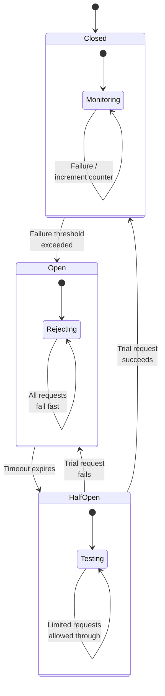
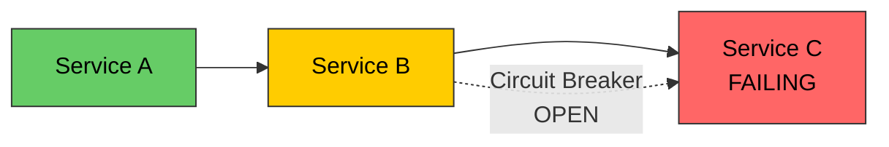

# Circuit Breaker Pattern

# Contents

1. [Circuit Breaker Pattern](#circuit-breaker-pattern)
2. [What Is a Circuit Breaker?](#what-is-a-circuit-breaker)
3. [Why Use Circuit Breakers?](#why-use-circuit-breakers)
4. [How It Works](#how-it-works)
5. [Circuit Breaker States](#circuit-breaker-states)
   1. [Closed State](#closed-state)
   2. [Open State](#open-state)
   3. [Half-Open State](#half-open-state)
6. [State Diagram](#state-diagram)
7. [Preventing Cascading Failures](#preventing-cascading-failures)
8. [Implementation](#implementation)
   1. [Circuit Breaker from Scratch](#circuit-breaker-from-scratch)
   2. [Using the Circuit Breaker](#using-the-circuit-breaker)
   3. [Circuit Breaker with Events](#circuit-breaker-with-events)
9. [Libraries and Frameworks](#libraries-and-frameworks)
   1. [Opossum (Node.js)](#opossum-nodejs)
   2. [Resilience4j (Java)](#resilience4j-java)
   3. [Polly (.NET)](#polly-net)
10. [Configuration Guidelines](#configuration-guidelines)
11. [When to Use Circuit Breakers](#when-to-use-circuit-breakers)
12. [Best Practices](#best-practices)
13. [Resources](#resources)

---

## What Is a Circuit Breaker?

The **circuit breaker pattern** is a stability pattern that prevents an application from repeatedly calling a service that is likely to fail. Just like an electrical circuit breaker that trips to prevent damage from excessive current, a software circuit breaker stops making calls to a failing service and fails fast instead.

> **Tip:** The circuit breaker pattern was popularized by Michael Nygard in his book "Release It!" and has since become a foundational pattern in microservice architectures.

## Why Use Circuit Breakers?

In a distributed system, services depend on one another. When a downstream service fails or becomes slow, the calling service can:

- **Exhaust its thread pool** waiting for responses that never come
- **Consume all available connections** to the failed service
- **Propagate the failure** to its own callers, creating a cascade

| Without Circuit Breaker                     | With Circuit Breaker                        |
|---------------------------------------------|---------------------------------------------|
| Requests pile up waiting for timeouts       | Fails fast, freeing resources immediately   |
| Thread pool exhaustion in the caller        | Caller remains responsive                   |
| Cascading failures across the system        | Failure is isolated to the broken service   |
| Slow degradation until total system failure | Quick recovery when the service comes back  |

## How It Works

The circuit breaker wraps a function call and monitors it for failures. Based on the failure rate, it transitions between states:

1. **Normally (Closed):** All requests pass through to the downstream service. The breaker counts failures.
2. **After threshold exceeded (Open):** Requests are immediately rejected without calling the downstream service. This gives the failing service time to recover.
3. **After a timeout (Half-Open):** A limited number of test requests are allowed through to check if the service has recovered.

## Circuit Breaker States

### Closed State

The default state. Requests flow normally. The breaker tracks the number of recent failures.

- If failures exceed the threshold (e.g., 5 failures in 60 seconds), the breaker **trips** to Open.
- If requests succeed, the failure counter resets.

### Open State

All requests are immediately rejected with an error -- no call is made to the downstream service.

- A timeout timer starts (e.g., 30 seconds).
- After the timeout expires, the breaker transitions to Half-Open.
- This state protects both the caller and the failing service.

### Half-Open State

A limited number of trial requests are allowed through to test if the service has recovered.

- If the trial requests succeed, the breaker resets to Closed.
- If any trial request fails, the breaker trips back to Open and the timeout resets.

## State Diagram



## Preventing Cascading Failures

Consider a system where Service A calls Service B, which calls Service C:



Without a circuit breaker, Service C's failure causes Service B to hang, which causes Service A to hang. With a circuit breaker on B's calls to C, Service B fails fast and can return a fallback response, keeping Service A healthy.

## Implementation

### Circuit Breaker from Scratch

```javascript
class CircuitBreaker {
  constructor(options = {}) {
    this.state = 'CLOSED';
    this.failureCount = 0;
    this.successCount = 0;
    this.failureThreshold = options.failureThreshold || 5;
    this.resetTimeout = options.resetTimeout || 30000; // 30 seconds
    this.halfOpenMaxAttempts = options.halfOpenMaxAttempts || 3;
    this.halfOpenAttempts = 0;
    this.nextAttempt = Date.now();
  }

  async execute(fn) {
    if (this.state === 'OPEN') {
      if (Date.now() < this.nextAttempt) {
        throw new Error('Circuit breaker is OPEN -- request rejected');
      }
      this.state = 'HALF_OPEN';
      this.halfOpenAttempts = 0;
    }

    if (this.state === 'HALF_OPEN' && this.halfOpenAttempts >= this.halfOpenMaxAttempts) {
      throw new Error('Circuit breaker HALF_OPEN -- max trial attempts reached');
    }

    try {
      const result = await fn();
      this.onSuccess();
      return result;
    } catch (error) {
      this.onFailure();
      throw error;
    }
  }

  onSuccess() {
    if (this.state === 'HALF_OPEN') {
      this.successCount++;
      if (this.successCount >= this.halfOpenMaxAttempts) {
        this.reset();
      }
    }
    this.failureCount = 0;
  }

  onFailure() {
    this.failureCount++;

    if (this.state === 'HALF_OPEN' || this.failureCount >= this.failureThreshold) {
      this.trip();
    }
  }

  trip() {
    this.state = 'OPEN';
    this.nextAttempt = Date.now() + this.resetTimeout;
    console.warn(`Circuit breaker tripped to OPEN. Next attempt at ${new Date(this.nextAttempt).toISOString()}`);
  }

  reset() {
    this.state = 'CLOSED';
    this.failureCount = 0;
    this.successCount = 0;
    this.halfOpenAttempts = 0;
    console.info('Circuit breaker reset to CLOSED');
  }
}
```

### Using the Circuit Breaker

```javascript
const axios = require('axios');

const breaker = new CircuitBreaker({
  failureThreshold: 3,
  resetTimeout: 10000,
});

async function getUser(userId) {
  try {
    const result = await breaker.execute(async () => {
      const response = await axios.get(`http://user-service/users/${userId}`, {
        timeout: 3000,
      });
      return response.data;
    });
    return result;
  } catch (error) {
    if (error.message.includes('Circuit breaker')) {
      // Return fallback data
      return { id: userId, name: 'Unknown', source: 'fallback' };
    }
    throw error;
  }
}
```

### Circuit Breaker with Events

Add observability by emitting events on state transitions.

```javascript
const EventEmitter = require('events');

class ObservableCircuitBreaker extends EventEmitter {
  constructor(options) {
    super();
    this.state = 'CLOSED';
    this.failureCount = 0;
    this.failureThreshold = options.failureThreshold || 5;
    this.resetTimeout = options.resetTimeout || 30000;
    this.nextAttempt = Date.now();
  }

  trip() {
    const previousState = this.state;
    this.state = 'OPEN';
    this.nextAttempt = Date.now() + this.resetTimeout;
    this.emit('stateChange', { from: previousState, to: 'OPEN' });
    this.emit('open');
  }

  reset() {
    const previousState = this.state;
    this.state = 'CLOSED';
    this.failureCount = 0;
    this.emit('stateChange', { from: previousState, to: 'CLOSED' });
    this.emit('close');
  }
}

// Usage with monitoring
const breaker = new ObservableCircuitBreaker({ failureThreshold: 3 });

breaker.on('open', () => {
  metrics.increment('circuit_breaker.opened');
  alerting.warn('Circuit breaker opened for user-service');
});

breaker.on('close', () => {
  metrics.increment('circuit_breaker.closed');
});

breaker.on('stateChange', ({ from, to }) => {
  console.log(`Circuit breaker: ${from} --> ${to}`);
});
```

## Libraries and Frameworks

### Opossum (Node.js)

```javascript
const CircuitBreaker = require('opossum');

const options = {
  timeout: 3000,           // 3 second timeout
  errorThresholdPercentage: 50,  // trip when 50% of requests fail
  resetTimeout: 30000,     // try again after 30 seconds
};

const breaker = new CircuitBreaker(asyncFunction, options);

breaker.fallback(() => {
  return { data: 'fallback response' };
});

breaker.on('success', (result) => console.log('Success:', result));
breaker.on('timeout', () => console.log('Timeout'));
breaker.on('reject', () => console.log('Rejected -- circuit is open'));
breaker.on('open', () => console.log('Circuit opened'));
breaker.on('halfOpen', () => console.log('Circuit half-opened'));
breaker.on('close', () => console.log('Circuit closed'));

const result = await breaker.fire(args);
```

### Resilience4j (Java)

```java
CircuitBreakerConfig config = CircuitBreakerConfig.custom()
    .failureRateThreshold(50)
    .waitDurationInOpenState(Duration.ofSeconds(30))
    .slidingWindowSize(10)
    .minimumNumberOfCalls(5)
    .permittedNumberOfCallsInHalfOpenState(3)
    .build();

CircuitBreaker circuitBreaker = CircuitBreaker.of("userService", config);

Supplier<String> decoratedSupplier = CircuitBreaker
    .decorateSupplier(circuitBreaker, () -> userService.getUser(userId));

Try<String> result = Try.ofSupplier(decoratedSupplier)
    .recover(throwable -> "fallback response");
```

### Polly (.NET)

```csharp
var circuitBreakerPolicy = Policy
    .Handle<HttpRequestException>()
    .Or<TimeoutException>()
    .CircuitBreakerAsync(
        exceptionsAllowedBeforeBreaking: 3,
        durationOfBreak: TimeSpan.FromSeconds(30),
        onBreak: (exception, duration) =>
        {
            logger.LogWarning($"Circuit broken for {duration.TotalSeconds}s");
        },
        onReset: () =>
        {
            logger.LogInformation("Circuit reset");
        }
    );

var result = await circuitBreakerPolicy.ExecuteAsync(async () =>
{
    return await httpClient.GetStringAsync("http://user-service/users/1");
});
```

## Configuration Guidelines

| Parameter                 | Description                                     | Typical Value      |
|---------------------------|-------------------------------------------------|--------------------|
| Failure Threshold         | Number or percentage of failures to trip         | 5 failures or 50%  |
| Reset Timeout             | How long to wait before testing recovery         | 15-60 seconds      |
| Timeout                   | Max wait time for a single call                  | 2-5 seconds        |
| Sliding Window Size       | Number of calls to consider for failure rate     | 10-100 calls       |
| Half-Open Max Attempts    | Number of trial requests in half-open state      | 1-5 requests       |
| Minimum Calls             | Minimum calls before failure rate is calculated  | 5-10 calls         |

> **Tip:** Start with conservative settings (low threshold, longer reset timeout) and tune based on observed behavior. Setting the threshold too high delays failure detection; setting it too low causes unnecessary tripping.

## When to Use Circuit Breakers

**Use circuit breakers when:**

- Calling external services or APIs over the network
- Accessing shared resources like databases or caches
- Making calls that are likely to fail if they have recently failed
- You need to prevent cascading failures in a microservice architecture

**Do not use circuit breakers when:**

- The call is local and unlikely to fail due to external factors
- Failure is expected and handled normally (e.g., cache miss)
- The operation is idempotent and can be safely retried indefinitely
- The cost of failing fast is higher than the cost of waiting

## Best Practices

- **Combine with retries.** Use retries inside the circuit breaker for transient failures, but let the breaker trip for persistent failures.
- **Add fallback responses.** Always define what happens when the circuit is open.
- **Monitor circuit breaker state.** Expose metrics for open/closed/half-open state changes.
- **Use per-service breakers.** Do not share a single circuit breaker across unrelated services.
- **Log state transitions.** Every trip and reset should be logged and ideally trigger an alert.
- **Consider bulkheading.** Combine circuit breakers with bulkheads (separate thread pools) for complete isolation.
- **Test the open state.** Verify that your application behaves correctly when the circuit is open.

## Resources

- [Martin Fowler - Circuit Breaker](https://martinfowler.com/bliki/CircuitBreaker.html)
- [Microsoft - Circuit Breaker Pattern](https://learn.microsoft.com/en-us/azure/architecture/patterns/circuit-breaker)
- [Release It! by Michael Nygard](https://pragprog.com/titles/mnee2/release-it-second-edition/)
- [Opossum - Node.js Circuit Breaker](https://github.com/nodeshift/opossum)
- [Resilience4j Documentation](https://resilience4j.readme.io/)
- [Polly - .NET Resilience Library](https://github.com/App-vNext/Polly)
- [Netflix Hystrix (archived, for historical reference)](https://github.com/Netflix/Hystrix)
