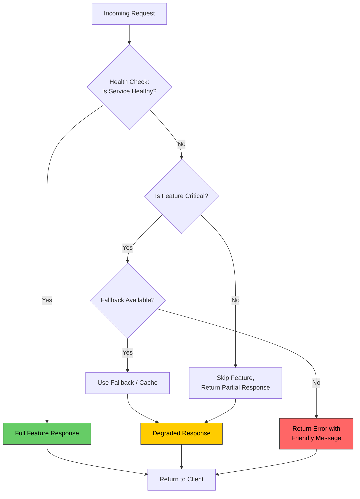

# Graceful Degradation

# Contents

1. [Graceful Degradation](#graceful-degradation)
2. [What Is Graceful Degradation?](#what-is-graceful-degradation)
3. [Why It Matters](#why-it-matters)
4. [How It Works](#how-it-works)
5. [Strategies](#strategies)
   1. [Feature Toggles](#feature-toggles)
   2. [Fallback Responses](#fallback-responses)
   3. [Reduced Functionality](#reduced-functionality)
   4. [Static Content Serving](#static-content-serving)
6. [Degradation Flow](#degradation-flow)
7. [Implementation Patterns](#implementation-patterns)
   1. [Feature Toggle Service](#feature-toggle-service)
   2. [Fallback with Cache](#fallback-with-cache)
   3. [Middleware-Based Degradation](#middleware-based-degradation)
8. [Real-World Examples](#real-world-examples)
9. [Best Practices](#best-practices)
10. [Resources](#resources)

---

## What Is Graceful Degradation?

**Graceful degradation** is a design strategy where a system continues to operate with reduced functionality when one or more of its components fail, rather than crashing entirely. The goal is to preserve the core user experience even when supporting services become unavailable.

> **Tip:** Think of graceful degradation like a car with a flat tire. The car does not explode -- you can still drive slowly to safety. Similarly, your application should remain usable, even if some features are temporarily unavailable.

## Why It Matters

In distributed systems, failures are not a matter of "if" but "when." A single dependency going down should not take your entire platform offline.

| Scenario                          | Without Degradation             | With Degradation                        |
|-----------------------------------|---------------------------------|-----------------------------------------|
| Recommendation service is down    | Product page fails to load      | Product page loads without recommendations |
| Payment provider is slow          | Checkout times out completely   | User is shown a "retry later" message   |
| Search index is unavailable       | Search returns a 500 error      | Search falls back to a simpler query    |
| Analytics service is unreachable  | Page load is blocked            | Page loads; analytics are queued         |

## How It Works

Graceful degradation relies on identifying **critical** vs **non-critical** components. When a non-critical component fails, the system bypasses or replaces it rather than propagating the failure.

The general approach involves:

1. **Classify features** by priority (critical, important, nice-to-have)
2. **Define fallback behavior** for each non-critical feature
3. **Monitor health** of dependencies continuously
4. **Trigger degradation** automatically when thresholds are breached
5. **Restore full functionality** when the dependency recovers

## Strategies

### Feature Toggles

Feature toggles (also called feature flags) allow you to enable or disable features at runtime without deploying new code. During degradation, toggles can be flipped to disable problematic features.

```javascript
// Feature toggle configuration
const featureFlags = {
  recommendations: true,
  liveChat: true,
  advancedSearch: true,
  analytics: true,
};

function isFeatureEnabled(featureName) {
  return featureFlags[featureName] ?? false;
}

// Usage in a route handler
app.get('/product/:id', async (req, res) => {
  const product = await productService.getById(req.params.id);

  let recommendations = [];
  if (isFeatureEnabled('recommendations')) {
    try {
      recommendations = await recommendationService.getFor(product.id);
    } catch (err) {
      // Disable the feature automatically on failure
      featureFlags.recommendations = false;
      console.warn('Recommendations disabled due to service failure');
    }
  }

  res.render('product', { product, recommendations });
});
```

### Fallback Responses

When a service call fails, return a pre-defined fallback response instead of an error.

```javascript
async function getProductReviews(productId) {
  try {
    return await reviewService.fetch(productId);
  } catch (error) {
    console.warn(`Review service unavailable: ${error.message}`);
    // Return cached or static fallback
    return {
      reviews: [],
      summary: 'Reviews are temporarily unavailable.',
      averageRating: null,
    };
  }
}
```

### Reduced Functionality

Offer a simpler version of a feature when the full version cannot be served.

```javascript
async function search(query) {
  try {
    // Full-featured search with facets, suggestions, and ranking
    return await elasticsearchClient.search({
      index: 'products',
      body: buildAdvancedQuery(query),
    });
  } catch (error) {
    console.warn('Elasticsearch unavailable, falling back to DB search');
    // Simple database LIKE query as fallback
    return await db.query(
      'SELECT * FROM products WHERE name ILIKE $1 LIMIT 20',
      [`%${query}%`]
    );
  }
}
```

### Static Content Serving

When dynamic content generation fails, serve pre-rendered static pages.

```javascript
app.get('/homepage', async (req, res) => {
  try {
    const dynamicContent = await contentService.getHomepage();
    res.render('homepage', dynamicContent);
  } catch (error) {
    // Serve a pre-built static HTML version
    res.sendFile(path.join(__dirname, 'static', 'homepage-fallback.html'));
  }
});
```

## Degradation Flow



## Implementation Patterns

### Feature Toggle Service

A centralized toggle service that checks dependency health and controls feature availability.

```javascript
class DegradationManager {
  constructor() {
    this.services = new Map();
    this.checkInterval = 10000; // 10 seconds
  }

  register(serviceName, healthCheckFn, fallbackFn) {
    this.services.set(serviceName, {
      healthy: true,
      healthCheck: healthCheckFn,
      fallback: fallbackFn,
      failureCount: 0,
      threshold: 3,
    });
  }

  async startMonitoring() {
    setInterval(async () => {
      for (const [name, service] of this.services) {
        try {
          await service.healthCheck();
          service.healthy = true;
          service.failureCount = 0;
        } catch (err) {
          service.failureCount++;
          if (service.failureCount >= service.threshold) {
            service.healthy = false;
            console.warn(`Service "${name}" marked as degraded`);
          }
        }
      }
    }, this.checkInterval);
  }

  async execute(serviceName, primaryFn) {
    const service = this.services.get(serviceName);
    if (!service) throw new Error(`Unknown service: ${serviceName}`);

    if (service.healthy) {
      try {
        return await primaryFn();
      } catch (err) {
        service.failureCount++;
        if (service.failureCount >= service.threshold) {
          service.healthy = false;
        }
        return await service.fallback();
      }
    }

    return await service.fallback();
  }
}
```

### Fallback with Cache

Use a caching layer so that the last known good response can be returned during outages.

```javascript
const NodeCache = require('node-cache');
const cache = new NodeCache({ stdTTL: 300 }); // 5-minute TTL

async function getWithFallbackCache(key, fetchFn) {
  try {
    const freshData = await fetchFn();
    cache.set(key, freshData);
    return { data: freshData, degraded: false };
  } catch (error) {
    const cachedData = cache.get(key);
    if (cachedData) {
      return { data: cachedData, degraded: true };
    }
    throw new Error('Service unavailable and no cached data');
  }
}
```

### Middleware-Based Degradation

Express middleware that automatically handles degradation across routes.

```javascript
function degradable(serviceName, fallbackResponse) {
  return async (req, res, next) => {
    const service = degradationManager.services.get(serviceName);

    if (service && !service.healthy) {
      res.set('X-Degraded', 'true');
      return res.json(fallbackResponse);
    }

    next();
  };
}

// Usage
app.get('/api/recommendations',
  degradable('recommendation-service', { items: [], message: 'Recommendations unavailable' }),
  async (req, res) => {
    const items = await recommendationService.getFor(req.query.userId);
    res.json({ items });
  }
);
```

## Real-World Examples

**Netflix** is well known for its aggressive graceful degradation strategy:

- If the personalization service is down, users see a generic "Top 10" list instead of personalized recommendations.
- If video metadata is unavailable, a cached version is displayed.
- The entire Chaos Engineering practice (Chaos Monkey, Simian Army) is designed to test degradation paths.

**Amazon** employs graceful degradation across its retail platform:

- If the recommendation engine fails, the product page still loads with the core product data.
- During peak traffic (Prime Day), non-essential services like detailed analytics or complex promotions may be temporarily disabled to protect checkout flow.

**Twitter/X** degrades timeline rendering:

- When the ranking algorithm is overloaded, users may see a reverse-chronological timeline instead of an algorithmically ranked one.

## Best Practices

- **Always prioritize core business functions.** Identify the minimum viable experience and protect it at all costs.
- **Test your degradation paths.** Use chaos engineering techniques to simulate failures in staging and production.
- **Communicate degradation to users.** Show banners or messages like "Some features are temporarily limited" instead of silently hiding content.
- **Include degradation status in responses.** Use headers like `X-Degraded: true` so clients and monitoring tools are aware.
- **Set recovery thresholds.** Automatically restore full functionality after a service has been healthy for a defined period.
- **Log and alert on degradation events.** Every degradation activation should trigger an alert for the operations team.

> **Tip:** Graceful degradation is not an excuse for poor reliability. It is a safety net, not a substitute for building robust services. Always fix the root cause of failures.

## Resources

- [Netflix Tech Blog - Fault Tolerance in a High Volume, Distributed System](https://netflixtechblog.com/fault-tolerance-in-a-high-volume-distributed-system-91ab4faae74a)
- [Martin Fowler - Feature Toggles](https://martinfowler.com/articles/feature-toggles.html)
- [AWS Architecture Blog - Implementing Graceful Degradation](https://aws.amazon.com/blogs/architecture/)
- [Google SRE Book - Handling Overload](https://sre.google/sre-book/handling-overload/)
- [Release It! by Michael Nygard](https://pragprog.com/titles/mnee2/release-it-second-edition/)
