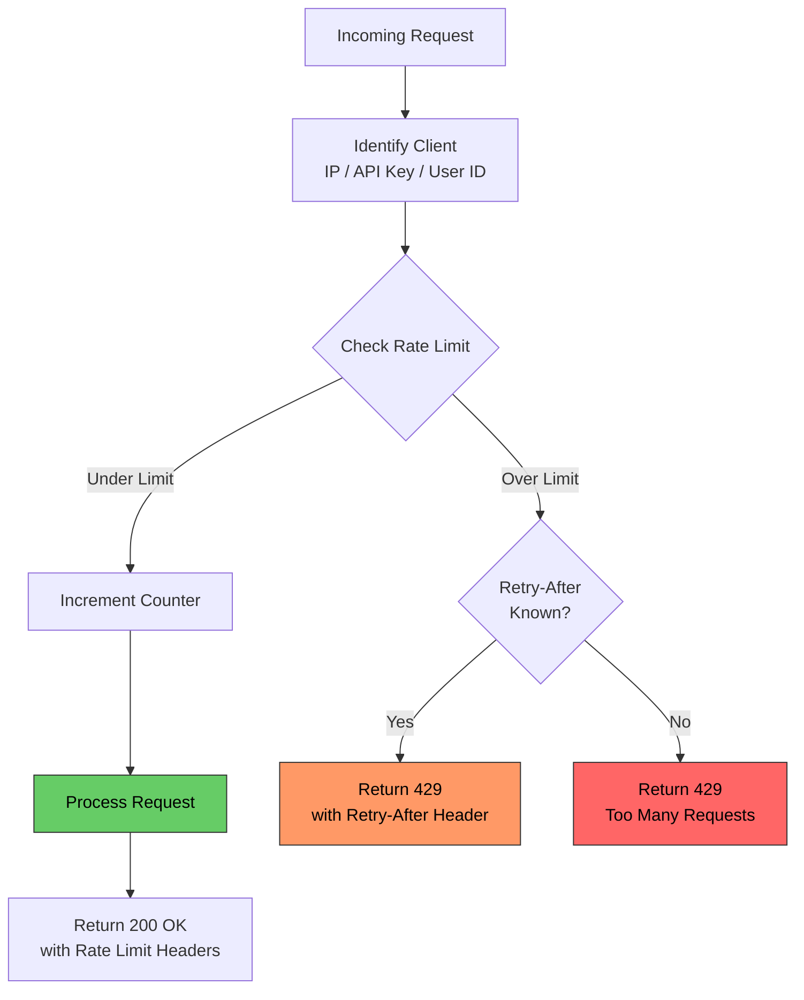

# Throttling

# Contents

1. [Throttling](#throttling)
2. [What Is Throttling?](#what-is-throttling)
3. [Why Throttle?](#why-throttle)
4. [Types of Throttling](#types-of-throttling)
   1. [Rate Limiting](#rate-limiting)
   2. [Concurrent Request Limiting](#concurrent-request-limiting)
   3. [Bandwidth Throttling](#bandwidth-throttling)
5. [Throttling Algorithms](#throttling-algorithms)
   1. [Token Bucket](#token-bucket)
   2. [Leaky Bucket](#leaky-bucket)
   3. [Fixed Window Counter](#fixed-window-counter)
   4. [Sliding Window Log](#sliding-window-log)
   5. [Sliding Window Counter](#sliding-window-counter)
6. [Algorithm Comparison](#algorithm-comparison)
7. [Throttling Flow](#throttling-flow)
8. [Implementation Examples](#implementation-examples)
   1. [Token Bucket in Node.js](#token-bucket-in-nodejs)
   2. [Redis-Based Sliding Window](#redis-based-sliding-window)
   3. [Express Rate Limiting Middleware](#express-rate-limiting-middleware)
9. [HTTP 429 Too Many Requests](#http-429-too-many-requests)
10. [Best Practices](#best-practices)
11. [Resources](#resources)

---

## What Is Throttling?

**Throttling** is a technique used to control the rate at which requests are processed by a system. It acts as a gatekeeper that limits the number of operations a client or service can perform within a given time window, preventing resource exhaustion and ensuring fair usage.

> **Tip:** Throttling is different from debouncing. Throttling ensures a function executes at most once per interval, while debouncing delays execution until a quiet period has passed. Both are useful, but throttling is the standard approach for API protection.

## Why Throttle?

Without throttling, a single misbehaving client or a traffic spike can overwhelm your services:

- **Protect system resources** -- CPU, memory, database connections are finite
- **Ensure fair usage** -- prevent one client from monopolizing the system
- **Reduce costs** -- avoid unnecessary scaling for abusive traffic
- **Maintain SLAs** -- keep response times within acceptable limits for all users
- **Prevent abuse** -- stop brute-force attacks, scraping, or spam

## Types of Throttling

### Rate Limiting

Controls the number of requests a client can make within a time window (e.g., 100 requests per minute).

```
Client A: ████████░░  (80/100 used)   -- OK
Client B: ██████████  (100/100 used)  -- THROTTLED
Client C: ███░░░░░░░  (30/100 used)   -- OK
```

### Concurrent Request Limiting

Limits the number of simultaneous in-flight requests, regardless of the time window.

```
Max concurrent: 5
Active requests: [Req1, Req2, Req3, Req4, Req5]
New request arrives --> QUEUED or REJECTED
```

### Bandwidth Throttling

Limits the amount of data transferred per unit of time, commonly used for file downloads or streaming.

```
User (free tier):    500 KB/s
User (premium tier): 5 MB/s
```

## Throttling Algorithms

### Token Bucket

The token bucket algorithm uses a bucket that holds tokens. Tokens are added at a fixed rate. Each request consumes one token. If the bucket is empty, the request is rejected.

**Characteristics:**
- Allows short bursts of traffic (up to the bucket capacity)
- Smooth average rate over time
- Simple to implement

```
Bucket capacity: 10 tokens
Refill rate: 2 tokens/second

Time 0s: [██████████] 10 tokens -- Burst of 8 requests allowed
Time 0s: [██░░░░░░░░]  2 tokens -- 8 tokens consumed
Time 1s: [████░░░░░░]  4 tokens -- 2 tokens refilled
Time 2s: [██████░░░░]  6 tokens -- 2 tokens refilled
```

### Leaky Bucket

Requests enter a bucket (queue) and are processed at a constant rate. If the bucket overflows, new requests are dropped.

**Characteristics:**
- Produces a perfectly smooth output rate
- No bursts allowed
- Acts as a traffic shaper

### Fixed Window Counter

Divides time into fixed windows (e.g., 1-minute intervals) and counts requests per window. Simple but susceptible to burst traffic at window boundaries.

```
Window: 12:00 - 12:01  |  Limit: 100
                        |
12:00:00  ████          |  20 requests
12:00:30  ████████████  |  80 requests (total: 100)
12:00:45  ██ BLOCKED    |  Limit reached
12:01:00  -- new window--|  Counter resets
```

> **Tip:** The boundary problem with fixed windows: a client can send 100 requests at 12:00:59 and another 100 at 12:01:00, effectively sending 200 requests in 2 seconds while technically staying within the per-minute limit.

### Sliding Window Log

Keeps a log of exact timestamps for each request. When a new request arrives, it removes timestamps older than the window and checks the count. Precise but memory-intensive.

### Sliding Window Counter

A hybrid approach that combines fixed window and sliding window. It estimates the count by weighting the current and previous windows based on the overlap.

```
Previous window count: 70 (12:00 - 12:01)
Current window count:  30 (12:01 - 12:02)
Current time: 12:01:15 (25% into current window)

Estimated count = 70 * (1 - 0.25) + 30 = 70 * 0.75 + 30 = 82.5
Limit: 100 --> ALLOWED
```

## Algorithm Comparison

| Algorithm              | Burst Handling  | Memory Usage | Precision | Complexity |
|------------------------|-----------------|--------------|-----------|------------|
| Token Bucket           | Allows bursts   | Low          | Good      | Low        |
| Leaky Bucket           | No bursts       | Low          | Good      | Low        |
| Fixed Window Counter   | Boundary issues | Very Low     | Low       | Very Low   |
| Sliding Window Log     | No bursts       | High         | Exact     | Medium     |
| Sliding Window Counter | Minimal bursts  | Low          | Good      | Medium     |

## Throttling Flow



## Implementation Examples

### Token Bucket in Node.js

```javascript
class TokenBucket {
  constructor(capacity, refillRate) {
    this.capacity = capacity;
    this.tokens = capacity;
    this.refillRate = refillRate; // tokens per second
    this.lastRefill = Date.now();
  }

  refill() {
    const now = Date.now();
    const elapsed = (now - this.lastRefill) / 1000;
    this.tokens = Math.min(
      this.capacity,
      this.tokens + elapsed * this.refillRate
    );
    this.lastRefill = now;
  }

  consume(tokens = 1) {
    this.refill();
    if (this.tokens >= tokens) {
      this.tokens -= tokens;
      return true;
    }
    return false;
  }
}

// Usage
const buckets = new Map();

function rateLimitMiddleware(req, res, next) {
  const clientId = req.ip;

  if (!buckets.has(clientId)) {
    buckets.set(clientId, new TokenBucket(10, 2)); // 10 capacity, 2/sec refill
  }

  const bucket = buckets.get(clientId);

  if (bucket.consume()) {
    res.set('X-RateLimit-Remaining', Math.floor(bucket.tokens));
    next();
  } else {
    res.status(429).json({
      error: 'Too Many Requests',
      message: 'Rate limit exceeded. Please try again later.',
      retryAfter: Math.ceil(1 / bucket.refillRate),
    });
  }
}
```

### Redis-Based Sliding Window

For distributed systems, store rate limit counters in Redis so all instances share state.

```javascript
const Redis = require('ioredis');
const redis = new Redis();

async function slidingWindowRateLimit(clientId, limit, windowMs) {
  const now = Date.now();
  const windowStart = now - windowMs;
  const key = `ratelimit:${clientId}`;

  const pipeline = redis.pipeline();

  // Remove expired entries
  pipeline.zremrangebyscore(key, 0, windowStart);

  // Count current entries
  pipeline.zcard(key);

  // Add current request
  pipeline.zadd(key, now, `${now}-${Math.random()}`);

  // Set expiry on the key
  pipeline.pexpire(key, windowMs);

  const results = await pipeline.exec();
  const currentCount = results[1][1];

  if (currentCount >= limit) {
    return { allowed: false, remaining: 0 };
  }

  return { allowed: true, remaining: limit - currentCount - 1 };
}

// Middleware usage
app.use(async (req, res, next) => {
  const result = await slidingWindowRateLimit(req.ip, 100, 60000); // 100/min

  res.set('X-RateLimit-Limit', '100');
  res.set('X-RateLimit-Remaining', String(result.remaining));

  if (!result.allowed) {
    return res.status(429).json({ error: 'Rate limit exceeded' });
  }

  next();
});
```

### Express Rate Limiting Middleware

Using the popular `express-rate-limit` library:

```javascript
const rateLimit = require('express-rate-limit');

const apiLimiter = rateLimit({
  windowMs: 15 * 60 * 1000, // 15 minutes
  max: 100,                  // limit each IP to 100 requests per window
  standardHeaders: true,     // return rate limit info in RateLimit-* headers
  legacyHeaders: false,      // disable X-RateLimit-* headers
  message: {
    error: 'Too many requests, please try again later.',
  },
});

app.use('/api/', apiLimiter);

// Different limits for different endpoints
const authLimiter = rateLimit({
  windowMs: 15 * 60 * 1000,
  max: 5, // strict limit for auth endpoints
  message: { error: 'Too many login attempts' },
});

app.use('/api/auth/', authLimiter);
```

## HTTP 429 Too Many Requests

When a client exceeds the rate limit, respond with HTTP status code **429**. Include helpful headers so the client knows when to retry.

```http
HTTP/1.1 429 Too Many Requests
Content-Type: application/json
Retry-After: 30
X-RateLimit-Limit: 100
X-RateLimit-Remaining: 0
X-RateLimit-Reset: 1672531260

{
  "error": "Too Many Requests",
  "message": "Rate limit exceeded. Please retry after 30 seconds.",
  "retryAfter": 30
}
```

**Standard headers to include:**

| Header                | Description                                      |
|-----------------------|--------------------------------------------------|
| `Retry-After`         | Seconds (or date) until the client can retry      |
| `X-RateLimit-Limit`   | Maximum requests allowed in the window            |
| `X-RateLimit-Remaining` | Requests remaining in the current window        |
| `X-RateLimit-Reset`   | Unix timestamp when the window resets             |

## Best Practices

- **Use different limits for different tiers.** Free users get 100 req/min, paid users get 1000 req/min.
- **Apply throttling at multiple layers.** API gateway, load balancer, and application level.
- **Identify clients correctly.** Use API keys for authenticated traffic and IP addresses as a fallback.
- **Return meaningful error responses.** Always include `Retry-After` and rate limit headers.
- **Use distributed storage (Redis) for rate limiting** in multi-instance deployments.
- **Log throttled requests** for monitoring and debugging abusive patterns.
- **Exempt health checks and internal services** from throttling rules.
- **Implement backoff on the client side.** Exponential backoff with jitter is the standard approach.

> **Tip:** Do not rely solely on client-side rate limiting. Clients can be modified or bypassed. Server-side enforcement is mandatory.

## Resources

- [IETF RFC 6585 - HTTP 429 Too Many Requests](https://tools.ietf.org/html/rfc6585)
- [Stripe Engineering - Rate Limiters and Load Shedders](https://stripe.com/blog/rate-limiters)
- [Google Cloud Architecture - Rate Limiting](https://cloud.google.com/architecture/rate-limiting-strategies-techniques)
- [Token Bucket Algorithm - Wikipedia](https://en.wikipedia.org/wiki/Token_bucket)
- [express-rate-limit Documentation](https://github.com/express-rate-limit/express-rate-limit)
- [Redis Rate Limiting Patterns](https://redis.io/glossary/rate-limiting)
