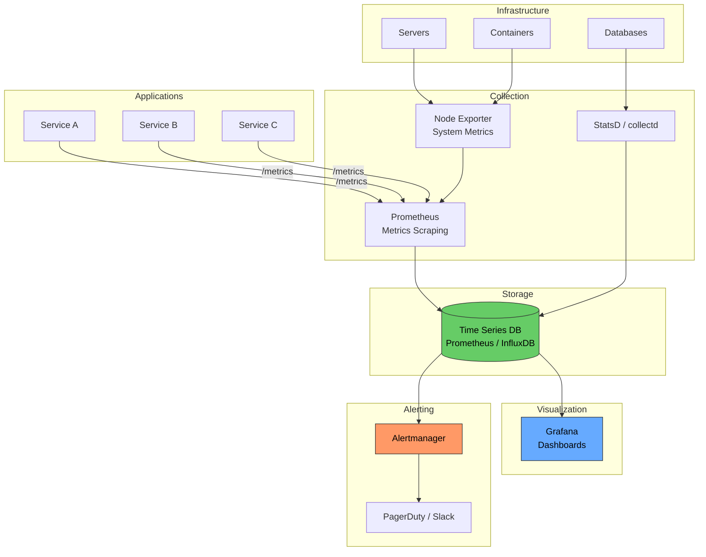

# Monitoring

# Contents

1. [Monitoring](#monitoring)
2. [What Is Monitoring?](#what-is-monitoring)
3. [Why Monitoring Matters](#why-monitoring-matters)
4. [Types of Monitoring](#types-of-monitoring)
   1. [Infrastructure Monitoring](#infrastructure-monitoring)
   2. [Application Monitoring](#application-monitoring)
   3. [Business Metrics Monitoring](#business-metrics-monitoring)
   4. [Synthetic Monitoring](#synthetic-monitoring)
5. [Key Metrics](#key-metrics)
   1. [The USE Method](#the-use-method)
   2. [The RED Method](#the-red-method)
   3. [The Four Golden Signals](#the-four-golden-signals)
6. [Metrics Comparison](#metrics-comparison)
7. [Monitoring Stack Architecture](#monitoring-stack-architecture)
8. [Tools and Platforms](#tools-and-platforms)
   1. [Prometheus](#prometheus)
   2. [Grafana](#grafana)
   3. [Datadog](#datadog)
   4. [New Relic](#new-relic)
9. [Prometheus and Grafana Setup](#prometheus-and-grafana-setup)
   1. [Instrumenting a Node.js Application](#instrumenting-a-nodejs-application)
   2. [Prometheus Configuration](#prometheus-configuration)
   3. [Grafana Dashboard Example](#grafana-dashboard-example)
10. [Alerting](#alerting)
    1. [Alerting Best Practices](#alerting-best-practices)
    2. [Alert Configuration Example](#alert-configuration-example)
    3. [Severity Levels](#severity-levels)
11. [Dashboards](#dashboards)
12. [Anti-Patterns](#anti-patterns)
13. [Resources](#resources)

---

## What Is Monitoring?

**Monitoring** is the practice of collecting, processing, aggregating, and displaying real-time quantitative data about a system. It provides visibility into system health, performance, and behavior, enabling teams to detect issues, diagnose problems, and make informed decisions.

> **Tip:** Monitoring answers the question "What is happening right now?" while observability (a broader concept) answers "Why is it happening?" Monitoring is a subset of observability.

## Why Monitoring Matters

Without monitoring, you are flying blind. Issues are discovered by users instead of engineers, and debugging becomes guesswork.

| Without Monitoring                         | With Monitoring                              |
|--------------------------------------------|----------------------------------------------|
| Users report outages before you know       | Alerts fire before users are affected        |
| Debugging relies on log searching          | Dashboards show system state at a glance     |
| Capacity planning is guesswork             | Trends reveal when to scale                  |
| Performance regressions go unnoticed       | Latency spikes trigger immediate alerts      |
| Post-incident analysis lacks data          | Historical data enables root cause analysis  |

## Types of Monitoring

### Infrastructure Monitoring

Tracks the health and resource usage of the underlying infrastructure: servers, containers, networks, and storage.

**Key metrics:**
- CPU utilization
- Memory usage and swap
- Disk I/O and space
- Network throughput and packet loss
- Container resource limits and usage

```
Server: web-prod-01
CPU:    ████████░░░░  67%
Memory: ██████████░░  83%
Disk:   ████░░░░░░░░  33%
Network: 450 Mbps in / 120 Mbps out
```

### Application Monitoring

Also called **APM (Application Performance Monitoring)**, it tracks the internal behavior of your application: request latency, error rates, database query performance, and dependency health.

**Key metrics:**
- Request duration (p50, p95, p99)
- Error rate (4xx, 5xx)
- Throughput (requests per second)
- Database query time
- External API call latency
- Queue depth and processing time

### Business Metrics Monitoring

Tracks metrics that directly reflect business outcomes: signups, orders, revenue, conversion rates. These metrics connect technical health to business impact.

**Examples:**
- Orders placed per minute
- Revenue per hour
- User signup rate
- Cart abandonment rate
- Payment success/failure ratio

> **Tip:** Business metrics are often the most important indicators. A system can appear technically healthy while a critical business flow is broken. Always monitor what matters to the business.

### Synthetic Monitoring

Simulates user interactions from external locations to detect availability and performance issues before real users are affected.

```javascript
// Synthetic check example
async function checkHomepage() {
  const start = Date.now();
  const response = await fetch('https://example.com');
  const duration = Date.now() - start;

  return {
    status: response.status,
    latency: duration,
    healthy: response.status === 200 && duration < 3000,
  };
}
```

## Key Metrics

### The USE Method

Defined by Brendan Gregg, the **USE method** is designed for analyzing the performance of **resources** (hardware, infrastructure). For every resource, check:

| Letter | Stands For   | Description                                   | Example                       |
|--------|-------------|-----------------------------------------------|-------------------------------|
| **U**  | Utilization | Percentage of time the resource is busy        | CPU at 85%                    |
| **S**  | Saturation  | Degree to which the resource has extra work queued | 12 processes in the run queue |
| **E**  | Errors      | Count of error events                          | 3 disk I/O errors             |

### The RED Method

Defined by Tom Wilkie, the **RED method** is designed for monitoring **services** (microservices, APIs). For every service, track:

| Letter | Stands For | Description                         | Example                    |
|--------|-----------|-------------------------------------|----------------------------|
| **R**  | Rate      | Number of requests per second        | 1200 req/s                 |
| **E**  | Errors    | Number of failed requests per second | 12 errors/s (1% error rate)|
| **D**  | Duration  | Distribution of request latency      | p50: 45ms, p99: 320ms     |

### The Four Golden Signals

Defined in the Google SRE book, these are the four metrics that matter most for any user-facing system:

1. **Latency** -- how long it takes to serve a request (distinguish between successful and failed requests)
2. **Traffic** -- how much demand is being placed on the system (requests per second, sessions, etc.)
3. **Errors** -- the rate of requests that fail (explicit errors like 500s and implicit errors like wrong content)
4. **Saturation** -- how "full" the system is (CPU, memory, I/O utilization, queue depth)

> **Tip:** Use the **USE method** for infrastructure, the **RED method** for services, and the **Four Golden Signals** as an overall framework. They complement each other rather than compete.

## Metrics Comparison

| Framework             | Best For          | Focus                        |
|-----------------------|-------------------|------------------------------|
| USE Method            | Infrastructure    | Resource utilization         |
| RED Method            | Microservices     | Request-centric performance  |
| Four Golden Signals   | User-facing systems | Overall system health       |

## Monitoring Stack Architecture



## Tools and Platforms

### Prometheus

An open-source monitoring and alerting toolkit, originally built at SoundCloud. It is the de facto standard for monitoring cloud-native applications.

**Key features:**
- Pull-based metric collection (scrapes `/metrics` endpoints)
- Powerful query language (PromQL)
- Built-in alerting via Alertmanager
- Multi-dimensional data model with labels
- No external dependencies (single binary)

### Grafana

An open-source platform for monitoring visualization. It connects to various data sources (Prometheus, InfluxDB, Elasticsearch) and provides rich, customizable dashboards.

**Key features:**
- Rich visualization options (graphs, heatmaps, tables, gauges)
- Template variables for dynamic dashboards
- Alerting with notification channels
- Dashboard sharing and embedding
- Plugin ecosystem

### Datadog

A commercial SaaS monitoring platform that provides infrastructure monitoring, APM, log management, and synthetic monitoring in a single platform.

**Key features:**
- Agent-based metric collection
- Over 600 integrations
- Machine learning-based anomaly detection
- Distributed tracing with APM
- Real-time log analytics

### New Relic

A commercial observability platform focused on application performance monitoring.

**Key features:**
- Auto-instrumentation for many languages
- Distributed tracing
- Error tracking and analysis
- AI-powered anomaly detection
- Custom dashboards and NRQL query language

## Prometheus and Grafana Setup

### Instrumenting a Node.js Application

```javascript
const express = require('express');
const client = require('prom-client');

const app = express();

// Create a Registry
const register = new client.Registry();

// Add default metrics (CPU, memory, event loop, etc.)
client.collectDefaultMetrics({ register });

// Custom metrics
const httpRequestDuration = new client.Histogram({
  name: 'http_request_duration_seconds',
  help: 'Duration of HTTP requests in seconds',
  labelNames: ['method', 'route', 'status_code'],
  buckets: [0.01, 0.05, 0.1, 0.25, 0.5, 1, 2.5, 5, 10],
});
register.registerMetric(httpRequestDuration);

const httpRequestsTotal = new client.Counter({
  name: 'http_requests_total',
  help: 'Total number of HTTP requests',
  labelNames: ['method', 'route', 'status_code'],
});
register.registerMetric(httpRequestsTotal);

const activeConnections = new client.Gauge({
  name: 'http_active_connections',
  help: 'Number of active HTTP connections',
});
register.registerMetric(activeConnections);

// Middleware to track metrics
app.use((req, res, next) => {
  activeConnections.inc();
  const end = httpRequestDuration.startTimer();

  res.on('finish', () => {
    const labels = {
      method: req.method,
      route: req.route?.path || req.path,
      status_code: res.statusCode,
    };
    end(labels);
    httpRequestsTotal.inc(labels);
    activeConnections.dec();
  });

  next();
});

// Metrics endpoint for Prometheus to scrape
app.get('/metrics', async (req, res) => {
  res.set('Content-Type', register.contentType);
  res.end(await register.metrics());
});

app.get('/api/users', (req, res) => {
  res.json([{ id: 1, name: 'Alice' }]);
});

app.listen(3000);
```

### Prometheus Configuration

```yaml
# prometheus.yml
global:
  scrape_interval: 15s
  evaluation_interval: 15s

rule_files:
  - 'alerts.yml'

alerting:
  alertmanagers:
    - static_configs:
        - targets: ['alertmanager:9093']

scrape_configs:
  - job_name: 'node-app'
    scrape_interval: 5s
    static_configs:
      - targets: ['app:3000']
        labels:
          environment: 'production'
          service: 'user-api'

  - job_name: 'node-exporter'
    static_configs:
      - targets: ['node-exporter:9100']
```

### Grafana Dashboard Example

Common PromQL queries for a dashboard:

```promql
# Request rate (requests per second)
rate(http_requests_total[5m])

# Error rate (percentage of 5xx responses)
sum(rate(http_requests_total{status_code=~"5.."}[5m]))
/
sum(rate(http_requests_total[5m]))
* 100

# P95 latency
histogram_quantile(0.95, rate(http_request_duration_seconds_bucket[5m]))

# P99 latency
histogram_quantile(0.99, rate(http_request_duration_seconds_bucket[5m]))

# Active connections
http_active_connections

# CPU usage by container
rate(process_cpu_seconds_total[5m]) * 100

# Memory usage
process_resident_memory_bytes / 1024 / 1024
```

## Alerting

### Alerting Best Practices

- **Alert on symptoms, not causes.** Alert when users are affected (high error rate), not on internal events (a pod restarted).
- **Set meaningful thresholds.** Base thresholds on SLOs, not arbitrary numbers.
- **Reduce alert fatigue.** Every alert should be actionable. If an alert does not require human intervention, it should not page someone.
- **Use severity levels.** Not every issue needs to wake someone up at 3 AM.
- **Include runbooks.** Link to a runbook in every alert so the on-call engineer knows what to do.
- **Test your alerts.** Regularly verify that alerts fire correctly and reach the right people.

### Alert Configuration Example

```yaml
# alerts.yml (Prometheus Alertmanager rules)
groups:
  - name: application
    rules:
      - alert: HighErrorRate
        expr: |
          sum(rate(http_requests_total{status_code=~"5.."}[5m]))
          /
          sum(rate(http_requests_total[5m]))
          > 0.05
        for: 5m
        labels:
          severity: critical
        annotations:
          summary: 'High error rate detected'
          description: 'Error rate is {{ $value | humanizePercentage }} over the last 5 minutes'
          runbook_url: 'https://wiki.internal/runbooks/high-error-rate'

      - alert: HighLatency
        expr: |
          histogram_quantile(0.95,
            rate(http_request_duration_seconds_bucket[5m])
          ) > 1
        for: 10m
        labels:
          severity: warning
        annotations:
          summary: 'P95 latency exceeds 1 second'
          description: 'P95 latency is {{ $value }}s'

      - alert: HighMemoryUsage
        expr: |
          process_resident_memory_bytes / 1024 / 1024 > 512
        for: 15m
        labels:
          severity: warning
        annotations:
          summary: 'Memory usage exceeds 512MB'
```

### Severity Levels

| Severity | Action Required                  | Notification Channel | Example                        |
|----------|----------------------------------|---------------------|--------------------------------|
| Critical | Immediate response required      | PagerDuty (page)    | Service is down, data loss     |
| Warning  | Investigate within business hours | Slack channel        | High memory, elevated latency  |
| Info     | No action, informational         | Dashboard only       | Deployment completed           |

## Dashboards

Effective dashboards follow a hierarchy:

1. **Overview dashboard** -- system health at a glance (traffic, errors, latency, saturation)
2. **Service dashboards** -- per-service detail (RED metrics, dependency health)
3. **Infrastructure dashboards** -- per-node resource usage (USE metrics)
4. **Debug dashboards** -- detailed views for incident investigation

**Dashboard design principles:**

- Place the most important information in the top-left
- Use consistent colors (green = healthy, yellow = warning, red = critical)
- Include time range selectors and template variables
- Keep dashboards focused -- one dashboard per concern
- Add annotations for deployments, incidents, and configuration changes

> **Tip:** The best dashboard is one that tells you something is wrong within 5 seconds of looking at it. If you have to study a dashboard to understand the system state, it needs redesign.

## Anti-Patterns

- **Monitoring everything** -- collecting metrics you never look at wastes resources and creates noise.
- **Alert fatigue** -- too many low-priority alerts cause teams to ignore all alerts.
- **Dashboard sprawl** -- dozens of dashboards with no clear hierarchy makes finding information difficult.
- **Ignoring baselines** -- without knowing what "normal" looks like, you cannot detect anomalies.
- **Not monitoring the monitoring system** -- if Prometheus goes down, who alerts you?
- **Only monitoring infrastructure** -- healthy servers mean nothing if the application is returning errors.

## Resources

- [Google SRE Book - Monitoring Distributed Systems](https://sre.google/sre-book/monitoring-distributed-systems/)
- [Prometheus Documentation](https://prometheus.io/docs/)
- [Grafana Documentation](https://grafana.com/docs/)
- [Brendan Gregg - USE Method](https://www.brendangregg.com/usemethod.html)
- [Tom Wilkie - The RED Method](https://grafana.com/blog/2018/08/02/the-red-method-how-to-instrument-your-services/)
- [Datadog - Monitoring 101](https://www.datadoghq.com/blog/monitoring-101-collecting-data/)
- [Practical Monitoring by Mike Julian](https://www.oreilly.com/library/view/practical-monitoring/9781491957349/)
- [prom-client for Node.js](https://github.com/siimon/prom-client)
