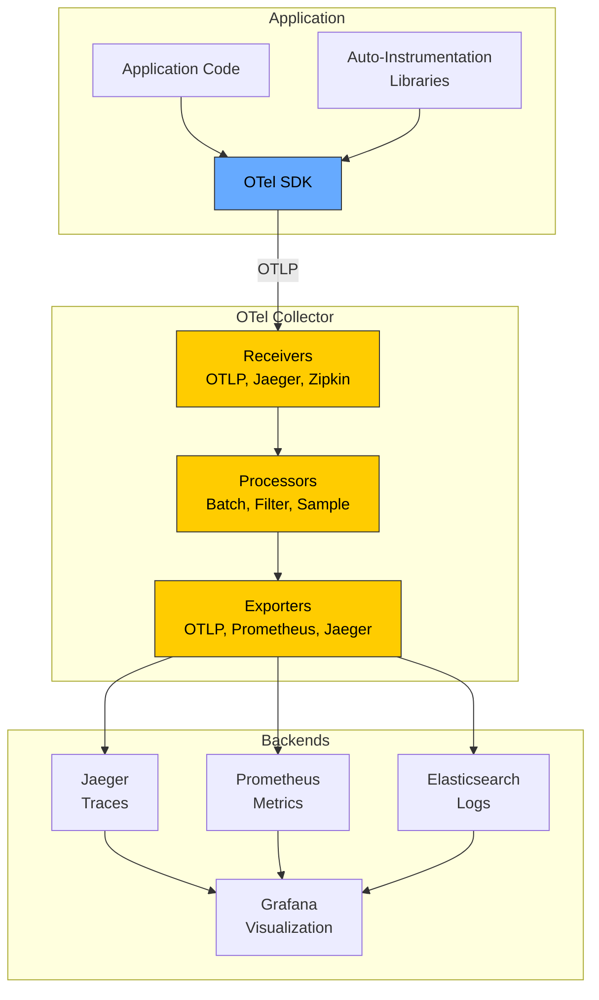
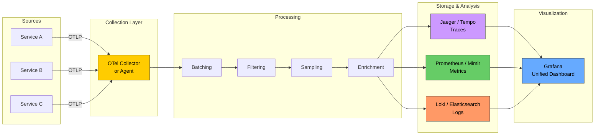

# Telemetry

# Contents

1. [Telemetry](#telemetry)
2. [What Is Telemetry?](#what-is-telemetry)
3. [The Three Pillars of Observability](#the-three-pillars-of-observability)
   1. [Logs](#logs)
   2. [Metrics](#metrics)
   3. [Traces](#traces)
4. [Pillars Comparison](#pillars-comparison)
5. [OpenTelemetry Framework](#opentelemetry-framework)
   1. [What Is OpenTelemetry?](#what-is-opentelemetry)
   2. [Core Components](#core-components)
   3. [OpenTelemetry Architecture](#opentelemetry-architecture)
6. [Distributed Tracing](#distributed-tracing)
   1. [What Is Distributed Tracing?](#what-is-distributed-tracing)
   2. [Spans](#spans)
   3. [Trace Context and Propagation](#trace-context-and-propagation)
   4. [Trace Visualization](#trace-visualization)
7. [Instrumentation](#instrumentation)
   1. [Automatic Instrumentation](#automatic-instrumentation)
   2. [Manual Instrumentation](#manual-instrumentation)
8. [Telemetry Pipeline](#telemetry-pipeline)
9. [Tools and Platforms](#tools-and-platforms)
   1. [Jaeger](#jaeger)
   2. [Zipkin](#zipkin)
   3. [OpenTelemetry Collector](#opentelemetry-collector)
10. [OpenTelemetry Collector Configuration](#opentelemetry-collector-configuration)
11. [Implementation Examples](#implementation-examples)
    1. [Setting Up OpenTelemetry in Node.js](#setting-up-opentelemetry-in-nodejs)
    2. [Creating Custom Spans](#creating-custom-spans)
    3. [Structured Logging with Trace Context](#structured-logging-with-trace-context)
    4. [Custom Metrics with OpenTelemetry](#custom-metrics-with-opentelemetry)
12. [Correlation Across Pillars](#correlation-across-pillars)
13. [Best Practices](#best-practices)
14. [Resources](#resources)

---

## What Is Telemetry?

**Telemetry** is the automated collection, transmission, and analysis of data from remote systems. In software engineering, telemetry refers to the signals your applications emit -- logs, metrics, and traces -- that allow you to understand system behavior, diagnose problems, and measure performance.

> **Tip:** Telemetry is the "how" of observability. While observability is the property of a system that allows you to understand its internal state from its external outputs, telemetry is the mechanism that produces those outputs.

## The Three Pillars of Observability

### Logs

**Logs** are discrete, timestamped records of events that happened in the system. They are the most fundamental telemetry signal and have been used since the earliest days of computing.

```json
{
  "timestamp": "2025-03-15T10:23:45.123Z",
  "level": "ERROR",
  "service": "payment-service",
  "traceId": "abc123def456",
  "spanId": "span789",
  "message": "Payment processing failed",
  "error": "ConnectionTimeoutError",
  "userId": "user-42",
  "amount": 99.99,
  "currency": "USD"
}
```

**Types of logs:**
- **Unstructured** -- free-form text (hard to query and parse)
- **Structured** -- key-value pairs or JSON (machine-parseable, recommended)
- **Semi-structured** -- text with embedded structured data

**Log levels:**

| Level   | Purpose                                    | Example                        |
|---------|--------------------------------------------|--------------------------------|
| TRACE   | Very detailed debugging information        | Function entry/exit            |
| DEBUG   | Detailed information for debugging         | Variable values, flow control  |
| INFO    | General operational information            | Server started, request served |
| WARN    | Potentially harmful situations             | Retry attempt, slow query      |
| ERROR   | Error events that allow continued operation| Failed API call, invalid input |
| FATAL   | Severe errors causing application shutdown | Database connection lost       |

### Metrics

**Metrics** are numerical measurements collected at regular intervals. They are efficient to store and query, making them ideal for dashboards, alerting, and trend analysis.

**Metric types:**

- **Counter** -- a cumulative value that only increases (e.g., total requests served)
- **Gauge** -- a value that can go up or down (e.g., current CPU usage, active connections)
- **Histogram** -- samples observations and counts them in configurable buckets (e.g., request latency distribution)
- **Summary** -- similar to histogram but calculates quantiles over a sliding time window

```
# Counter
http_requests_total{method="GET", status="200"} 15234

# Gauge
http_active_connections 42

# Histogram
http_request_duration_seconds_bucket{le="0.1"} 12000
http_request_duration_seconds_bucket{le="0.5"} 14500
http_request_duration_seconds_bucket{le="1.0"} 15100
http_request_duration_seconds_bucket{le="+Inf"} 15234
```

### Traces

**Traces** track the lifecycle of a single request as it flows through multiple services in a distributed system. A trace is composed of multiple **spans**, each representing a unit of work.

```
Trace ID: abc123def456
|
|-- Span: API Gateway (12ms)
    |-- Span: Auth Service (3ms)
    |-- Span: User Service (8ms)
        |-- Span: Database Query (5ms)
        |-- Span: Cache Lookup (1ms)
    |-- Span: Response Serialization (1ms)
```

## Pillars Comparison

| Aspect          | Logs                      | Metrics                  | Traces                     |
|-----------------|---------------------------|--------------------------|----------------------------|
| Data type       | Text / structured events  | Numerical time series    | Request flow graphs        |
| Cardinality     | High (one per event)      | Low (aggregated)         | Medium (one per request)   |
| Storage cost    | High                      | Low                      | Medium                     |
| Query speed     | Slow (full-text search)   | Fast (time series DB)    | Medium (indexed by trace ID)|
| Best for        | Debugging specific events | Alerting and dashboards  | Understanding request flow |
| Retention       | Days to weeks             | Months to years          | Days to weeks              |

## OpenTelemetry Framework

### What Is OpenTelemetry?

**OpenTelemetry** (OTel) is a vendor-neutral, open-source observability framework for generating, collecting, and exporting telemetry data (logs, metrics, and traces). It is a CNCF (Cloud Native Computing Foundation) project and the industry standard for instrumentation.

OpenTelemetry was formed by merging two earlier projects: OpenTracing and OpenCensus.

> **Tip:** OpenTelemetry does not provide a backend for storing or visualizing telemetry data. It handles instrumentation, collection, and export. You pair it with backends like Jaeger, Prometheus, Grafana, or Datadog.

### Core Components

- **API** -- defines the interfaces for instrumenting code (language-specific)
- **SDK** -- implements the API with configuration, sampling, and export
- **Exporters** -- send data to backends (OTLP, Jaeger, Prometheus, Zipkin)
- **Collector** -- a standalone process that receives, processes, and exports telemetry
- **Instrumentation Libraries** -- auto-instrument popular frameworks and libraries
- **OTLP (OpenTelemetry Protocol)** -- the native wire protocol for transmitting telemetry

### OpenTelemetry Architecture



## Distributed Tracing

### What Is Distributed Tracing?

**Distributed tracing** tracks a request as it propagates through multiple services, databases, and message queues. It provides a complete picture of the request lifecycle, showing where time is spent and where failures occur.

### Spans

A **span** is the fundamental building block of a trace. Each span represents a single operation and contains:

| Field         | Description                                   |
|---------------|-----------------------------------------------|
| Trace ID      | Unique identifier shared by all spans in a trace |
| Span ID       | Unique identifier for this specific span      |
| Parent Span ID| ID of the parent span (null for root span)    |
| Operation Name| Name of the operation (e.g., "GET /api/users")|
| Start Time    | When the operation began                      |
| Duration      | How long the operation took                   |
| Status        | OK, ERROR, or UNSET                           |
| Attributes    | Key-value pairs with additional context        |
| Events        | Timestamped annotations within the span       |

### Trace Context and Propagation

For traces to work across service boundaries, trace context must be propagated between services. The **W3C Trace Context** standard defines HTTP headers for this:

```http
traceparent: 00-0af7651916cd43dd8448eb211c80319c-b7ad6b7169203331-01
tracestate: vendor1=value1,vendor2=value2
```

The `traceparent` header contains:
- Version (`00`)
- Trace ID (`0af7651916cd43dd8448eb211c80319c`)
- Parent Span ID (`b7ad6b7169203331`)
- Trace Flags (`01` = sampled)

### Trace Visualization

```
Trace: 0af765...0319c  Duration: 245ms

API Gateway     |████████████████████████████████████████████| 245ms
  Auth Service  |████|                                        12ms
  Order Service      |██████████████████████████████████|      180ms
    DB: Read              |████████|                           35ms
    Payment API                     |████████████████|         95ms
    DB: Write                                         |████|  20ms
  Response                                                |██| 8ms
```

## Instrumentation

### Automatic Instrumentation

Auto-instrumentation intercepts calls to popular libraries and frameworks, generating spans without code changes. OpenTelemetry provides auto-instrumentation packages for HTTP clients, database drivers, messaging systems, and web frameworks.

```javascript
// tracing.js -- load before your application code
const { NodeSDK } = require('@opentelemetry/sdk-node');
const { getNodeAutoInstrumentations } = require('@opentelemetry/auto-instrumentations-node');
const { OTLPTraceExporter } = require('@opentelemetry/exporter-trace-otlp-http');

const sdk = new NodeSDK({
  traceExporter: new OTLPTraceExporter({
    url: 'http://otel-collector:4318/v1/traces',
  }),
  instrumentations: [
    getNodeAutoInstrumentations({
      '@opentelemetry/instrumentation-http': { enabled: true },
      '@opentelemetry/instrumentation-express': { enabled: true },
      '@opentelemetry/instrumentation-pg': { enabled: true },
      '@opentelemetry/instrumentation-redis': { enabled: true },
    }),
  ],
});

sdk.start();
console.log('OpenTelemetry tracing initialized');
```

Run your application with:
```bash
node --require ./tracing.js app.js
```

### Manual Instrumentation

For custom business logic, create spans manually to capture domain-specific operations.

```javascript
const { trace, SpanStatusCode } = require('@opentelemetry/api');

const tracer = trace.getTracer('order-service', '1.0.0');

async function processOrder(order) {
  return tracer.startActiveSpan('processOrder', async (span) => {
    try {
      span.setAttribute('order.id', order.id);
      span.setAttribute('order.total', order.total);
      span.setAttribute('order.items_count', order.items.length);

      // Nested span for validation
      await tracer.startActiveSpan('validateOrder', async (validationSpan) => {
        await validateOrder(order);
        validationSpan.end();
      });

      // Nested span for payment
      await tracer.startActiveSpan('chargePayment', async (paymentSpan) => {
        paymentSpan.setAttribute('payment.method', order.paymentMethod);
        const result = await chargePayment(order);
        paymentSpan.setAttribute('payment.transaction_id', result.transactionId);
        paymentSpan.end();
      });

      // Add an event (a timestamped log within the span)
      span.addEvent('order.processed', {
        'order.id': order.id,
        'order.status': 'completed',
      });

      span.setStatus({ code: SpanStatusCode.OK });
      return { success: true };
    } catch (error) {
      span.setStatus({ code: SpanStatusCode.ERROR, message: error.message });
      span.recordException(error);
      throw error;
    } finally {
      span.end();
    }
  });
}
```

## Telemetry Pipeline



## Tools and Platforms

### Jaeger

An open-source distributed tracing platform, originally developed at Uber. It is fully compatible with OpenTelemetry.

**Key features:**
- Distributed context propagation
- Distributed transaction monitoring
- Root cause analysis
- Service dependency analysis
- Performance and latency optimization

### Zipkin

An open-source distributed tracing system, originally developed at Twitter based on Google's Dapper paper.

**Key features:**
- Lightweight and easy to deploy
- Support for multiple transport protocols (HTTP, Kafka, gRPC)
- Built-in web UI for trace visualization
- Storage backends: Cassandra, Elasticsearch, MySQL

### OpenTelemetry Collector

A vendor-agnostic proxy that receives, processes, and exports telemetry data. It is the recommended way to deploy telemetry pipelines.

**Key features:**
- Receives data in multiple formats (OTLP, Jaeger, Zipkin, Prometheus)
- Processes data (batching, filtering, sampling, attribute manipulation)
- Exports to multiple backends simultaneously
- Runs as an agent (sidecar) or gateway (centralized)

## OpenTelemetry Collector Configuration

```yaml
# otel-collector-config.yaml
receivers:
  otlp:
    protocols:
      grpc:
        endpoint: 0.0.0.0:4317
      http:
        endpoint: 0.0.0.0:4318

  prometheus:
    config:
      scrape_configs:
        - job_name: 'app-metrics'
          scrape_interval: 10s
          static_configs:
            - targets: ['app:3000']

processors:
  batch:
    timeout: 5s
    send_batch_size: 1024

  memory_limiter:
    check_interval: 1s
    limit_mib: 512

  attributes:
    actions:
      - key: environment
        value: production
        action: upsert

  tail_sampling:
    decision_wait: 10s
    policies:
      - name: errors
        type: status_code
        status_code: { status_codes: [ERROR] }
      - name: slow-requests
        type: latency
        latency: { threshold_ms: 1000 }
      - name: probabilistic
        type: probabilistic
        probabilistic: { sampling_percentage: 10 }

exporters:
  otlp/jaeger:
    endpoint: jaeger:4317
    tls:
      insecure: true

  prometheus:
    endpoint: 0.0.0.0:8889

  loki:
    endpoint: http://loki:3100/loki/api/v1/push

service:
  pipelines:
    traces:
      receivers: [otlp]
      processors: [memory_limiter, batch, attributes]
      exporters: [otlp/jaeger]

    metrics:
      receivers: [otlp, prometheus]
      processors: [memory_limiter, batch]
      exporters: [prometheus]

    logs:
      receivers: [otlp]
      processors: [memory_limiter, batch, attributes]
      exporters: [loki]
```

## Implementation Examples

### Setting Up OpenTelemetry in Node.js

```javascript
// tracing.js
const { NodeSDK } = require('@opentelemetry/sdk-node');
const { OTLPTraceExporter } = require('@opentelemetry/exporter-trace-otlp-http');
const { OTLPMetricExporter } = require('@opentelemetry/exporter-metrics-otlp-http');
const { PeriodicExportingMetricReader } = require('@opentelemetry/sdk-metrics');
const { getNodeAutoInstrumentations } = require('@opentelemetry/auto-instrumentations-node');
const { Resource } = require('@opentelemetry/resources');
const { ATTR_SERVICE_NAME, ATTR_SERVICE_VERSION } = require('@opentelemetry/semantic-conventions');

const sdk = new NodeSDK({
  resource: new Resource({
    [ATTR_SERVICE_NAME]: 'order-service',
    [ATTR_SERVICE_VERSION]: '1.2.0',
    'deployment.environment': 'production',
  }),
  traceExporter: new OTLPTraceExporter({
    url: 'http://otel-collector:4318/v1/traces',
  }),
  metricReader: new PeriodicExportingMetricReader({
    exporter: new OTLPMetricExporter({
      url: 'http://otel-collector:4318/v1/metrics',
    }),
    exportIntervalMillis: 15000,
  }),
  instrumentations: [getNodeAutoInstrumentations()],
});

sdk.start();

process.on('SIGTERM', () => {
  sdk.shutdown().then(() => process.exit(0));
});
```

### Creating Custom Spans

```javascript
const { trace, context, SpanKind } = require('@opentelemetry/api');

const tracer = trace.getTracer('inventory-service');

async function checkInventory(items) {
  return tracer.startActiveSpan('checkInventory', {
    kind: SpanKind.INTERNAL,
    attributes: { 'inventory.item_count': items.length },
  }, async (span) => {
    const results = [];

    for (const item of items) {
      await tracer.startActiveSpan(`checkItem:${item.sku}`, async (itemSpan) => {
        itemSpan.setAttribute('item.sku', item.sku);
        itemSpan.setAttribute('item.quantity_requested', item.quantity);

        const available = await db.query(
          'SELECT quantity FROM inventory WHERE sku = $1',
          [item.sku]
        );

        const inStock = available.rows[0]?.quantity >= item.quantity;
        itemSpan.setAttribute('item.in_stock', inStock);

        results.push({ sku: item.sku, inStock });
        itemSpan.end();
      });
    }

    span.setAttribute('inventory.all_in_stock', results.every(r => r.inStock));
    span.end();
    return results;
  });
}
```

### Structured Logging with Trace Context

Correlate logs with traces by including trace and span IDs in log entries.

```javascript
const { trace } = require('@opentelemetry/api');
const winston = require('winston');

const logger = winston.createLogger({
  format: winston.format.combine(
    winston.format.timestamp(),
    winston.format.json()
  ),
  transports: [new winston.transports.Console()],
});

function log(level, message, extra = {}) {
  const activeSpan = trace.getActiveSpan();
  const spanContext = activeSpan?.spanContext();

  logger.log(level, message, {
    ...extra,
    traceId: spanContext?.traceId || 'no-trace',
    spanId: spanContext?.spanId || 'no-span',
    traceFlags: spanContext?.traceFlags,
    service: 'order-service',
  });
}

// Usage
log('info', 'Order created', { orderId: '12345', total: 99.99 });
// Output:
// {
//   "level": "info",
//   "message": "Order created",
//   "timestamp": "2025-03-15T10:30:00.000Z",
//   "orderId": "12345",
//   "total": 99.99,
//   "traceId": "abc123def456",
//   "spanId": "span789",
//   "service": "order-service"
// }
```

### Custom Metrics with OpenTelemetry

```javascript
const { metrics } = require('@opentelemetry/api');

const meter = metrics.getMeter('order-service', '1.0.0');

// Counter
const ordersCreated = meter.createCounter('orders.created', {
  description: 'Total number of orders created',
  unit: '1',
});

// Histogram
const orderProcessingTime = meter.createHistogram('orders.processing_duration', {
  description: 'Time to process an order',
  unit: 'ms',
});

// Gauge (via observable gauge)
const activeOrders = meter.createObservableGauge('orders.active', {
  description: 'Number of orders currently being processed',
});

let activeOrderCount = 0;
activeOrders.addCallback((result) => {
  result.observe(activeOrderCount);
});

// Usage
async function createOrder(order) {
  const start = Date.now();
  activeOrderCount++;

  try {
    await processOrder(order);
    ordersCreated.add(1, { 'order.type': order.type, 'order.region': order.region });
  } finally {
    activeOrderCount--;
    orderProcessingTime.record(Date.now() - start, { 'order.type': order.type });
  }
}
```

## Correlation Across Pillars

The real power of telemetry comes from correlating logs, metrics, and traces:

1. **An alert fires** based on a metric (error rate > 5%)
2. **You check the dashboard** and see the spike started at 14:32
3. **You filter traces** for errors during that time window
4. **You find a specific trace** showing a failing database call
5. **You search logs** using the trace ID to find the exact error message and stack trace

This workflow is only possible when all three pillars share a common identifier (trace ID) and are queryable from a single interface.

> **Tip:** Always include the trace ID in your log entries. This single practice transforms your debugging capability, allowing you to jump from a log line to the full request trace in seconds.

## Best Practices

- **Start with auto-instrumentation.** It covers HTTP, database, and messaging with zero code changes.
- **Add manual instrumentation for business logic.** Auto-instrumentation cannot capture domain-specific operations.
- **Use semantic conventions.** OpenTelemetry defines standard attribute names -- use them for consistency.
- **Sample intelligently.** Collect 100% of errors and slow requests, sample a percentage of normal requests.
- **Keep cardinality under control.** Do not use high-cardinality values (user IDs, request IDs) as metric labels.
- **Correlate all three signals.** Include trace IDs in logs and link metrics to traces.
- **Use the OpenTelemetry Collector.** It decouples your application from specific backends and enables processing.
- **Set resource attributes.** Always tag telemetry with service name, version, and environment.
- **Export via OTLP.** It is the native protocol and supports all three signal types.
- **Plan for data volume.** Telemetry generates significant data -- plan storage, retention, and sampling accordingly.

## Resources

- [OpenTelemetry Documentation](https://opentelemetry.io/docs/)
- [W3C Trace Context Specification](https://www.w3.org/TR/trace-context/)
- [Jaeger Documentation](https://www.jaegertracing.io/docs/)
- [Zipkin Documentation](https://zipkin.io/)
- [OpenTelemetry Collector Configuration](https://opentelemetry.io/docs/collector/configuration/)
- [Distributed Systems Observability by Cindy Sridharan](https://www.oreilly.com/library/view/distributed-systems-observability/9781492033431/)
- [Google SRE Book - Monitoring Distributed Systems](https://sre.google/sre-book/monitoring-distributed-systems/)
- [Charity Majors - Observability Engineering](https://www.oreilly.com/library/view/observability-engineering/9781492076438/)
- [OpenTelemetry JS SDK](https://github.com/open-telemetry/opentelemetry-js)
