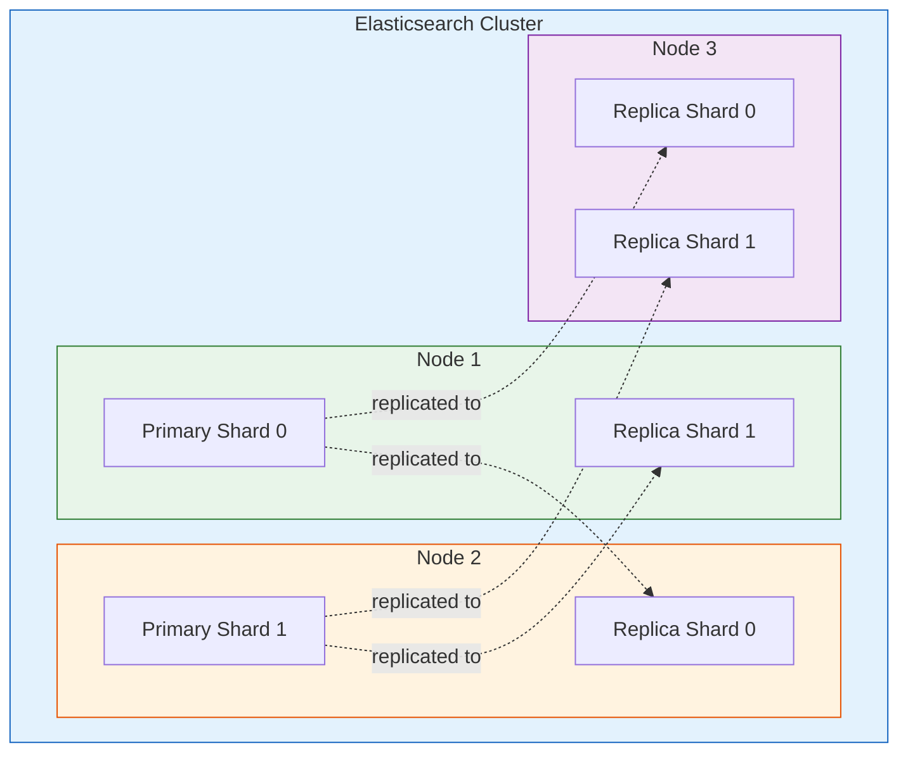

# Search Engines

> Full-text search is one of those features that users expect to "just work," but building a fast, relevant search experience is one of the more complex challenges in backend development.

# Table of Contents

1. [What Are Search Engines in the Backend Context](#what-are-search-engines-in-the-backend-context)
2. [Why Full-Text Search Matters](#why-full-text-search-matters)
3. [How Search Engines Work](#how-search-engines-work)
   1. [Indexing](#indexing)
   2. [Querying](#querying)
   3. [Ranking and Relevance](#ranking-and-relevance)
4. [Elasticsearch](#elasticsearch)
   1. [Architecture](#architecture)
   2. [Documents and Indices](#documents-and-indices)
   3. [Basic Queries](#basic-queries)
   4. [Aggregations](#aggregations)
   5. [Use Cases](#use-cases)
5. [Solr](#solr)
6. [MeiliSearch and Typesense](#meilisearch-and-typesense)
7. [Elasticsearch vs Solr Comparison](#elasticsearch-vs-solr-comparison)
8. [Integration with Backend Applications](#integration-with-backend-applications)
9. [Best Practices](#best-practices)
10. [Resources](#resources)

---

## What Are Search Engines in the Backend Context

In backend development, a "search engine" refers to a specialized data store designed for fast, full-text search and retrieval. Unlike traditional relational databases that are optimized for structured queries (`SELECT * FROM users WHERE id = 5`), search engines are optimized for finding documents that match unstructured or semi-structured text queries.

These systems sit alongside your primary database and provide search capabilities that would be impractical to build with SQL `LIKE` queries or basic pattern matching.

Common examples include:
- **Elasticsearch** - The most widely used open-source search engine
- **Apache Solr** - A mature search platform built on Apache Lucene
- **MeiliSearch** - A lightweight, developer-friendly search engine
- **Typesense** - An open-source, typo-tolerant search engine

---

## Why Full-Text Search Matters

Consider an e-commerce platform with millions of products. A user searches for "comfortable running shoes for flat feet." A traditional SQL query cannot meaningfully handle this:

```sql
-- This is slow, does not understand relevance, and misses synonyms
SELECT * FROM products
WHERE description LIKE '%comfortable%'
  AND description LIKE '%running%'
  AND description LIKE '%shoes%'
  AND description LIKE '%flat feet%';
```

A search engine can:
- Match documents even if the exact phrase is not present
- Understand that "sneakers" is related to "shoes"
- Rank results by relevance (how well they match the query)
- Handle typos ("runnng shoes" still returns results)
- Return results in milliseconds, even over millions of documents
- Provide facets (filter by brand, price range, size)

---

## How Search Engines Work

### Indexing

Before documents can be searched, they must be **indexed**. Indexing is the process of analyzing text and building a data structure called an **inverted index**.

An inverted index maps every unique term to the list of documents that contain it:

```
Term           → Document IDs
─────────────────────────────
"comfortable"  → [doc1, doc5, doc12]
"running"      → [doc1, doc3, doc7, doc12]
"shoes"        → [doc1, doc2, doc3, doc5, doc7, doc12]
"flat"         → [doc1, doc8]
```


During indexing, the text goes through an **analysis pipeline**:

1. **Tokenization** - Splitting text into individual tokens (words)
2. **Lowercasing** - Converting all tokens to lowercase
3. **Stop word removal** - Removing common words like "the," "is," "and"
4. **Stemming/Lemmatization** - Reducing words to their root form ("running" becomes "run")
5. **Synonym expansion** - Optionally mapping "sneakers" to "shoes"

### Querying


When a user submits a search query, the engine:

1. Analyzes the query text using the same pipeline as indexing
2. Looks up each term in the inverted index
3. Finds documents that match the query terms
4. Scores and ranks the results
5. Returns the top results

### Ranking and Relevance

Search engines use scoring algorithms to determine how relevant each document is to a query. The most common algorithm is **TF-IDF** (Term Frequency - Inverse Document Frequency):

- **Term Frequency (TF)** - How often a term appears in a document. More occurrences = higher score.
- **Inverse Document Frequency (IDF)** - How rare a term is across all documents. Rare terms are weighted more heavily than common ones.

Elasticsearch uses **BM25**, an improved version of TF-IDF, as its default scoring algorithm. BM25 accounts for document length and has tunable parameters for better relevance.

> **Tip:** Relevance tuning is often the most time-consuming part of implementing search. Invest time in understanding your users' search behavior and adjusting scoring accordingly.

---

## Elasticsearch

Elasticsearch is a distributed, RESTful search and analytics engine built on top of Apache Lucene. It is the most popular search engine for backend applications and forms the "E" in the ELK Stack (Elasticsearch, Logstash, Kibana).

### Architecture

Elasticsearch is designed as a distributed system from the ground up.

| Component | Description |
|-----------|-------------|
| **Cluster** | A collection of one or more nodes that holds all your data |
| **Node** | A single server instance that is part of a cluster |
| **Index** | A collection of documents with similar characteristics (like a database table) |
| **Shard** | A subdivision of an index. Each shard is a self-contained Lucene index |
| **Replica** | A copy of a shard for fault tolerance and read scaling |

```
Cluster
├── Node 1
│   ├── Primary Shard 0
│   └── Replica Shard 1
├── Node 2
│   ├── Primary Shard 1
│   └── Replica Shard 0
└── Node 3
    ├── Replica Shard 0
    └── Replica Shard 1
```



Data is automatically distributed across shards, and shards are distributed across nodes. If a node fails, replicas on other nodes ensure no data is lost.

### Documents and Indices

Elasticsearch stores data as JSON documents. Each document belongs to an index.

```bash
# Create a document in the "products" index
curl -X POST "localhost:9200/products/_doc" -H "Content-Type: application/json" -d '{
  "name": "Trail Runner Pro",
  "category": "running shoes",
  "price": 129.99,
  "description": "Comfortable trail running shoes with extra arch support for flat feet",
  "brand": "SportMax",
  "in_stock": true
}'
```

You can define a **mapping** to specify how fields should be indexed and stored:

```bash
curl -X PUT "localhost:9200/products" -H "Content-Type: application/json" -d '{
  "mappings": {
    "properties": {
      "name":        { "type": "text" },
      "category":    { "type": "keyword" },
      "price":       { "type": "float" },
      "description": { "type": "text", "analyzer": "english" },
      "brand":       { "type": "keyword" },
      "in_stock":    { "type": "boolean" }
    }
  }
}'
```

> **Key distinction:** `text` fields are analyzed (tokenized, stemmed) for full-text search. `keyword` fields are stored as-is for exact matching, filtering, and aggregations.

### Basic Queries

**Match Query** - The most common full-text query. Analyzes the input and finds matching documents.

```json
{
  "query": {
    "match": {
      "description": "comfortable running shoes"
    }
  }
}
```

**Bool Query** - Combines multiple queries with boolean logic.

```json
{
  "query": {
    "bool": {
      "must": [
        { "match": { "description": "running shoes" } }
      ],
      "filter": [
        { "term": { "in_stock": true } },
        { "range": { "price": { "lte": 150 } } }
      ],
      "should": [
        { "match": { "description": "comfortable" } }
      ]
    }
  }
}
```

- `must` - Documents must match (affects score)
- `filter` - Documents must match (does not affect score, cacheable)
- `should` - Documents that match get a higher score
- `must_not` - Documents must not match

**Range Query** - Finds documents with values within a range.

```json
{
  "query": {
    "range": {
      "price": {
        "gte": 50,
        "lte": 150
      }
    }
  }
}
```

### Aggregations

Aggregations provide analytics capabilities on top of search results. They are the Elasticsearch equivalent of SQL `GROUP BY`.

```json
{
  "size": 0,
  "aggs": {
    "brands": {
      "terms": { "field": "brand" }
    },
    "avg_price": {
      "avg": { "field": "price" }
    },
    "price_ranges": {
      "range": {
        "field": "price",
        "ranges": [
          { "to": 50 },
          { "from": 50, "to": 100 },
          { "from": 100 }
        ]
      }
    }
  }
}
```

Aggregation types include:
- **Metric** - `avg`, `sum`, `min`, `max`, `cardinality`
- **Bucket** - `terms`, `range`, `date_histogram`, `filters`
- **Pipeline** - Aggregations that work on the output of other aggregations

### Use Cases

- **E-commerce product search** - Full-text search with filters, facets, and autocomplete
- **Log analytics** - The ELK Stack (Elasticsearch + Logstash + Kibana) for centralized logging
- **Application performance monitoring** - Storing and querying metrics and traces
- **Geospatial search** - Finding locations within a radius or bounding box
- **Autocomplete and suggestions** - Real-time search-as-you-type functionality

---

## Solr

Apache Solr is another search platform built on Apache Lucene. It has been around longer than Elasticsearch (since 2004) and is a mature, feature-rich option.

**Key features:**
- Built-in support for faceted search
- Rich admin UI (Solr Admin)
- SolrCloud for distributed search
- Strong XML/JSON/CSV document support
- Extensive plugin ecosystem

Solr was the dominant search platform before Elasticsearch gained popularity. It remains widely used in enterprise environments, particularly in industries like publishing and government.

---

## MeiliSearch and Typesense

These newer search engines focus on developer experience and ease of setup.

**MeiliSearch:**
- Written in Rust for high performance
- Typo-tolerant out of the box
- Simple RESTful API
- Instant search results (designed for sub-50ms responses)
- Easy to set up -- a single binary with no dependencies
- Great for small to medium datasets

```bash
# Add documents to MeiliSearch
curl -X POST 'http://localhost:7700/indexes/movies/documents' \
  -H 'Content-Type: application/json' \
  --data-binary '[
    { "id": 1, "title": "The Matrix", "genres": ["sci-fi", "action"] },
    { "id": 2, "title": "The Godfather", "genres": ["drama", "crime"] }
  ]'

# Search
curl 'http://localhost:7700/indexes/movies/search' \
  -H 'Content-Type: application/json' \
  --data-binary '{ "q": "matrx" }'
# Returns "The Matrix" despite the typo
```

**Typesense:**
- Written in C++ for performance
- Typo-tolerant by default
- Simple API with client libraries in many languages
- Built-in geo-search
- Tunable ranking and relevance
- Open-source with a hosted cloud option

Both MeiliSearch and Typesense are excellent alternatives when you need simple, fast search without the operational complexity of Elasticsearch.

---

## Elasticsearch vs Solr Comparison

| Feature | Elasticsearch | Solr |
|---------|--------------|------|
| **Based on** | Apache Lucene | Apache Lucene |
| **First Release** | 2010 | 2004 |
| **API** | RESTful JSON | RESTful JSON/XML |
| **Configuration** | API-driven (dynamic) | Configuration files (static) |
| **Distributed** | Built-in from day one | SolrCloud (added later) |
| **Real-time indexing** | Near real-time | Near real-time |
| **Community** | Very large, active | Large, mature |
| **Analytics** | Strong (aggregations) | Strong (facets, pivots) |
| **Machine Learning** | Built-in ML features (paid) | Requires plugins |
| **Ease of Setup** | Easier | More configuration needed |
| **Best For** | Log analytics, time-series, general search | Enterprise search, rich document search |

> **Tip:** Both Elasticsearch and Solr are built on the same foundation (Lucene) and offer similar core capabilities. Elasticsearch has gained more market share in recent years, particularly for log analytics and observability.

---

## Integration with Backend Applications

Search engines are typically used alongside a primary database, not as a replacement. The general pattern is:

1. **Primary database** stores the authoritative data (e.g., PostgreSQL, MongoDB)
2. **Search engine** stores a searchable copy of the data
3. **Synchronization** keeps the two in sync

**Common synchronization approaches:**

**Application-level sync** - The application writes to both the database and search engine.

```javascript
async function createProduct(product) {
  // Write to primary database
  const saved = await db.products.insert(product);

  // Index in Elasticsearch
  await esClient.index({
    index: "products",
    id: saved.id,
    body: {
      name: saved.name,
      description: saved.description,
      price: saved.price,
    },
  });

  return saved;
}
```

**Change Data Capture (CDC)** - A tool like Debezium watches the database transaction log and automatically syncs changes to the search engine. This is more reliable than application-level sync since it captures all changes, including those made outside the application.

**Periodic batch reindex** - A scheduled job rebuilds the search index from the primary database. Simple but introduces a delay between data changes and search availability.

---

## Best Practices

1. **Do not use a search engine as your primary database.** Search engines prioritize search speed over data durability and consistency. Always keep an authoritative data store.

2. **Design your mappings carefully.** Changing mappings on an existing index often requires reindexing all data. Plan your field types and analyzers upfront.

3. **Use filters for non-scoring criteria.** Filters are cached and faster than queries. Use `filter` for exact matches (status, category) and `must`/`should` for full-text relevance.

4. **Monitor cluster health.** Track shard sizes, JVM heap usage, query latency, and indexing throughput. Elasticsearch provides a `_cluster/health` API for this.

5. **Right-size your shards.** Each shard has overhead. Too many small shards degrade performance. A common guideline is 10-50 GB per shard.

6. **Use aliases for zero-downtime reindexing.** Create a new index, reindex data into it, then atomically swap the alias to point to the new index.

```bash
# Create alias
curl -X POST "localhost:9200/_aliases" -H "Content-Type: application/json" -d '{
  "actions": [
    { "remove": { "index": "products_v1", "alias": "products" } },
    { "add":    { "index": "products_v2", "alias": "products" } }
  ]
}'
```

7. **Implement search analytics.** Track what users search for, what they click, and what yields zero results. This data is invaluable for tuning relevance.

8. **Handle failures gracefully.** If the search engine is down, fall back to a degraded experience (e.g., database query) rather than showing an error.

---

## Resources

- [Elasticsearch Official Documentation](https://www.elastic.co/guide/en/elasticsearch/reference/current/index.html)
- [Elasticsearch: The Definitive Guide](https://www.elastic.co/guide/en/elasticsearch/guide/current/index.html)
- [Apache Solr Reference Guide](https://solr.apache.org/guide/)
- [MeiliSearch Documentation](https://docs.meilisearch.com/)
- [Typesense Documentation](https://typesense.org/docs/)
- [Relevant Search by Doug Turnbull & John Berryman](https://www.manning.com/books/relevant-search)
- [Elasticsearch in Action](https://www.manning.com/books/elasticsearch-in-action)
- [Introduction to Information Retrieval - Stanford NLP](https://nlp.stanford.edu/IR-book/)
