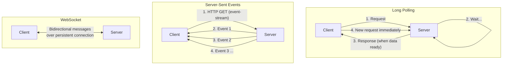
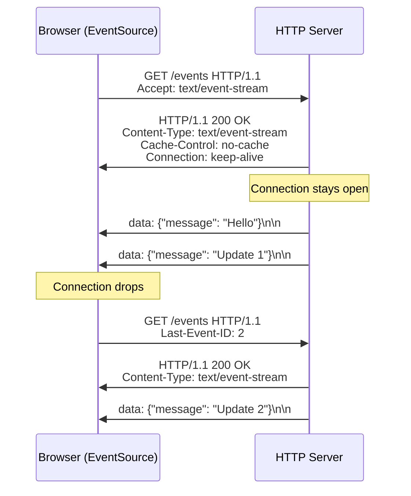
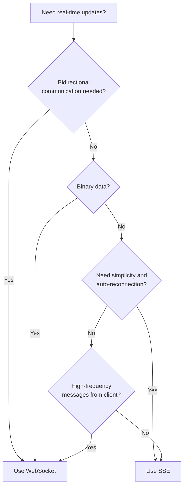

# Server-Sent Events (SSE)

## Table of Contents

1. [What are Server-Sent Events](#what-are-server-sent-events)
2. [SSE vs WebSockets vs Long Polling](#sse-vs-websockets-vs-long-polling)
3. [How SSE Works](#how-sse-works)
4. [EventSource API in the Browser](#eventsource-api-in-the-browser)
5. [SSE Event Format](#sse-event-format)
6. [Server Implementation (Node.js)](#server-implementation-nodejs)
7. [Client Implementation (JavaScript)](#client-implementation-javascript)
8. [Reconnection and Last-Event-ID](#reconnection-and-last-event-id)
9. [Use Cases](#use-cases)
10. [Limitations of SSE](#limitations-of-sse)
11. [When to Use SSE vs WebSocket](#when-to-use-sse-vs-websocket)
12. [Best Practices](#best-practices)
13. [Resources](#resources)

---

## What are Server-Sent Events

Server-Sent Events (SSE) is a standard that allows a server to push real-time updates to the browser over a single, long-lived HTTP connection. Unlike WebSockets, SSE is **unidirectional** — data flows only from the server to the client.

SSE is part of the [HTML5 specification](https://html.spec.whatwg.org/multipage/server-sent-events.html) and is supported by all modern browsers natively through the `EventSource` API.

**Key characteristics:**

- **Unidirectional** — Server pushes data to the client; the client cannot send data back over the same connection.
- **HTTP-based** — Uses standard HTTP, so it works through proxies, firewalls, and load balancers without special configuration.
- **Text-based** — Messages are sent as UTF-8 text with the `text/event-stream` content type.
- **Auto-reconnection** — The browser automatically reconnects if the connection drops.
- **Event IDs** — Built-in support for tracking the last received event, enabling seamless resume after reconnection.
- **Simple** — No special protocol or handshake required; it is plain HTTP.

---

## SSE vs WebSockets vs Long Polling



| Feature | Long Polling | SSE | WebSocket |
|---------|-------------|-----|-----------|
| Direction | Server to client | Server to client | Bidirectional |
| Protocol | HTTP | HTTP | WS (upgraded from HTTP) |
| Connection | New connection per response | Single persistent connection | Single persistent connection |
| Overhead | High (repeated headers) | Low (single connection) | Very low (minimal frame headers) |
| Auto-reconnect | Manual | Built-in | Manual |
| Binary data | Yes | No (text only) | Yes |
| Browser support | All browsers | All modern browsers | All modern browsers |
| Complexity | Low | Low | Moderate |
| Max connections | Limited by HTTP connection pool | ~6 per domain (HTTP/1.1) | No browser limit |
| Firewall/proxy friendly | Yes | Yes | Sometimes blocked |

> **Tip:** SSE is the simplest solution when you only need the server to push updates to the client. Reach for WebSockets only when you need bidirectional communication.

---

## How SSE Works

SSE uses a standard HTTP GET request. The server responds with `Content-Type: text/event-stream` and keeps the connection open, sending events as they occur.



**The flow:**

1. The client creates an `EventSource` object pointing to a server endpoint.
2. The browser sends a standard HTTP GET request with `Accept: text/event-stream`.
3. The server responds with `Content-Type: text/event-stream` and keeps the connection open.
4. The server writes events to the response stream whenever data is available.
5. If the connection drops, the browser automatically reconnects after a short delay.
6. On reconnection, the browser sends the `Last-Event-ID` header so the server can resume from where it left off.

---

## EventSource API in the Browser

The `EventSource` API is the built-in browser interface for consuming SSE streams.

```javascript
// Create a connection to the SSE endpoint
const eventSource = new EventSource("/api/events");

// Listen for generic messages (events without a named type)
eventSource.onmessage = (event) => {
  console.log("Received:", event.data);
};

// Listen for named events
eventSource.addEventListener("notification", (event) => {
  const data = JSON.parse(event.data);
  console.log("Notification:", data);
});

eventSource.addEventListener("heartbeat", (event) => {
  console.log("Server is alive");
});

// Connection lifecycle events
eventSource.onopen = () => {
  console.log("Connection established");
};

eventSource.onerror = (event) => {
  if (eventSource.readyState === EventSource.CONNECTING) {
    console.log("Reconnecting...");
  } else {
    console.error("Connection failed");
    eventSource.close();
  }
};

// Close the connection when done
// eventSource.close();
```

**EventSource ready states:**

| Value | Constant | Description |
|-------|----------|-------------|
| 0 | `EventSource.CONNECTING` | Connecting or reconnecting |
| 1 | `EventSource.OPEN` | Connection is open and receiving events |
| 2 | `EventSource.CLOSED` | Connection is closed and will not reconnect |

---

## SSE Event Format

Each SSE event is a block of text separated by a blank line (`\n\n`). Each line within the block is a field in the format `field: value`.

### Fields

| Field | Description |
|-------|-------------|
| `data` | The event payload. Multiple `data` lines are joined with newlines. |
| `event` | The event type name. The client listens for this with `addEventListener`. |
| `id` | The event ID. The browser sends this as `Last-Event-ID` on reconnection. |
| `retry` | Reconnection time in milliseconds. Overrides the browser default. |

### Examples

```
Basic message (unnamed event):
data: Hello, world!

JSON data:
data: {"user": "Alice", "action": "login"}

Named event:
event: notification
data: {"title": "New message", "body": "You have 3 unread messages"}

Event with ID:
id: 42
event: price-update
data: {"symbol": "AAPL", "price": 178.50}

Multi-line data (lines are joined with \n):
data: Line 1
data: Line 2
data: Line 3

Set reconnection interval to 5 seconds:
retry: 5000
data: Connected

Comment (ignored by the client, useful for keep-alive):
: this is a comment to keep the connection alive
```

> **Tip:** Send a comment line (`: keepalive`) every 15-30 seconds to prevent proxies and load balancers from closing idle connections.

---

## Server Implementation (Node.js)

```javascript
const http = require("http");

const server = http.createServer((req, res) => {
  if (req.url === "/events") {
    // Set SSE headers
    res.writeHead(200, {
      "Content-Type": "text/event-stream",
      "Cache-Control": "no-cache",
      Connection: "keep-alive",
      "Access-Control-Allow-Origin": "*",
    });

    let eventId = 0;

    // Check if client is resuming from a previous connection
    const lastEventId = req.headers["last-event-id"];
    if (lastEventId) {
      eventId = parseInt(lastEventId, 10);
      console.log(`Client reconnected, resuming from event ${eventId}`);
    }

    // Send events every 2 seconds
    const intervalId = setInterval(() => {
      eventId++;
      const data = JSON.stringify({
        id: eventId,
        timestamp: new Date().toISOString(),
        message: `Update #${eventId}`,
      });

      res.write(`id: ${eventId}\n`);
      res.write(`event: update\n`);
      res.write(`data: ${data}\n\n`);
    }, 2000);

    // Send a keep-alive comment every 15 seconds
    const keepAliveId = setInterval(() => {
      res.write(": keepalive\n\n");
    }, 15000);

    // Clean up when the client disconnects
    req.on("close", () => {
      clearInterval(intervalId);
      clearInterval(keepAliveId);
      console.log("Client disconnected");
    });
  } else {
    res.writeHead(200, { "Content-Type": "text/html" });
    res.end("<h1>SSE Demo</h1><p>Connect to /events</p>");
  }
});

server.listen(3000, () => {
  console.log("SSE server running on http://localhost:3000");
});
```

### Express.js Version

```javascript
const express = require("express");
const app = express();

// Store connected clients
const clients = new Set();

app.get("/events", (req, res) => {
  res.set({
    "Content-Type": "text/event-stream",
    "Cache-Control": "no-cache",
    Connection: "keep-alive",
  });
  res.flushHeaders();

  clients.add(res);
  console.log(`Client connected. Total: ${clients.size}`);

  req.on("close", () => {
    clients.delete(res);
    console.log(`Client disconnected. Total: ${clients.size}`);
  });
});

// Broadcast to all connected clients
function broadcast(event, data) {
  const message = `event: ${event}\ndata: ${JSON.stringify(data)}\n\n`;
  clients.forEach((client) => client.write(message));
}

// Example: broadcast a notification every 5 seconds
setInterval(() => {
  broadcast("notification", {
    title: "Server Update",
    time: new Date().toISOString(),
  });
}, 5000);

app.listen(3000, () => {
  console.log("SSE server running on http://localhost:3000");
});
```

---

## Client Implementation (JavaScript)

### Basic Client

```javascript
const eventSource = new EventSource("http://localhost:3000/events");

eventSource.addEventListener("update", (event) => {
  const data = JSON.parse(event.data);
  document.getElementById("feed").innerHTML += `
    <div class="event">
      <strong>#${data.id}</strong> - ${data.message}
      <small>${data.timestamp}</small>
    </div>
  `;
});

eventSource.onerror = () => {
  console.log("Connection lost. Browser will auto-reconnect...");
};
```

### With Authentication (Using EventSource Polyfill)

The native `EventSource` API does not support custom headers. To send authentication tokens, use a polyfill or the `fetch` API.

```javascript
// Using the eventsource package (npm install eventsource)
import { EventSource } from "eventsource";

const es = new EventSource("http://localhost:3000/events", {
  headers: {
    Authorization: "Bearer my-jwt-token",
  },
});

// Alternative: Use fetch API for SSE with custom headers
async function connectSSE() {
  const response = await fetch("/events", {
    headers: { Authorization: "Bearer my-jwt-token" },
  });

  const reader = response.body.getReader();
  const decoder = new TextDecoder();

  while (true) {
    const { done, value } = await reader.read();
    if (done) break;
    const text = decoder.decode(value);
    console.log("Received:", text);
  }
}
```

---

## Reconnection and Last-Event-ID

One of the strongest features of SSE is its built-in reconnection mechanism.

**How it works:**

1. The server assigns an `id` field to each event.
2. The browser stores the last received event ID internally.
3. When the connection drops, the browser waits for the retry interval (default ~3 seconds).
4. On reconnection, the browser sends a `Last-Event-ID` HTTP header with the stored ID.
5. The server can use this ID to replay missed events.

```
First connection:
id: 1
data: Event 1

id: 2
data: Event 2

── connection drops ──

Reconnection request:
GET /events HTTP/1.1
Last-Event-ID: 2

Server resumes from event 3:
id: 3
data: Event 3
```

**Controlling retry interval from the server:**

```
retry: 10000
data: Reconnect after 10 seconds if disconnected
```

> **Tip:** Store events in a buffer (e.g., the last 100 events) on the server so you can replay missed events when a client reconnects with a `Last-Event-ID`.

---

## Use Cases

SSE is ideal for scenarios where the server needs to push updates to the client, but the client does not need to send data back.

| Use Case | Description |
|----------|-------------|
| **Live news/sports feeds** | Push breaking news or score updates as they happen |
| **Notifications** | Real-time alerts, system status changes |
| **Stock tickers** | Continuous price updates for financial instruments |
| **Dashboard monitoring** | Server metrics, application health, build status |
| **Social media feeds** | New posts, likes, and comments appearing in real time |
| **Progress tracking** | File upload progress, long-running job status |
| **Log streaming** | Tailing server logs in a web interface |
| **AI/LLM streaming** | Token-by-token streaming of AI-generated responses |

---

## Limitations of SSE

- **Unidirectional only** — Data flows from server to client. For client-to-server communication, you still need regular HTTP requests.
- **Text-based only** — Binary data must be Base64-encoded, adding ~33% overhead.
- **Connection limit** — Browsers limit the number of SSE connections to ~6 per domain under HTTP/1.1. HTTP/2 raises this significantly (default 100 streams).
- **No native custom headers** — The `EventSource` API does not support setting custom headers (e.g., for authentication). Workarounds include query parameters, cookies, or polyfills.
- **No cross-tab sharing** — Each browser tab opens its own connection. Use `SharedWorker` or `BroadcastChannel` to share a single SSE connection across tabs.

---

## When to Use SSE vs WebSocket



**Choose SSE when:**

- You only need server-to-client updates (notifications, feeds, dashboards).
- You want automatic reconnection and event ID tracking out of the box.
- You need to work through corporate proxies and firewalls without issues.
- Simplicity is a priority over raw performance.

**Choose WebSocket when:**

- You need bidirectional communication (chat, gaming, collaboration).
- You need to send binary data (audio, video, file transfer).
- You need very high-frequency message exchange in both directions.
- The connection limit per domain is a concern (WebSocket connections are not subject to the HTTP/1.1 limit).

---

## Best Practices

1. **Set proper headers** — Always include `Cache-Control: no-cache` and `Connection: keep-alive` in your SSE response to prevent intermediaries from buffering or closing the connection.

2. **Send keep-alive comments** — Write a comment line (`: keepalive\n\n`) every 15-30 seconds to prevent proxies, load balancers, and CDNs from closing idle connections.

3. **Always include event IDs** — Assign an `id` field to every event so the browser can resume correctly after a disconnection.

4. **Handle reconnection on the server** — Read the `Last-Event-ID` header and replay any missed events. Keep a bounded buffer of recent events.

5. **Use named events** — Use the `event` field to categorize messages so clients can subscribe to specific event types with `addEventListener`.

6. **Implement graceful shutdown** — When the server shuts down, close all SSE connections cleanly so clients reconnect to a healthy instance.

7. **Use HTTP/2** — HTTP/2 multiplexes all streams over a single TCP connection, effectively removing the 6-connection-per-domain limit of HTTP/1.1.

8. **Share connections across tabs** — Use a `SharedWorker` or `BroadcastChannel` API to share a single SSE connection across multiple tabs, reducing server load.

9. **Compress responses** — Enable gzip or Brotli compression on the server. SSE text data compresses well and reduces bandwidth usage.

10. **Monitor connection count** — Track the number of active SSE connections on your server. Each connection holds an open file descriptor; plan capacity accordingly.

---

## Resources

- [MDN — Server-Sent Events](https://developer.mozilla.org/en-US/docs/Web/API/Server-sent_events) — Comprehensive guide to the SSE API.
- [MDN — EventSource](https://developer.mozilla.org/en-US/docs/Web/API/EventSource) — API reference for the EventSource interface.
- [HTML Living Standard — Server-Sent Events](https://html.spec.whatwg.org/multipage/server-sent-events.html) — The official specification.
- [Can I Use — EventSource](https://caniuse.com/eventsource) — Browser compatibility table.
- [eventsource (npm)](https://www.npmjs.com/package/eventsource) — Node.js and browser polyfill with custom header support.
- [SSE vs WebSocket — A Comparison](https://ably.com/blog/websockets-vs-sse) — Detailed comparison of the two technologies.
- [Using Server-Sent Events (web.dev)](https://web.dev/articles/eventsource-basics) — Practical tutorial with examples.
