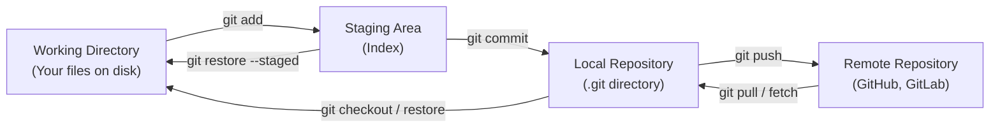
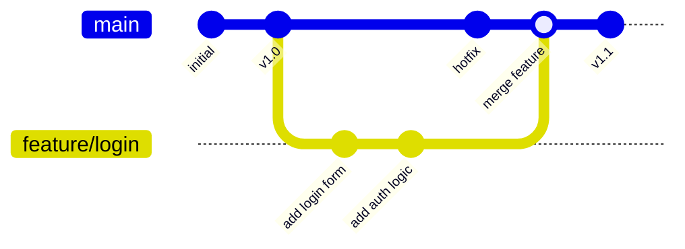
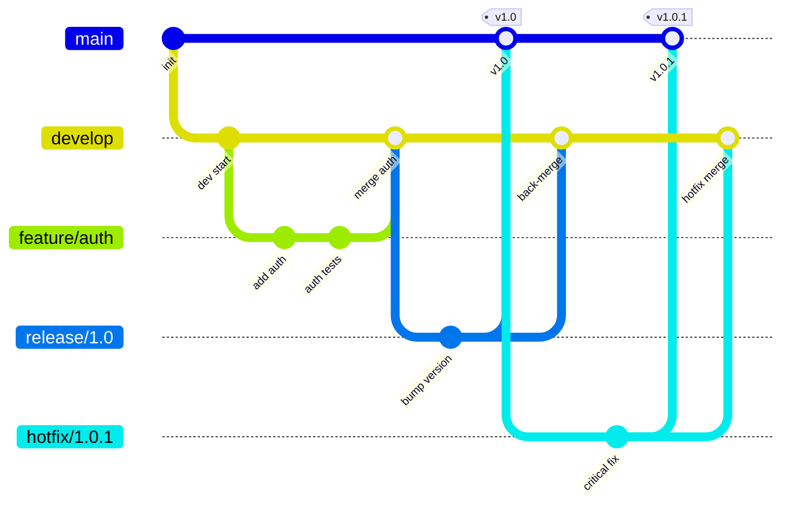

# Version Control Systems

Version control is one of the most fundamental tools in a developer's workflow. It tracks changes to code over time, enables collaboration, and provides a safety net for experimentation. Every professional software project uses version control, and **Git** is the dominant system today.

# Contents

1. [What is Version Control](#what-is-version-control)
2. [Why Version Control is Essential](#why-version-control-is-essential)
3. [Types of Version Control Systems](#types-of-version-control-systems)
4. [Git Fundamentals](#git-fundamentals)
5. [Basic Git Commands](#basic-git-commands)
6. [Branching and Merging](#branching-and-merging)
7. [Branching Strategies](#branching-strategies)
8. [Handling Merge Conflicts](#handling-merge-conflicts)
9. [The .gitignore File](#the-gitignore-file)
10. [GitHub, GitLab, and Bitbucket](#github-gitlab-and-bitbucket)
11. [Pull Requests and Code Review](#pull-requests-and-code-review)
12. [Git Best Practices](#git-best-practices)
13. [Conventional Commits](#conventional-commits)
14. [Resources](#resources)

---

## What is Version Control

A **version control system (VCS)** is software that tracks and manages changes to files over time. It records every modification in a special database so that if something goes wrong, you can compare earlier versions and revert to a previous state.

Think of it as an unlimited undo system for your entire project, combined with the ability for multiple people to work on the same codebase simultaneously.

## Why Version Control is Essential

- **History** -- every change is recorded with who made it, when, and why
- **Collaboration** -- multiple developers can work on the same project without overwriting each other's work
- **Branching** -- experiment with new features in isolation without affecting the main codebase
- **Backup** -- your code is stored in a remote repository, protecting against data loss
- **Code review** -- changes can be reviewed before being integrated
- **Traceability** -- link code changes to issues, bugs, and feature requests
- **CI/CD integration** -- automated testing and deployment triggered by version control events

> **Tip:** Version control is not just for code. Configuration files, infrastructure-as-code (Terraform, Kubernetes manifests), documentation, and even database schemas benefit from version control.

## Types of Version Control Systems

### Centralized Version Control Systems (CVCS)

A single central server stores all versioned files. Clients check out files from that server.

**Examples:** Subversion (SVN), CVS, Perforce

**Drawbacks:**
- Single point of failure -- if the server goes down, no one can commit
- Requires network access for most operations
- Slower for large teams

### Distributed Version Control Systems (DVCS)

Every developer has a complete copy of the repository, including its full history. Operations like commit, branch, and merge happen locally.

**Examples:** Git, Mercurial

**Advantages:**
- Work offline -- commit, branch, and view history without network access
- No single point of failure
- Faster operations (most are local)
- Better branching and merging

```
CVCS:                           DVCS:

  ┌──────────┐                    ┌──────────┐
  │  Server  │                    │  Remote  │
  └────┬─────┘                    └──┬───┬───┘
       │                             │   │
  ┌────┼─────┐                 ┌─────┘   └─────┐
  │    │     │                 │               │
  v    v     v                 v               v
 Dev1 Dev2  Dev3          ┌────────┐     ┌────────┐
                          │Dev1    │     │Dev2    │
                          │(full   │     │(full   │
                          │ repo)  │     │ repo)  │
                          └────────┘     └────────┘
```

## Git Fundamentals

**Git** was created by Linus Torvalds in 2005 for managing the Linux kernel. It is now the industry standard for version control.

### Key Concepts

**Repository (repo):** A directory tracked by Git, containing all files and the complete history of changes.

**Commit:** A snapshot of your project at a point in time. Each commit has a unique SHA-1 hash, an author, a timestamp, and a message describing the change.

**Branch:** A lightweight movable pointer to a commit. Branches allow you to diverge from the main line of development.

**HEAD:** A pointer to the current branch and commit you are working on.

### The Three Areas

Git uses three main areas to manage your files:



1. **Working Directory** -- the actual files on your filesystem
2. **Staging Area (Index)** -- a preview of your next commit; files you have marked to include
3. **Repository** -- the committed history stored in the `.git` directory

## Basic Git Commands

### Setting Up

```bash
# Configure your identity (required before first commit)
git config --global user.name "Your Name"
git config --global user.email "you@example.com"

# Initialize a new repository
git init

# Clone an existing repository
git clone https://github.com/user/repo.git
git clone git@github.com:user/repo.git    # SSH
```

### Daily Workflow

```bash
# Check the status of your working directory
git status

# View changes not yet staged
git diff

# View changes that are staged
git diff --staged

# Stage specific files
git add server.js
git add src/controllers/

# Stage all changes
git add .

# Commit staged changes
git commit -m "Add user authentication endpoint"

# View commit history
git log
git log --oneline --graph
```

### Working with Remotes

```bash
# Add a remote repository
git remote add origin https://github.com/user/repo.git

# Push commits to remote
git push origin main

# Pull latest changes from remote
git pull origin main

# Fetch changes without merging
git fetch origin

# View remote repositories
git remote -v
```

### Undoing Changes

```bash
# Unstage a file (keep changes in working directory)
git restore --staged file.txt

# Discard changes in working directory
git restore file.txt

# Amend the last commit (change message or add files)
git commit --amend -m "Updated commit message"

# Revert a commit (creates a new commit that undoes changes)
git revert abc1234

# View the reflog (recovery tool for lost commits)
git reflog
```

## Branching and Merging

Branches are one of Git's most powerful features. They allow you to develop features, fix bugs, and experiment in isolation.

### Branch Operations

```bash
# List branches
git branch          # local branches
git branch -r       # remote branches
git branch -a       # all branches

# Create a new branch
git branch feature/user-auth

# Switch to a branch
git checkout feature/user-auth
# or (modern syntax)
git switch feature/user-auth

# Create and switch in one command
git checkout -b feature/user-auth
git switch -c feature/user-auth

# Delete a branch
git branch -d feature/user-auth      # safe delete (only if merged)
git branch -D feature/user-auth      # force delete
```

### Branching and Merging Flow



### Merging

```bash
# Merge a branch into your current branch
git checkout main
git merge feature/user-auth

# This creates a merge commit if there are divergent changes
```

### Rebasing

Rebase rewrites commit history by moving your branch's commits on top of another branch. This creates a linear history.

```bash
# Rebase your branch on top of main
git checkout feature/user-auth
git rebase main

# Then fast-forward merge
git checkout main
git merge feature/user-auth
```

| Strategy | Result | When to Use |
|---|---|---|
| Merge | Preserves all history, creates merge commit | Shared branches, preserving context |
| Rebase | Linear history, no merge commits | Feature branches before merging |
| Squash merge | Combines all commits into one | Clean main branch history |

> **Tip:** Never rebase commits that have been pushed to a shared branch. Rebase is for cleaning up your local, unpushed work.

## Branching Strategies

### GitFlow



A structured branching model with dedicated branches for different purposes:

```
main ──────────────────────────────────────────────>
  │                                    ▲
  └──> develop ──────────────────────> │ ──────────>
         │          ▲         │        │
         └─ feature/login ──┘         │
         └─ feature/payment ─────────┘

Hotfix: main -> hotfix/bug -> main + develop
Release: develop -> release/1.0 -> main + develop
```

- **main** -- production-ready code
- **develop** -- integration branch for features
- **feature/** -- individual feature branches
- **release/** -- preparation for a release
- **hotfix/** -- urgent production fixes

### Trunk-Based Development

A simpler model where developers commit to a single branch (trunk/main) frequently, using short-lived feature branches.

```
main ──────────────────────────────────────────────>
  │    ▲    │    ▲    │         ▲
  └────┘    └────┘    └─────────┘
  (short feature branches, merged quickly)
```

**Characteristics:**
- Feature branches live for hours or days, not weeks
- Relies heavily on feature flags for incomplete features
- Continuous integration is essential
- Preferred by teams practicing CI/CD

| Strategy | Team Size | Release Cadence | Complexity |
|---|---|---|---|
| GitFlow | Medium-Large | Scheduled releases | Higher |
| Trunk-based | Any | Continuous delivery | Lower |
| GitHub Flow | Small-Medium | Continuous delivery | Low |

## Handling Merge Conflicts

Merge conflicts occur when Git cannot automatically resolve differences between two branches.

### When Conflicts Happen

- Two branches modify the same line in the same file
- One branch deletes a file that the other modifies
- Both branches add a file with the same name but different content

### Resolving Conflicts

```bash
# After a merge with conflicts
git merge feature/update-config

# Git marks the conflicting files
# Open the file and look for conflict markers:
```

```
<<<<<<< HEAD
const port = 3000;
=======
const port = process.env.PORT || 8080;
>>>>>>> feature/update-config
```

To resolve:

1. Edit the file to choose the correct code (remove the markers)
2. Stage the resolved file: `git add config.js`
3. Complete the merge: `git commit`

```bash
# Useful tools for resolving conflicts
git mergetool          # opens configured merge tool
git diff               # see remaining conflicts
git merge --abort      # cancel the merge entirely
```

> **Tip:** Small, frequent merges reduce the likelihood and complexity of conflicts. If you are working on a long-lived branch, regularly merge or rebase from the target branch.

## The .gitignore File

The `.gitignore` file tells Git which files and directories to ignore. Ignored files will not be tracked or committed.

```gitignore
# Dependencies
node_modules/
vendor/
__pycache__/
.venv/

# Environment variables (NEVER commit secrets)
.env
.env.local
.env.production

# Build output
dist/
build/
*.o
*.class

# IDE and editor files
.idea/
.vscode/
*.swp
*.swo
.DS_Store

# Logs
*.log
logs/

# OS files
Thumbs.db
.DS_Store
```

> **Tip:** Use [gitignore.io](https://www.toptal.com/developers/gitignore) to generate `.gitignore` templates for your specific tech stack.

## GitHub, GitLab, and Bitbucket

These platforms host Git repositories remotely and add collaboration features on top of Git.

| Feature | GitHub | GitLab | Bitbucket |
|---|---|---|---|
| Hosting | Cloud / Enterprise | Cloud / Self-hosted | Cloud / Data Center |
| CI/CD | GitHub Actions | GitLab CI/CD (built-in) | Bitbucket Pipelines |
| Free private repos | Yes | Yes | Yes |
| Code review | Pull Requests | Merge Requests | Pull Requests |
| Package registry | GitHub Packages | GitLab Registry | Limited |
| Wiki | Yes | Yes | Yes |
| Project management | Issues, Projects | Issues, Boards, Epics | Jira integration |
| Market position | Largest community | Popular for self-hosting | Popular with Atlassian users |

## Pull Requests and Code Review

A **pull request (PR)** -- called a **merge request (MR)** in GitLab -- is a request to merge changes from one branch into another. It is the primary mechanism for code review.

### Creating a Good Pull Request

1. **Keep it focused** -- one feature or fix per PR
2. **Keep it small** -- aim for under 400 lines of changes
3. **Write a clear description** -- explain what changed and why
4. **Link related issues** -- reference issue numbers
5. **Include tests** -- demonstrate that your changes work
6. **Add screenshots** -- for UI changes

### PR Template Example

```markdown
## Summary
Brief description of the changes.

## Changes
- Added user authentication endpoint
- Integrated JWT token generation
- Added rate limiting middleware

## Testing
- [ ] Unit tests pass
- [ ] Integration tests pass
- [ ] Manual testing completed

## Related Issues
Closes #42
```

### Code Review Best Practices

**As a reviewer:**
- Review promptly (within 24 hours)
- Be constructive and specific
- Focus on logic, security, and maintainability -- not style (use linters for that)
- Approve when it is good enough, not when it is perfect

**As an author:**
- Respond to all comments
- Do not take feedback personally
- Explain your reasoning when you disagree

## Git Best Practices

1. **Commit often** -- small, focused commits are easier to review and revert
2. **Write meaningful commit messages** -- explain the "why," not just the "what"
3. **Never commit secrets** -- API keys, passwords, tokens belong in environment variables
4. **Use branches** -- never commit directly to main in team projects
5. **Pull before push** -- keep your branch up to date to minimize conflicts
6. **Review your changes before committing** -- use `git diff --staged`
7. **Use `.gitignore`** -- keep build artifacts, dependencies, and IDE files out of the repo
8. **Tag releases** -- use `git tag v1.0.0` for release versions
9. **Keep the history clean** -- squash or rebase messy feature branch commits before merging

## Conventional Commits

**Conventional Commits** is a specification for writing standardized commit messages. It makes commit history readable and enables automated tooling (changelogs, semantic versioning).

### Format

```
<type>[optional scope]: <description>

[optional body]

[optional footer(s)]
```

### Common Types

| Type | Description |
|---|---|
| `feat` | A new feature |
| `fix` | A bug fix |
| `docs` | Documentation changes |
| `style` | Formatting, whitespace (no code change) |
| `refactor` | Code restructuring (no feature or fix) |
| `test` | Adding or modifying tests |
| `chore` | Build process, dependencies, tooling |
| `perf` | Performance improvement |
| `ci` | CI/CD configuration changes |

### Examples

```bash
# Feature
git commit -m "feat(auth): add JWT token refresh endpoint"

# Bug fix
git commit -m "fix(api): handle null user in GET /users/:id"

# Breaking change
git commit -m "feat(api)!: change authentication from API key to OAuth 2.0

BREAKING CHANGE: All clients must update to use OAuth 2.0 tokens.
API key authentication is no longer supported."

# Chore
git commit -m "chore(deps): update express to 4.18.2"
```

Benefits of Conventional Commits:

- Automatically generate CHANGELOGs
- Automatically determine semantic version bumps
- Communicate the nature of changes to teammates
- Trigger specific CI/CD processes (e.g., only run deployment on `feat` or `fix`)

## Resources

- [Pro Git Book (free online)](https://git-scm.com/book/en/v2) -- the definitive Git reference
- [Git Official Documentation](https://git-scm.com/doc)
- [Learn Git Branching (interactive)](https://learngitbranching.js.org/) -- visual, interactive Git tutorial
- [GitHub Skills](https://skills.github.com/) -- hands-on GitHub courses
- [Conventional Commits Specification](https://www.conventionalcommits.org/)
- [Atlassian Git Tutorials](https://www.atlassian.com/git/tutorials)
- [GitFlow Workflow](https://nvie.com/posts/a-successful-git-branching-model/)
- [Trunk Based Development](https://trunkbaseddevelopment.com/)
- [Oh Shit, Git!?!](https://ohshitgit.com/) -- practical guide for common Git mistakes
- [gitignore.io](https://www.toptal.com/developers/gitignore) -- generate .gitignore files
