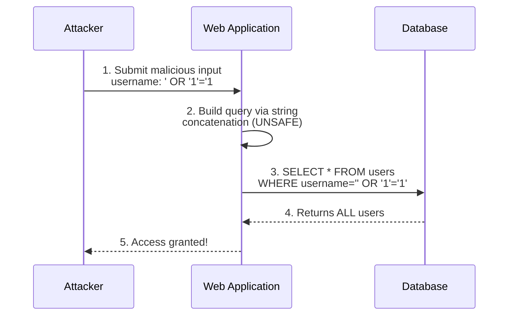
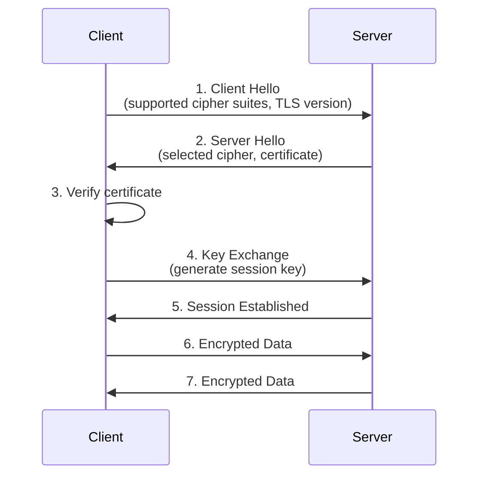
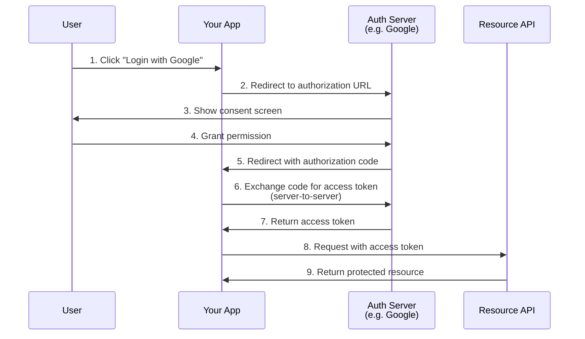

# Web Security Knowledge

---

# Contents

1.  [Why Web Security Matters](#why-web-security-matters)
2.  [OWASP Top 10 Overview](#owasp-top-10-overview)
3.  [Common Attacks](#common-attacks)
4.  [HTTPS and SSL/TLS](#https-and-ssltls)
5.  [Hashing Algorithms](#hashing-algorithms)
6.  [Password Storage Best Practices](#password-storage-best-practices)
7.  [Content Security Policy (CSP)](#content-security-policy-csp)
8.  [CORS Security](#cors-security)
9.  [Authentication vs Authorization](#authentication-vs-authorization)
10. [OAuth 2.0 and OpenID Connect](#oauth-20-and-openid-connect)
11. [JWT Security Considerations](#jwt-security-considerations)
12. [Server Hardening Basics](#server-hardening-basics)
13. [Resources](#resources)

# Why Web Security Matters

Web security is a critical concern for every backend developer. A single vulnerability can lead to data breaches, financial losses, legal consequences, and the destruction of user trust. As a backend developer, you are the last line of defense before data reaches persistent storage and critical business logic.

Key reasons to prioritize security:

- **Data Protection** -- Users trust you with their personal data. Breaches expose sensitive information like passwords, emails, financial records, and health data.
- **Legal Compliance** -- Regulations such as GDPR, HIPAA, and PCI-DSS impose strict requirements on how data is stored and transmitted. Non-compliance results in significant fines.
- **Business Continuity** -- Attacks like DDoS or ransomware can take services offline, resulting in revenue loss and reputational damage.
- **Supply Chain Impact** -- A vulnerability in your service can compromise every system that depends on it.

> **Principle of Least Privilege:** Always give users, services, and processes the minimum level of access they need to perform their function. This limits the blast radius of any breach.

# OWASP Top 10 Overview

The Open Web Application Security Project (OWASP) maintains a regularly updated list of the ten most critical web application security risks. The 2021 edition includes:

| Rank | Risk | Description |
|------|------|-------------|
| A01 | **Broken Access Control** | Users acting outside their intended permissions |
| A02 | **Cryptographic Failures** | Failures related to cryptography leading to data exposure |
| A03 | **Injection** | SQL, NoSQL, OS, and LDAP injection attacks |
| A04 | **Insecure Design** | Flaws in design and architecture, not implementation |
| A05 | **Security Misconfiguration** | Default configs, open cloud storage, verbose errors |
| A06 | **Vulnerable Components** | Using components with known vulnerabilities |
| A07 | **Authentication Failures** | Broken authentication and session management |
| A08 | **Software and Data Integrity Failures** | Code and infrastructure without integrity verification |
| A09 | **Security Logging Failures** | Insufficient logging and monitoring |
| A10 | **Server-Side Request Forgery (SSRF)** | Application fetches remote resources without validation |

> **Tip:** Make reviewing the OWASP Top 10 a regular practice. Bookmark the official site and check it before every major release.

# Common Attacks

## SQL Injection

SQL Injection occurs when an attacker can insert or manipulate SQL queries through user input. It remains one of the most dangerous and common web vulnerabilities.

**Vulnerable code:**

```python
# NEVER do this
query = f"SELECT * FROM users WHERE username = '{username}' AND password = '{password}'"
cursor.execute(query)
```



If the attacker enters `' OR '1'='1` as the username, the query becomes:

```sql
SELECT * FROM users WHERE username = '' OR '1'='1' AND password = ''
```

This returns all users, bypassing authentication entirely.

**Prevention -- Use parameterized queries:**

```python
# Safe - parameterized query
cursor.execute(
    "SELECT * FROM users WHERE username = %s AND password = %s",
    (username, password)
)
```

```javascript
// Node.js with pg library - parameterized query
const result = await pool.query(
  'SELECT * FROM users WHERE username = $1 AND password = $2',
  [username, password]
);
```

> **Rule:** Never concatenate user input into SQL queries. Always use parameterized queries or prepared statements.

## XSS (Cross-Site Scripting)

XSS attacks inject malicious scripts into web pages viewed by other users. There are three types:

```mermaid
sequenceDiagram
    participant Attacker
    participant App as Web Application
    participant DB as Database
    participant Victim as Victim's Browser

    Note over Attacker,Victim: Stored XSS Attack Flow
    Attacker->>App: 1. Submit comment with<br/>&lt;script&gt;steal(cookies)&lt;/script&gt;
    App->>DB: 2. Store malicious comment
    Victim->>App: 3. View page with comments
    App->>DB: 4. Fetch comments
    DB-->>App: 5. Return comments (incl. script)
    App-->>Victim: 6. Render page with script
    Victim->>Attacker: 7. Script executes,<br/>sends cookies to attacker
```

| Type | Description | Example |
|------|-------------|---------|
| **Stored XSS** | Malicious script is permanently stored on the server (e.g., in a database) | A comment containing `<script>` tags |
| **Reflected XSS** | Script is reflected off a web server in error messages or search results | A crafted URL with script in query params |
| **DOM-based XSS** | The vulnerability exists in client-side code, not the server | Manipulating `document.location` |

**Prevention:**

```javascript
// Escape HTML output
function escapeHtml(text) {
  const map = {
    '&': '&amp;',
    '<': '&lt;',
    '>': '&gt;',
    '"': '&quot;',
    "'": '&#039;'
  };
  return text.replace(/[&<>"']/g, (m) => map[m]);
}

// Use in templates
const safeOutput = escapeHtml(userInput);
```

## CSRF (Cross-Site Request Forgery)

CSRF tricks an authenticated user into submitting a request they did not intend to make. The attacker exploits the fact that the browser automatically includes cookies with every request.

**How it works:**

```html
<!-- Malicious page tricks the user into transferring money -->
<form action="https://bank.com/transfer" method="POST" id="evil-form">
  <input type="hidden" name="to" value="attacker-account" />
  <input type="hidden" name="amount" value="10000" />
</form>
<script>document.getElementById('evil-form').submit();</script>
```

**Prevention:**

1. **CSRF Tokens** -- Generate a unique token per session and include it in every form. Validate it on the server.
2. **SameSite Cookies** -- Set the `SameSite` attribute on cookies.
3. **Check Origin/Referer headers** -- Verify the request originates from your domain.

```javascript
// Express.js CSRF protection with csurf middleware
const csrf = require('csurf');
const csrfProtection = csrf({ cookie: true });

app.get('/form', csrfProtection, (req, res) => {
  res.render('form', { csrfToken: req.csrfToken() });
});

app.post('/process', csrfProtection, (req, res) => {
  res.send('Data processed');
});
```

## Clickjacking

Clickjacking tricks users into clicking on something different from what they perceive by embedding your site in an invisible iframe on a malicious page.

**Prevention:**

```
# HTTP response header to prevent framing
X-Frame-Options: DENY

# Modern alternative using CSP
Content-Security-Policy: frame-ancestors 'none';
```

## MITM (Man-in-the-Middle)

In a MITM attack, the attacker secretly intercepts and possibly alters communication between two parties who believe they are communicating directly with each other.

**Prevention:**
- Always use HTTPS (TLS) for all communications
- Implement HSTS (HTTP Strict Transport Security)
- Use certificate pinning for mobile applications
- Validate SSL certificates properly

```
# HSTS header - forces HTTPS for 1 year including subdomains
Strict-Transport-Security: max-age=31536000; includeSubDomains; preload
```

## DDoS (Distributed Denial of Service)

DDoS attacks overwhelm a server with traffic from many sources, making it unavailable to legitimate users.

**Mitigation strategies:**
- Use a CDN/DDoS protection service (Cloudflare, AWS Shield)
- Implement rate limiting at the application level
- Use load balancers to distribute traffic
- Configure firewalls to block suspicious patterns
- Set up auto-scaling to absorb traffic spikes

```javascript
// Express.js rate limiting
const rateLimit = require('express-rate-limit');

const limiter = rateLimit({
  windowMs: 15 * 60 * 1000,  // 15 minutes
  max: 100,                    // limit each IP to 100 requests per window
  message: 'Too many requests, please try again later.'
});

app.use('/api/', limiter);
```

# HTTPS and SSL/TLS

HTTPS is HTTP over TLS (Transport Layer Security). It encrypts data in transit between the client and server, preventing eavesdropping and tampering.

**How TLS Handshake Works:**

```
1. Client Hello     --> Client sends supported cipher suites and TLS version
2. Server Hello     <-- Server selects cipher suite, sends certificate
3. Key Exchange     --> Client verifies certificate, generates session key
4. Secure Channel   <-> Both sides use session key for encrypted communication
```



**Key concepts:**

| Term | Description |
|------|-------------|
| **SSL** | Secure Sockets Layer -- the predecessor to TLS (deprecated) |
| **TLS** | Transport Layer Security -- the current standard (TLS 1.3 is latest) |
| **Certificate** | A digital document that binds a public key to a domain identity |
| **CA** | Certificate Authority -- a trusted entity that issues certificates |
| **Let's Encrypt** | A free, automated CA that provides TLS certificates |

> **Tip:** Always use TLS 1.2 or 1.3. Disable older protocols (SSL 3.0, TLS 1.0, TLS 1.1) as they have known vulnerabilities.

# Hashing Algorithms

Hashing transforms input data into a fixed-size string of characters. A good hash function is deterministic, fast to compute, infeasible to reverse, and produces unique outputs for different inputs.

| Algorithm | Output Size | Status | Use Case |
|-----------|-------------|--------|----------|
| **MD5** | 128-bit | Broken | File checksums only (never for passwords) |
| **SHA-1** | 160-bit | Deprecated | Legacy systems (avoid in new projects) |
| **SHA-256** | 256-bit | Secure | Data integrity, digital signatures |
| **SHA-512** | 512-bit | Secure | Data integrity, higher security needs |
| **bcrypt** | 184-bit | Secure | Password hashing (includes salt and cost factor) |
| **Argon2** | Configurable | Secure | Password hashing (winner of PHC competition) |

```python
# Python bcrypt example
import bcrypt

# Hash a password
password = b"my_secure_password"
salt = bcrypt.gensalt(rounds=12)
hashed = bcrypt.hashpw(password, salt)

# Verify a password
if bcrypt.checkpw(password, hashed):
    print("Password matches")
```

```javascript
// Node.js with argon2
const argon2 = require('argon2');

// Hash
const hash = await argon2.hash('my_secure_password', {
  type: argon2.argon2id,
  memoryCost: 65536,
  timeCost: 3,
  parallelism: 4
});

// Verify
const isValid = await argon2.verify(hash, 'my_secure_password');
```

> **Important:** MD5 and SHA-1 are cryptographically broken for security purposes. Never use them for passwords or authentication tokens.

# Password Storage Best Practices

1. **Never store passwords in plain text** -- Always hash passwords before storing them.
2. **Use a dedicated password hashing algorithm** -- Use bcrypt, scrypt, or Argon2id. Do not use general-purpose hash functions like SHA-256.
3. **Use a unique salt per password** -- bcrypt and Argon2 handle salting automatically.
4. **Use a high work factor** -- Increase the cost parameter so hashing takes at least 100ms. This slows brute-force attacks.
5. **Implement account lockout or throttling** -- Limit failed login attempts to prevent brute-force attacks.
6. **Enforce password complexity** -- Require minimum length (at least 8 characters) and check against common password lists.
7. **Support multi-factor authentication (MFA)** -- Add a second factor like TOTP, SMS, or hardware keys.

# Content Security Policy (CSP)

CSP is an HTTP response header that tells the browser which sources of content are trusted. It is one of the most effective defenses against XSS attacks.

```
Content-Security-Policy: default-src 'self';
  script-src 'self' https://cdn.example.com;
  style-src 'self' 'unsafe-inline';
  img-src 'self' data: https:;
  connect-src 'self' https://api.example.com;
  font-src 'self' https://fonts.googleapis.com;
  frame-ancestors 'none';
```

| Directive | Controls |
|-----------|----------|
| `default-src` | Fallback for all resource types |
| `script-src` | JavaScript sources |
| `style-src` | CSS sources |
| `img-src` | Image sources |
| `connect-src` | AJAX, WebSocket, and EventSource connections |
| `frame-ancestors` | Which sites can embed this page in a frame |
| `report-uri` | URL to send violation reports to |

> **Tip:** Start with a strict policy (`default-src 'self'`) and gradually add exceptions as needed. Use `Content-Security-Policy-Report-Only` to test without enforcement.

# CORS Security

Cross-Origin Resource Sharing (CORS) controls which domains can make requests to your API. Without proper CORS configuration, your API is either too open (vulnerable) or too restrictive (broken).

```javascript
// Express.js CORS configuration
const cors = require('cors');

// Restrictive - only allow specific origins
const corsOptions = {
  origin: ['https://myapp.com', 'https://admin.myapp.com'],
  methods: ['GET', 'POST', 'PUT', 'DELETE'],
  allowedHeaders: ['Content-Type', 'Authorization'],
  credentials: true,
  maxAge: 86400  // Cache preflight for 24 hours
};

app.use(cors(corsOptions));
```

**Common mistakes to avoid:**
- Setting `Access-Control-Allow-Origin: *` with `credentials: true`
- Reflecting the `Origin` header without validation
- Not restricting allowed methods and headers

# Authentication vs Authorization

These two concepts are related but fundamentally different:

| Aspect | Authentication (AuthN) | Authorization (AuthZ) |
|--------|----------------------|---------------------|
| **Question** | Who are you? | What can you do? |
| **Purpose** | Verify identity | Verify permissions |
| **Example** | Login with username/password | Checking if user can delete a post |
| **Happens** | Before authorization | After authentication |
| **Methods** | Passwords, tokens, biometrics, MFA | Roles, policies, ACLs, RBAC |

```
User submits credentials --> Authentication (verify identity)
                         --> Authorization (check permissions)
                         --> Access granted or denied
```

**Common authorization models:**

- **RBAC (Role-Based Access Control)** -- Users are assigned roles; roles have permissions.
- **ABAC (Attribute-Based Access Control)** -- Access decisions based on attributes of the user, resource, and environment.
- **ACL (Access Control List)** -- Explicit list of who can access what resources.

# OAuth 2.0 and OpenID Connect

**OAuth 2.0** is an authorization framework that allows third-party applications to access user resources without exposing the user's credentials.

**OpenID Connect (OIDC)** is an identity layer built on top of OAuth 2.0 that adds authentication capabilities.

**OAuth 2.0 Authorization Code Flow:**

```
1. User clicks "Login with Google"
2. App redirects to Google's authorization server
3. User authenticates and grants permission
4. Google redirects back with an authorization code
5. App exchanges the code for an access token (server-to-server)
6. App uses the access token to access Google APIs
```



**Key OAuth 2.0 grant types:**

| Grant Type | Use Case |
|-----------|----------|
| **Authorization Code** | Server-side web apps (most secure) |
| **Authorization Code + PKCE** | Single-page apps and mobile apps |
| **Client Credentials** | Machine-to-machine communication |
| **Refresh Token** | Obtaining new access tokens without re-authentication |

> **Important:** The Implicit grant and Resource Owner Password Credentials grant are deprecated and should not be used in new applications.

# JWT Security Considerations

JSON Web Tokens (JWT) are widely used for authentication, but they come with significant security pitfalls if misused.

**JWT Structure:**

```
header.payload.signature

eyJhbGciOiJIUzI1NiJ9.eyJ1c2VyX2lkIjoxMjM0fQ.SIGNATURE
```

**Security best practices:**

1. **Always verify the signature** -- Never decode a JWT without verifying its signature.
2. **Use strong algorithms** -- Use RS256 or ES256 for asymmetric signing. Avoid HS256 in distributed systems where the secret must be shared.
3. **Set short expiration times** -- Access tokens should expire within 15-60 minutes.
4. **Validate all claims** -- Check `iss`, `aud`, `exp`, `nbf`, and any custom claims.
5. **Do not store sensitive data in the payload** -- JWTs are encoded, not encrypted. Anyone can decode the payload.
6. **Use the `alg` header carefully** -- Reject tokens with `alg: none`. Use an allowlist of accepted algorithms.

```javascript
// Node.js JWT verification with jsonwebtoken
const jwt = require('jsonwebtoken');

// Signing
const token = jwt.sign(
  { userId: 1234, role: 'admin' },
  process.env.JWT_SECRET,
  { algorithm: 'HS256', expiresIn: '15m', issuer: 'myapp.com' }
);

// Verification with full validation
try {
  const decoded = jwt.verify(token, process.env.JWT_SECRET, {
    algorithms: ['HS256'],    // Allowlist algorithms
    issuer: 'myapp.com',      // Validate issuer
    maxAge: '1h'              // Maximum token age
  });
} catch (err) {
  console.error('Invalid token:', err.message);
}
```

# Server Hardening Basics

Server hardening reduces the attack surface of your server by disabling unnecessary services and applying security configurations.

**Essential steps:**

1. **Keep software updated** -- Apply security patches promptly. Subscribe to CVE notifications for your stack.
2. **Disable unused services and ports** -- Only expose what is necessary.
3. **Use a firewall** -- Configure iptables or ufw to restrict inbound and outbound traffic.
4. **Use non-root users** -- Run application processes with least-privilege accounts.
5. **Secure SSH** -- Disable password authentication, use key-based auth, change the default port.
6. **Set security headers** -- Add response headers that protect against common attacks.

```
# Recommended security headers
X-Content-Type-Options: nosniff
X-Frame-Options: DENY
X-XSS-Protection: 0
Referrer-Policy: strict-origin-when-cross-origin
Permissions-Policy: camera=(), microphone=(), geolocation=()
Content-Security-Policy: default-src 'self'
Strict-Transport-Security: max-age=31536000; includeSubDomains
```

7. **Enable audit logging** -- Log all authentication attempts, privilege escalations, and configuration changes.
8. **Implement intrusion detection** -- Use tools like fail2ban, OSSEC, or cloud-native solutions.
9. **Encrypt data at rest** -- Use disk encryption and encrypted database fields for sensitive data.

# Resources

- [OWASP Top 10](https://owasp.org/www-project-top-ten/)
- [OWASP Cheat Sheet Series](https://cheatsheetseries.owasp.org/)
- [MDN Web Security](https://developer.mozilla.org/en-US/docs/Web/Security)
- [JWT.io - JSON Web Tokens](https://jwt.io/)
- [OAuth 2.0 Simplified - Aaron Parecki](https://www.oauth.com/)
- [Let's Encrypt Documentation](https://letsencrypt.org/docs/)
- [Mozilla Observatory - Security Scanner](https://observatory.mozilla.org/)
- [Helmet.js - Express Security Headers](https://helmetjs.github.io/)
- [CWE - Common Weakness Enumeration](https://cwe.mitre.org/)
- [Have I Been Pwned](https://haveibeenpwned.com/)
