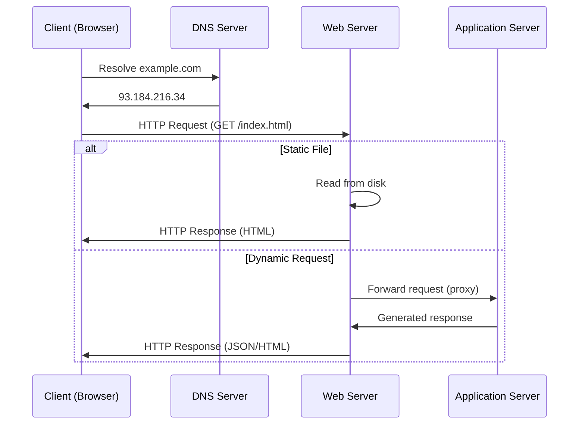
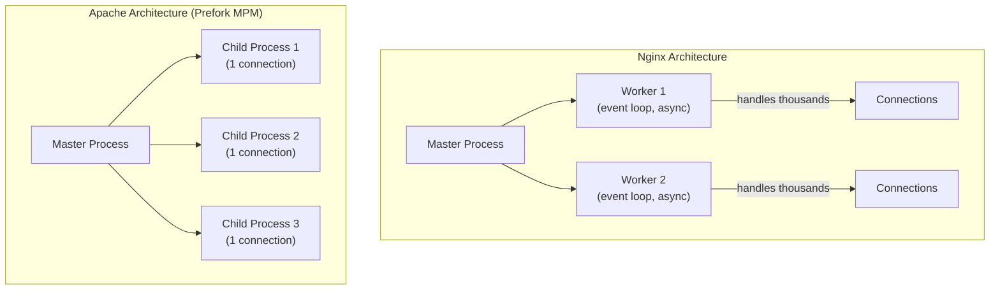
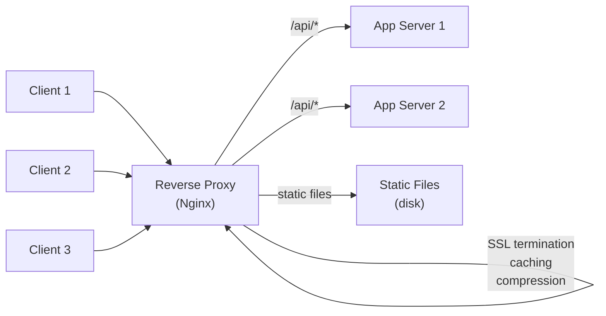
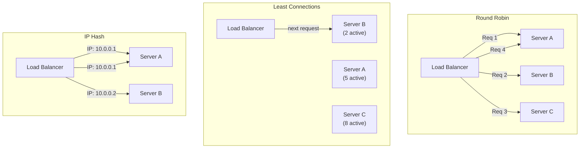

# Web Servers

## Table of Contents

1. [What is a Web Server](#what-is-a-web-server)
2. [How Web Servers Work](#how-web-servers-work)
3. [Nginx](#nginx)
4. [Nginx Configuration Basics](#nginx-configuration-basics)
5. [Nginx as a Reverse Proxy](#nginx-as-a-reverse-proxy)
6. [Nginx Load Balancing](#nginx-load-balancing)
7. [Nginx Static File Serving](#nginx-static-file-serving)
8. [Apache HTTP Server](#apache-http-server)
9. [Apache .htaccess](#apache-htaccess)
10. [Apache mod_rewrite](#apache-mod_rewrite)
11. [Caddy](#caddy)
12. [Nginx vs Apache Comparison](#nginx-vs-apache-comparison)
13. [Reverse Proxy Explained](#reverse-proxy-explained)
14. [Load Balancing Algorithms](#load-balancing-algorithms)
15. [SSL/TLS Termination](#ssltls-termination)
16. [Resources](#resources)

---

## What is a Web Server

A web server is software that accepts HTTP requests from clients (typically browsers) and serves HTTP responses, which usually contain HTML pages, images, stylesheets, scripts, or API data. Web servers can serve static content directly from the file system or act as intermediaries, forwarding requests to application servers that generate dynamic content.

**Two meanings of "web server":**

1. **Hardware** — A physical or virtual machine that hosts web server software.
2. **Software** — The program (Nginx, Apache, Caddy) that handles HTTP requests.

In backend development, "web server" almost always refers to the software component.

---

## How Web Servers Work

The basic request/response cycle:



```
1. Client sends HTTP request
   GET /index.html HTTP/1.1
   Host: example.com

2. DNS resolves example.com to an IP address

3. TCP connection is established (with TLS handshake if HTTPS)

4. Web server receives the request

5. Web server processes the request:
   - Static file? → Read from disk and return
   - Dynamic request? → Forward to application server

6. Web server sends HTTP response
   HTTP/1.1 200 OK
   Content-Type: text/html
   Content-Length: 1234

   <html>...</html>

7. Connection is kept alive or closed
```

**Connection handling models:**

| Model | Description | Used By |
|-------|-------------|---------|
| Process-per-connection | Fork a new process per request | Apache Prefork MPM |
| Thread-per-connection | Create a thread per request | Apache Worker MPM |
| Event-driven | Single thread handles many connections via event loop | Nginx, Node.js |
| Hybrid | Combination of threads and events | Apache Event MPM |

---

## Nginx

Nginx (pronounced "engine-x") is a high-performance, open-source web server created by Igor Sysoev in 2004. It is the most widely used web server in the world, powering over 30% of all websites.

**Architecture:**

Nginx uses an **event-driven, asynchronous, non-blocking** architecture:

- A **master process** reads configuration and manages worker processes.
- **Worker processes** handle thousands of simultaneous connections using an event loop.
- Each worker runs a single thread, avoiding the overhead of context switching.
- Connections are processed asynchronously using `epoll` (Linux), `kqueue` (BSD/macOS), or similar OS mechanisms.

```
                  ┌─────────────────┐
                  │  Master Process  │
                  │ (reads config,   │
                  │  manages workers)│
                  └────────┬────────┘
            ┌──────────────┼──────────────┐
            v              v              v
     ┌─────────────┐ ┌─────────────┐ ┌─────────────┐
     │  Worker 1    │ │  Worker 2    │ │  Worker 3    │
     │ (event loop) │ │ (event loop) │ │ (event loop) │
     │ ~10K conns   │ │ ~10K conns   │ │ ~10K conns   │
     └─────────────┘ └─────────────┘ └─────────────┘
```

This architecture allows Nginx to handle hundreds of thousands of concurrent connections with minimal memory usage.

---

## Nginx Configuration Basics

Nginx configuration files use a block-based syntax with directives and contexts.

**Main configuration file:** `/etc/nginx/nginx.conf`

```nginx
# Main context
user nginx;
worker_processes auto;          # One worker per CPU core
error_log /var/log/nginx/error.log warn;
pid /var/run/nginx.pid;

events {
    worker_connections 1024;    # Max connections per worker
    multi_accept on;
}

http {
    include /etc/nginx/mime.types;
    default_type application/octet-stream;

    # Logging
    log_format main '$remote_addr - $remote_user [$time_local] '
                    '"$request" $status $body_bytes_sent '
                    '"$http_referer" "$http_user_agent"';
    access_log /var/log/nginx/access.log main;

    # Performance
    sendfile on;
    tcp_nopush on;
    tcp_nodelay on;
    keepalive_timeout 65;
    gzip on;
    gzip_types text/plain text/css application/json application/javascript;

    # Include site configurations
    include /etc/nginx/conf.d/*.conf;
}
```

**Server block (virtual host):**

```nginx
server {
    listen 80;
    server_name example.com www.example.com;

    root /var/www/example.com/html;
    index index.html;

    location / {
        try_files $uri $uri/ =404;
    }

    location /api/ {
        proxy_pass http://localhost:3000;
    }

    error_page 404 /404.html;
    error_page 500 502 503 504 /50x.html;
}
```

**Key configuration contexts:**

| Context | Purpose |
|---------|---------|
| `main` | Global settings (workers, PID, error log) |
| `events` | Connection processing configuration |
| `http` | HTTP server configuration |
| `server` | Virtual host configuration |
| `location` | Request URI routing |
| `upstream` | Backend server groups for load balancing |

---

## Nginx as a Reverse Proxy

A reverse proxy sits in front of your application servers, forwarding client requests and returning the responses.

```nginx
server {
    listen 80;
    server_name api.example.com;

    location / {
        proxy_pass http://localhost:3000;
        proxy_http_version 1.1;
        proxy_set_header Upgrade $http_upgrade;
        proxy_set_header Connection 'upgrade';
        proxy_set_header Host $host;
        proxy_set_header X-Real-IP $remote_addr;
        proxy_set_header X-Forwarded-For $proxy_add_x_forwarded_for;
        proxy_set_header X-Forwarded-Proto $scheme;
        proxy_cache_bypass $http_upgrade;
    }
}
```

**Why use a reverse proxy:**

- **SSL termination** — Handle HTTPS at the proxy, pass plain HTTP to app servers.
- **Load balancing** — Distribute traffic across multiple backend servers.
- **Caching** — Cache responses to reduce backend load.
- **Compression** — Compress responses before sending to clients.
- **Security** — Hide backend server details, add rate limiting and access controls.
- **Static files** — Serve static assets directly without hitting the application server.

---

## Nginx Load Balancing

```nginx
upstream backend {
    least_conn;                        # Load balancing algorithm
    server 10.0.0.1:3000 weight=3;    # Higher weight = more traffic
    server 10.0.0.2:3000;
    server 10.0.0.3:3000;
    server 10.0.0.4:3000 backup;      # Used only when others are down
}

server {
    listen 80;
    server_name app.example.com;

    location / {
        proxy_pass http://backend;
        proxy_next_upstream error timeout http_502 http_503;
        proxy_connect_timeout 5s;
        proxy_read_timeout 60s;
    }
}
```

**Health checks** (Nginx Plus or open-source modules):

```nginx
upstream backend {
    server 10.0.0.1:3000;
    server 10.0.0.2:3000;

    # Passive health checks (open-source Nginx)
    # Mark server as down after 3 failures within 30 seconds
    server 10.0.0.1:3000 max_fails=3 fail_timeout=30s;
}
```

---

## Nginx Static File Serving

Nginx is extremely efficient at serving static files because it uses the `sendfile` system call, which transfers data directly from the file system to the network socket without copying to user space.

```nginx
server {
    listen 80;
    server_name static.example.com;
    root /var/www/static;

    # Cache static assets in the browser
    location ~* \.(jpg|jpeg|png|gif|ico|css|js|woff2)$ {
        expires 30d;
        add_header Cache-Control "public, immutable";
        access_log off;
    }

    # Serve SPA (Single Page Application)
    location / {
        try_files $uri $uri/ /index.html;
    }

    # Enable gzip compression
    gzip on;
    gzip_vary on;
    gzip_min_length 1024;
    gzip_types
        text/plain
        text/css
        text/javascript
        application/javascript
        application/json
        image/svg+xml;
}
```

---

## Apache HTTP Server

Apache HTTP Server (httpd) is one of the oldest and most widely deployed web servers, first released in 1995. It is developed by the Apache Software Foundation.

### Architecture: MPM Modules

Apache uses **Multi-Processing Modules (MPMs)** that determine how it handles connections:

| MPM | Description | Best For |
|-----|-------------|----------|
| **Prefork** | One process per connection, no threading | Compatibility with non-thread-safe modules (mod_php) |
| **Worker** | Hybrid model with multiple threads per process | Higher concurrency with moderate memory |
| **Event** | Like Worker but with asynchronous keep-alive handling | Modern workloads, best performance |

```
Prefork MPM:
Master Process
├── Child Process 1 (handles 1 connection)
├── Child Process 2 (handles 1 connection)
├── Child Process 3 (handles 1 connection)
└── ...

Event MPM:
Master Process
├── Child Process 1
│   ├── Thread 1 (handles multiple connections)
│   ├── Thread 2 (handles multiple connections)
│   └── Listener Thread (manages keep-alive)
├── Child Process 2
│   ├── Thread 1
│   └── Thread 2
└── ...
```

---

## Apache .htaccess

`.htaccess` files allow per-directory configuration without modifying the main Apache config. They are processed on every request, which impacts performance.

```apache
# Redirect HTTP to HTTPS
RewriteEngine On
RewriteCond %{HTTPS} off
RewriteRule ^(.*)$ https://%{HTTP_HOST}%{REQUEST_URI} [L,R=301]

# Custom error pages
ErrorDocument 404 /errors/404.html
ErrorDocument 500 /errors/500.html

# Deny access to sensitive files
<FilesMatch "\.(env|git|htpasswd)$">
    Require all denied
</FilesMatch>

# Enable CORS
Header set Access-Control-Allow-Origin "*"

# Set caching headers
<IfModule mod_expires.c>
    ExpiresActive On
    ExpiresByType image/jpeg "access plus 1 month"
    ExpiresByType text/css "access plus 1 week"
    ExpiresByType application/javascript "access plus 1 week"
</IfModule>

# Password protect a directory
AuthType Basic
AuthName "Restricted Area"
AuthUserFile /etc/apache2/.htpasswd
Require valid-user
```

> **Tip:** For production servers, prefer putting configuration in the main Apache config files (`httpd.conf` or virtual host files) and set `AllowOverride None`. This avoids the performance overhead of Apache scanning for `.htaccess` files in every directory.

---

## Apache mod_rewrite

`mod_rewrite` is Apache's URL rewriting module. It uses regular expressions to match and transform request URIs.

```apache
RewriteEngine On

# Clean URLs: /products/123 → /product.php?id=123
RewriteRule ^products/([0-9]+)$ /product.php?id=$1 [L,QSA]

# Remove trailing slashes
RewriteCond %{REQUEST_FILENAME} !-d
RewriteRule ^(.*)/$ /$1 [L,R=301]

# Force www
RewriteCond %{HTTP_HOST} !^www\. [NC]
RewriteRule ^(.*)$ https://www.%{HTTP_HOST}/$1 [L,R=301]

# Block specific user agents (bots)
RewriteCond %{HTTP_USER_AGENT} (badbot|scraper) [NC]
RewriteRule .* - [F,L]
```

**Common RewriteRule flags:**

| Flag | Description |
|------|-------------|
| `[L]` | Last rule — stop processing further rules |
| `[R=301]` | Redirect with HTTP 301 (permanent) |
| `[R=302]` | Redirect with HTTP 302 (temporary) |
| `[QSA]` | Append original query string |
| `[F]` | Return 403 Forbidden |
| `[NC]` | Case-insensitive match |
| `[P]` | Proxy (forward to another server) |

---

## Caddy

Caddy is a modern, open-source web server written in Go. Its standout feature is **automatic HTTPS** — it obtains and renews TLS certificates from Let's Encrypt with zero configuration.

**Caddyfile (configuration):**

```
# Simple static site with automatic HTTPS
example.com {
    root * /var/www/example.com
    file_server
}

# Reverse proxy
api.example.com {
    reverse_proxy localhost:3000
}

# Load balancing
app.example.com {
    reverse_proxy localhost:3001 localhost:3002 localhost:3003 {
        lb_policy round_robin
        health_uri /health
        health_interval 10s
    }
}

# SPA with API proxy
myapp.com {
    handle /api/* {
        reverse_proxy localhost:8080
    }
    handle {
        root * /var/www/myapp
        try_files {path} /index.html
        file_server
    }
}
```

**Why Caddy:**

- Automatic HTTPS with Let's Encrypt (no certbot setup).
- Simple, human-readable configuration.
- HTTP/2 and HTTP/3 enabled by default.
- Extensible via plugins.
- Single binary with no dependencies.

---

## Nginx vs Apache Comparison



| Feature | Nginx | Apache |
|---------|-------|--------|
| Architecture | Event-driven, async | Process/thread-based (MPMs) |
| Performance (static) | Excellent | Good |
| Performance (concurrent) | Excellent (low memory) | Moderate (higher memory) |
| Configuration | Centralized config files | Centralized + `.htaccess` |
| Dynamic content | External (FastCGI, proxy) | Built-in modules (mod_php) |
| .htaccess support | No | Yes |
| Module system | Compiled at build time | Runtime loadable modules |
| OS support | Linux, BSD, macOS, Windows | Linux, BSD, macOS, Windows |
| Documentation | Good | Excellent (long history) |
| Market share | ~34% | ~29% |

**When to choose Nginx:**

- High-traffic sites needing maximum concurrency.
- Reverse proxy and load balancer use cases.
- Serving static content at scale.
- Microservices architectures.

**When to choose Apache:**

- Shared hosting environments needing `.htaccess`.
- Legacy PHP applications using `mod_php`.
- Need for runtime-loadable modules.
- Complex per-directory configuration requirements.

---

## Reverse Proxy Explained

A reverse proxy is a server that sits between clients and backend servers, forwarding client requests to the appropriate backend and returning the response.



```
Without reverse proxy:
Client ──────────────────> Application Server

With reverse proxy:
Client ──> Reverse Proxy ──> Application Server 1
                         ──> Application Server 2
                         ──> Application Server 3
```

**Benefits:**

| Benefit | Description |
|---------|-------------|
| Load balancing | Distribute traffic across multiple backends |
| SSL termination | Handle encryption at the proxy level |
| Caching | Cache responses to reduce backend load |
| Compression | Compress responses (gzip, Brotli) |
| Security | Hide backend topology, WAF integration |
| Rate limiting | Throttle abusive clients |
| A/B testing | Route traffic to different application versions |

---

## Load Balancing Algorithms



| Algorithm | Description | Best For |
|-----------|-------------|----------|
| **Round Robin** | Distributes requests sequentially across servers | Equal-capacity servers, general use |
| **Weighted Round Robin** | Like round robin but servers with higher weight get more requests | Mixed-capacity servers |
| **Least Connections** | Sends request to the server with fewest active connections | Variable request processing times |
| **IP Hash** | Routes based on client IP hash (same client → same server) | Session affinity without cookies |
| **Random** | Selects a random backend server | Simple, statistically even distribution |
| **Least Time** | Routes to server with lowest response time + fewest connections | Performance-critical applications |

**Nginx configuration examples:**

```nginx
# Round Robin (default)
upstream backend {
    server 10.0.0.1:3000;
    server 10.0.0.2:3000;
}

# Least Connections
upstream backend {
    least_conn;
    server 10.0.0.1:3000;
    server 10.0.0.2:3000;
}

# IP Hash (sticky sessions)
upstream backend {
    ip_hash;
    server 10.0.0.1:3000;
    server 10.0.0.2:3000;
}

# Weighted
upstream backend {
    server 10.0.0.1:3000 weight=5;
    server 10.0.0.2:3000 weight=3;
    server 10.0.0.3:3000 weight=1;
}
```

---

## SSL/TLS Termination

SSL/TLS termination is the process of decrypting encrypted HTTPS traffic at the reverse proxy, then forwarding unencrypted HTTP to backend servers. This offloads the computational cost of encryption from application servers.

```nginx
server {
    listen 443 ssl http2;
    server_name example.com;

    # SSL certificate and key
    ssl_certificate /etc/ssl/certs/example.com.pem;
    ssl_certificate_key /etc/ssl/private/example.com.key;

    # Modern SSL configuration
    ssl_protocols TLSv1.2 TLSv1.3;
    ssl_ciphers ECDHE-ECDSA-AES128-GCM-SHA256:ECDHE-RSA-AES128-GCM-SHA256;
    ssl_prefer_server_ciphers off;

    # HSTS header
    add_header Strict-Transport-Security "max-age=63072000" always;

    # OCSP stapling
    ssl_stapling on;
    ssl_stapling_verify on;

    location / {
        proxy_pass http://backend;  # Plain HTTP to backend
    }
}

# Redirect HTTP to HTTPS
server {
    listen 80;
    server_name example.com;
    return 301 https://$server_name$request_uri;
}
```

> **Tip:** Use tools like [Mozilla SSL Configuration Generator](https://ssl-config.mozilla.org/) to generate secure, up-to-date SSL configurations for your web server.

---

## Resources

- [Nginx Official Documentation](https://nginx.org/en/docs/)
- [Nginx Admin Guide](https://docs.nginx.com/nginx/admin-guide/)
- [Apache HTTP Server Documentation](https://httpd.apache.org/docs/)
- [Caddy Documentation](https://caddyserver.com/docs/)
- [Mozilla SSL Configuration Generator](https://ssl-config.mozilla.org/)
- [DigitalOcean — Nginx Tutorials](https://www.digitalocean.com/community/tags/nginx)
- [Nginx vs Apache: Practical Considerations](https://www.digitalocean.com/community/tutorials/apache-vs-nginx-practical-considerations)
- [HTTP/2 Explained](https://http2-explained.haxx.se/)
- [Let's Encrypt](https://letsencrypt.org/) — Free SSL/TLS certificates
