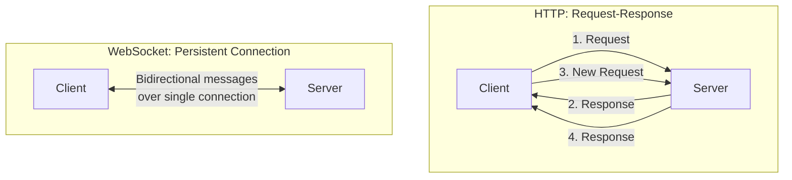
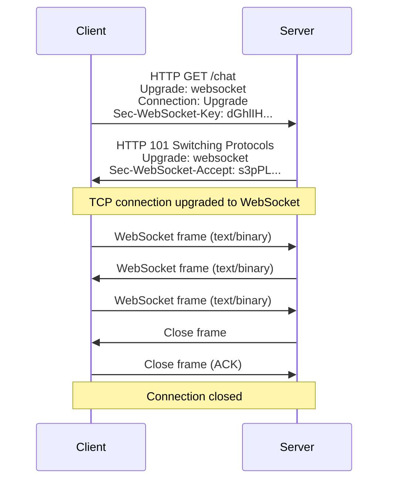
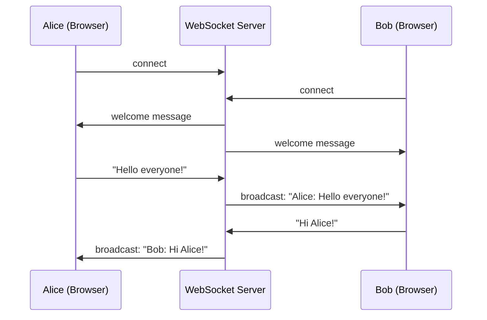
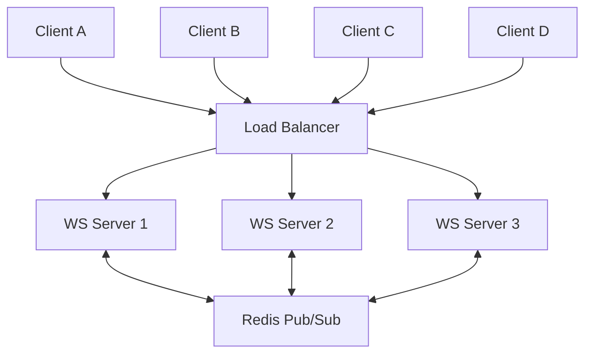

# WebSockets

## Table of Contents

1. [What are WebSockets](#what-are-websockets)
2. [HTTP vs WebSocket](#http-vs-websocket)
3. [WebSocket Handshake Process](#websocket-handshake-process)
4. [WebSocket Protocol](#websocket-protocol)
5. [Use Cases](#use-cases)
6. [WebSocket Implementation Example](#websocket-implementation-example)
7. [Socket.IO Overview](#socketio-overview)
8. [Server-Sent Events (SSE)](#server-sent-events-sse)
9. [Long Polling vs WebSocket vs SSE](#long-polling-vs-websocket-vs-sse)
10. [Scaling WebSockets](#scaling-websockets)
11. [Security Considerations](#security-considerations)
12. [Resources](#resources)

---

## What are WebSockets

WebSockets provide a **full-duplex, bidirectional** communication channel over a single, long-lived TCP connection. Unlike HTTP, where the client must initiate every exchange, WebSockets allow both the client and server to send messages to each other at any time without the overhead of repeated HTTP requests.

The WebSocket protocol was standardized as [RFC 6455](https://datatracker.ietf.org/doc/html/rfc6455) in 2011 and is supported by all modern browsers and server platforms.

**Key characteristics:**

- **Full-duplex** — Both parties can send and receive simultaneously.
- **Persistent connection** — The connection stays open until explicitly closed.
- **Low latency** — No HTTP overhead per message after the initial handshake.
- **Low overhead** — WebSocket frames have a minimal header (as little as 2 bytes).
- **Real-time** — Messages are delivered immediately upon sending.

---

## HTTP vs WebSocket



| Feature | HTTP | WebSocket |
|---------|------|-----------|
| Communication | Request-response (unidirectional) | Full-duplex (bidirectional) |
| Connection | New connection per request (HTTP/1.1 with keep-alive reuses) | Single persistent connection |
| Initiation | Client always initiates | Either party can send at any time |
| Overhead | HTTP headers on every request (~800 bytes) | Minimal frame header (~2-14 bytes) |
| Protocol | `http://` or `https://` | `ws://` or `wss://` |
| State | Stateless | Stateful |
| Caching | Built-in HTTP caching | No caching |
| Use case | Request-response APIs, page loads | Real-time communication |

```
HTTP Request-Response:
Client ──request──>  Server
Client <──response── Server
Client ──request──>  Server
Client <──response── Server

WebSocket:
Client ──handshake──>  Server
Client <──upgrade────  Server
Client <──message────  Server  (server-initiated)
Client ──message────>  Server
Client <──message────  Server
Client ──message────>  Server
```

---

## WebSocket Handshake Process

A WebSocket connection begins with an HTTP upgrade handshake. The client sends a standard HTTP request with special headers asking to upgrade the connection to WebSocket.



**Client request:**

```http
GET /chat HTTP/1.1
Host: server.example.com
Upgrade: websocket
Connection: Upgrade
Sec-WebSocket-Key: dGhlIHNhbXBsZSBub25jZQ==
Sec-WebSocket-Version: 13
Origin: http://example.com
```

**Server response:**

```http
HTTP/1.1 101 Switching Protocols
Upgrade: websocket
Connection: Upgrade
Sec-WebSocket-Accept: s3pPLMBiTxaQ9kYGzzhZRbK+xOo=
```

**How it works:**

1. The client sends an HTTP GET request with `Upgrade: websocket` header.
2. The `Sec-WebSocket-Key` is a random Base64-encoded value generated by the client.
3. The server concatenates this key with a special GUID, computes a SHA-1 hash, and returns it as `Sec-WebSocket-Accept`.
4. If the server agrees, it responds with `101 Switching Protocols`.
5. The TCP connection is now upgraded — both sides can send WebSocket frames.

> **Tip:** The `Sec-WebSocket-Key` and `Sec-WebSocket-Accept` exchange is not for security — it is to prevent misconfigured HTTP servers from accidentally accepting WebSocket connections. Use `wss://` (WebSocket Secure) for encryption.

---

## WebSocket Protocol

After the handshake, data is transmitted in **frames**. Each frame has a small header followed by the payload.

### Frame Structure

```
 0                   1                   2                   3
 0 1 2 3 4 5 6 7 8 9 0 1 2 3 4 5 6 7 8 9 0 1 2 3 4 5 6 7 8 9 0 1
+-+-+-+-+-------+-+-------------+-------------------------------+
|F|R|R|R| opcode|M| Payload len |    Extended payload length    |
|I|S|S|S|  (4)  |A|     (7)     |            (16/64)            |
|N|V|V|V|       |S|             |  (if payload len == 126/127)  |
| |1|2|3|       |K|             |                               |
+-+-+-+-+-------+-+-------------+-------------------------------+
|     Extended payload length continued, if payload len == 127  |
+-------------------------------+-------------------------------+
|                               | Masking-key, if MASK set to 1 |
+-------------------------------+-------------------------------+
| Masking-key (continued)       |          Payload Data         |
+-------------------------------+-------------------------------+
|                     Payload Data continued ...                |
+---------------------------------------------------------------+
```

### Opcodes

| Opcode | Name | Description |
|--------|------|-------------|
| `0x0` | Continuation | Continuation of a fragmented message |
| `0x1` | Text | Text frame (UTF-8 encoded) |
| `0x2` | Binary | Binary data frame |
| `0x8` | Close | Connection close request |
| `0x9` | Ping | Heartbeat request |
| `0xA` | Pong | Heartbeat response |

**Ping/Pong** frames are used as heartbeats to keep the connection alive and detect broken connections. The server sends a Ping; the client must respond with a Pong.

---

## Use Cases

WebSockets are the right tool when you need low-latency, bidirectional communication.



| Use Case | Why WebSockets |
|----------|---------------|
| **Chat applications** | Messages must be delivered instantly in both directions |
| **Real-time notifications** | Server pushes updates as they happen |
| **Live dashboards** | Continuous data streaming (stock prices, metrics) |
| **Online gaming** | Low-latency state synchronization |
| **Collaborative editing** | Multiple users editing the same document (Google Docs) |
| **Live sports scores** | Instant updates without polling |
| **IoT data streaming** | Continuous sensor data from devices |
| **Financial trading** | Real-time price feeds and order execution |

---

## WebSocket Implementation Example

### Node.js Server with the `ws` Library

```javascript
const WebSocket = require('ws');

const wss = new WebSocket.Server({ port: 8080 });

// Track connected clients
const clients = new Set();

wss.on('connection', (ws, req) => {
  console.log(`New client connected from ${req.socket.remoteAddress}`);
  clients.add(ws);

  // Send a welcome message
  ws.send(JSON.stringify({ type: 'welcome', message: 'Connected to server' }));

  // Handle incoming messages
  ws.on('message', (data) => {
    const message = JSON.parse(data);
    console.log('Received:', message);

    // Broadcast to all other connected clients
    clients.forEach((client) => {
      if (client !== ws && client.readyState === WebSocket.OPEN) {
        client.send(JSON.stringify({
          type: 'broadcast',
          from: message.username,
          text: message.text,
          timestamp: new Date().toISOString(),
        }));
      }
    });
  });

  // Handle client disconnect
  ws.on('close', (code, reason) => {
    console.log(`Client disconnected: ${code} - ${reason}`);
    clients.delete(ws);
  });

  // Handle errors
  ws.on('error', (error) => {
    console.error('WebSocket error:', error);
    clients.delete(ws);
  });
});

// Heartbeat: ping all clients every 30 seconds
setInterval(() => {
  wss.clients.forEach((ws) => {
    if (ws.isAlive === false) return ws.terminate();
    ws.isAlive = false;
    ws.ping();
  });
}, 30000);

wss.on('listening', () => {
  console.log('WebSocket server running on ws://localhost:8080');
});
```

### Browser Client

```javascript
const ws = new WebSocket('ws://localhost:8080');

ws.onopen = () => {
  console.log('Connected to server');
  ws.send(JSON.stringify({
    username: 'Alice',
    text: 'Hello everyone!',
  }));
};

ws.onmessage = (event) => {
  const message = JSON.parse(event.data);
  console.log('Received:', message);
};

ws.onclose = (event) => {
  console.log(`Disconnected: ${event.code} - ${event.reason}`);
  // Implement reconnection logic here
};

ws.onerror = (error) => {
  console.error('WebSocket error:', error);
};
```

---

## Socket.IO Overview

Socket.IO is a popular library that provides real-time communication with automatic fallback mechanisms. It builds on top of WebSockets but adds features like automatic reconnection, rooms, namespaces, and broadcasting.

**Key features:**

- **Automatic fallback** — Falls back to HTTP long polling if WebSocket is not available.
- **Reconnection** — Automatically reconnects with exponential backoff.
- **Rooms and namespaces** — Group clients for targeted broadcasting.
- **Acknowledgements** — Callback-based message confirmation.
- **Binary support** — Send binary data alongside events.

**Server example:**

```javascript
const { Server } = require('socket.io');
const io = new Server(3000, {
  cors: { origin: '*' },
});

io.on('connection', (socket) => {
  console.log(`User connected: ${socket.id}`);

  // Join a room
  socket.on('join-room', (room) => {
    socket.join(room);
    socket.to(room).emit('user-joined', socket.id);
  });

  // Handle chat message
  socket.on('chat-message', (data) => {
    // Send to everyone in the room except the sender
    socket.to(data.room).emit('chat-message', {
      from: socket.id,
      text: data.text,
      timestamp: new Date(),
    });
  });

  // Handle disconnect
  socket.on('disconnect', (reason) => {
    console.log(`User disconnected: ${socket.id} - ${reason}`);
  });
});
```

**Client example:**

```javascript
import { io } from 'socket.io-client';

const socket = io('http://localhost:3000');

socket.on('connect', () => {
  socket.emit('join-room', 'general');
});

socket.emit('chat-message', {
  room: 'general',
  text: 'Hello everyone!',
});

socket.on('chat-message', (data) => {
  console.log(`${data.from}: ${data.text}`);
});
```

> **Tip:** Socket.IO is **not** a plain WebSocket implementation. A Socket.IO client cannot connect to a plain WebSocket server, and vice versa. The protocol adds its own packet format on top of WebSocket.

---

## Server-Sent Events (SSE)

Server-Sent Events (SSE) is a simpler alternative to WebSockets for scenarios where only the **server** needs to push data to the **client**. SSE uses a standard HTTP connection and the `text/event-stream` content type.

**Server example (Node.js with Express):**

```javascript
const express = require('express');
const app = express();

app.get('/events', (req, res) => {
  // Set SSE headers
  res.setHeader('Content-Type', 'text/event-stream');
  res.setHeader('Cache-Control', 'no-cache');
  res.setHeader('Connection', 'keep-alive');

  // Send an event every second
  const intervalId = setInterval(() => {
    const data = {
      time: new Date().toISOString(),
      value: Math.random(),
    };
    res.write(`data: ${JSON.stringify(data)}\n\n`);
  }, 1000);

  // Clean up on client disconnect
  req.on('close', () => {
    clearInterval(intervalId);
    res.end();
  });
});

app.listen(3000);
```

**Client example:**

```javascript
const eventSource = new EventSource('/events');

eventSource.onmessage = (event) => {
  const data = JSON.parse(event.data);
  console.log('Received:', data);
};

eventSource.onerror = (error) => {
  console.error('SSE error:', error);
};
```

**SSE features:**

- Automatic reconnection built into the browser API.
- Event IDs for resuming missed events.
- Named events for routing.
- Text-only (no binary data).

---

## Long Polling vs WebSocket vs SSE

| Feature | Long Polling | WebSocket | SSE |
|---------|-------------|-----------|-----|
| Direction | Server to client (simulated) | Bidirectional | Server to client |
| Connection | New HTTP request per update | Single persistent TCP | Single persistent HTTP |
| Overhead | High (HTTP headers per poll) | Low (2-14 byte frame header) | Low (HTTP streaming) |
| Latency | Medium (polling interval) | Very low | Low |
| Browser support | Universal | Universal (modern) | Universal (modern, no IE) |
| Binary data | Yes (via HTTP) | Yes | No (text only) |
| Reconnection | Manual | Manual (or library-based) | Automatic (built-in) |
| Proxy/firewall friendly | Yes | Sometimes blocked | Yes |
| Scalability | Poor (many connections) | Good | Good |
| Complexity | Low | Medium | Low |

**When to choose which:**

- **Long Polling** — Legacy systems or when WebSocket/SSE are blocked by corporate proxies.
- **WebSocket** — Bidirectional communication, low-latency interactions (chat, gaming).
- **SSE** — Server-to-client streaming (notifications, live feeds, dashboards).

---

## Scaling WebSockets

Scaling WebSocket connections presents unique challenges compared to stateless HTTP because each connection is persistent and stateful.

### Challenges

- Each WebSocket connection consumes a server socket and memory.
- A single server can typically handle 10,000-100,000 concurrent connections (depending on hardware and application logic).
- Broadcasting messages must reach clients connected to different server instances.

### Strategies

**1. Horizontal scaling with a message broker:**

Use Redis Pub/Sub, NATS, or Kafka to synchronize messages across multiple WebSocket server instances.



```
Client A ──> WS Server 1 ──> Redis Pub/Sub ──> WS Server 2 ──> Client B
Client C ──> WS Server 1 ──>               ──> WS Server 3 ──> Client D
```

**2. Sticky sessions:**

Configure your load balancer to route a client's WebSocket connection to the same server instance using cookies, IP hash, or connection ID.

**3. Connection limits and backpressure:**

- Set maximum connections per server instance.
- Implement message queuing when clients cannot consume messages fast enough.

**4. Use a dedicated WebSocket gateway:**

Services like AWS API Gateway WebSocket, Pusher, or Ably handle WebSocket scaling infrastructure so your application logic remains simple.

**5. Redis adapter for Socket.IO:**

```javascript
const { Server } = require('socket.io');
const { createAdapter } = require('@socket.io/redis-adapter');
const { createClient } = require('redis');

const io = new Server(3000);

const pubClient = createClient({ url: 'redis://localhost:6379' });
const subClient = pubClient.duplicate();

Promise.all([pubClient.connect(), subClient.connect()]).then(() => {
  io.adapter(createAdapter(pubClient, subClient));
  console.log('Socket.IO with Redis adapter ready');
});
```

---

## Security Considerations

1. **Always use `wss://` (WebSocket Secure)** — Encrypt WebSocket connections with TLS, just as you use HTTPS for HTTP.

2. **Validate the Origin header** — Check the `Origin` header during the handshake to prevent cross-site WebSocket hijacking.

```javascript
const wss = new WebSocket.Server({
  port: 8080,
  verifyClient: (info) => {
    const origin = info.origin || info.req.headers.origin;
    const allowedOrigins = ['https://myapp.com', 'https://www.myapp.com'];
    return allowedOrigins.includes(origin);
  },
});
```

3. **Authenticate connections** — Pass authentication tokens during the handshake (via query parameter or cookie) and validate before accepting.

```javascript
wss.on('connection', (ws, req) => {
  const token = new URL(req.url, 'http://localhost').searchParams.get('token');
  const user = verifyToken(token);
  if (!user) {
    ws.close(4001, 'Unauthorized');
    return;
  }
  ws.user = user;
});
```

4. **Validate and sanitize all messages** — Never trust client input. Parse, validate, and sanitize every incoming message.

5. **Implement rate limiting** — Prevent clients from flooding the server with messages.

6. **Set message size limits** — Configure maximum message sizes to prevent memory exhaustion attacks.

7. **Handle connection timeouts** — Use ping/pong heartbeats to detect and clean up dead connections.

---

## Resources

- [RFC 6455 — The WebSocket Protocol](https://datatracker.ietf.org/doc/html/rfc6455)
- [MDN Web Docs — WebSocket API](https://developer.mozilla.org/en-US/docs/Web/API/WebSocket)
- [MDN Web Docs — Server-Sent Events](https://developer.mozilla.org/en-US/docs/Web/API/Server-sent_events)
- [ws — Node.js WebSocket Library](https://github.com/websockets/ws)
- [Socket.IO Documentation](https://socket.io/docs/)
- [WebSocket Security (OWASP)](https://cheatsheetseries.owasp.org/cheatsheets/WebSocket_Security_Cheat_Sheet.html)
- [HTML Living Standard — WebSockets](https://html.spec.whatwg.org/multipage/web-sockets.html)
